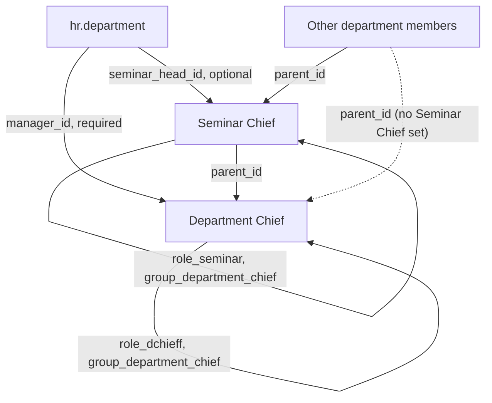
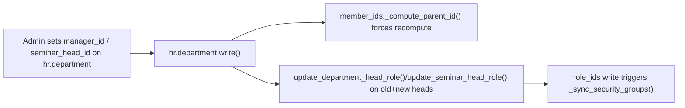

# Technical Reference: Department Chief / Seminar Chief Cascade

## Overview

`hr.department` (extended by `models/employees/department.py`) is the single source of truth for a department's chain of command: its native `manager_id` field is used as the **Department Chief** (required on the form), and a new `seminar_head_id` field (Many2one to `hr.employee`, optional) is the **Seminar Chief**. From these two, EMS derives:

- Every other member's `hr.employee.parent_id` ("Manager").
- The `role_dchieff` ("Department chieff") / `role_seminar` ("Seminar leader") entries in `role_ids`, and (via the existing `_sync_security_groups()` mechanism — see [Academic role hierarchy](role_hierarchy.md)) `group_department_chief` membership.

Both are computed, never editable by hand from the employee form — they must be set on the department's own form.

## Cascade rules

1. Every member of the department, **except the Department Chief**, gets `parent_id` = the department's `seminar_head_id`.
2. The Seminar Chief's own `parent_id` = the department's `manager_id` (Department Chief).
3. The Department Chief is excluded from this cascade entirely — their own `parent_id` is left untouched (out of scope for this feature; a future iteration will handle Head of Studies / Deputy / Director assignment).
4. If `manager_id` and `seminar_head_id` happen to be the same employee, that employee is caught by rule 3 first (`employee == department.manager_id`) and never reaches the seminar-head branch — no self-referencing `parent_id` is possible.
5. A department with no `seminar_head_id` falls back to `parent_id` = `manager_id` directly for every other member — the Seminar Chief level is simply skipped, it is never left unset.
6. `manager_id` is required at the view level (`views/community/department/form.xml`, `required="1"`) so every department always has a Department Chief once saved through the form; it is intentionally **not** a hard model-level `required=True`/DB `NOT NULL` — several pre-existing departments predate this feature and have no `manager_id` yet, and a DB-level constraint would fail the module upgrade for them. Programmatic creation (imports, demo data, tests) can still create a department without one.

## CRUD flow

- **`hr.employee._compute_parent_id`** (`models/employees/employee.py`, overriding the native `hr.employee.base` compute) implements rules 1–5 above, `@api.depends('department_id')`. Because it depends only on `department_id`, Odoo automatically re-triggers it whenever an employee's own `department_id` changes (e.g. moved from the employee's own form) — no extra code needed on that side.
- **`hr.department.write()`** (`models/employees/department.py`) detects a change to `manager_id`/`seminar_head_id` and explicitly forces a recompute for every current `member_ids`, plus updates the role on the union of the old and new head/Seminar Chief (so a person who stops heading *this* department but still heads *another* one keeps the role — `role_dchieff`/`role_seminar` are not unipersonal). This is also what demotes the previous holder of either role when a department is reassigned to someone else.
- **`hr.employee.update_department_head_role()` / `update_seminar_head_role()`** add/remove `role_dchieff`/`role_seminar` from `role_ids` based on whether the employee still holds `headed_department_ids`/`seminar_department_ids` (One2many inverses of `manager_id`/`seminar_head_id`) for at least one department — mirrors the existing `update_tutor_role()` pattern.
- **`hr.employee._onchange_role_ids`** blocks manual add *and* remove of `role_dchieff`/`role_seminar` from the employee form (reverts + shows a warning either way), the same UI-level enforcement already used for `role_tutor`. Unlike `role_tutor` (where removing the tag cascades into clearing `tutorship_ids`, since that's a direct, employee-side inverse field), `role_dchieff`/`role_seminar` have no such employee-side field to clear — the position lives entirely on `hr.department` — so removal while still holding the position is reverted, not cascaded.

## Access control

| Model | Group | Access |
|-------|-------|--------|
| `hr.department` | `group_academic_admin` | Full CRUD |
| `hr.department` | `group_teacher`, `group_secretary` | Read-only |
| `hr.employee` | `group_academic_admin` | Full CRUD |
| `hr.employee` | `group_teacher` | Read-only |

Only `group_academic_admin` can set `manager_id`/`seminar_head_id`, so this feature has a single operating role (see the admin user manual, `docs/en/admin/teacher-roles.md`).

## Known limitations

- No automatic backfill: existing departments keep `seminar_head_id` empty, and some predate this feature with no `manager_id` either, until an admin opens and saves each one (the view-level `required="1"` on `manager_id` then kicks in).
- Out of scope for this iteration: employees whose real manager shouldn't come from this cascade at all (e.g. an assistant head of studies who should report to Direction regardless of their nominal department). They may get an incorrect `parent_id` until a future iteration adds that exception.
