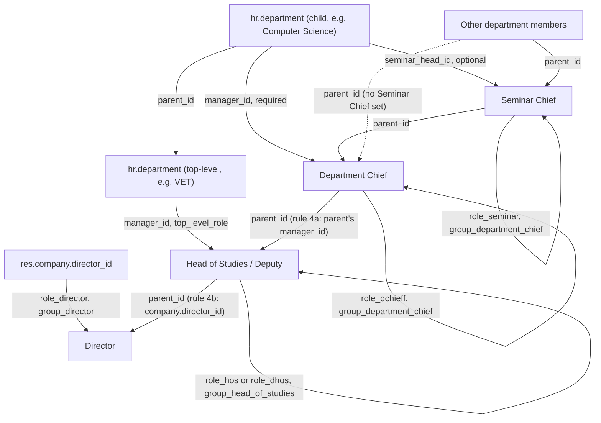
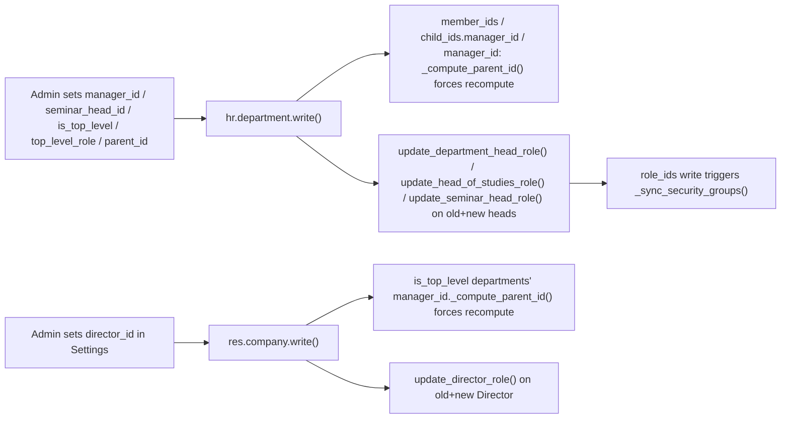

# Technical Reference: Department Chief / Seminar Chief / Head of Studies / Director Cascade

## Overview

`hr.department` (extended by `models/employees/department.py`) is the single source of truth for a department's chain of command: its native `manager_id` field is used as the **Department Chief** (required on the form), and a new `seminar_head_id` field (Many2one to `hr.employee`, optional) is the **Seminar Chief**. A department can also be marked `is_top_level`: it then has no `parent_id`, no `seminar_head_id`, and `manager_id` is relabelled **Head of Studies** and holds `role_hos`/`role_dhos` instead of `role_dchieff` (selected via `top_level_role`). Above all departments, `res.company.director_id` (Ajustes/Settings > EMS Management, not any department form — deliberately: a fake global department to hold the Director was considered and rejected, see `models/settings/company.py`) is the **Director**, holding `role_director`. From these fields, EMS derives:

- Every other member's `hr.employee.parent_id` ("Manager"), including a cascade **between** departments (a department's own Chief/Head of Studies gets their own Manager set to the parent department's Manager) and from the top-level departments up to the Director.
- The `role_dchieff` ("Department chieff") / `role_seminar` ("Seminar leader") / `role_hos` ("Head of studies") / `role_dhos` ("Deputy head of studies") / `role_director` ("Director") entries in `role_ids`, and (via the existing `_sync_security_groups()` mechanism — see [Academic role hierarchy](role_hierarchy.md)) `group_department_chief`/`group_head_of_studies`/`group_director` membership.

All of these are computed, never editable by hand from the employee form — they must be set on the department's own form (Chief/Seminar Chief/Head of Studies) or in Settings (Director).

## Cascade rules

1. Every member of the department, **except its own Chief/Head of Studies**, gets `parent_id` = the department's `seminar_head_id` (or `manager_id` directly if no `seminar_head_id` — see rule 5).
2. The Seminar Chief's own `parent_id` = the department's `manager_id` (Department Chief).
3. **Anyone who chiefs *any* department** (`headed_department_ids` non-empty — Department Chief of a regular department, or Head of Studies/Deputy of a top-level one) is excluded from every *other* department's own intra-cascade entirely, including their own nominal `department_id` if it differs from what they head (e.g. an employee nominally in "Computer Science" who actually heads "VET" — see the worked example in `role_hierarchy.md`/the admin manual). Their own `parent_id` instead comes from rule 4.
4. **Cross-department cascade**, two parts:
   - **4a.** A department's own Chief/Head of Studies gets `parent_id` = the *parent* department's `manager_id`, if the parent department has one set.
   - **4b.** If a headed department is itself top-level (no parent by definition), `parent_id` = `res.company.director_id` instead, if set — unless the employee themselves *is* the Director (self-reference guard, same spirit as rule 6).
   - If neither applies (no parent chief, not top-level with a Director set, or the employee is the Director), `parent_id` is cleared.
5. A department with no `seminar_head_id` falls back to `parent_id` = `manager_id` directly for every other member — the Seminar Chief level is simply skipped, it is never left unset.
6. If `manager_id` and `seminar_head_id` happen to be the same employee, that employee is caught by rule 3 first and never reaches the seminar-chief branch — no self-referencing `parent_id` is possible.
7. `manager_id` is required at the view level (`views/community/department/form.xml`, `required="1"`) so every department always has a Chief/Head of Studies once saved through the form; it is intentionally **not** a hard model-level `required=True`/DB `NOT NULL` — several pre-existing departments predate this feature and have no `manager_id` yet, and a DB-level constraint would fail the module upgrade for them. Programmatic creation (imports, demo data, tests) can still create a department without one.
8. A top-level department (`is_top_level`) cannot have a `parent_id` or a `seminar_head_id` — enforced by an onchange (clears both when checked, mirroring `ems.group`'s `_onchange_group_type`), a `write()`/`create()` sanitize (real guarantee against RPC/import bypass, mirroring `_sanitize_group_type_vals`), and a backstop `@api.constrains` (mirroring `_check_group_type_fields`). The constrain deliberately does **not** require `top_level_role` when `is_top_level` is set — `data/custom/hr.department.csv` seeds the two known top-level departments with `is_top_level=1` and no `manager_id`/`top_level_role` (set manually via the UI post-deploy, same precedent as `seminar_head_id`).

## CRUD flow

- **`hr.employee._compute_parent_id`** (`models/employees/employee.py`, overriding the native `hr.employee.base` compute) implements rules 1–6 above, `@api.depends('department_id')`. Because it depends only on `department_id`, Odoo automatically re-triggers it whenever an employee's own `department_id` changes — no extra code needed on that side. Every branch explicitly (re)assigns `parent_id`, including to `False`/an empty recordset when no rule applies — a stale value from a *previous* cascade state must be cleared, not silently kept, when an employee transitions (e.g. into heading a top-level department with no parent above it).
- **`hr.department.write()`/`create()`** (`models/employees/department.py`) detects a change to `manager_id`/`seminar_head_id`/`parent_id`/`is_top_level`/`top_level_role` and explicitly forces a recompute of: `member_ids` (rule 1), `child_ids.manager_id` (rule 4, downstream — a child department's own Chief depends on *this* department's `manager_id`), and `manager_id` itself (rule 4, upstream — this department's own Chief depends on *its parent's* `manager_id`, which may have just changed via `parent_id`). It also updates roles on the union of the old and new Chief/Seminar Chief (so a person who stops heading *this* department but still heads *another* one keeps the role — none of `role_dchieff`/`role_seminar`/`role_hos`/`role_dhos` are unipersonal *per department*; `role_hos`/`role_dhos` remain globally unipersonal via `ems.role.check_limit()`, unchanged). This is also what demotes the previous holder of a role when a department is reassigned to someone else.
- **`hr.employee.update_department_head_role()`** adds/removes `role_dchieff` based on `headed_department_ids` **excluding** top-level ones (a top-level Chief never gets `role_dchieff`).
- **`hr.employee.update_seminar_head_role()`** adds/removes `role_seminar` based on `seminar_department_ids`, unchanged.
- **`hr.employee.update_head_of_studies_role()`** (new) adds/removes `role_hos`/`role_dhos` based on `headed_department_ids.filtered('is_top_level')` and each one's `top_level_role`.
- **`hr.employee.update_director_role()`** adds/removes `role_director` based on `directed_company_ids` (One2many inverse of `res.company.director_id`, same pattern as `headed_department_ids`).
- **`res.company.write()`** (`models/settings/company.py`) mirrors `hr.department.write()`'s pattern for `director_id`: forces a recompute of every `is_top_level` department's `manager_id._compute_parent_id()` for that company (rule 4b), and calls `update_director_role()` on the union of the old and new Director. Exposed via Ajustes/Settings > EMS Management > Center Data (`models/settings/settings.py`'s related field + `views/settings/form.xml`'s `ems_email_settings` block), the same mechanism already used for `current_course_id`/`default_schedule_framework_id` — no fake "Direction" department, and no `create()` override (a second `res.company` is never created in practice; single-company deployment).
- **`hr.employee._onchange_role_ids`** blocks manual add *and* remove of `role_dchieff`/`role_seminar`/`role_hos`/`role_dhos`/`role_director` from the employee form (reverts + shows a warning either way), the same UI-level enforcement already used for `role_tutor`. **Behavioural change:** `role_hos`/`role_dhos`/`role_director` used to be manually assigned by an admin (see `role_hierarchy.md`) — they now become fully department/Settings-driven, exactly like `role_dchieff` before them; no role in this chain remains manually assignable. If someone already holds one of these roles today without being linked to the corresponding department/company, that assignment sits untouched until their `role_ids` is next edited in the UI, at which point it's reverted — audit `ems.role.employee_ids` for these roles around deploy time.

## Access control

| Model | Group | Access |
|-------|-------|--------|
| `hr.department` | `group_academic_admin` | Full CRUD |
| `hr.department` | `group_teacher`, `group_secretary` | Read-only |
| `hr.employee` | `group_academic_admin` | Full CRUD |
| `hr.employee` | `group_teacher` | Read-only |
| `res.company.director_id` (via Settings) | `base.group_system` (reached here only through `ems.group_settings_admin`/root) | Read/write |

`group_academic_admin` can set the department-level fields, so that part of the feature has a single operating role (see the admin user manual, `docs/en/admin/teacher-roles.md`). **`director_id` is a deliberate exception:** it lives on `res.config.settings`/`res.company`, gated by Odoo's native Settings access (`base.group_system`, granted in this module only via `ems.group_settings_admin` or root/admin) — a *different*, independent permission from `group_academic_admin`. Someone with full academic control is not guaranteed Settings access; this mismatch was raised with and accepted by the developer rather than widening either group's `implied_ids` as part of this feature.

## Known limitations

- No automatic backfill: existing departments keep `seminar_head_id` empty, and some predate this feature with no `manager_id` either, until an admin opens and saves each one (the view-level `required="1"` on `manager_id` then kicks in). The two known top-level departments (VET, ESO/BTX) are seeded with `is_top_level=1` but no `manager_id`/`top_level_role` — set manually post-deploy. `director_id` similarly starts empty — no employee is seeded as Director.
- If an employee heads more than one department whose parents have different Managers, rule 4a's "last one wins" (iteration order) — acceptable since none of these roles are unipersonal per department.
- `ASP` (secretariat/admin staff, not teachers) is deliberately **not** marked `is_top_level` yet.
