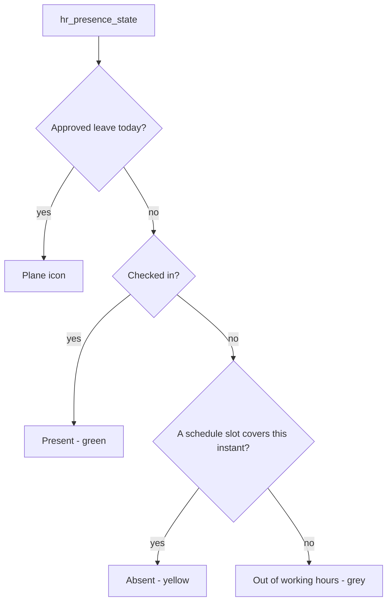

# Technical Reference: `hr.employee` (EMS extension)

## Overview

`models/employees/employee.py` extends `hr.employee.base` (abstract, shared with `hr.employee.public`) and `hr.employee` themselves with everything EMS needs: employee type (teacher/ASP), roles, tutorships, department leadership, a personal weekly schedule, and photo-visibility rules. It is one of the largest, most mature files in the module — most of its behaviour already has dedicated tests and docs from earlier work; this doc is primarily a **map** tying those together, plus coverage for the pieces that were still gaps before this DTON pass.

**Module file:** `models/employees/employee.py` — two classes: `ems_employee_base` (`_inherit = ["hr.employee.base"]`, shared with the lighter `hr.employee.public`) and `ems_employee` (`_inherit = ["hr.employee"]`, the full model).

---

## Already documented elsewhere (cross-links, not duplicated here)

| Area | Fields/methods | Doc |
|------|-----------------|-----|
| Role → security group sync | `role_ids`, `_onchange_role_ids`, `update_*_role()`, `_sync_security_groups()` | [Academic role hierarchy](role_hierarchy.md) |
| `parent_id` cascade (Department Chief / Seminar Chief / Director) | `_compute_parent_id` | [Department cascade](department.md) |
| Personal calendar lifecycle | `create()`/`write()`/`unlink()`'s `resource_calendar_id` handling, `_personal_calendar_name()` | [Working schedules](working_schedule.md) |
| Weekly schedule derived breaks | `_get_derived_break_entries`, `get_derived_break_attendance_data` | [Working schedules](working_schedule.md) |
| Profile picture sync | `write_photo()`, `write()`'s photo guard, `_refresh_stale_avatar_placeholder()` | [Photo visibility](photo_visibility.md) |
| Google Workspace / EMS user creation | `action_create_google_account`, `action_create_ems_user`, OAuth pre-link | [Google Workspace staff integration](google_workspace_staff.md) |

Each of these areas already has thorough `TransactionCase` coverage (`test_employee_role_group_sync.py`, `test_employee_schedule_lifecycle.py`, `test_employee_photo_visibility.py`, `test_employee_ems_user.py`, `test_working_schedule.py`) — 60+ test methods between them. This DTON pass didn't need to add to those; it filled the remaining gaps below instead.

---

## Gaps filled in this DTON pass

### `read_only` — fixed a real bug: `compute_sudo` was silently defeating its own security check

```python
read_only = fields.Boolean(compute="_compute_read_only", compute_sudo=True, store=False)
```

Intended to mark "this user cannot edit this record" so a view can gate the whole form on it (per the field's own comment) — but it has **zero current view/JS consumers** anywhere in the module (confirmed by a full-codebase search). It was still worth fixing rather than deleting: it's cheap to get right, and a future consumer wiring it up would otherwise inherit a broken field silently.

The bug: `compute_sudo=True` runs the *entire compute* — including `self.check_access_rights('write', ...)` — as superuser, so the write-access check always saw full rights and `read_only` was always `False`, for every user, unconditionally. Fixed by re-checking against a recordset explicitly bound back to the real calling user (`self.env.user` itself is unaffected by `compute_sudo`, so `self.with_user(self.env.user).check_access_rights(...)` restores the real per-user answer):

```mermaid
flowchart TD
    A[_compute_read_only runs, self is sudo'd] --> B["self.with_user(self.env.user)\n— rebind to the real caller"]
    B --> C[check_access_rights('write') on that rebound recordset]
    C --> D[read_only = NOT can_write]
```

Covered by `tests/test_employee_display_fields.py` (`test_read_only_false_for_admin` / `test_read_only_true_for_teacher`).

### `roles` / `tutorships` — display-only computed strings

```python
roles = fields.Char(compute="_compute_roles_str", store=True)
tutorships = fields.Char(compute="_compute_tutorships_str", store=True)
```

Comma-joined `role_ids`/`tutorship_ids` names, used only for display (the employee kanban card, `views/community/employee/kanban.xml`). No bug found; just untested until this pass — covered by `tests/test_employee_display_fields.py`.

### `get_report_role_lines()` — only the Director branch was tested

One display line per `role_ids` entry for the working-schedule PDF header, appending role-specific context (tutored group(s), headed department(s), etc.) for seven roles: tutor, department chief, seminar chief, HoS, DHoS, secretary, director. Before this pass, `test_company_director.py` only exercised the director branch (`test_get_report_role_lines_director_shows_company`) — the other six were logic that had never actually run in a test. Added one test per remaining branch to the same file (it already has the department/employee creation helpers these needed).

### `ems.group.create()` didn't sync the tutor role — fixed 2026-07-27

Found while writing the `roles`/`tutorships` tests: creating an `ems.group` with `tutor_id` set **at creation time** did not add `ems.role_tutor` to the employee — only a later `write({'tutor_id': ...})` on an *existing* group did (`ems.group.write()` explicitly called `update_tutor_role()`/`_sync_security_groups()`; `create()` did not). Initially left for `ems.group`'s own DTON pass to avoid a drive-by change to a model that hadn't had its D/T/O/N cycle yet — but per the project's own DTON trigger rule (apply Testing at minimum when a change is requested to an un-DTON'd model, rather than deferring), the user asked for it to be fixed immediately once the gap was confirmed. Both `create()` and `write()` now share a `_sync_tutor_role()` helper (`models/contacts/group.py`); full D/O/N for the rest of that model — it doesn't have its own dev doc yet — still waits for its own DTON phase.

### `archived_reason_label` / `archived_reason_color` — added 2026-08-01

Feed the shared `ems_archived_reason_ribbon` field widget (`static/src/js/backend/
archived_reason_ribbon_field.js`, also used by `res.partner` — see [`contact.md`](../contacts/
contact.md)) on both `views/community/employee/{form,kanban}.xml`. Unlike `res.partner`'s
equivalent (a real compute, since only 3 of 6 `contact_type` values are ribbon-worthy), these
are **plain one-line `related=` fields** —

```python
archived_reason_label = fields.Char(related="departure_reason_id.name",
    groups="hr.group_hr_user,ems.group_teacher")
archived_reason_color = fields.Char(related="departure_reason_id.color",
    groups="hr.group_hr_user,ems.group_teacher")
```

— because *every* `hr.departure.reason` is ribbon-worthy here: there's no subset to filter down
to the way `contact_type` needs. `color` (`models/employees/departure_reason.py`, `_inherit =
["hr.departure.reason", "ems.hex_color_mixin"]`) is a new EMS addition to the native model, using
the same hex color-picker widget already established for `ems.attendance_status`/`ems.role`
(`widget="color" class="ems_color_swatch"`, added to `hr.departure.reason`'s own native list/form
via `views/community/employee/departure_reason.xml`).

**`groups=` matters here in a way it doesn't for `res.partner`**: the native
`departure_reason_id` field is itself restricted to `hr.group_hr_user` (`hr/models/
hr_employee.py`), and Odoo's own view-loading validation (`ir_ui_view.py`) raises an "Access
Rights Inconsistency" warning if a widget/field references a group-restricted field in its
`invisible=` condition without matching that same restriction — confirmed empirically
(2026-08-01: the warning appeared in `./upgrade.sh`'s log the first time these fields were added
without matching `groups=` on the ribbon elements themselves). Fixed by mirroring the exact
`groups="hr.group_hr_user,ems.group_teacher"` pattern this file already uses elsewhere (e.g.
`employee_type`, `activity_ids`) on both the field and the (adjusted, not duplicated) native
"Archived" ribbon.

**The native `hr.view_employee_form` already ships its own generic "Archived" ribbon**
(`hr_employee_views.xml`, `invisible="active"`) — this was missed on a first pass (assumed no
ribbon existed there, by analogy with the kanban, which genuinely has none), which would have
stacked two "Archived" ribbons on an archived employee with no departure reason set. Fixed by
adjusting the native ribbon's `invisible` condition in place (`invisible="active or
pending_identification or archived_reason_label"`) via `<xpath expr="//widget[@name='web_ribbon']"
position="attributes">`, the same "adjust, don't duplicate" approach `res.partner`'s form already
uses — always re-check the *native* base view for an existing ribbon before adding a new one,
not just this addon's own inherited views.

---

## Presence dot (`hr_presence_state` / `hr_icon_display`)

The coloured dot on the Teachers/ASP kanban cards and at the top of the employee form is Odoo's own
presence icon (`hr`, `hr_attendance`, `hr_holidays`; not stored, recomputed on every read). EMS
changes two of its inputs so it follows **only the attendance check-in/out and the employee's own
schedule** (issue #555):

- **"Should be working now" is the current instant, not the next hour.** hr's
  `_get_employee_working_now()` asks the calendar for work intervals in `[now, now + 1h]`, so a
  checked-out teacher showed as Absent up to an hour before their first class and in every gap
  shorter than an hour between two slots. `ems_employee_base._get_employee_working_now()`
  (`models/employees/employee.py`) asks for `[now, now + 1s]` instead, in the company's timezone
  (see `docs/en/developers/shared/timezones.md`), still with `compute_leaves` so public holidays
  count as not working. Its only callers are the presence computes (`hr`, `hr_attendance`;
  `hr_presence` isn't installed).
- **Login-based presence is off.** `res.company.hr_presence_control_login` (on by default in hr)
  showed as Present anyone with EMS open in a browser (`im_status == 'online'`), checked in or
  not, and flipped them to Absent after 30 minutes idle. `_disable_login_presence_control()`
  (`__init__.py`) switches it off for every company: from `post_init_hook` on fresh installs and
  from a `migrations/18.0.0.33.0/post-migrate.py` on upgrades. `hr_presence_control_attendance` stays on.
- **Computed as superuser, so it doesn't depend on who looks (issue #575).** The state reads the
  employee's last check-in (`last_attendance_id` / `attendance_state`), which hr_attendance restricts
  to HR and attendance officers (`groups=`). Computed with a teacher's or a tutor's rights those came
  back empty, so a checked-in colleague's form showed "Out of working hours" (grey) while the
  Teachers kanban, loaded another way, showed them present (green). `ems_employee_base` redeclares
  `hr_presence_state`, `hr_icon_display` and `show_hr_icon_display` with `compute_sudo=True`. Nothing
  new is exposed: the dot was already shown to them, and only says present / absent / on leave /
  out of working hours. Covered by `test_employee_presence_state.py` (read as a teacher and a tutor)
  and `test_employee_presence_tour.py` (kanban and form, as a tutor).

- **Native labels fixed in Catalan/Spanish.** hr ships 'Out of Working hours' with no Catalan
  translation, hr_holidays ships 'On leave' as "En sortir" (ca) and 'Present but on leave' as
  "...de vacaciones" (es). Loading a `.po` never overwrites a translation that already exists, so
  EMS's own i18n files can't correct them: `_fix_native_presence_translations()` (`__init__.py`)
  writes them straight into `ir_model_fields_selection.name` (same `post_init_hook` +
  `post-migrate.py` pair), and later hr/hr_holidays upgrades leave them alone for the same reason.



Covered by `tests/test_employee_presence_state.py` (before the first slot, inside a slot, in a gap,
after the last slot, checked in, online but not checked in, the company flag and the labels).

## Views

| View | File | Notes |
|------|------|-------|
| Form | `views/community/employee/form.xml` | Heavily inherits `hr.view_employee_form`; adds the Actions dropdown to the native header (the Google Workspace/EMS user actions, plus hr_holidays_attendance's "Deduct Extra Hours" moved in by `view_employee_form_native_actions`, see [Form "Actions" dropdown](../shared/actions_dropdown.md)), the Schedule tab (`schedule_grid` widget), the Teaching tab (tutorships/coordination/subjects) |
| Kanban | `views/community/employee/kanban.xml` | Renders `roles`/`tutorships`; also splits the presence icon's widget per group - see [absence.md](absence.md)'s "hr_holidays leaks a restricted field into the Teachers screen through a widget" |
| List | `views/community/employee/list.xml` | — |
| Menu | `views/community/employee/menu.xml` | `action_employee_kanban`, already covered by `employee_google_workspace_tour.js`'s navigation, but that tour never opens the employee's own **form** — see the new `employee_tour.js` added in this pass for that gap |
| Settings tab extension | `views/settings/hr_employees_form.xml` | Out of scope here — extends the *Employees app's own* Settings tab, not EMS's |

---

## Access Control

Defined in `security/ir.model.access.csv` (lines 2–3).

| Role | Create | Read | Write | Delete | Group XML ID |
|------|:------:|:----:|:-----:|:------:|--------------|
| Administrator | ✓ | ✓ | ✓ | ✓ | `ems.group_academic_admin` |
| Teacher | — | ✓ | — | — | `ems.group_teacher` |

Plus Odoo's own `hr.group_hr_user`/`hr.group_hr_manager` access, unchanged by EMS. Several individual fields carry their own `groups=` restriction (e.g. `activity_*` fields limited to `hr.group_hr_user,ems.group_teacher`) rather than being gated at the model level.

### Work email and work mobile of an employee linked to a user

`work_email` and `mobile_phone` are stored on the employee's work contact, which for an employee linked to an EMS user is that user's own partner (hr's `_inverse_work_contact_details`). Odoo's `res.partner.write()` demands write access on `res.users` whenever the partner belongs to another internal user, and only "Access Rights" (`base.group_erp_manager`) has it. So natively, whoever may edit the employee (Head of Studies/Deputy, TAC, the secretariat) could still not change or remove those two fields, e.g. a manual corporate email (issue #552).

EMS overrides `_inverse_work_contact_details` to write the linked user's partner as superuser. It runs after the employee's own write check, so it adds nothing to who can edit which employee (`security/rules/employees.xml` still decides that). One exception keeps the native guard: when the linked user holds `base.group_erp_manager`, the write goes through unchanged, since changing that user's email would also redirect their password reset.

### Every field EMS adds to `hr.employee` must declare `groups=`

Not a style preference - it is the rule stated in Odoo's own `hr.employee` class docstring, and breaking it produces an `AccessError` far away from the field that caused it.

A user without `hr.group_hr_user` (and without the `base.group_system` read ACL) has no access to `hr.employee` at all: `hr.employee.fetch()` redirects the read to the `hr.employee.public` mirror and raises over any requested field that mirror does not have. Reading one field in Python does not request one field - `_fetch_field()` prefetches every field of the same prefetch group that the user *may* access, so a private field with no `groups=` is silently added to that batch and fails the whole read:

```
AccessError: The fields “…”, which you are trying to read,
             are not available for employee public profiles.
```

Views are not affected (the web client requests an explicit field list, which never expands), which is why this only ever surfaces server-side, in an unrelated feature. Issue #492 is the worked example: eight EMS fields (`schedule_import_code`, `pending_identification` and the six stored `google_ws_*` ones) had no `groups=`, and a secretary registering a student's withdrawal hit the error through `ems.student.year_record._generate_one()`'s `group.tutor_id.name` - a screen with no connection to Google Workspace or schedule imports.

| | |
|---|---|
| **Applies to** | every field declared on `hr.employee` and not on `hr.employee.public`. A field added to `hr.employee.base` instead (`models/employees/employee.py`'s first class) lands on both models and needs nothing. |
| **Value to use** | `base.group_system,hr.group_hr_user,ems.group_teacher` - the trio already used by `employee_type`. Every EMS role that can read `hr.employee` holds one of them, and `base.group_system` carries its own read ACL (`hr/security/ir.model.access.csv`), so it never reaches the public profile. |
| **Enforced by** | `tests/test_employee_staff_permissions.py::test_ems_hr_employee_only_fields_declare_groups`, which fails listing any EMS field that regresses. |

Keep the field's `groups=` consistent with the `groups=` of any view element whose `invisible`/`readonly` expression reads it, or `./upgrade.sh` reports an "Access Rights Inconsistency" warning for that element.

### Identity document and social security number for the chain of command

Both live in an "Identification" group of the "Private Information" tab, and who gets what depends on `hr.group_hr_user`:

| Viewer | What they get |
|--------|---------------|
| HR officers: Head of Studies/Deputy and above, TAC, the secretariat (all imply `hr.group_hr_user`) | The native `identification_id` and `ssnid`, editable, on any employee they can read. Writing follows `security/rules/employees.xml`: the Head of Studies and TAC write teachers only (issue #391), the secretariat writes every staff member, nobody but the administrators deletes. |
| Department Chief (and Seminar Chief), who lack `hr.group_hr_user` | Read-only copies (`scoped_identification_id`, `scoped_ssnid`) of the employees in their own chain of command. No tab at all on anyone else. |
| Anyone else with the teacher form (plain teachers, tutors) | No tab. |

Why copies for the Department Chief: the native fields carry `groups="hr.group_hr_user"`, which is a per-field gate, not a per-record one. Giving that group to a Department Chief would open every employee's private data centre-wide. Instead, three computed fields on `hr.employee` scope the data by record:

| Field | Value |
|-------|-------|
| `can_view_identity` | True when the viewer is in the employee's `tutor_scope_user_ids` (the employee, every chief above them through `parent_id` and the Director - see [role_hierarchy.md](role_hierarchy.md#tutor-scope-permissions-escalate-along-the-chain-of-command-issue-483)) or holds `hr.group_hr_user`. It is the tab's `invisible` condition. |
| `scoped_identification_id` | `identification_id` when `can_view_identity`, blank otherwise. |
| `scoped_ssnid` | `ssnid` when `can_view_identity`, blank otherwise. |

View mechanics (`view_employee_form`):

- Layout of the tab: "Identification" first, EMS's "Emergency" beside it in the right-hand column, the native "Private Contact" below both. The native Citizenship/Family/Education groups stay hidden and take no column.
- The tab's `groups` becomes `hr.group_hr_user,ems.group_department_chief`, and its "Private Contact" and EMS "Emergency" groups get `groups="hr.group_hr_user"`, so a Department Chief sees the "Identification" group alone.
- Inside that group, the native fields carry `groups="hr.group_hr_user"` and the copies `groups="!hr.group_hr_user"`, so each viewer gets exactly one pair. The native pair duplicates the fields of the hidden "Citizenship" group; both nodes are bound to the same field.
- Both pairs carry the same labels ("Identity document", "Social Security No").
- `compute_sudo=True` reads the native fields as superuser, and `@api.depends_context('uid')` keeps the value per viewer. The compute checks `self.env.user`, which is still the real viewer under `compute_sudo`.
- A Department Chief has no write access to `hr.employee`, so the whole form, copies included, is read-only for them.
- Tests: `tests/test_employee_identity_visibility.py` (scope per viewer, and who may write) and `tests/test_employee_identity_visibility_tour.py` (a Department Chief's browser, and a secretariat edit on an ASP).
