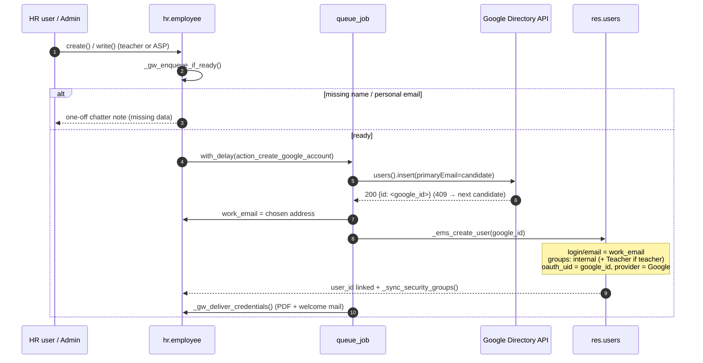

# Google Workspace staff integration & EMS user auto-creation

Automates the two accounts every staff member (teacher / ASP) needs:

1. **Corporate Google Workspace account** (issue 304) — created through the Admin SDK
   Directory API; the resulting address is stored in `work_email`.
2. **EMS user** (`res.users`, issue 342) — created right after the Google account, with
   login = corporate email and Google OAuth **pre-linked** (`oauth_uid` = the numeric
   Google user id returned by the Directory API), so staff sign in with the
   *Sign in with Google* button without ever receiving a password email.

Both live in `models/employees/google_workspace_integration.py`
(`HrEmployeeGoogleWorkspace`, `_inherit = 'hr.employee'`), with shared helpers in
`models/shared/google_workspace_mixin.py`.

## Flow

### `_ems_create_user(google_id=False)`

Idempotent; everything runs `sudo()` (callers are queue jobs or buttons limited to
`ems.group_academic_admin` / `hr.group_hr_user`). In order:

1. Guard: `employee_type in ('teacher', 'asp')` and `work_email` ends with the
   corporate domain — otherwise no-op.
2. Employee already has `user_id` → only backfill the OAuth fields if empty
   (and the `(provider, oauth_uid)` pair is free).
3. A `res.users` with `login = work_email` exists (archived included) and is not
   linked to another employee → re-link: unarchive, realign `login`/`email` to the
   corporate address, add missing groups, backfill OAuth. Linked to another
   employee → skip with a chatter note.
4. Otherwise create the user: `login`/`email` = corporate address (load-bearing —
   see *pitfalls*), `firstname`/`lastname` from `_gw_split_name()` (res.users
   inherits res.partner, which uses OCA `partner_firstname`), `mobile`, `tz`,
   explicit `company_id`/`company_ids` and groups, all under
   `no_reset_password=True`.
5. `_ems_link_google_signin(user, google_id)` sets `oauth_uid` + `oauth_provider_id`
   when the id is known and not taken by another user (auth_oauth unique constraint).
6. Link `employee.user_id`, call `_sync_security_groups()` so role/job-mapped
   groups apply immediately (the `write()` trigger only fires on
   `role_ids`/`job_id`/`tutorship_ids`), and post a chatter summary
   (created/re-linked + whether Google sign-in was pre-linked).

Call sites inside `action_create_google_account()`:

- **Success path** — right after `work_email` is written, before
  `_gw_deliver_credentials()`, with the `id` from the `users().insert` response.
- **Adopt path** (employee already had a corporate `work_email`, e.g. manual email) —
  with `_gw_google_user_id()`, which resolves the id via `users().get(userKey=email)`
  and returns `False` on any error (the OU-scoped admin role answers **403, not 404**,
  for unknown users) so the EMS user is still created, just without the OAuth pre-link.

In **dry-run** (`company.google_ws_dry_run`) no API call is made, so there is no
Google id: the EMS user is created without OAuth fields.

## Lifecycle

| Employee event | Google account | EMS user (`res.users`) |
|---|---|---|
| Created / completed (ready) | created (queued) | created + OAuth pre-linked |
| Archived (`active = False`) | suspended, moved to suspended OU (queued) | archived immediately (`_ems_sync_user_active`) |
| Unarchived | reactivated (queued) | unarchived |
| Deleted (`unlink`) | suspended synchronously | archived |

The user archiving is deliberately **synchronous and independent** of
`google_ws_enabled` and of the job queue: a former employee must lose Odoo access
immediately even if the Google integration is disabled or the queue is down.
`_ems_sync_user_active` skips `self.env.user` and the superuser.

## Access control

| Action | Who |
|---|---|
| Create employee / trigger account creation (buttons) | `ems.group_academic_admin`, `hr.group_hr_user` |
| Auto-created user groups (teacher) | `base.group_user` + `ems.group_teacher` |
| Auto-created user groups (ASP) | `base.group_user` only (role/job sync adds the rest) |
| res.users creation itself | `sudo()` inside the flow |

`ems.group_teacher` does **not** imply `base.group_user`, so the internal-user group
is granted explicitly.

## Required fields

| Step | Required data |
|---|---|
| Plain employee creation | `name` (plus `private_email` at view level for **new** teacher/ASP records) |
| Google account creation | `name`, `private_email` (recovery + credentials email); phone/NIF optional |
| EMS user creation | corporate `work_email` (produced by the previous step) |

## Pitfalls (native hr v18)

- `work_email` is a stored compute on `work_contact_id.email`, and writing
  `user_id` swaps `work_contact_id` to the user's partner (`_sync_user`). Creating
  the user **without `email`** would wipe the just-written corporate address.
  Same for `mobile_phone` → pass `mobile` in the create values.
- With `email` set, `auth_signup` sends the invitation mail on user creation unless
  `no_reset_password=True` is in the context.
- Re-entrancy is safe: linking `user_id` re-enters `write()` but `_gw_ready()` is
  `False` once `work_email` is set.

## Tests

`tests/test_employee_ems_user.py` (`TestEmployeeEmsUser`) — user creation, groups per
type, OAuth capture/backfill, idempotence, re-link of archived users, `work_email`
survival regression, lifecycle sync, no invitation mail. The SMTP transport is patched
class-wide (see `tests/test_strike.py` pattern). Google-side behaviour is covered by
`tests/test_employee_google_workspace.py`.
