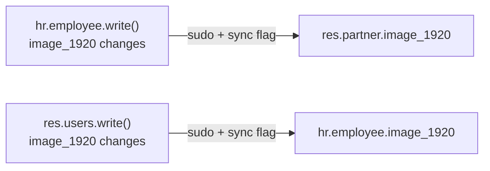

# Profile picture disable switch

Lets a teacher (or any employee with a linked user account) disable their own profile
picture from **"My Profile"**. While disabled, nobody — not even an admin, from any
form — can change the photo; it shows Odoo's own initials placeholder everywhere
instead. Re-enabling does not restore the previous photo: a fresh upload is required.

Implemented in `models/employees/user.py` (`ems_users`, `_inherit = "res.users"`) and
`models/employees/employee.py` (`ems_employee`, `_inherit = ["hr.employee"]`).

## Field

- **`res.users.image_disabled`** (Boolean, default `False`) — the only new field, set
  from "My Profile".

`image_1920` itself is left completely untouched on both models — it's the same plain,
native `image.mixin` field it always was. There is no compute, no inverse, no backup
field: every write is a direct, explicit assignment.

## Keeping employee and user photos identical

`hr.employee.image_1920` and the linked `res.users`/`res.partner.image_1920` are always
the same value. Whichever side is written pushes the new value to the other, with a
shared context flag (`EMS_PHOTO_SYNC_CONTEXT_KEY`, defined in `employee.py`, imported by
`user.py`) preventing the receiving side from pushing it right back:

The push always uses `sudo()`: it's an internal consistency operation, not something
the acting user needs model-level write access to on the *other* model (e.g. a teacher
uploading their own photo from "My Profile" has no `hr.employee` write access at all).

## Disabling

Setting `res.users.image_disabled = True`:

1. Generates Odoo's own initials-avatar SVG once
   (`res.partner._avatar_generate_svg()` — `res.users` has no method of its own since
   `avatar.mixin` methods aren't part of the `_inherits` field delegation, only fields
   are).
2. Writes it explicitly, sync-flagged, into both `partner_id.image_1920` and (if linked)
   `employee_id.image_1920` — not left to the normal push-on-change sync, so this stays
   an obvious, one-time destructive action rather than something that could be triggered
   incidentally.

From then on, any write to `image_1920` on either model — by anyone, including an admin,
outside the sync-flagged push above — raises `UserError` until the switch is turned back
off. Re-enabling (`image_disabled = False`) does nothing else: no photo is restored, the
placeholder stays until someone uploads a real one.

## Access control

| Actor | With photo enabled | With photo disabled |
|---|---|---|
| The employee themselves (via "My Profile") | can upload/replace | blocked, `UserError` |
| Anyone with `hr.employee` write access (e.g. admin, from the employee form) | can upload/replace | blocked, `UserError`, even for an admin/superuser writing without `sudo()` |
| Anyone reading `hr.employee`/`res.users`/`res.partner` | sees the real photo | sees the initials placeholder, everywhere (Discuss, top bar, org chart, kanban, employee form — there is no special-cased viewer) |

No new `ir.model.access.csv`/`ir.rule` entries were added.

## Migration

This feature has never shipped before, in any form — no legacy `image_visibility`/
`image_private` data exists anywhere to migrate. `migrations/18.0.0.21.0/post-migrate.py`
adds a single function, `_sync_employee_photo_to_user`, that copies each employee's
current `image_1920` to their linked user once, matching what `write()` maintains
automatically from now on. `image_disabled` needs no migration — it's born `False` by
its own field default.
