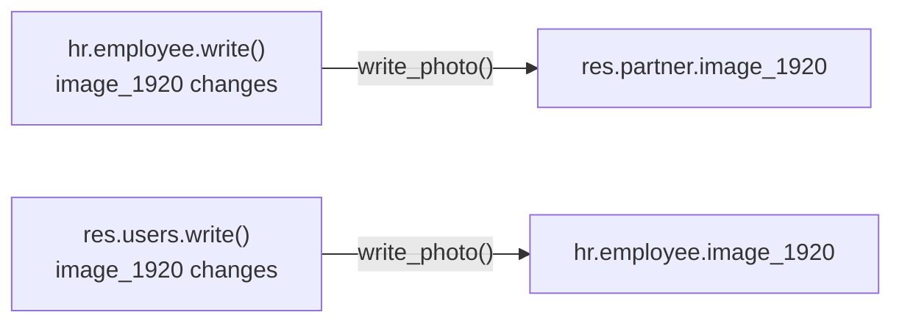

# Profile picture disable switch

Lets a teacher (or any employee with a linked user account) disable their own profile
picture from **"My Profile"**. While disabled, nobody — not even an admin, from any
form — can change the photo; it shows Odoo's own initials placeholder everywhere
instead. Re-enabling does not restore the previous photo: a fresh upload is required.

Implemented in `models/employees/user.py` (`ems_users`, `_inherit = "res.users"`) and
`models/employees/employee.py` (`ems_employee`, `_inherit = ["hr.employee"]`).

## Field

- **`res.users.image_disabled`** (Boolean, default `False`) — the only new field, set
  from "My Profile".

`image_1920` itself is left completely untouched on both models — it's the same plain,
native `image.mixin` field it always was. There is no compute, no inverse, no backup
field: every write is a direct, explicit assignment.

## Keeping employee and user photos identical

`hr.employee.image_1920` and the linked `res.users`/`res.partner.image_1920` are always
the same value. Whichever side is written pushes the new value to the other, always via
`write_photo()`, which always targets `hr.employee` or `res.partner` — **never**
`res.users` itself:

That asymmetry is what keeps the loop-prevention guard (below) simple: only
`hr.employee.write()` can ever be re-entered by this feature's own sync pushes, so only
it needs one. `res.users.write()` is always the *entry point* a user/admin action starts
at, never a target `write_photo()` pushes into — so it needs no such guard at all, and
`res.partner` (`models/contacts/contact.py`) has no photo-sync logic of its own to loop
back through either.

## `write_photo()` — why every write goes through it, not a plain assignment

`write_photo(record, value)` (`employee.py`) is the single choke point every photo write
in this feature goes through — the user-initiated write itself (via the `write()`
overrides below), every employee↔user sync push, and the migration
(`_sync_employee_photo_to_user`). It exists to work around a real Odoo core behaviour
that caused a genuine, user-reported bug during development:

- **Odoo never re-detects an existing `ir.attachment`'s `mimetype` when its content is
  overwritten in place** — only `Model.create()` runs mimetype detection
  (`ir_attachment._check_contents`); updating `datas` in place
  (`ir_attachment._inverse_datas`) recomputes `checksum`/`file_size`/`store_fname` but
  never touches `mimetype`. This feature writes genuinely different kinds of content into
  the same fields over time (a real photo, then Odoo's own initials-placeholder SVG, then
  a real photo again after re-enabling) — a plain assignment left the attachment's
  `mimetype` column stuck on whatever it was before, so the browser was served the new
  bytes under the *old* `Content-Type` and refused to render them (visible as literal
  "Binary file" text instead of the picture).
- `image_1024`/`image_512`/`image_256`/`image_128` (`image.mixin`'s resized copies of
  `image_1920`) are each their **own**, independent `ir.attachment` row, lazily
  recomputed only the next time something actually *reads* that field — so the same
  stale-mimetype problem could resurface later, and under a different, unpredictable
  actor (see below), even after fixing `image_1920` itself.

`write_photo()` addresses both: it deletes every existing `image_1920`/`1024`/`512`/
`256`/`128` attachment for the record first (forcing every one of them through
`create()`, which always detects the mimetype fresh), then writes the new value and
**eagerly** reads the four resized fields itself — rather than leaving them to whatever
next viewer happens to trigger their lazy recompute.

That "next viewer" detail matters for a second, unrelated Odoo restriction:
`ir_attachment._check_contents` forces any XML-like `mimetype` (SVG included) down to
`text/plain` unless the *acting user* can write `ir.ui.view` — a deliberate anti-XSS
guard against a non-admin sneaking a script-bearing SVG through, checked with
`self.env['ir.ui.view'].sudo(False).has_access('write')`, which explicitly strips any
`sudo()` wrapper before checking. A plain `.sudo()` does **not** bypass it — only
`with_user(SUPERUSER_ID)` (which genuinely changes the acting user, not just the `su`
flag) does. This is why disabling (`user.py`, the `if disabling:` branch) writes the
placeholder via `user.with_user(SUPERUSER_ID)...`, not `.sudo()`: without it, a teacher
disabling their *own* photo would get an SVG placeholder mislabeled as `text/plain` the
moment it was (re-)computed under their own, non-admin session — and eagerly reading the
resized fields inside `write_photo()`, under that same elevated user, is what stops a
later, unprivileged read from re-triggering the mislabeling for a fresh `image_1024`
attachment.

## Disabling

Setting `res.users.image_disabled = True`:

1. Generates Odoo's own initials-avatar SVG once
   (`res.partner._avatar_generate_svg()` — `res.users` has no method of its own since
   `avatar.mixin` methods aren't part of the `_inherits` field delegation, only fields
   are).
2. Writes it explicitly, via `write_photo()`, sync-flagged, as `SUPERUSER_ID`, into both
   `partner_id.image_1920` and (if linked) `employee_id.image_1920` — not left to the
   normal push-on-change sync, so this stays an obvious, one-time destructive action
   rather than something that could be triggered incidentally.

From then on, any write to `image_1920` on either model — by anyone, including an admin,
outside the sync-flagged push above — raises `UserError` until the switch is turned back
off. The check compares against the *effective* `image_disabled` value this same write
will leave in place (`vals.get('image_disabled', user.image_disabled)` in `user.py`), not
just the value already in the database — so unticking "Disable profile picture" and
picking a new file in the same "My Profile" save works in one step; only *disabling* and
uploading in the same write stays blocked (the uploaded photo would be immediately
overwritten by the placeholder anyway, so there is nothing to gain by allowing it, and it
avoids an ambiguous combined request).

Re-enabling (`image_disabled = False`) on its own does nothing else: no photo is
restored, the placeholder stays until someone uploads a real one.

## Access control

| Actor | With photo enabled | With photo disabled |
|---|---|---|
| The employee themselves (via "My Profile") | can upload/replace | blocked, `UserError` |
| Anyone with `hr.employee` write access (e.g. admin, from the employee form) | can upload/replace | blocked, `UserError`, even for an admin/superuser writing without `sudo()` |
| Anyone reading `hr.employee`/`res.users`/`res.partner` | sees the real photo | sees the initials placeholder, everywhere (Discuss, top bar, org chart, kanban, employee form — there is no special-cased viewer) |

No new `ir.model.access.csv`/`ir.rule` entries were added.

## Anti-recursion guard

`write_photo(employee, ...)` writes `image_1920` on the `hr.employee` record itself —
which would re-enter `hr.employee.write()` and call `write_photo()` again, forever.
`write_photo()` always tags its own internal write with a context flag
(`EMS_PHOTO_SYNC_CONTEXT_KEY`, module-level in `employee.py`), and `hr.employee.write()`
checks it *first*, skipping straight to `super().write(vals)` — no guard/push logic runs
for `write_photo()`'s own writes, breaking the cycle after exactly one hop. No other model
needs this: `write_photo()` never targets `res.users` (see above), and `res.partner` has
no write() override to loop back through — so this single check in `hr.employee.write()`
is the entire anti-recursion mechanism for the whole feature.

## Migration

This feature has never shipped before, in any form — no legacy `image_visibility`/
`image_private` data exists anywhere to migrate. `migrations/18.0.0.21.0/post-migrate.py`
adds a single function, `_sync_employee_photo_to_user`, that copies each employee's
current `image_1920` to their linked user once (via `write_photo()`, for the same
mimetype-safety reason as above — a centre may have a teacher whose user-side photo was
uploaded independently, in a different format, before this feature existed), matching
what `write()` maintains automatically from now on. `image_disabled` needs no migration —
it's born `False` by its own field default.

This same function also absorbs what used to be a separate, pre-existing
`_copy_teacher_photo_to_user` (teacher/ASP photo backfill for Google Workspace account
creation, unrelated to this feature): since `_sync_employee_photo_to_user` unconditionally
copies every employee-with-a-user's `image_1920` to their user, it's a strict superset of
that older function's effect — keeping both would have meant doing the same copy twice for
no reason, so `_copy_teacher_photo_to_user` was removed rather than left dead in the
`migrate()` call chain.
