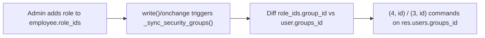

# Technical Reference: Academic Role Hierarchy

## Overview

EMS grants teachers escalating access through a chain of `res.groups` implication (`security/groups.xml`, category `ems.category_roles`). Each group in the chain implies (and therefore includes all permissions of) the one before it, via `implied_ids`.

`group_department_chief` was added identical to `group_tutor` (`implied_ids = [group_tutor]`, no extra rights of its own yet). `group_head_of_studies` implies `group_department_chief` instead of `group_tutor` directly, so the chain is unbroken.

## Role → Group Sync

Group membership is not edited directly by admins in normal operation; it is derived from data:

- **`ems.role`** (`models/employees/role.py`) is a role catalog. Each role may carry a `group_id`: employees holding that role are automatically added to the linked `res.groups`.
- **`data/main/ems.role_group_relationship.xml`** wires specific role catalog entries (from `data/cat/ems.role.csv`) to their security group, e.g. `role_tutor → group_tutor`, `role_dchieff → group_department_chief`, `role_hos`/`role_dhos → group_head_of_studies`, `role_director → group_director`.
- **`ems_employee_base._sync_security_groups()`** (`models/employees/employee.py`) diffs an employee's `role_ids`/`job_id` derived groups against `res.users.groups_id` and issues `(4, id)`/`(3, id)` commands, called from `write()` and the relevant `@api.onchange` handlers.
- `role_tutor` is the one exception: it is **not** manually assignable — `update_tutor_role()` links/unlinks it automatically based on whether the employee is referenced as `tutor_id` on any `ems.group`. All other roles in the chain (`role_dchieff`, `role_hos`, `role_dhos`, `role_director`) are assigned manually by an admin, by adding the role to the employee's `role_ids`.

## Access Control

| Group | Implies | Comment |
|-------|---------|---------|
| `ems.group_teacher` | `hr_attendance.group_hr_attendance_own_reader` | Base teacher access |
| `ems.group_tutor` | `ems.group_teacher` | Teacher in charge of a group; row-level access to their group's students is granted via record rules in `security/rules/*.xml` that filter on `group_teacher` + a domain on `tutor_id`, not on `group_tutor` itself |
| `ems.group_department_chief` | `ems.group_tutor` | Department head. Grants full read/write/create/unlink access to `ems.group` (see `access_ems_group_department_chief`), otherwise currently identical to Tutor |
| `ems.group_head_of_studies` | `ems.group_department_chief`, `hr_attendance.group_hr_attendance_manager` | Full read/write access to all employees' attendance records |
| `ems.group_director` | `ems.group_head_of_studies` | Currently identical to Head of Studies |
| `ems.group_academic_admin` | `ems.group_director` (+ Secretary/Quality/Settings admin chains) | All access rights |

No new record rules or views were needed for `group_department_chief`: because it implies `group_tutor`, every rule/view gated on `group_teacher` (with a `tutor_id` domain) or on `group_tutor` directly is automatically satisfied.

## Key Migrations

| Version | Change | File |
|---------|--------|------|
| 18.0.0.19.3 | Renamed role catalog id `role_dchieff_cs` → `role_dchieff` (was incorrectly scoped to a single department) and wired it to the new `group_department_chief` (then named `group_head_of_department`) | `migrations/18.0.0.19.3/pre-migrate.py` |
| 18.0.0.21.0 | Renamed security group XML ID `group_head_of_department` → `group_department_chief`; granted the group full write/create/unlink access on `ems.group` | `migrations/18.0.0.21.0/pre-migrate.py` |
