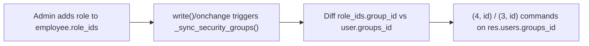

# Technical Reference: Academic Role Hierarchy

## `ems.role` model reference

| Field | Type | Notes |
|-------|------|-------|
| `name` | `Char`, translatable, required | Role label (e.g. "Head of studies") |
| `color` | `Char` (hex) | Free-pick display color — see [Free-pick color widget](../shared/color_widget.md) |
| `notes` | `Text` | Free-form admin notes |
| `unipersonal` | `Boolean` | If set, `check_limit()` raises when a second employee would be assigned this role |
| `employee_type` | `Selection` | `teacher`/`asp` — restricts which employees `employee_ids` can hold |
| `employee_ids` | `Many2many → hr.employee.public` | Who currently holds this role (manual `hr_employee_public_ems_role_rel` relation — see the in-code comment for why) |
| `group_id` | `Many2one → res.groups` | If set, holding this role auto-adds the employee to this security group — see "Role → Group Sync" below |

CRUD is plain: `group_academic_admin` has full read/write/create/unlink on the role catalog (`security/ir.model.access.csv`); `group_teacher`/`group_secretary` are read-only, so a teacher can see which role a colleague holds but not edit the catalog. The catalog itself (`data/cat/ems.role.csv`) seeds 16 built-in roles; a centre can add its own from the UI.

## Overview

EMS grants teachers escalating access through a chain of `res.groups` implication (`security/groups.xml`, category `ems.category_roles`). Each group in the chain implies (and therefore includes all permissions of) the one before it, via `implied_ids`.

`group_department_chief` was added identical to `group_tutor` (`implied_ids = [group_tutor]`, no extra rights of its own yet). `group_head_of_studies` implies `group_department_chief` instead of `group_tutor` directly, so the chain is unbroken.

## Role → Group Sync

Group membership is not edited directly by admins in normal operation; it is derived from data:

- **`ems.role`** (`models/employees/role.py`) is a role catalog. Each role may carry a `group_id`: employees holding that role are automatically added to the linked `res.groups`.
- **`data/main/ems.role_group_relationship.xml`** wires specific role catalog entries (from `data/cat/ems.role.csv`) to their security group, e.g. `role_tutor → group_tutor`, `role_dchieff → group_department_chief`, `role_seminar → group_department_chief`, `role_hos`/`role_dhos → group_head_of_studies`, `role_secretary → group_secretary` (Secretary block, independent from this chain — see the Access Control table below), `role_director → group_director`.
- **`ems_employee_base._sync_security_groups()`** (`models/employees/employee.py`) diffs an employee's `role_ids`/`job_id` derived groups against `res.users.groups_id` and issues `(4, id)`/`(3, id)` commands, called from `write()` and the relevant `@api.onchange` handlers.
- `role_tutor`, `role_dchieff`, `role_seminar`, `role_hos`, `role_dhos`, `role_secretary` and `role_director` are **not** manually assignable — no role in this chain remains manual: `update_tutor_role()` links/unlinks `role_tutor` based on whether the employee is referenced as `tutor_id` on any `ems.group`; `update_department_head_role()`/`update_seminar_chief_role()` do the same for `role_dchieff`/`role_seminar` based on `hr.department.manager_id`/`seminar_chief_id` (labelled "Department Chief"/"Seminar Chief" on the department form); `update_area_manager_role()` does the same for `role_hos`/`role_dhos`/`role_secretary` based on a *top-level* department's `manager_id`/`top_level_role` (labelled "Area Manager" on the department form — `role_secretary` is how the `ASP` top-level department's manager is handled, a teacher coordinating administrative/secretariat staff); `update_director_role()` does the same for `role_director` based on `res.company.director_id` (Ajustes/Settings > EMS Management — deliberately not a department field, see [Department Chief / Seminar Chief / Head of Studies / Director cascade](department.md)). Note `role_secretary` was changed from non-unipersonal to unipersonal in `data/cat/ems.role.csv` when it joined `top_level_role` — there is only ever one ASP Area Manager centre-wide, same as Head of Studies/Deputy/Director.

## Access Control

| Group | Implies | Comment |
|-------|---------|---------|
| `ems.group_teacher` | `hr_attendance.group_hr_attendance_own_reader` | Base teacher access |
| `ems.group_tutor` | `ems.group_teacher` | Teacher in charge of a group; row-level access to their group's students is granted via record rules in `security/rules/*.xml` that filter on `group_teacher` + a domain on `tutor_id`, not on `group_tutor` itself |
| `ems.group_department_chief` | `ems.group_tutor` | Department head. Grants full read/write/create/unlink access to `ems.group` (see `access_ems_group_department_chief`), otherwise currently identical to Tutor |
| `ems.group_head_of_studies` | `ems.group_department_chief`, `hr_attendance.group_hr_attendance_manager` | Full read/write access to all employees' attendance records |
| `ems.group_director` | `ems.group_head_of_studies` | Currently identical to Head of Studies |
| `ems.group_academic_admin` | `ems.group_director` (+ Secretary/Quality/Settings admin chains) | All access rights |

No new record rules or views were needed for `group_department_chief`: because it implies `group_tutor`, every rule/view gated on `group_teacher` (with a `tutor_id` domain) or on `group_tutor` directly is automatically satisfied.

## Key Migrations

| Version | Change | File |
|---------|--------|------|
| 18.0.0.19.3 | Renamed role catalog id `role_dchieff_cs` → `role_dchieff` (was incorrectly scoped to a single department) and wired it to the new `group_department_chief` (then named `group_head_of_department`) | `migrations/18.0.0.19.3/pre-migrate.py` |
| 18.0.0.21.0 | Renamed security group XML ID `group_head_of_department` → `group_department_chief`; granted the group full write/create/unlink access on `ems.group` | `migrations/18.0.0.21.0/pre-migrate.py` |
