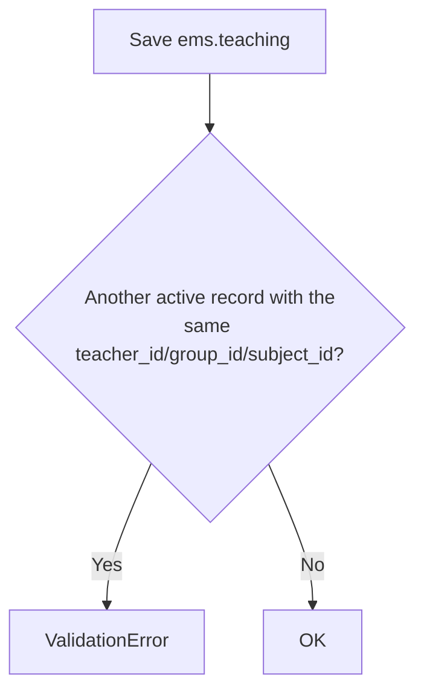

# Technical Reference: `ems.teaching`

## Overview

`ems.teaching` is the ternary relation teacher–group–subject: "this teacher teaches this subject to this group." It is derived from, and kept in sync with, the teacher's weekly schedule (`sync_from_schedule()`) — not normally hand-maintained, though its own CRUD screen exists for direct edits.

**Module file:** `models/employees/teaching.py` — `_inherit = ['ems.base']`, EMS's shared mixin (`models/shared/base.py`, itself built on `mail.thread`/`mail.activity.mixin`) used by several models across the app. It contributes `active` (archive flag), `action_archive()`, `get_user_is_admin()`/`get_user_is_tutor()`/`get_user_is_tutor_of_self()`, `notify()` (bus toast) and `chatter()`/`chatter_exception()` (mail-thread logging helpers) — none of which `ems.teaching` overrides or uses directly beyond inheriting `active`. `ems.base` doesn't have its own dedicated technical doc yet (per the DTON roadmap, shared mixins are documented at their first consumer rather than getting a dedicated phase); this is that first mention.

---

## Data Model

### Fields

| Field | Type | Required | Stored | Description |
|-------|------|----------|--------|-------------|
| `teacher_id` | `Many2one → hr.employee` | Yes | Yes | `ondelete='cascade'`; domain restricted to `employee_type = 'teacher'` |
| `group_id` | `Many2one → ems.group` | Yes | Yes | `ondelete='cascade'` |
| `subject_id` | `Many2one → ems.subject` | Yes | Yes | `ondelete='cascade'` |
| `inuse_group_ids` | `Many2many → ems.group` (computed, `compute_sudo=True`) | — | No | Groups already assigned to this teacher for the same subject — used to filter the group selector in the form so the same pair can't be picked twice |
| `display_name` | `Char` (computed) | — | No | The subject's own `display_name` |

### `_check_unique_active` Constraint

One active teaching entry per exact (teacher, group, subject) triple — a duplicate must be archived first, not silently allowed to coexist.

### `sync_from_schedule(teacher, entries)` — the real source of truth

Shared by the working-schedule XML importer and the employee "Schedule" tab's grid widget (see [Working schedules](working_schedule.md)) so `teaching_ids` always reflects what's actually on the schedule instead of being maintained separately by hand in two places. Diffs the teacher's current `teaching_ids` against the `(subject_id, group_ids)` pairs found in `entries`: unchanged pairs are left alone, new pairs are created, pairs no longer present are **unlinked** (not archived — the schedule is the single source of truth, so a stale teaching row has no reason to persist even as history).

---

## Access Control

Defined in `security/ir.model.access.csv` (lines 99–101).

| Role | Create | Read | Write | Delete | Group XML ID |
|------|:------:|:----:|:-----:|:------:|--------------|
| Administrator | ✓ | ✓ | ✓ | ✓ | `ems.group_academic_admin` |
| Teacher | — | ✓ | — | — | `ems.group_teacher` |
| Secretary | — | ✓ | — | — | `ems.group_secretary` |

---

## Views

| View | File | Notes |
|------|------|-------|
| List | `views/community/teaching/list.xml` | Also embedded read-only in `hr.employee`'s own "Teaching" tab (`views/community/employee/form.xml`) |
| Form | `views/community/teaching/form.xml` | — |
| Action + Menu | `views/community/teaching/menu.xml` | — |
