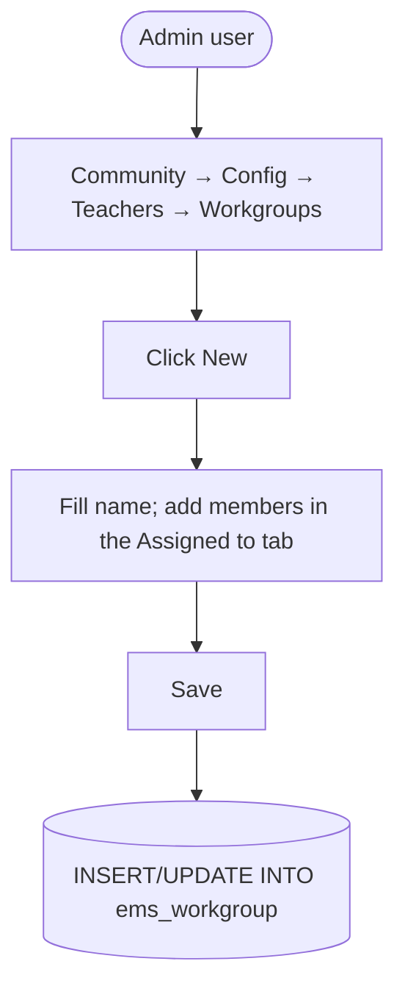

# Technical Reference: `ems.workgroup`

## Overview

`ems.workgroup` is a simple free-form grouping of employees (teachers, providers, ASP) — e.g. a project team or a cross-department committee, with no built-in behaviour beyond membership. No computed fields, no constraints, no business logic.

**Module file:** `models/employees/workgroup.py`

---

## Data Model

### Fields

| Field | Type | Required | Stored | Description |
|-------|------|----------|--------|-------------|
| `name` | `Char` | Yes | Yes | Workgroup name |
| `employee_ids` | `Many2many → hr.employee.public` | No | Yes | Members, domain-restricted to `employee_type = 'teacher'` |
| `notes` | `Text` | No | Yes | Free-form administrative notes |

Uses `hr.employee.public` (not the full `hr.employee`) for `employee_ids` — the lighter, read-mostly model, appropriate here since membership doesn't need full HR field access.

---

## CRUD Operations

Standard CRUD via its own menu — no custom `create()`/`write()`/`unlink()` overrides, no constraints.

---

## Access Control

Defined in `security/ir.model.access.csv` (lines 107–109).

| Role | Create | Read | Write | Delete | Group XML ID |
|------|:------:|:----:|:-----:|:------:|--------------|
| Administrator | ✓ | ✓ | ✓ | ✓ | `ems.group_academic_admin` |
| Teacher | — | ✓ | — | — | `ems.group_teacher` |
| Secretary | — | ✓ | — | — | `ems.group_secretary` |

No record-level rules exist for this model.

---

## Views

| View | File | Notes |
|------|------|-------|
| List | `views/community/workgroup/list.xml` | — |
| Form | `views/community/workgroup/form.xml` | Main data group; "Assigned to" (kanban-mode `employee_ids`) / Notes tabs |
| Action + Menu | `views/community/workgroup/menu.xml` | `action_workgroup_tree`, under Community → Configuration → Teachers (sequence 2) |

No other model references `ems.workgroup` — it is a leaf, standalone grouping tool.
