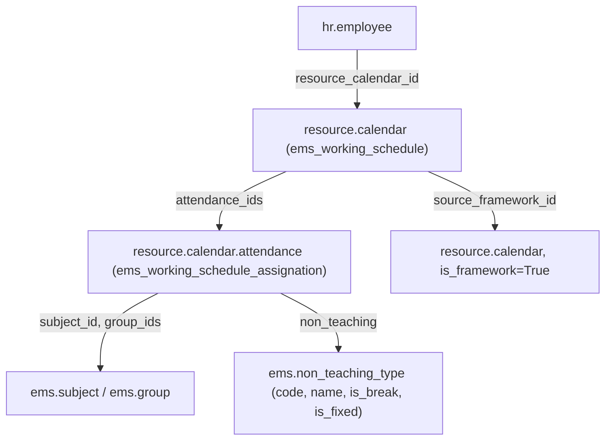
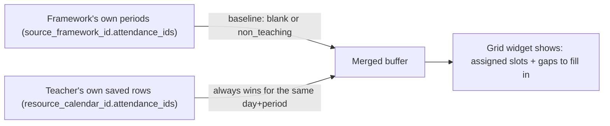
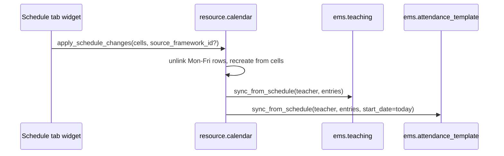
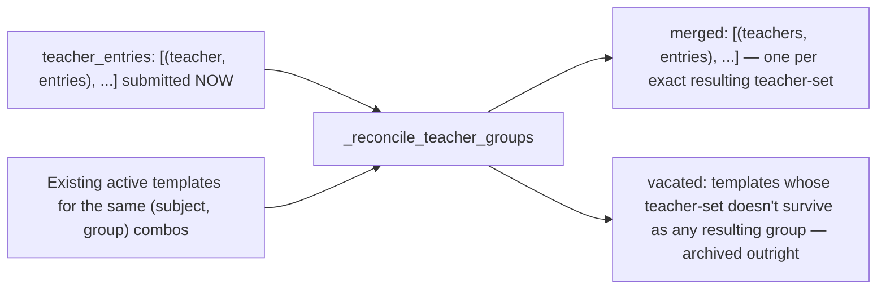
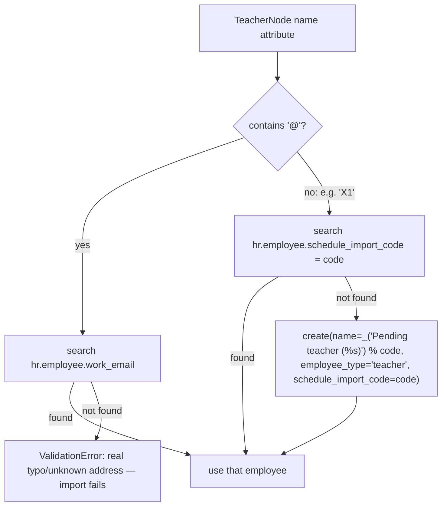
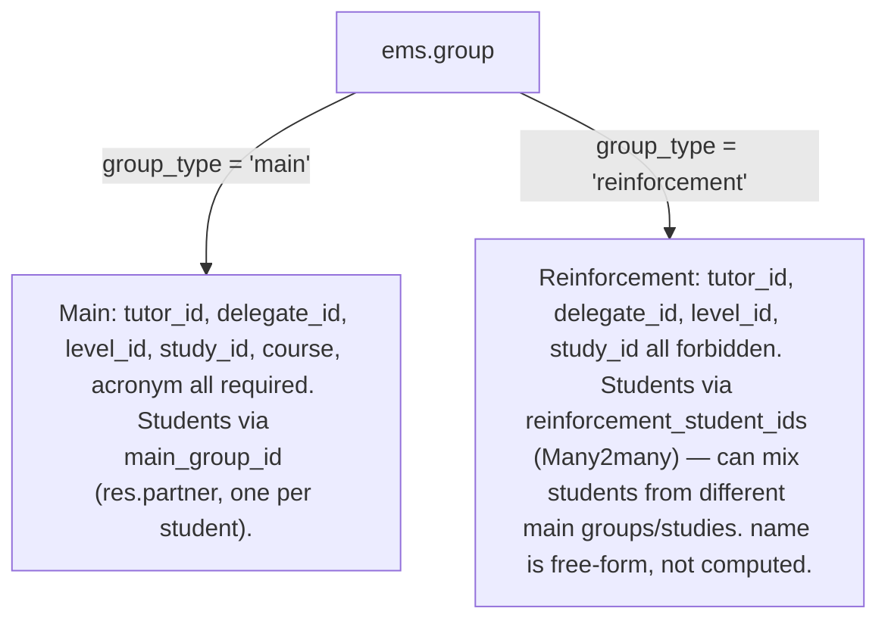

# Technical Reference: Teacher Working Schedules & Schedule Frameworks

## Overview

Every teacher's weekly timetable is their `hr.employee.resource_calendar_id` (a `resource.calendar`, extended by EMS), whose weekly slots live in `resource.calendar.attendance` rows (also extended). The whole system exists to let admins visually build/edit that timetable from the employee's own **Schedule** tab, instead of hand-editing raw attendance lines, while still supporting bulk XML import for centres that already export data from an external planner.

## Model extensions

**`resource.calendar`** (`models/employees/working_schedule.py`, class `ems_working_schedule`):
- `is_framework` (Boolean) — marks a calendar as a reusable **schedule framework** (a level's bell-schedule template) instead of a real teacher's personal calendar.
- `level_id` (Many2one `ems.level`) — which level a framework belongs to (ESO, BTX, CFGM...). Not required — one framework can also be the centre-wide default with no level.
- `source_framework_id` (Many2one `resource.calendar`, domain `is_framework=True`) — which framework a *personal* calendar was built from. This is the only thing that lets the "Schedule" tab keep showing a teacher's still-unassigned periods on every future edit (see "The empty-slot rule" below) — it is set by `seed_from_framework()` and by `apply_schedule_changes()`'s `source_framework_id` argument, never edited by hand.
- `unique_name` SQL constraint (pre-existing).

**`resource.calendar.attendance`** (`ems_working_schedule_assignation`):
- `subject_id` (Many2one `ems.subject`), `group_ids` (Many2many `ems.group`) — what's being taught in that slot.
- `non_teaching` (Many2one `ems.non_teaching_type`) — a non-teaching commitment instead of a subject (guard duty, break, coordination meeting...). See "Non-teaching types" below.
- `space_id` (Many2one `ems.space`, computed, stored) — the classroom, derived from `group_ids[:1].space_id` (same simplification `ems.attendance_template` already used: first group wins when several share a slot).

**`ems.non_teaching_type`** (`models/employees/non_teaching_type.py`) — a configurable vocabulary of non-teaching activities, replacing what used to be a hardcoded `Selection` so an admin can add a new code from **Configuration → Teachers → Non-teaching types** without a developer deploying code (the planner app that feeds the XML importer is outside our control and can introduce new codes at any time):
- `code` (Char, required, unique) — the stable, external-planner-facing identifier (e.g. `G`, `BR`, `CM`); what the XML import and the CM+Wednesday special case key off.
- `name` (Char, required, translatable) — the display label.
- `is_break` (Boolean) — dropped entirely from both `get_schedule_hours_summary()` columns (e.g. a lunch/patio break).
- `is_fixed` (Boolean) — always routed to the "fixed" hours-summary column (e.g. guard duties). The Wednesday-only "coordination meeting is fixed" rule doesn't reduce to a plain boolean, so it stays as an explicit `code == 'CM'` check in Python (see `get_schedule_hours_summary()` below) — this is why `code` is kept even though `name` alone would cover display.
- `sequence` (Integer), `active` (Boolean).

Seeded by `data/main/ems.non_teaching_type.csv` with the original 12 codes (`AC`, `BR`, `CM`, `CT`, `G`, `MM`, `MT`, `R`, `S`, `SC`, `TT`, `WIC`), `ems.non_teaching_<lowercase code>`-prefixed xmlids.

**`hr.employee`** (`models/employees/employee.py`, `ems_employee_base`): `schedule_attendance_ids` — a **related** One2many to `resource_calendar_id.attendance_ids`, used purely so the "Schedule" tab's widget field can be declared on the employee form (Odoo view archs can't reference a dotted `many2one.one2many` path directly).

## The empty-slot rule: nothing unassigned is ever stored

**A `resource.calendar.attendance` row only exists if it is real** — a subject assignment, or a non-teaching commitment (patio, a meeting...). An empty/unassigned period is *never* written to the database, even though the "Schedule" tab visually shows it as an editable gap. This was a deliberate correction after an earlier version *did* persist blank "Free" placeholder rows: they collided (Odoo's own `resource.calendar._check_overlap` constraint) with genuinely different times added by hand for the same teacher on the same day, and there was no clean way to tell "a real but still-unassigned slot" apart from "nothing is supposed to happen here".

Since unassigned slots aren't stored, the "Schedule" tab's grid widget re-derives them on every `Edit`/`New` by **merging two sources**:

- The **baseline** comes from the calendar's `source_framework_id` (fetched live, never stored on the teacher's own calendar) — including the framework's *own* non-teaching rows (patio, coordination meeting), which are real commitments every teacher following that framework inherits.
- The **real overlay** is the teacher's actually-saved rows, which always win for a given (weekday, exact hour_from/hour_to) pair, and can introduce periods the framework never had (a manually added "Add period" block, or a period copied from a colleague — see below).
- On **Save**, only cells that ended up with a real subject or a real `non_teaching` value are sent to `apply_schedule_changes` — genuinely-empty and still-unassigned ("blank") cells are both skipped.
- A manually added period ("Add period" in the widget) that's left unassigned in a given edit session simply **disappears** the next time you edit — it was never saved, so there's nothing to remember. This is intentional: only the framework's own structure is guaranteed to reappear.

## Server methods (`models/employees/working_schedule.py`)

- **`seed_from_framework(self, framework)`** — points a calendar's `source_framework_id` at `framework` and clears its own Mon–Fri attendance rows. Writes *nothing* else (per the empty-slot rule) — the framework's periods only become real rows the first time the Schedule tab actually saves something.
- **`apply_schedule_changes(self, cells, source_framework_id=None)`** — the single write path used by the Schedule tab's "Save": unlinks all Mon–Fri rows and recreates them from `cells` (a list of dicts shaped like `resource.calendar.attendance` create-vals), then re-derives `ems.teaching` and `ems.attendance_template` from the same `cells` (see below) and, if `source_framework_id` was passed (only when `New` picked/inherited a different framework), updates the calendar's own reference.
- **`ems.teaching.sync_from_schedule(self, teacher, entries)`** (`models/employees/teaching.py`) — diffs `teacher.teaching_ids` against `entries` (subject_id + group_ids pairs) by a `"subject.group"` key: creates what's missing, unlinks what's no longer there, leaves the rest untouched. Shared by both the XML importer and `apply_schedule_changes`.
- **`ems.attendance_template.sync_from_schedule(self, teacher, entries, start_date=None)`** (`models/attendance/attendance_template.py`) — a single-teacher sync, keyed by `"subject.sorted(group_ids).sorted(teacher_ids)"`, creating/archiving `ems.attendance_template` + their `attendance_schedule_ids`, and calling `fill_students()` on new ones. `start_date` defaults to September 1st (a fresh XML import assumes a brand-new course) but the Schedule tab's grid always passes *today* (a live mid-course edit shouldn't imply retroactive attendance). Internally delegates to `sync_from_schedule_batch()` wrapping its single `(teacher, entries)` pair, so a solo live edit is reconciled for co-teaching exactly like the XML importer's own multi-teacher batch — see "Co-teaching" below.
- **`get_schedule_hours_summary(self)`** — not stored, computed on demand (see "The 'Schedule' tab widget" below for why). Sums each Mon–Fri attendance row's duration (`hour_to - hour_from`, rounded UP with `math.ceil` — a period that only partially overlaps an hour still counts as a full hour), split into `{'teaching': {'rows': [...], 'total': int}, 'fixed': {'rows': [...], 'total': int}, 'total': int}`. `teaching` rows are keyed by `attendance.group_ids[:1].level_id` for subject periods taught to a `'main'` `ems.group` — or, for a `'reinforcement'` group (no single `level_id` of its own, see "Reinforcement groups" below), keyed and labelled by the group itself instead — plus any non-teaching activity not routed to `fixed`; `fixed` rows are activities with `non_teaching.is_fixed` (any day, e.g. guard duties) plus coordination meetings (`non_teaching.code == 'CM'`) specifically on Wednesday (`dayofweek == '2'`) — the centre's fixed non-teaching commitments. Activities with `non_teaching.is_break` are dropped from both. Reuses `get_report_label()` for translated activity names, same as the PDF report.

## Employee lifecycle hooks (`models/employees/employee.py`, `ems_employee`)

- **`create()`** — every new `employee_type='teacher'` gets their **own** `resource.calendar` (never shared, never the company's own calendar — `resource.mixin`'s client-side default pre-fills `resource_calendar_id` with the company's calendar before `create()` even runs server-side, so that value can't be used to detect "nothing was chosen"; it's unconditionally overridden), seeded from `company.default_schedule_framework_id` (required field, see Settings below).
- **`write()`** — renaming an employee renames their personal calendar to match (`"<name> (<current course>)"`), skipped for a calendar that `is_framework`.
- **`unlink()`** — deletes the employee's personal calendar (cascading its attendance rows), unless it's a framework, still referenced by another employee, or is the company's own base calendar.

## Schedule frameworks & the default-framework setting

A **framework** is just a `resource.calendar` with `is_framework=True` and an optional `level_id` — reusing the model rather than inventing a parallel one. Frameworks are managed like any other working schedule (**Configuration → Teachers → Schedule frameworks**, `views/community/working_schedules/menu.xml`), editing their `attendance_ids` with the same base Odoo list Odoo already ships for `resource.calendar`.

`res.company.default_schedule_framework_id` (`models/settings/company.py`, required, domain `is_framework=True`) is the framework every new teacher is seeded from. Exposed in **Settings → Employees** as `res.config.settings.schedule_framework_id` — note the settings-side field can't be named `default_*`, since `res.config.settings` treats that prefix as a special "set an `ir.default` value" field (requiring a `default_model` attribute), not a plain related field.

`data/main/ems.schedule_framework_default.xml` ships a generic default framework (hourly 8–14h/15–21h blocks, `noupdate="1"` since its child `resource.calendar.attendance` rows are `(0,0,...)` create commands — reloading them on every upgrade would duplicate/overlap). `data/custom/resource.calendar[.attendance].csv` ships the centre's real per-level frameworks (ESO, BTX, CFGM/CFGS/CFGB/EFPS/PFI), `__import__`-prefixed per the data-folder convention.

**Auto-fill pitfall:** `resource.calendar._compute_attendance_ids` (base Odoo, `resource_calendar.py`) auto-fills a brand-new calendar's `attendance_ids` from `company.resource_calendar_id` whenever `create()` doesn't include `attendance_ids` in the same call. Since our frameworks are seeded via two separate CSV files (parent record, then child attendance rows), the parent's own `create()` call has no inline `attendance_ids` and gets contaminated. Every legitimate row we create carries a real xmlid (CSV `id` or, for the default framework's XML, individually-`id`'d `<record>` elements — never inline `eval` tuples, which are anonymous and indistinguishable from the auto-fill); the module's `post_init_hook` (fresh installs) and `migrations/18.0.0.20.0/post-migrate.py` (upgrades) both purge any framework attendance row that has no matching `ir_model_data` entry.

## The "Schedule" tab widget

`static/src/js/backend/schedule_grid_field.js` (OWL field widget, `widget="schedule_grid"`, registered on `schedule_attendance_ids`) + `static/src/xml/backend/schedule_grid_field.xml` + `static/src/css/backend/schedule_grid.css`.

- **Read-only view**: entries positioned absolutely by exact `hour_from`/`hour_to` (not hour-rounded) inside an hourly-tick background grid. Blank/unassigned rows are filtered out of the read view entirely (nothing to show). The grid's own vertical axis (`computeBounds()` in `schedule_grid_geometry.js`, shared with the group widget) fits tightly to the teacher's actual entries — an afternoon-only teacher (e.g. 14h–22h) sees exactly that window, not a wider one padded out to a generic default; `DEFAULT_START`/`DEFAULT_END` (8h–20h) only apply as a fallback canvas when the calendar has no entries yet.
- **Derived break** (view mode only): a break the teacher's own calendar has no real saved row for yet is filled in from `hr.employee._get_derived_break_entries()`. The algorithm is deliberately **gap-based, not level-based**: for each weekday the teacher has at least one real entry (of any kind), it takes that day's own known span (earliest `hour_from` to latest `hour_to` among the teacher's real entries that day) and checks *every* break defined on *any* level's framework — a candidate is included only if it falls fully inside that span and doesn't overlap any real entry; two frameworks defining the exact same break collapse into one result. This deliberately never tries to guess "the" level a teacher belongs to — a teacher can plausibly teach several levels, even within the same day (e.g. an English teacher covering ESO, Batxillerat and cicles), each with its own break time, and each is evaluated independently against that day's actual gaps. A gap that doesn't line up with any known break simply stays empty.

  **Fetched via RPC, not exposed as a form field.** An earlier version returned this from a computed Many2many field (`derived_break_attendance_ids`, hidden with its own embedded `<list>` sub-view) — it computed correctly server-side (proven by the PDF report, which calls the same method directly in Python) but never actually rendered in the widget. The most plausible explanation, after ruling out the data itself (a `web_read`-shaped RPC simulated against real teacher data showed nothing wrong), is that an *invisible* x2many field with its own embedded list doesn't reliably load its sub-fields client-side, unlike a plain `Many2one`/`Boolean` field (`resource_calendar_id`/`can_edit_schedule` are hidden the same way and work fine). The fix: `hr.employee.get_derived_break_attendance_data()` is a plain public method (RPC-callable, no leading underscore) returning `.read()` dicts (Many2one as a `(id, name)` tuple — matches the array shape `entry.data.non_teaching[1]` already expects), fetched explicitly by the widget's `_loadDerivedBreaks()` in `onWillStart` and again after `save()` — the exact same `orm.call`/`useState` pattern this component already uses for `catalog.subjects`/`get_schedule_hours_summary`. `entriesForDay()` merges the fetched list with the real entries client-side, view-mode only, skipping any derived slot a real entry already occupies. Server-side, `get_schedule_report_lines()` does the equivalent merge for the PDF, calling `_get_derived_break_entries()` directly.

  **Float-rounding tolerance.** A framework break's own `hour_to` and the real period that immediately follows it can represent the exact same clock time (e.g. 11:25) as two slightly different floats — `11.416667` (a literal, as typically entered/imported) versus `11 + 25/60 == 11.416666666666666` (computed) — a difference far too small to matter but enough to make a strict `<` overlap check misfire and silently drop a break that should have shown up. `_get_derived_break_entries()`'s day-span and overlap checks both use `HOUR_EPSILON` (1/120 hour, 30 seconds — comfortably bigger than any float noise, comfortably smaller than any real, meaningful gap) instead of an exact comparison.

  **Visually distinct from every other non-teaching activity.** A break renders with its own CSS class, `o_schedule_grid_entry_break` (a diagonal brown stripe pattern, `schedule_grid.css`) — gated on `non_teaching_is_break` specifically, not on `non_teaching` in general, so a guard duty or coordination meeting keeps getting its own colour instead (see below). Without that distinction a break in the teacher's own grid was visually indistinguishable from a meeting, which read as "wrong" once breaks started reliably appearing. Same compact single-line block either way (time + label together, see above) — there is no other visual difference between an explicitly-saved break and a derived one. The group PDF's own break cell (`reports/contacts/report_group_schedule.xml`, `.gs-break`) uses the same brown/stripe treatment for consistency; the teacher's own PDF (`report_working_schedule.xml`) still colours every cell — including a break — from the same rotating palette as subjects, unchanged for now.

- **Per-subject/activity colour, not one flat colour for everything.** `schedule_grid_geometry.js` exports `REPORT_COLOR_PALETTE` (mirrors the identically-named Python constant in `ems.schedule_report_mixin` — kept in sync by hand, cross-language) and `buildColorMap(items)`, which assigns each distinct `items[].key` its own colour from that palette, reused every time the same key reappears, in first-seen `(dayofweek, hour_from)` order — the exact same "same subject always gets the same colour" rule `resource.calendar.get_schedule_report_lines()`/`ems.group.get_schedule_report_lines()` already use for the PDF. Both widgets build a `colorByKey` getter from their own currently-displayed entries only (a schedule with 3 subjects gets (at most) 3 colours, not one slot per subject that exists in the whole catalogue) and read it back per entry/block (`entryColor()`/`blockColor()`), appending `background-color` to the block's own inline `style` — the CSS classes (`.o_schedule_grid_entry`'s flat blue, the old flat grey on `.o_schedule_grid_entry_nonteaching`) now only serve as a fallback for the rare case nothing computed a colour. A break opts out of this (its `_colorKey`/`blockColor` equivalent returns `null`) since it already has its own fixed, deliberately-different brown/stripe look.
- **Edit mode** (`Edit`, or after `New`): rows are the **distinct real periods** found in the merged baseline+real buffer (see "The empty-slot rule"), not a fixed hourly grid — each row shows its own exact `HH:MM–HH:MM`, editable via two `<input type="time">` (moving the start shifts the end too, preserving duration, so a block can't accidentally balloon across the day), plus a subject+group dropdown pair (or a non-teaching reason) per (day, period) cell. `Add period`/the trash icon let an admin introduce or remove a period the loaded source didn't have — this is how a teacher who genuinely mixes two levels' bell schedules (e.g. an English teacher covering both ESO and CFGS classes) gets a slot at a time neither framework defines.
- **Import**: opens `ems.working_schedules_import_wizard` as a dialog, pre-scoped to the current employee (`context: {default_teacher_id}`) — the wizard then skips its usual by-email matching and takes the file's first (only) teacher node directly.
- **New**: choose a schedule framework (blank baseline) or another teacher (their real schedule as the overlay, plus *their* reference framework as the baseline too — a substitute inherits the same future gaps) — entirely replaces the buffer, but nothing is written until `Save`.
- **PDF**: calls `this.actionService.doAction("ems.action_report_working_schedule", { additionalContext: { active_ids: [this.props.record.resId] } })` — downloads the printable weekly schedule for the currently open employee (see "PDF report" below). No buffer/dirty-state interaction; available in both view and edit mode.
- **Hours summary** (below the grid, view mode only, hidden while editing): `resource.calendar.get_schedule_hours_summary()` returns two columns — mirrors the real external schedules this data is modelled on:
  - **"Weekly teaching hours"**: rows grouped by `ems.group.level_id` (teaching periods) — or, for a reinforcement group, one row per group (see "Reinforcement groups" below) — plus any non-teaching activity that isn't fixed or a Wednesday coordination meeting.
  - **"Other fixed-schedule hours"**: activities with `non_teaching.is_fixed` (e.g. guard duties, any day) and coordination meetings (`non_teaching.code == 'CM'`) specifically on Wednesday (`dayofweek == '2'`) — the centre's fixed non-teaching commitments. Activities with `non_teaching.is_break` (e.g. the lunch/patio break) are dropped from both columns entirely.
  Each column ends with its own `Total` row; the block below both shows the combined `Overall total` (should read 24 — `full_time_required_hours` — for a full-time teacher). The widget's `_loadSummary()` calls the method via RPC on initial mount (`onWillStart`) and again after `save()` — it deliberately does **not** recompute from the in-progress edit buffer, so it always reflects the last-saved schedule, not unsaved changes. See "Server methods" below for the aggregation itself.

## PDF report (`ems.report_working_schedule`)

`reports/employees/report_working_schedule.xml` — a `qweb-pdf` `ir.actions.report` on `hr.employee`, bound (`binding_type="report"`) so it also appears in the employee form's native Print menu, not just the Schedule tab's own `PDF` button.

- `resource.calendar.get_schedule_report_lines()` (`models/employees/working_schedule.py`) builds the printable rows server-side: one row per **distinct** `(hour_from, hour_to)` pair found across the calendar's Mon–Fri `attendance_ids`, each with a 5-slot `cells` list (Monday→Friday) holding either the matching `resource.calendar.attendance` record or an empty recordset. Since unassigned slots are never stored (see "The empty-slot rule"), every non-empty cell is already a real subject or non-teaching entry — the template does no filtering of its own.
- The template just iterates `employee.resource_calendar_id.get_schedule_report_lines()`, keeping all business logic in Python per the project's coding standards.
- **Header** (`hr.employee.get_report_role_lines()`): H1 is the employee's name + current course; H2 (only if set) is `department_id.name`; H3 (only if the employee has any `role_ids`) lists one line per role, in `role.name` order as returned by `get_report_role_lines()`. Two roles get extra context appended, resolved by fixed xmlid (same pattern as `role_tutor` used elsewhere in `employee.py`): `ems.role_tutor` → the tutored group(s)' `name` (from `tutorship_ids`); `ems.role_dchieff` → the employee's own `department_id.name` — **there is no per-department link for the "department chief" role** in the data model (it only implies the `ems.group_department_chief` security group, with no scoping to a specific `hr.department`), so the employee's own department is reused for this line rather than introducing a new field.

## Co-teaching (`ems.attendance_template.teacher_ids`)

`ems.attendance_template.teacher_ids` is a **Many2many** to `hr.employee` (relation table `ems_attendance_template_teacher_rel`), not a Many2one — two teachers can genuinely co-teach the same class (same subject, same group(s), same room, same time) and share **one** template, one set of `attendance_schedule_ids`, and therefore the same jointly-visible, jointly-editable `ems.attendance_session_header` records (any co-teacher can mark attendance; see "Access control" below). `hr.employee.attendance_template_ids` is the matching Many2many on the other side, pointing at the same relation table.

A template's identity is therefore `(subject_id, group_ids, teacher_ids)` — the **same** `(subject, group)` combination can have several active templates simultaneously, one per distinct exact set of co-teachers, split at the exact `(weekday, hour_from, hour_to)` slot level. Example: teacher A teaches "Programació"/DAW1A on Monday and Wednesday; teacher B joins only for the exact same Wednesday slot. The result is **two** templates: a shared A+B template for Wednesday, and A's own solo template for Monday — not one shared template covering both days.

`ems.attendance_template._reconcile_teacher_groups(self, teacher_entries)` is the single algorithm behind this, used by **both** `sync_from_schedule` (one teacher, the Schedule tab's live editor) and `sync_from_schedule_batch` (several teachers, the XML importer's normal case — `sync_from_schedule` just wraps its one pair and delegates to the batch version):

For every `(subject_id, group_ids)` combination touched by the submitting teacher(s) — including combos they used to teach but dropped entirely this call — it merges each **exact time slot** across:
- the newly submitted entries, and
- the still-existing slots of any OTHER teacher on the same template who is **not** submitting data in this call (an "untouched" co-teacher).

Slots are then grouped by their final teacher set. A template whose **current** exact teacher-set matches one of these groups survives (its schedule lines get refreshed in place, same archive-then-recreate pattern as the rest of the sync). A template whose teacher-set does **not** match any resulting group — because it shrank (a co-teacher dropped out), grew, split, or vanished entirely — is archived outright (`vacated`) and superseded by whichever new/updated template(s) now cover its slots.

This is what lets a **solo** live edit correctly reclassify another teacher's data: if A already has a Monday+Wednesday template and B (submitting alone) starts teaching that exact Wednesday slot, Wednesday splits out of A's template into a new shared A+B template, while Monday stays solo-A, untouched — without any special-casing between the live editor and the batch importer.

`find_external_conflicts` (room-collision detection against teachers **outside** the current batch) and `check_overlap`'s `same_teacher` check (`ems.attendance_schedule.py`) both moved from equality to **set intersection** on `teacher_ids` for the same reason.

## Import wizard (`ems.working_schedules_import_wizard`)

Parses a planner XML export (`<TeacherNode name="email ...">` → `<DayNode name="N ...">` → `<HourNode name="N HH:MM">` → `<Subject>`/`<NonTeaching>`/`<Students>` children) via `_create_schedule()`, then calls the same `ems.teaching.sync_from_schedule`/`ems.attendance_template.sync_from_schedule` used by the widget's save path. A `teacher_id` field (set via context from the widget's "Import" button) makes the by-email loop in both `_onchange_file` and `create()` a no-op — the file's single node is used directly for that employee.

**Teaching vs. non-teaching is decided by code, not by tag or by the `Students` sibling:** both `<Subject>` and `<NonTeaching>` are accepted as the hour's activity node; whichever one is present, its `name` attribute's leading code is looked up against `ems.non_teaching_type.code` — a hit means the hour is non-teaching (`NonTeaching` is only kept for older exports; some planner apps outside our control send non-teaching hours as a `<Subject>` node too, whose only observable difference from a real subject is the missing `<Students>` sibling). A miss falls through to the `ems.subject` lookup by code. `<Students>` is unrelated to this decision — it's always just a third, independent sibling that attaches `group_ids` when present, regardless of which activity node it sits next to. An unrecognized code (neither a known `ems.non_teaching_type.code` nor an `ems.subject.code`) raises a `ValidationError` — the fix, when the planner introduces a genuinely new non-teaching activity, is adding it once from **Configuration → Teachers → Non-teaching types**, not a code change.

Two upload modes, switched by whether `teacher_id` is set (the form shows one or the other via `invisible="teacher_id"`/`invisible="not teacher_id"`):
- **Scoped** (per-employee "Import" button, `default_teacher_id` in context): single `file` (`Many2one` `attachment_id` + related `Binary`), the file's one node maps directly to that employee.
- **General** (the "Working Schedules" list's cog menu, `import_planner_cog_menu.js` — no `teacher_id`): `attachment_ids`, a `Many2many` to `ir.attachment` rendered with the native `many2many_binary` widget, so **several files can be attached at once**, each one still free to describe **several teachers** by e-mail (unchanged from before). `create()`'s `_collect_xml_contents()` decodes every source given (`file` and/or each `attachment_ids` record) and processes all of them through the same per-node import loop; `_onchange_attachment_ids` mirrors `_onchange_file`'s already-has-a-schedule warning, checking every node in every attached file.

**Loading feedback:** both fields use custom widgets (`ems_blocking_binary`/`ems_blocking_many2many_binary`, `static/src/js/backend/working_schedule_import_blocking_upload.js`) instead of the plain `binary`/`many2many_binary` ones — thin subclasses that wrap the upload's `update()`/`onFileUploaded()` call with Odoo's own `env.services.ui.block()`/`.unblock()`. The onchange this triggers (`_onchange_file`/`_onchange_attachment_ids`) parses the whole XML server-side and was slow enough, with zero visual feedback otherwise, to look hung (reported 2026-08-01). No bespoke spinner: `ui.block()` is the same reference-counted overlay Odoo already uses for long button actions, just wired to the file input instead.

### Pending-identification teachers (a code with no `@`)

New timetables sometimes arrive before every teaching post is staffed — the external planner names those rows with a placeholder code (`X1`, `X2`...) instead of a real e-mail. `_is_email_like(value)` (`"@" in value`) is the only thing that tells the two apart, in both the **general** path's `create()` loop and `_onchange_attachment_ids`'s preview — the **scoped** (per-employee) path never does an e-mail lookup at all, so it's unaffected.

- A code match is **idempotent across re-imports**: the same code (`X1`) always resolves back to the same placeholder `hr.employee` record, so re-uploading an updated file for the same still-unstaffed post updates that teacher's schedule/`ems.teaching`/`ems.attendance_template` in place instead of creating a duplicate.
- `hr.employee.pending_identification` (`models/employees/employee.py`, computed+stored, `@api.depends("schedule_import_code")`) is the single derived flag driving the "Pending identification" indicator across `views/community/employee/{list,kanban,form,search}.xml` (list column, kanban badge, form ribbon, search filter/group-by) — `schedule_import_code` is the only stored source of truth, kept in sync automatically rather than as a second field that could drift.
- The onchange preview (`_onchange_attachment_ids`) never creates anything — a not-yet-matched code is only collected into a non-blocking `info_message` (blue banner, distinct from the red `blocking_error_message` used for a genuine unmatched e-mail) so the **Import** button stays enabled. The real get-or-create only happens in `create()`.
- **Resolution reuses the existing Google Workspace button, no separate "confirm identity" action.** Once an admin fills in the real `name` + `private_email` and calls `action_create_google_account()` (`models/employees/google_workspace_integration.py`), its existing missing-fields gate already blocks a still-unidentified placeholder (no `private_email` yet) exactly like it blocks any other incomplete employee — no change needed there. On success, the method additionally posts a chatter note with the original code and clears `schedule_import_code` (`emp.write({'schedule_import_code': False})`), which flips `pending_identification` back to `False` via the compute. The schedule, `ems.teaching` rows and `ems.attendance_template`/`ems.attendance_schedule` rows created at import time are untouched by this — they were already attached to this same employee record from the moment the placeholder was created.

## Reinforcement groups (`ems.group.group_type`)

An `ems.group` (`models/contacts/group.py`) is one of two kinds, distinguished by `group_type`:

A reinforcement group still appears in a teacher's schedule exactly like a main group — it's referenced the same way by `resource.calendar.attendance.group_ids`, resolved the same way by the XML importer's exact-name lookup (`_parse_schedule_entries`), and still needs `space_id` set (checked by `_groups_without_space`, same as any group). The only differences are:
- `_compute_name` only derives `name` from `study_id.acronym + course + acronym` for `'main'` groups; a `'reinforcement'` group's `name` is set directly (must match whatever the external planner exports for it, since the importer's lookup is an exact string match) and defaults to its `acronym`/`external_id` (or a placeholder) only the first time it's computed.
- `_check_group_type_fields` (an `@api.constrains`) enforces the field split above at write time.
- `ems.attendance_template.level_id`/`study_id` are **not required** (unlike most other fields on that model) precisely because a template built from a reinforcement group's slot (`_write_schedule_sync`, keyed off `first_group`) has no single level/study to store there.
- `get_schedule_hours_summary()` can't bucket a reinforcement group's teaching hours by `level_id` (there isn't one) — it buckets by the group itself instead, so those hours still show up as their own row in the "Weekly teaching hours" column.

Student membership in a reinforcement group is entirely manual (`reinforcement_student_ids`) — it does not touch `res.partner.main_group_id`, which keeps pointing at the student's real group.

## Access control

| Action | `base.group_user` (default) | `ems.group_department_chief` and above (`ems.group_head_of_studies`, `ems.group_director`, `ems.group_academic_admin`) |
|--------|------------------------------|------------------------------|
| Read a `resource.calendar`/`resource.calendar.attendance` | ✅ (base Odoo ACL) | ✅ |
| Export a schedule to PDF (`PDF` button / native Print menu) | ✅ | ✅ |
| Write/create/unlink `resource.calendar.attendance` (Edit/New/Add period, all writes through `apply_schedule_changes`) | ❌ | ✅ (`security/ir.model.access.csv`, `access_resource_calendar_attendance_admin`) |
| Write `resource.calendar` (needed for `source_framework_id`, set by Edit/New) | ❌ | ✅ (`access_resource_calendar_write_department_chief`) |
| Manage schedule frameworks | inherited from the above | ✅ |
| Import wizard | ❌ (no ACL row) | ✅ (`access_ems_working_schedules_import_wizard_admin`) |
| Read `ems.non_teaching_type` (needed to display `non_teaching`'s label anywhere it's read) | ✅ (`ems.group_teacher`/`ems.group_secretary` explicit read-only rows) | ✅ |
| Manage `ems.non_teaching_type` (add/edit/deactivate a code) | ❌ | ✅ (`access_ems_non_teaching_type_admin`, `ems.group_department_chief`) |

`hr.employee.can_edit_schedule` (a non-stored `compute_sudo` boolean, `self.env.user.has_group('ems.group_department_chief')`) is what the Schedule tab's toolbar itself reads to show/hide `Edit`/`Import`/`New` (`schedule_grid_field.js`'s `canEdit` getter) — the ACL rows above are the actual enforcement, this field only drives the widget's own visibility so a lower role never sees buttons it can't use. `PDF` is deliberately **not** gated by it: every role that can already read a schedule (i.e. everyone, per the table above) can also export it, including from the employee form's native Print menu.

Any other role currently only sees a teacher's schedule read-only (their own, via the employee record they can already open) — nobody below Department Chief can edit it.

`ems.attendance_template`'s own `rule_attendance_template_teacher_own` and `ems.attendance_session_header`'s `rule_attendance_session_teacher_own` (`security/rules/attendance.xml`) both traverse `teacher_ids.user_id.id`/`template_teacher_ids.user_id.id` (Many2many, not Many2one) — so **any** co-teacher on a shared template can read/write its schedule and every attendance session created from it, not just one designated "owner".
