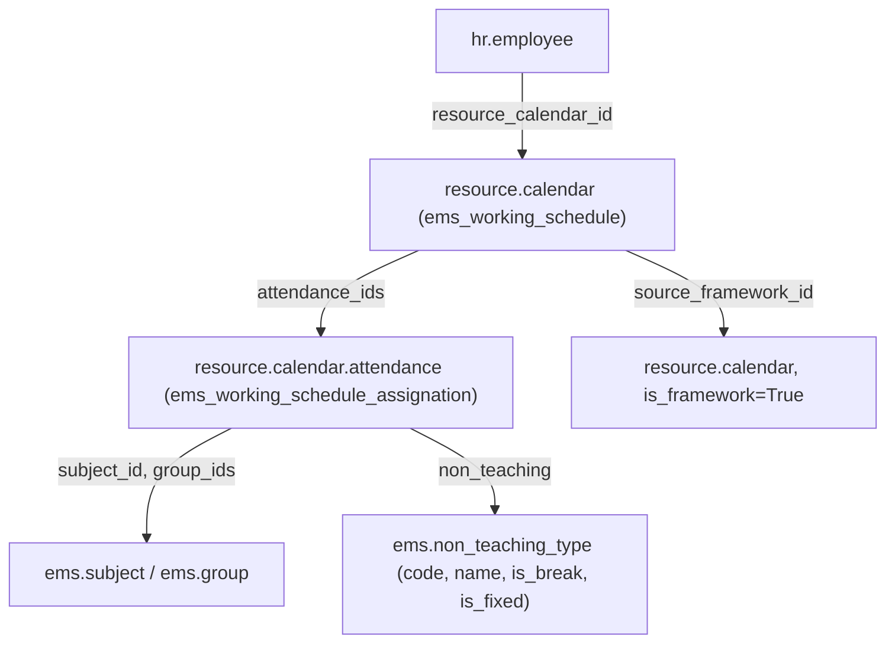
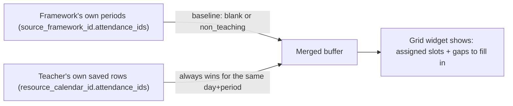
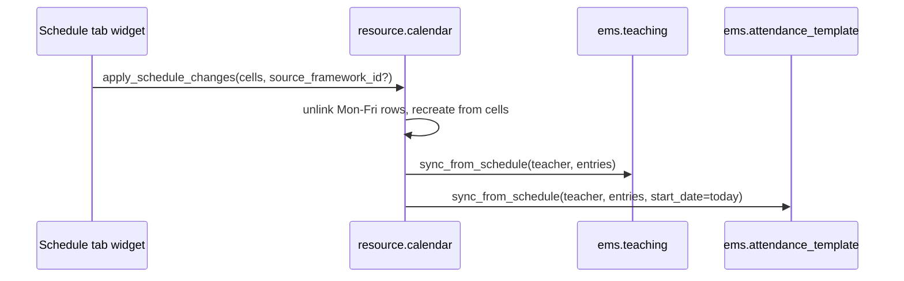
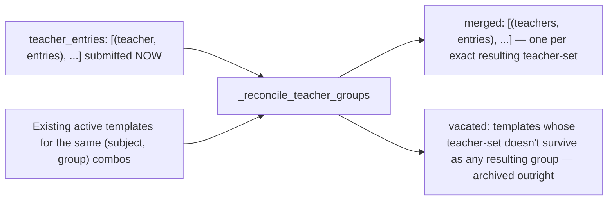
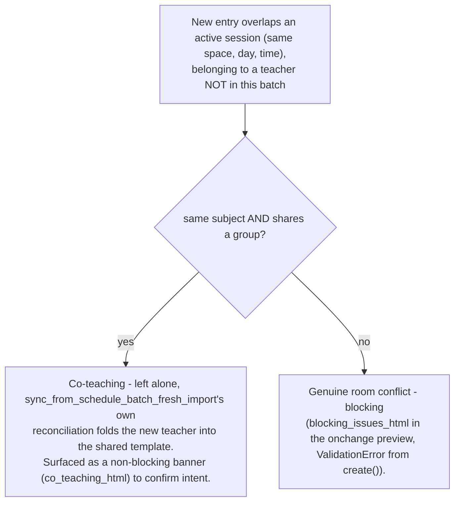
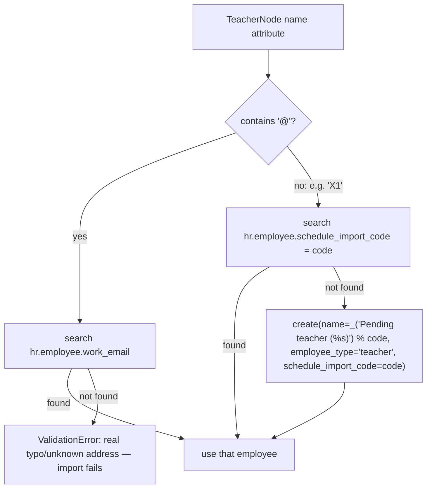
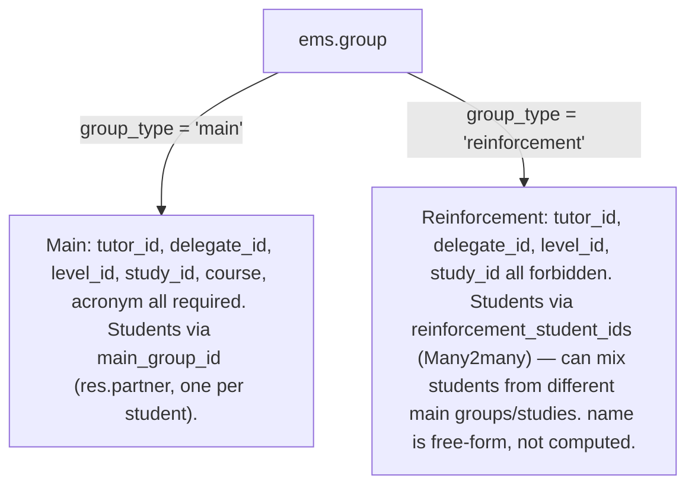

# Technical Reference: Teacher Working Schedules & Schedule Frameworks

## Overview

Every teacher's weekly timetable is their `hr.employee.resource_calendar_id` (a `resource.calendar`, extended by EMS), whose weekly slots live in `resource.calendar.attendance` rows (also extended). The whole system exists to let admins visually build/edit that timetable from the employee's own **Schedule** tab, instead of hand-editing raw attendance lines, while still supporting bulk XML import for centres that already export data from an external planner.



## Model extensions

**`resource.calendar`** (`models/employees/working_schedule.py`, class `ems_working_schedule`):
- `is_framework` (Boolean) — marks a calendar as a reusable **schedule framework** (a level's bell-schedule template) instead of a real teacher's personal calendar.
- `level_id` (Many2one `ems.level`) — which level a framework belongs to (ESO, BTX, CFGM...). Not required — one framework can also be the centre-wide default with no level.
- `source_framework_id` (Many2one `resource.calendar`, domain `is_framework=True`) — which framework a *personal* calendar was built from. This is the only thing that lets the "Schedule" tab keep showing a teacher's still-unassigned periods on every future edit (see "The empty-slot rule" below) — it is set by `seed_from_framework()` and by `apply_schedule_changes()`'s `source_framework_id` argument, never edited by hand.
- `employee_id` (Many2one `hr.employee`), `course_id` (Many2one `ems.course`) — added 2026-08-06 (see `plans/course_transition_teacher_schedule_archival.md`) so a personal calendar is a permanent, queryable historical record of "who taught, in which course" on its own terms, independent of `hr.employee.resource_calendar_id` (which only ever points at an employee's *current* calendar — see `get_employee()` below). Both are set once at creation (`ems_employee.create()`) and left alone afterwards; blank for a framework calendar, which has no employee/course of its own. Not yet backfilled on pre-existing rows — a calendar created before this phase has neither set, and its `get_employee()`/`_refresh_personal_name()` both fall back to the pre-existing reverse-search mechanism for that case (see below).
- `unique_name` SQL constraint (pre-existing).
- **`create()` override** — auto-derives `name` (`"<employee_id.name> (<course_id.name>)"`, or just `employee_id.name` if no `course_id`) from `employee_id`/`course_id` when the caller sets those but not an explicit `name`, so the naming convention has a single source of truth instead of every caller building the string by hand. An explicit `name` in `vals` always wins.
- **`get_employee()`** — prefers the stored `employee_id` (keeps working once this calendar is no longer any employee's *current* one, e.g. after a course transition supersedes it), falling back to the original reverse search (`hr.employee.search([('resource_calendar_id', '=', self.id)])`) for a calendar predating this field.
- **`_refresh_personal_name()`** — rebuilds `name` from the calendar's own `employee_id`/`course_id` (falling back to `get_employee()`'s reverse search for a legacy calendar); no-op for a framework calendar. Called by `ems_employee.write()` whenever the linked employee's own `name` changes.

**`resource.calendar.attendance`** (`ems_working_schedule_assignation`):
- `subject_id` (Many2one `ems.subject`), `group_ids` (Many2many `ems.group`) — what's being taught in that slot.
- `non_teaching` (Many2one `ems.non_teaching_type`) — a non-teaching commitment instead of a subject (guard duty, break, coordination meeting...). See "Non-teaching types" below.
- `space_id` (Many2one `ems.space`, plain stored field since 2026-08-05 — was a compute) — the classroom. Defaulted from `group_ids[:1].space_id` at creation (`create()`, same "first group wins when several share a slot" simplification as before), but a one-off divergence from the group's own room now survives instead of being silently re-derived on every load — see "Room granularity" below.
- `active` (Boolean, default `True`, added 2026-08-06) — core `resource.calendar.attendance` has no `active` field of its own; added here so a course transition can *archive* a teacher's migrating blocks instead of `unlink()`-ing them, which would destroy the exact per-block history (`subject_id`/`group_ids`) a later "who taught what, which course" query needs (see `plans/course_transition_teacher_schedule_archival.md`). Odoo's own generic `action_archive()`/`action_unarchive()` (`odoo/models.py`) already work for any model carrying this field — no override needed. As of this phase, nothing writes `active=False` here yet; `apply_schedule_changes()` still `unlink()`s the Mon–Fri rows on every Schedule-tab save, unaffected until a later phase of that same plan changes the transition wizard's own call sites.

**`ems.non_teaching_type`** (`models/employees/non_teaching_type.py`) — a configurable vocabulary of non-teaching activities, replacing what used to be a hardcoded `Selection` so an admin can add a new code from **Configuration → Teachers → Non-teaching types** without a developer deploying code (the planner app that feeds the XML importer is outside our control and can introduce new codes at any time):
- `code` (Char, required, unique) — the stable, external-planner-facing identifier (e.g. `G`, `BR`, `CM`); what the XML import and the CM+Wednesday special case key off.
- `name` (Char, required, translatable) — the display label.
- `is_break` (Boolean) — dropped entirely from both `get_schedule_hours_summary()` columns (e.g. a lunch/patio break).
- `is_fixed` (Boolean) — always routed to the "fixed" hours-summary column (e.g. guard duties). The Wednesday-only "coordination meeting is fixed" rule doesn't reduce to a plain boolean, so it stays as an explicit `code == 'CM'` check in Python (see `get_schedule_hours_summary()` below) — this is why `code` is kept even though `name` alone would cover display.
- `sequence` (Integer), `active` (Boolean).

Seeded by `data/main/ems.non_teaching_type.csv` with the original 12 codes (`AC`, `BR`, `CM`, `CT`, `G`, `MM`, `MT`, `R`, `S`, `SC`, `TT`, `WIC`), `ems.non_teaching_<lowercase code>`-prefixed xmlids.

**`hr.employee`** (`models/employees/employee.py`, `ems_employee_base`): `schedule_attendance_ids` — a **related** One2many to `resource_calendar_id.attendance_ids`, used purely so the "Schedule" tab's widget field can be declared on the employee form (Odoo view archs can't reference a dotted `many2one.one2many` path directly).

## The empty-slot rule: nothing unassigned is ever stored

**A `resource.calendar.attendance` row only exists if it is real** — a subject assignment, or a non-teaching commitment (patio, a meeting...). An empty/unassigned period is *never* written to the database, even though the "Schedule" tab visually shows it as an editable gap. This was a deliberate correction after an earlier version *did* persist blank "Free" placeholder rows: they collided (Odoo's own `resource.calendar._check_overlap` constraint) with genuinely different times added by hand for the same teacher on the same day, and there was no clean way to tell "a real but still-unassigned slot" apart from "nothing is supposed to happen here".

Since unassigned slots aren't stored, the "Schedule" tab's grid widget re-derives them on every `Edit`/`New` by **merging two sources**:



- The **baseline** comes from the calendar's `source_framework_id` (fetched live, never stored on the teacher's own calendar) — including the framework's *own* non-teaching rows (patio, coordination meeting), which are real commitments every teacher following that framework inherits.
- The **real overlay** is the teacher's actually-saved rows, which always win for a given (weekday, exact hour_from/hour_to) pair, and can introduce periods the framework never had (a manually added "Add period" block, or a period copied from a colleague — see below).
- On **Save**, only cells that ended up with a real subject or a real `non_teaching` value are sent to `apply_schedule_changes` — genuinely-empty and still-unassigned ("blank") cells are both skipped.
- A manually added period ("Add period" in the widget) that's left unassigned in a given edit session simply **disappears** the next time you edit — it was never saved, so there's nothing to remember. This is intentional: only the framework's own structure is guaranteed to reappear.

## Room granularity (2026-08-05)

The room a class meets in no longer has to be a single value derived purely from its group.
Three fields, three different roles:

```mermaid
flowchart LR
    G["ems.group.space_id\n(the group's own 'home' room)"] -->|default at creation only| RC["resource.calendar.attendance.space_id\n(the weekly block - plain stored field)"]
    RC -->|entry['space_id'], via sync_from_schedule*| AS["ems.attendance_schedule.space_id\n(the recurring line - AUTHORITATIVE)"]
    AT["ems.attendance_template.space_id\n('Session's default space' - seed only)"] -.->|default for a manually-created line| AS
    AS -->|_compute_space_id| ASH["ems.attendance_session_header.space_id\n(read here for attendance-taking/reporting)"]
```

- **`ems.attendance_schedule.space_id`** (the recurring weekly line) is the one field everything
  else ultimately defers to — `check_overlap`/`classify_external_conflicts` already read from it,
  not from the template. `_schedule_lines` (`ems.attendance_template.py`) writes each line's room
  from that line's own resolved entry (`entry.get("space_id", space_id)`), preferring an explicit
  per-entry override over the group-derived fallback — so a one-off reassignment for a single
  weekly slot survives a future resync instead of being silently overwritten.
- **`resource.calendar.attendance.space_id`** (the Schedule tab/importer's own weekly block, one
  level upstream of `ems.attendance_schedule`) stopped being a compute — `ems_working_schedule_
  assignation.create()` defaults it from `group_ids[:1].space_id` only when the incoming vals
  don't already specify one, so it can independently diverge afterwards too.
- **`ems.attendance_template.space_id`** ("Session's default space", not the plain "Space" label
  it used to have) is no longer authoritative for anything — conflict detection and
  attendance-taking both read the *line's* room. It only serves as the seed value Odoo's own
  `default_<field>` context convention pre-fills for a schedule line created **by hand** through
  the template's own form (`context="{'default_space_id': space_id, ...}"` on
  `attendance_schedule_ids` in `views/attendance/attendance_template/form.xml`) - confirmed this
  existing context mechanism already covers that case on its own, no dedicated onchange needed.
- **`ems.attendance_session_header.space_id`** (`_compute_space_id`, `attendance_session.py`)
  reads `attendance_schedule_id.space_id` directly (the line) — it used to skip straight past the
  line to the template's own `space_id`, harmless only because both were always forced identical
  under the old design; once a line's room can genuinely diverge, that stale read would have shown
  the wrong room to a teacher taking attendance.

**Not yet built:** an actual UI path for setting a per-line room override (the wizard's planned
"reasignar aulas" resolution, `plans/working_schedule_import_redesign.md`) and the "Nueva versión"
lock/clone-archive mechanism (`plans/attendance_template_multi_study.md`) that will let an admin
safely correct an already-used template/line's fields without disturbing historical attendance.
This section only covers the model-level foundation those two features will build on.

## Server methods (`models/employees/working_schedule.py`)

- **`seed_from_framework(self, framework)`** — points a calendar's `source_framework_id` at `framework` and clears its own Mon–Fri attendance rows. Writes *nothing* else (per the empty-slot rule) — the framework's periods only become real rows the first time the Schedule tab actually saves something.
- **`apply_schedule_changes(self, cells, source_framework_id=None)`** — the single write path used by the Schedule tab's "Save": unlinks all Mon–Fri rows and recreates them from `cells` (a list of dicts shaped like `resource.calendar.attendance` create-vals), then re-derives `ems.teaching` and `ems.attendance_template` from the same `cells` (see below) and, if `source_framework_id` was passed (only when `New` picked/inherited a different framework), updates the calendar's own reference.
- **`ems.teaching.sync_from_schedule(self, teacher, entries)`** (`models/employees/teaching.py`) — diffs `teacher.teaching_ids` against `entries` (subject_id + group_ids pairs) by a `"subject.group"` key: creates what's missing, unlinks what's no longer there, leaves the rest untouched. Shared by both the XML importer and `apply_schedule_changes`.
- **`ems.attendance_template.sync_from_schedule(self, teacher, entries, start_date=None)`** (`models/attendance/attendance_template.py`) — a single-teacher sync, keyed by `"subject.sorted(group_ids).sorted(teacher_ids)"`, creating/archiving `ems.attendance_template` + their `attendance_schedule_ids`, and calling `fill_students()` on new ones. `start_date` defaults to September 1st (a fresh XML import assumes a brand-new course) but the Schedule tab's grid always passes *today* (a live mid-course edit shouldn't imply retroactive attendance). Internally delegates to `sync_from_schedule_batch()` wrapping its single `(teacher, entries)` pair, so a solo live edit is reconciled for co-teaching exactly like the XML importer's own multi-teacher batch — see "Co-teaching" below.
- **`get_schedule_hours_summary(self)`** — not stored, computed on demand (see "The 'Schedule' tab widget" below for why). Sums each Mon–Fri attendance row's duration (`hour_to - hour_from`, rounded UP with `math.ceil` — a period that only partially overlaps an hour still counts as a full hour), split into `{'teaching': {'rows': [...], 'total': int}, 'fixed': {'rows': [...], 'total': int}, 'total': int}`. `teaching` rows are keyed by `attendance.group_ids[:1].level_id` for subject periods taught to a `'main'` `ems.group` — or, for a `'reinforcement'` group (no single `level_id` of its own, see "Reinforcement groups" below), keyed and labelled by the group itself instead — plus any non-teaching activity not routed to `fixed`; `fixed` rows are activities with `non_teaching.is_fixed` (any day, e.g. guard duties) plus coordination meetings (`non_teaching.code == 'CM'`) specifically on Wednesday (`dayofweek == '2'`) — the centre's fixed non-teaching commitments. Activities with `non_teaching.is_break` are dropped from both. Reuses `get_report_label()` for translated activity names, same as the PDF report.



## Employee lifecycle hooks (`models/employees/employee.py`, `ems_employee`)

- **`create()`** — every new `employee_type='teacher'` gets their **own** `resource.calendar` (never shared, never the company's own calendar — `resource.mixin`'s client-side default pre-fills `resource_calendar_id` with the company's calendar before `create()` even runs server-side, so that value can't be used to detect "nothing was chosen"; it's unconditionally overridden), seeded from `company.default_schedule_framework_id` (required field, see Settings below). Passes `employee_id`/`course_id` (the new employee, `company.current_course_id`) to the calendar's own `create()`, which derives `name` from them (see above) — no name string built here by hand.
- **`write()`** — renaming an employee calls the calendar's own `_refresh_personal_name()`, which rebuilds `name` from its `employee_id`/`course_id` (or the reverse-search fallback for a legacy calendar) and no-ops for a framework calendar.
- **`unlink()`** — deletes the employee's personal calendar (cascading its attendance rows), unless it's a framework, still referenced by another employee, or is the company's own base calendar.

## Schedule frameworks & the default-framework setting

A **framework** is just a `resource.calendar` with `is_framework=True` and an optional `level_id` — reusing the model rather than inventing a parallel one. Frameworks are managed like any other working schedule (**Configuration → Teachers → Schedule frameworks**, `views/community/working_schedules/menu.xml`), editing their `attendance_ids` with the same base Odoo list Odoo already ships for `resource.calendar`.

`res.company.default_schedule_framework_id` (`models/settings/company.py`, required, domain `is_framework=True`) is the framework every new teacher is seeded from. Exposed in **Settings → Employees** as `res.config.settings.schedule_framework_id` — note the settings-side field can't be named `default_*`, since `res.config.settings` treats that prefix as a special "set an `ir.default` value" field (requiring a `default_model` attribute), not a plain related field.

`data/main/ems.schedule_framework_default.xml` ships a generic default framework (hourly 8–14h/15–21h blocks, `noupdate="1"` since its child `resource.calendar.attendance` rows are `(0,0,...)` create commands — reloading them on every upgrade would duplicate/overlap). `data/custom/resource.calendar[.attendance].csv` ships the centre's real per-level frameworks (ESO, BTX, CFGM/CFGS/CFGB/EFPS/PFI), `__import__`-prefixed per the data-folder convention.

**Auto-fill pitfall:** `resource.calendar._compute_attendance_ids` (base Odoo, `resource_calendar.py`) auto-fills a brand-new calendar's `attendance_ids` from `company.resource_calendar_id` whenever `create()` doesn't include `attendance_ids` in the same call. Since our frameworks are seeded via two separate CSV files (parent record, then child attendance rows), the parent's own `create()` call has no inline `attendance_ids` and gets contaminated. Every legitimate row we create carries a real xmlid (CSV `id` or, for the default framework's XML, individually-`id`'d `<record>` elements — never inline `eval` tuples, which are anonymous and indistinguishable from the auto-fill); the module's `post_init_hook` (fresh installs) and `migrations/18.0.0.20.0/post-migrate.py` (upgrades) both purge any framework attendance row that has no matching `ir_model_data` entry.

## The "Schedule" tab widget

`static/src/js/backend/schedule_grid_field.js` (OWL field widget, `widget="schedule_grid"`, registered on `schedule_attendance_ids`) + `static/src/xml/backend/schedule_grid_field.xml` + `static/src/css/backend/schedule_grid.css`.

- **Read-only view**: entries positioned absolutely by exact `hour_from`/`hour_to` (not hour-rounded) inside an hourly-tick background grid. Blank/unassigned rows are filtered out of the read view entirely (nothing to show). The grid's own vertical axis (`computeBounds()` in `schedule_grid_geometry.js`, shared with the group widget) fits tightly to the teacher's actual entries — an afternoon-only teacher (e.g. 14h–22h) sees exactly that window, not a wider one padded out to a generic default; `DEFAULT_START`/`DEFAULT_END` (8h–20h) only apply as a fallback canvas when the calendar has no entries yet.
- **Derived break** (view mode only): a break the teacher's own calendar has no real saved row for yet is filled in from `hr.employee._get_derived_break_entries()`. The algorithm is deliberately **gap-based, not level-based**: for each weekday the teacher has at least one real entry (of any kind), it takes that day's own known span (earliest `hour_from` to latest `hour_to` among the teacher's real entries that day) and checks *every* break defined on *any* level's framework — a candidate is included only if it falls fully inside that span and doesn't overlap any real entry; two frameworks defining the exact same break collapse into one result. This deliberately never tries to guess "the" level a teacher belongs to — a teacher can plausibly teach several levels, even within the same day (e.g. an English teacher covering ESO, Batxillerat and cicles), each with its own break time, and each is evaluated independently against that day's actual gaps. A gap that doesn't line up with any known break simply stays empty.

  **Fetched via RPC, not exposed as a form field.** An earlier version returned this from a computed Many2many field (`derived_break_attendance_ids`, hidden with its own embedded `<list>` sub-view) — it computed correctly server-side (proven by the PDF report, which calls the same method directly in Python) but never actually rendered in the widget. The most plausible explanation, after ruling out the data itself (a `web_read`-shaped RPC simulated against real teacher data showed nothing wrong), is that an *invisible* x2many field with its own embedded list doesn't reliably load its sub-fields client-side, unlike a plain `Many2one`/`Boolean` field (`resource_calendar_id`/`can_edit_schedule` are hidden the same way and work fine). The fix: `hr.employee.get_derived_break_attendance_data()` is a plain public method (RPC-callable, no leading underscore) returning `.read()` dicts (Many2one as a `(id, name)` tuple — matches the array shape `entry.data.non_teaching[1]` already expects), fetched explicitly by the widget's `_loadDerivedBreaks()` in `onWillStart` and again after `save()` — the exact same `orm.call`/`useState` pattern this component already uses for `catalog.subjects`/`get_schedule_hours_summary`. `entriesForDay()` merges the fetched list with the real entries client-side, view-mode only, skipping any derived slot a real entry already occupies. Server-side, `get_schedule_report_lines()` does the equivalent merge for the PDF, calling `_get_derived_break_entries()` directly.

  **Float-rounding tolerance.** A framework break's own `hour_to` and the real period that immediately follows it can represent the exact same clock time (e.g. 11:25) as two slightly different floats — `11.416667` (a literal, as typically entered/imported) versus `11 + 25/60 == 11.416666666666666` (computed) — a difference far too small to matter but enough to make a strict `<` overlap check misfire and silently drop a break that should have shown up. `_get_derived_break_entries()`'s day-span and overlap checks both use `HOUR_EPSILON` (1/120 hour, 30 seconds — comfortably bigger than any float noise, comfortably smaller than any real, meaningful gap) instead of an exact comparison.

  **Visually distinct from every other non-teaching activity.** A break renders with its own CSS class, `o_schedule_grid_entry_break` (a diagonal brown stripe pattern, `schedule_grid.css`) — gated on `non_teaching_is_break` specifically, not on `non_teaching` in general, so a guard duty or coordination meeting keeps getting its own colour instead (see below). Without that distinction a break in the teacher's own grid was visually indistinguishable from a meeting, which read as "wrong" once breaks started reliably appearing. Same compact single-line block either way (time + label together, see above) — there is no other visual difference between an explicitly-saved break and a derived one. The group PDF's own break cell (`reports/contacts/report_group_schedule.xml`, `.gs-break`) uses the same brown/stripe treatment for consistency; the teacher's own PDF (`report_working_schedule.xml`) still colours every cell — including a break — from the same rotating palette as subjects, unchanged for now.

- **Per-subject/activity colour, not one flat colour for everything.** `schedule_grid_geometry.js` exports `REPORT_COLOR_PALETTE` (mirrors the identically-named Python constant in `ems.schedule_report_mixin` — kept in sync by hand, cross-language) and `buildColorMap(items)`, which assigns each distinct `items[].key` its own colour from that palette, reused every time the same key reappears, in first-seen `(dayofweek, hour_from)` order — the exact same "same subject always gets the same colour" rule `resource.calendar.get_schedule_report_lines()`/`ems.group.get_schedule_report_lines()` already use for the PDF. Both widgets build a `colorByKey` getter from their own currently-displayed entries only (a schedule with 3 subjects gets (at most) 3 colours, not one slot per subject that exists in the whole catalogue) and read it back per entry/block (`entryColor()`/`blockColor()`), appending `background-color` to the block's own inline `style` — the CSS classes (`.o_schedule_grid_entry`'s flat blue, the old flat grey on `.o_schedule_grid_entry_nonteaching`) now only serve as a fallback for the rare case nothing computed a colour. A break opts out of this (its `_colorKey`/`blockColor` equivalent returns `null`) since it already has its own fixed, deliberately-different brown/stripe look.
- **Edit mode** (`Edit`, or after `New`): rows are the **distinct real periods** found in the merged baseline+real buffer (see "The empty-slot rule"), not a fixed hourly grid — each row shows its own exact `HH:MM–HH:MM`, editable via two `<input type="time">` (moving the start shifts the end too, preserving duration, so a block can't accidentally balloon across the day), plus a subject+group dropdown pair (or a non-teaching reason) per (day, period) cell. `Add period`/the trash icon let an admin introduce or remove a period the loaded source didn't have — this is how a teacher who genuinely mixes two levels' bell schedules (e.g. an English teacher covering both ESO and CFGS classes) gets a slot at a time neither framework defines.
- **New**: choose a schedule framework (blank baseline) or another teacher (their real schedule as the overlay, plus *their* reference framework as the baseline too — a substitute inherits the same future gaps) — entirely replaces the buffer, but nothing is written until `Save`. This is also how a teacher joining mid-year gets their schedule (see "Import wizard" below — there is no per-employee file upload any more, deliberately).
- **PDF**: calls `this.actionService.doAction("ems.action_report_working_schedule", { additionalContext: { active_ids: [this.props.record.resId] } })` — downloads the printable weekly schedule for the currently open employee (see "PDF report" below). No buffer/dirty-state interaction; available in both view and edit mode.
- **Hours summary** (below the grid, view mode only, hidden while editing): `resource.calendar.get_schedule_hours_summary()` returns two columns — mirrors the real external schedules this data is modelled on:
  - **"Weekly teaching hours"**: rows grouped by `ems.group.level_id` (teaching periods) — or, for a reinforcement group, one row per group (see "Reinforcement groups" below) — plus any non-teaching activity that isn't fixed or a Wednesday coordination meeting.
  - **"Other fixed-schedule hours"**: activities with `non_teaching.is_fixed` (e.g. guard duties, any day) and coordination meetings (`non_teaching.code == 'CM'`) specifically on Wednesday (`dayofweek == '2'`) — the centre's fixed non-teaching commitments. Activities with `non_teaching.is_break` (e.g. the lunch/patio break) are dropped from both columns entirely.
  Each column ends with its own `Total` row; the block below both shows the combined `Overall total` (should read 24 — `full_time_required_hours` — for a full-time teacher). The widget's `_loadSummary()` calls the method via RPC on initial mount (`onWillStart`) and again after `save()` — it deliberately does **not** recompute from the in-progress edit buffer, so it always reflects the last-saved schedule, not unsaved changes. See "Server methods" below for the aggregation itself.

## PDF report (`ems.report_working_schedule`)

`reports/employees/report_working_schedule.xml` — a `qweb-pdf` `ir.actions.report` on `hr.employee`, bound (`binding_type="report"`) so it also appears in the employee form's native Print menu, not just the Schedule tab's own `PDF` button.

- `resource.calendar.get_schedule_report_lines()` (`models/employees/working_schedule.py`) builds the printable rows server-side: one row per **distinct** `(hour_from, hour_to)` pair found across the calendar's Mon–Fri `attendance_ids`, each with a 5-slot `cells` list (Monday→Friday) holding either the matching `resource.calendar.attendance` record or an empty recordset. Since unassigned slots are never stored (see "The empty-slot rule"), every non-empty cell is already a real subject or non-teaching entry — the template does no filtering of its own.
- The template just iterates `employee.resource_calendar_id.get_schedule_report_lines()`, keeping all business logic in Python per the project's coding standards.
- **Header** (`hr.employee.get_report_role_lines()`): H1 is the employee's name + current course; H2 (only if set) is `department_id.name`; H3 (only if the employee has any `role_ids`) lists one line per role, in `role.name` order as returned by `get_report_role_lines()`. Two roles get extra context appended, resolved by fixed xmlid (same pattern as `role_tutor` used elsewhere in `employee.py`): `ems.role_tutor` → the tutored group(s)' `name` (from `tutorship_ids`); `ems.role_dchieff` → the employee's own `department_id.name` — **there is no per-department link for the "department chief" role** in the data model (it only implies the `ems.group_department_chief` security group, with no scoping to a specific `hr.department`), so the employee's own department is reused for this line rather than introducing a new field.

## Co-teaching (`ems.attendance_template.teacher_ids`)

`ems.attendance_template.teacher_ids` is a **Many2many** to `hr.employee` (relation table `ems_attendance_template_teacher_rel`), not a Many2one — two teachers can genuinely co-teach the same class (same subject, same group(s), same room, same time) and share **one** template, one set of `attendance_schedule_ids`, and therefore the same jointly-visible, jointly-editable `ems.attendance_session_header` records (any co-teacher can mark attendance; see "Access control" below). `hr.employee.attendance_template_ids` is the matching Many2many on the other side, pointing at the same relation table.

A template's identity is therefore `(subject_id, group_ids, teacher_ids)` — the **same** `(subject, group)` combination can have several active templates simultaneously, one per distinct exact set of co-teachers, split at the exact `(weekday, hour_from, hour_to)` slot level. Example: teacher A teaches "Programació"/DAW1A on Monday and Wednesday; teacher B joins only for the exact same Wednesday slot. The result is **two** templates: a shared A+B template for Wednesday, and A's own solo template for Monday — not one shared template covering both days.

`ems.attendance_template._reconcile_teacher_groups(self, teacher_entries)` is the single algorithm behind this, used by **both** `sync_from_schedule` (one teacher, the Schedule tab's live editor) and `sync_from_schedule_batch` (several teachers, the XML importer's normal case — `sync_from_schedule` just wraps its one pair and delegates to the batch version):



For every `(subject_id, group_ids)` combination touched by the submitting teacher(s) — including combos they used to teach but dropped entirely this call — it merges each **exact time slot** across:
- the newly submitted entries, and
- the still-existing slots of any OTHER teacher on the same template who is **not** submitting data in this call (an "untouched" co-teacher).

Slots are then grouped by their final teacher set. A template whose **current** exact teacher-set matches one of these groups survives (its schedule lines get refreshed in place, same archive-then-recreate pattern as the rest of the sync). A template whose teacher-set does **not** match any resulting group — because it shrank (a co-teacher dropped out), grew, split, or vanished entirely — is archived outright (`vacated`) and superseded by whichever new/updated template(s) now cover its slots.

This is what lets a **solo** live edit correctly reclassify another teacher's data: if A already has a Monday+Wednesday template and B (submitting alone) starts teaching that exact Wednesday slot, Wednesday splits out of A's template into a new shared A+B template, while Monday stays solo-A, untouched — without any special-casing between the live editor and the batch importer.

`ems.attendance_template.classify_external_conflicts` (room-collision detection against teachers **outside** the current batch) and `check_overlap`'s `same_teacher` check (`ems.attendance_schedule.py`) both moved from equality to **set intersection** on `teacher_ids` for the same reason.

**`_reconcile_teacher_groups` is only correct when `entries` is the teacher's ENTIRE current
schedule** (the live editor's own assumption, baked into its `touched_templates` step: any of a
submitting teacher's existing active templates *not* re-submitted this call is treated as
deliberately dropped and folded/archived accordingly). The XML importer's `entries` is never
that — a file only ever describes **one slice** of the centre's schedule (e.g. one department),
imported incrementally alongside other files over time. Reusing `_reconcile_teacher_groups` (via
`sync_from_schedule_batch`) for the importer was tried and found (2026-08-01) to silently archive
a shared teacher's already-imported *other* department the moment a second department's file
mentioning that same teacher was imported — zero error raised, pure data loss, since from
`touched_templates`' point of view the first department's combo simply "wasn't resubmitted this
call" and was there for the taking.

**Fix: `_reconcile_fresh_import` + `sync_from_schedule_batch_fresh_import`** — the importer's own
entry point, structurally identical to `_reconcile_teacher_groups`/`sync_from_schedule_batch` but
**without** the `touched_templates` pre-scan: it only ever reconciles a `(subject, group-set)` key
that is actually present in the batch's own submitted entries, never a submitting teacher's
untouched other combos. `vacated` is still computed (needed for a co-teaching merge to correctly
archive an external teacher's now-superseded solo template), but scoped to those same keys only.
The identical "full replace" assumption was independently found in `ems.teaching.sync_from_
schedule` too (it unconditionally unlinked any teaching pair not in `entries`) — fixed by adding a
`replace` parameter: `True` (default) for the live editor, `False` for the importer's `create()`.
`sync_from_schedule_batch`/`_reconcile_teacher_groups` themselves are untouched — the live editor
keeps relying on their "this call = the whole schedule" semantics, which is correct there.

## Import wizard (`ems.working_schedules_import_wizard`)

**Redesigned 2026-08-01** to remove complexity that only existed to reconcile against an
already-populated, still-current schedule. The key fact that makes this possible: `ems.group`
records are **permanent and reused across academic years** — a course transition (see
`models/settings/course_transition_wizard.py`) never recreates them, it only archives the
*outgoing* `ems.attendance_template`s for the studies it transitions (per-study/department, not
all at once). So by the time a study's groups are due for a fresh import, there is genuinely
nothing active left to reconcile against for that scope — an active overlap found during import
is always either legitimate co-teaching or a real problem, never something to silently resolve.

Parses a planner XML export (`<TeacherNode name="email ...">` → `<DayNode name="N ...">` → `<HourNode name="N HH:MM">` → `<Subject>`/`<NonTeaching>`/`<Students>` children) via `_parse_schedule_entries()`, then calls `ems.teaching.sync_from_schedule(..., replace=False)`/`ems.attendance_template.sync_from_schedule_batch_fresh_import` — the importer's own entry points, **not** the ones the Schedule tab's grid widget uses to save a live edit (see "Reconciliation" above for why the importer needs its own).

### Screen 2 — "Resolve groups" (2026-08-05) — deferred group-name resolution

**Decision confirmed with the developer 2026-08-05, resolving a real conflict found before
implementing:** the intro-screen redesign above says an unresolvable group/subject *code* "still
blocks leaving the welcome screen, since there is no later step (yet) that could resolve it" —
phrasing that could mean either "permanently, by design" or "only until step 2 exists". Several
already-passing tests (`test_import_group_still_not_found_after_fallback_raises`,
`test_continue_from_intro_placeholder_code_unresolved_group_raises`) asserted the permanent
reading. Asked explicitly rather than guessing which reading was intended (per this repo's
"full-scenario exploration before implementing" rule) — confirmed: build screen 2 as originally
designed in `plans/working_schedule_import_redesign.md`, an unresolved **group** name (not
subject code — there is still no resolution screen for that) is deferred instead of blocking, and
the tests above are adapted to the new behavior rather than treated as authoritative.

**Mechanism:** `_parse_schedule_entries()`'s group-name lookup is unchanged (same three-heuristic
match: exact full name, acronym + trailing letter, unique acronym-prefix match — extracted into
its own `_resolve_group_name()` for reuse), but a name that still doesn't resolve no longer raises.
Instead the entry is tagged with `pending_group_names` (the raw, unresolved `<Students>` text) and
carries whatever groups it) did resolve in `group_ids`, deferring the rest. This tag is a
**transient, JSON-cache-only marker** — it must never survive into the `(0, 0, {...})` command
dicts actually passed to `resource.calendar.attendance.create()` (those dict keys must all be real
model fields), so `_continue_from_groups()` strips it from every entry before advancing past the
`groups` state; nothing reaches `_apply_import()` with the marker still attached.

- **`_classify_attachments()`** additionally collects the distinct set of unresolved raw names
  across the whole batch (dedup by raw text — the same typo appearing in 20 hour-nodes is one
  correction, not 20) and `_continue_from_intro()` materializes one
  `ems.working_schedules_import_wizard.group_line` per name (`raw_name` readonly, `group_id`
  Many2one to `ems.group` with native create-on-the-fly allowed) before advancing to `groups` —
  every batch visits this state, whether or not it has anything to show.
- **`_continue_from_groups()`** (state `groups`'s `action_continue()` handler): raises if any line
  still has no `group_id` picked (inline "must pick one" validation, same raised-`ValidationError`
  convention as the rest of this wizard); otherwise builds a `raw_name → group` map from the
  lines, walks the cached `node_cache` substituting every `pending_group_names` reference (via the
  shared `_finalize_pending_groups()` helper, which normalizes the two different `group_ids` shapes
  — a plain int list on `entries` items vs. a `[(6, 0, ids)]` command on `attendance_ids`' inner
  dicts — into the same resolved id set, and rebuilds the "(group names)" display suffix on `name`
  that intro deliberately skipped while resolution was still pending), re-serializes the cache, and
  advances to `teachers`.
- View: a new `state == 'groups'` screen shows `group_line_ids` as an editable list when non-empty,
  or a plain success alert when empty (no unresolved names in this batch) — same "list, or a
  success message" shape the plan describes for every resolution screen.

**"Continue" renders enabled/disabled instead of appearing/disappearing (2026-08-05, developer
feedback):** *"¿Se puede hacer que no te deje continuar hasta que no se hayan seleccionado
grupos?... Creo que quedará más claro si los botones de continuar, en lugar de aparecer u
ocultarse, aparecen como 'enabled' o 'disabled'."* Odoo's form-view buttons have no native,
domain-bindable "disabled" attribute the way fields have `readonly`/`required` (confirmed by
reading `view_button.js`'s own `disabled` getter — it only ever reads a static `props.disabled`
boolean prop, never a per-record expression; a literal `disabled="..."` in the arch is compiled as
a static STRING prop via `BUTTON_STRING_PROPS`, not evaluated per-record). Rather than risk an
unproven `t-att-disabled="..."` passthrough, this reuses the exact `invisible=` mechanism already
proven everywhere else in this wizard, applied to **two** buttons occupying the same spot:
- `action_continue` (the real, actionable button): `invisible="state == 'override_info' or
  continue_disabled"`.
- A second, purely cosmetic button, same label, `type="button"` (no server call), static
  `disabled="disabled"`, and its own distinct `name="action_continue_disabled"` (Odoo's view
  validator requires every button to have *a* `name`, even a dead one - deliberately different
  from `action_continue`'s so existing tour selectors matching `button[name='action_continue']`
  keep working unambiguously): `invisible="state == 'override_info' or not continue_disabled"`.

Since `invisible` fully removes a node from the DOM (not just CSS-hides it), only one of the two
is ever actually present — from the user's point of view "Continue" never disappears from that
spot while `state != 'override_info'`, it just visually toggles enabled/disabled (Bootstrap's own
`.btn:disabled` styling, no extra CSS needed). New computed `continue_disabled` (`@api.depends
("state", "ready_to_import", "group_line_ids.group_id")`): `not ready_to_import` at `intro`, "any
`group_line_ids` row still missing a `group_id`" at `groups`, `False` for every other (placeholder)
step. Verified in a real browser, not just by reasoning about the source: the resolve-group tour
asserts `button[name='action_continue_disabled'][disabled]` is actually present before a group is
picked, and `button[name='action_continue']:not([disabled])` right after.

### Screen 3 — "Resolve teachers" (2026-08-05) — deferred e-mail resolution

Unlike screen 2, this one needed no developer check-in first: the plan already fully specified an
unresolved e-mail as this screen's job, distinct from a pending-identification *code* (no `@`,
still handled automatically at Import, per screen 6 - see `_is_email_like`). Building it does
change what "an unknown e-mail" means for tests/tours written before this screen existed - it now
surfaces as a resolvable line here instead of always reaching an error dialog at the final Import
- adapted the same way screen 2's pre-existing tests were, since this is an unambiguous, intended
consequence of the screen actually existing now, not a design question to re-litigate.

**Mechanism**, deliberately mirroring screen 2's shape:

- **`_pending_teacher_identifiers(node_cache)`**: every distinct e-mail-shaped identifier
  (`_is_email_like`) with no matching `hr.employee.work_email` - a pending-identification *code*
  is never included, it isn't a problem for this screen to resolve. Computed **after** group picks
  are applied, inside `_continue_from_groups()` (not `_continue_from_intro()` - unlike screen 2's
  own lines, which are built leaving `intro`), materializing one `ems.working_schedules_import_
  wizard.teacher_line` (`raw_identifier` readonly, `employee_id` Many2one to `hr.employee` domain
  `employee_type = 'teacher'`) per name, before advancing to `teachers` - matches the flow diagram's
  own `groups --> teachers: Continue (apply group picks, reclassify)` transition.
- **`_continue_from_teachers()`**: raises if any line still has no `employee_id` picked (same
  convention as screen 2); otherwise builds an `identifier → employee` map and writes an
  `employee_id` key straight onto every matching `node_cache` item (not into `entries`/
  `attendance_ids` like screen 2's group substitution - a *teacher* isn't part of those dicts at
  all, it's the item's own top-level `identifier`), re-serializes the cache, advances to
  `internal_conflicts`.
- **`_apply_import()`** now checks `item.get('employee_id')` **first**, before falling back to the
  original `work_email` lookup (still the correct path for an identifier that resolved on its own,
  with no line ever created) or the placeholder-code branch (fully unaffected). The original
  `raise ValidationError(_("Teacher with email '%s' not found."))` stays as a safety net for a
  direct ORM/API caller bypassing the wizard's own step-by-step UI - by the time a real user
  reaches Import through the wizard, every e-mail that could need this line already got one.
- **Many2one create explicitly disabled** (`context="{'no_create': True, 'no_create_edit': True}"`,
  the developer's own call from the plan): a brand-new teacher record is screen 6's job
  (pending-identification, automatic at Import) - this screen only ever *attaches* the schedule to
  an already-existing employee, never creates one.
- View: a new `state == 'teachers'` screen, same "editable list, or a success alert" shape as
  `groups`; the placeholder "not implemented yet" alert's `invisible` grew a third excluded state
  (`'teachers'`) to match. `continue_disabled` grew its own `teachers` branch (any `teacher_line_ids`
  row still missing an `employee_id`) - same enabled/disabled "Continue" mechanism as screen 2, no
  new UI concept needed.

**"Create new" checkbox for a genuinely never-hired teacher (2026-08-05, developer feedback after
using it for real):** the original design above assumed every unresolved e-mail was a typo/mismatch
of an *already-existing* teacher. In practice, some rows are a genuinely new hire whose e-mail
simply doesn't exist in EMS yet - forcing a pick from the (create-disabled) Many2one made no sense
for those. `teacher_line` gains `create_new` (Boolean) - a checkbox shown *before* `employee_id` in
the list, which the field's own `readonly="create_new"` then locks once ticked (an `@api.onchange`
also clears any already-picked `employee_id`, so the two can never disagree). A row is valid if
*either* `employee_id` is set *or* `create_new` is ticked - never neither.

The resulting employee is created exactly like a placeholder-code teacher (same "Pending teacher
(...)" naming, same `schedule_import_code` re-import-dedup guarantee - reusing the raw e-mail
string as the code, so re-importing the same file before this teacher's real identity is resolved
finds and reuses the same record instead of creating a duplicate), plus one difference: the
developer's own framing - *"esa dirección de correo no se puede dar por buena, porque quizás está
ocupada, pero me gustaría intentarlo"* - means the file's e-mail IS worth trying, just not as an
immutable, auto-generated value. `google_ws_manual_email` (the existing Google Workspace
integration field, `models/employees/google_workspace_integration.py` - already means "edit Work
Email by hand instead of letting EMS generate it") is set `True` on creation, with `work_email`
pre-filled to the attempted address - editable from the start, never silently overwritten by the
normal auto-generation flow, exactly matching "intentarlo" (try it) without pretending it's been
confirmed.

Extracted `_get_or_create_pending_teacher(identifier, manual_email=False)` out of `_apply_import`'s
previously-inline placeholder-code branch, so both paths (a placeholder code, and now a
create-new-ticked e-mail) share the exact same get-or-create-by-`schedule_import_code` mechanism -
`manual_email` is the only behavioral difference between the two callers.

**Label shortened to "New" (2026-08-06, developer feedback):** the field's own `string` was
originally "Create new teacher" - too wide for a narrow checkbox column, crowding the row. Odoo's
list renderer has no arch-level hook to center a column *header*'s text - `getColumnClass`
(`list_renderer.js`) never consults the field's own `class` attribute the way `getCellClass` does
for data cells, only the cell content can be aligned that way - so centering just the checkbox
while leaving "New" left-aligned above it would look mismatched, and centering the header instead
would need bespoke CSS targeting this specific column by name (not the "Odoo way": every other
column in this codebase relies on Odoo's own default alignment, matching field type). Left both the
label and the checkbox at Odoo's default left alignment instead - no `class="text-center"` on the
field, simplest fix with no custom CSS.

### Screen 4 — "File conflicts" (2026-08-05, renamed from "Internal conflicts" 2026-08-06) — within-batch room collisions

**Genuinely new check, unlike screens 2/3** (which mainly relocated existing validation) - no
prior single-screen wizard equivalent existed. Confirmed the UI/validation shape with the
developer first, per the plan's own "Complexity flag" section (which explicitly asked to be
revisited here): a flat `resolution` Selection with all options always visible, validated
server-side on `Continue` (same raised-`ValidationError` convention as every other step), rather
than a fancier widget hiding invalid options per row - the plan itself offered both as equally
valid ("Green-phase call, not a design one"), and the flat/validated shape needs no new client-side
state machine.

**What does NOT need building:** two different teachers in this batch submitting the exact same
`(subject, group-set, slot)` already merge into one shared co-teaching template automatically,
today, via `_reconcile_fresh_import`'s own `by_slot`/`by_teacher_set` grouping (keyed on
`(subject_id, tuple(group_ids))`) - nothing about that merge mechanism changes. What screen 4 adds
is *visibility*: the developer's explicit 2026-08-01 call was that this auto-merge should still be
**shown and confirmed**, not silently assumed, since a same-subject/same-group collision can
equally be a genuine typo in the source file coincidentally producing the same shape.

**Detection (`_find_internal_conflicts`):** groups every **teaching** entry (`non_teaching` ones
are excluded - they carry no classroom, there's no room concept to collide over) across every
`node_cache` item by `(space_id, dayofweek, hour_from, hour_to)` - the room comes from
`_entry_default_space_id` (the entry's first `group_id`'s own `space_id`, same "first group wins"
convention used everywhere else in this file; an entry lacking a resolvable room is skipped, that
gap is caught elsewhere - see `_groups_without_space`). Within each occupied slot, every pairwise
combination of entries from **different** items (a teacher can't conflict with their own entry;
`find_self_conflicts` at Import already covers a teacher double-booked against their own *existing*
DB schedule - a distinct, unrelated case) becomes one conflict. **Only pairwise combinations are
handled** - a slot with 3+ colliding entries produces multiple pairwise lines rather than one
n-way line; not expected to matter in practice (a genuine 3-way room collision within one import
batch would be a very unusual planning error), documented here as a known simplification rather
than engineered for speculatively.

**Classification (`_classify_conflict_kind`)**, shared conceptually with screen 5 (not yet built)
per the plan's own "Conflict kind classification" section:
- same `subject_id` **and** a shared `group_id` → `co_teaching_eligible`.
- same `subject_id`, **no** shared `group_id` → `desdoble_eligible` (a genuine split/"desdoble"
  class needing two different rooms - the collision usually means the split's own destination room
  was never in the source file, so both groups still carry their shared original one).
- different `subject_id` → `plain_conflict` (pick one side, no other option makes sense).

`kind`'s own `string` was renamed from "Type" to "Conflict" (2026-08-06, developer feedback) - the
column sits next to `left_label`/`right_label` describing the two colliding sides, so "Conflict"
reads more naturally as "what kind of conflict is this" than the more generic "Type".
`desdoble_eligible`'s own option label was shortened from "Split session (different room needed)"
to just **"Split session"** (2026-08-06) - too long for the column once every column's width was
tightened (see the "Column width rebalancing" CSS note below).

**State renamed "Internal conflicts" → "File conflicts" (2026-08-06, developer feedback):** clearer
against screen 5's "Existing schedule conflicts" - both entries colliding here come from the same
imported *file*, not some internal/external EMS distinction. `internal_conflict_line_ids`'s own
field `string` was renamed to match (the technical model name `ems.working_schedules_import_wizard.
internal_conflict_line` and the `state` value `internal_conflicts` were deliberately left
unchanged - renaming either would be an XML-ID/technical-identifier change needing a migration,
far more than this ask called for; only the two *display* strings moved).

**`left_label`/`right_label`/`left_space_id`/`right_space_id` headers overridden per screen
(2026-08-06, developer feedback, refined same day after the first wording read ambiguously since
both label columns said just "File"):** on this screen, **"File (left)"/"File (right)"** (both
sides are entries from the same imported file, disambiguated by side) and **"Classroom
(left)"/"Classroom (right)"**; on screen 5 below, **"File"/"Database"** (no "(left)"/"(right)"
needed there - the two sides are never ambiguous, one's always the file and the other's always the
existing DB record) and **"Classroom (file)"/"Classroom (DB)"**. The shared mixin's own field
`string`s ("Left"/"Right"/"Left classroom"/"Right classroom") stay the generic default, only ever
overridden via `string="..."` on the `<field>` in this specific view (same `<field string="...">`
override pattern already used elsewhere in this arch, e.g. `raw_identifier`'s "E-mail found in
file") - no model-level split needed for a purely view-level label difference.

**`resolution`'s `co_teaching` option renamed "It's co-teaching (keep both)" → "Confirm" (2026-08-06,
developer feedback: too long for the column) - paired with a genuinely necessary small custom
widget** (`static/src/js/backend/conflict_resolution_selection_field.js`,
`ems_conflict_resolution`): "Confirm" only makes sense for a `co_teaching_eligible` line - showing
it as pickable for e.g. a `plain_conflict` ("Room conflict") line is confusing, even though picking
it there was already rejected server-side via `_resolution_is_valid`. Odoo's Selection field has no
declarative, per-record way to vary its own options within the same list (the options list is
defined once per field, not per row - confirmed by reading `web/static/src/views/fields/selection/
selection_field.js`), so this is a genuinely necessary widget override, not a shortcut around an
existing mechanism: `EmsConflictResolutionField extends SelectionField`, overriding only `get
options()` to filter out `'co_teaching'` whenever `this.props.record.data.kind !== 
'co_teaching_eligible'` - every other option stays available for every kind, unchanged. `kind` is
already a plain visible column in the same list, so no extra `relatedFields` plumbing is needed to
read it (contrast `archived_reason_ribbon_field.js`'s own `color_field` gotcha, which needed exactly
that because its field *isn't* otherwise rendered).

**Column width rebalancing (2026-08-06, developer feedback):** `left_label`/`right_label` (free
text) were hogging space at the expense of `kind`/`resolution`/the two room pickers, which kept
showing an ellipsis. `<field class="...">` only ever lands on the *data* cell, never the header
(`getColumnClass` in Odoo's `list_renderer.js` never consults a column's own class the way
`getCellClass` does for `<td>` - confirmed by testing `class="w-25"` first, which had no visible
effect at all), so `static/src/css/backend/working_schedules_import_wizard.css` sets a plain pixel
`max-width` on the two label columns (`ems_conflict_label` class on the `<field>`) instead of a
Bootstrap width utility - the browser's table layout gives the freed-up space to the other columns.
An initial version of this also set an explicit `min-width` on `kind`/`resolution`/the room
pickers - removed the same day once the header-shortening above made it actively counter-productive
once combined with a real classroom's long `display_name` (developer-reported "columns look
misaligned"); a `max-width` on just the two wide free-text columns turned out to be enough on its
own.

**Pre-existing i18n gap fixed while renaming these (2026-08-06):** every `kind`/`resolution` option
translation had only ever referenced `internal_conflict_line`'s own selection value, never
`external_conflict_line`'s (the two models share the option VALUES via the `conflict_mixin`, but
Odoo's translation loader binds by *exact* `#:` reference, not shared value - see CLAUDE.md's own
"msgid diff alone is not enough" note) - screen 5 ("Existing schedule conflicts") had been
rendering every `kind`/`resolution` label in English regardless of app language since screen 5 was
first built, undetected until this rename pass touched the same `.po` blocks and the gap became
visible by inspection. Fixed by adding `external_conflict_line`'s own reference to all 7 existing
blocks (3 `kind` options + 4 `resolution` options) rather than just the ones being renamed -
verified via `ir_model_fields_selection` directly (both models' rows now carry `ca_ES`/`es_ES`
keys, not just `en_US`).

**Positional references, not content matching:** each `ems.working_schedules_import_wizard.
internal_conflict_line` stores `left_item_index`/`left_entry_index`/`right_item_index`/
`right_entry_index` (plain integers into `node_cache`'s own list structure) rather than trying to
re-match entries by content later - built once, leaving `teachers`, from the very `node_cache`
`_continue_from_internal_conflicts` re-reads unchanged, so the indices stay valid. `left_label`/
`right_label` (prebuilt Char, reusing the existing teacher-name/subject/group/weekday/time
formatting conventions from `_conflict_lines`) are what the view actually shows - no need to
re-derive them from the raw entry at resolution time.

**`resolution`** (Selection: `co_teaching`/`prevail_left`/`prevail_right`/`reassign_rooms`),
defaulted per `kind` at line-creation time: `co_teaching` for co-teaching-eligible,
`reassign_rooms` for desdoble-eligible **and** for `plain_conflict` (changed 2026-08-06, developer
feedback: every `plain_conflict` pair found *here* is, by construction, a genuine same-room clash -
`_find_internal_conflicts` only ever pairs entries that already matched on `space_id` - so picking
a different room is the actual fix, not an afterthought behind `prevail_left`/`prevail_right`; the
plan's original "left default" call for this kind is superseded by this change). `left_space_id`/
`right_space_id` (Many2one `ems.space`) are pre-filled with the colliding room - the group's own
currently-assigned classroom, the same value on both sides since that's exactly why they collided
in the first place - for every desdoble-eligible **or** plain-conflict line regardless of its
current resolution, so they're ready the moment "reasignar aulas" is picked.

**`_continue_from_internal_conflicts()`**: raises (naming every offending line's labels) if any
line's `resolution` isn't valid for its own `kind`, or if `reassign_rooms` has a blank or
identical left/right room (picking the *same* room again wouldn't actually resolve anything).
Otherwise, re-reads `node_cache` fresh and applies every line:
- `co_teaching`: no-op - the existing auto-merge mechanism already handles it correctly.
- `prevail_left`/`prevail_right`: deletes the losing side's one specific hour-entry (and its
  matching `attendance_ids` command - the two lists stay index-aligned 1:1, `entries[i]` ↔
  `attendance_ids[i+1]`, since `_parse_schedule_entries` appends to both in lockstep) - never the
  whole teacher/item, just that one slot.
- `reassign_rooms`: writes `entry['space_id']` directly onto both sides' entries **and** their
  `attendance_ids` commands - `ems.attendance_template._schedule_line_vals` already prefers
  `entry.get("space_id", space_id)` over the group-derived default (built earlier this same day,
  during the `has_sessions`/room-granularity model work), and `resource.calendar.attendance`'s own
  `create()` override only defaults `space_id` when the vals dict doesn't already provide one - so
  this one dict key is all that's needed for the reassignment to actually reach both the written
  schedule line and the teacher's own calendar block, no further plumbing required.
- Deletions across **all** lines are collected first (grouped by item, as a set of entry indices)
  and applied in reverse-index order per item only after every line's in-place room writes have
  happened - so one line's deletion can never shift another still-unprocessed line's stored index
  within the same item (only relevant for the rare 3+-way collision case above, where the same item
  could appear in more than one line).

View: same "editable list, or a success alert" shape as screens 2/3; the placeholder "not
implemented yet" alert's `invisible` grew a fourth excluded state (`'internal_conflicts'`).
`continue_disabled` grew its own `internal_conflicts` branch (any line whose resolution isn't
currently valid for its kind) - same enabled/disabled "Continue" mechanism as before.

**Row color by alert level (2026-08-06, developer feedback):** not every conflict kind deserves the
same visual weight - `co_teaching_eligible`/`desdoble_eligible` are only asking for a quick
confirmation (the plan's own defaults already handle them sensibly), while `plain_conflict` is a
genuine decision the admin must actively make. `decoration-warning="kind in
('co_teaching_eligible', 'desdoble_eligible')"`/`decoration-danger="kind == 'plain_conflict'"` on
the `<list>` (standard Odoo row-decoration attributes, same pattern as e.g. `account.move`'s own
`payment_state` coloring) drive this - but decorations only ever produce a `text-<color>` class
(`getClassNameFromDecoration` in Odoo's own `list_renderer.js`/`utils.js`), i.e. colored *text*,
not a background - too subtle across six columns of already-dense text. `static/src/css/backend/
working_schedules_import_wizard.css` adds a soft background tint on top, keyed off those same
`.text-warning`/`.text-danger` classes Odoo already applies (`.o_data_row.text-warning > td`
etc.), scoped to `.o_field_widget[name="internal_conflict_line_ids"]`/`[name=
"external_conflict_line_ids"]` specifically (these two field names are unique to this wizard) so
it can never affect any other decorated list elsewhere in EMS. Tried the built-in Bootstrap 5.3
`.text-bg-warning`/`.text-bg-danger` utility classes first (via `decoration-bg-warning`/
`decoration-bg-danger`, which `getClassNameFromDecoration` happily turns into those exact class
names) - visually confirmed via a real browser screenshot that they render with **no visible
effect at all** in this Odoo install (bundled/trimmed Bootstrap build likely doesn't ship those
specific utilities), which is why the small custom CSS file exists instead of a zero-CSS
declarative-only fix.

### Screen 5 — "Existing schedule conflicts" (2026-08-05) — within-batch entries vs. already-active DB schedules

Same classification/resolution shape as screen 4 (`_classify_conflict_kind`, the flat `resolution`
Selection, the enabled/disabled "Continue"), but **left** = a new entry from this import,
**right** = an already-active `ems.attendance_schedule` DB record - no fresh check-in needed here,
the plan had already fully speced this screen (including the `has_sessions` interaction, found and
resolved in an earlier same-day session) before this pass began.

**Deliberately reimplements its own detection rather than reusing `ems.attendance_template.
classify_external_conflicts`/`find_self_conflicts` as black boxes** (those two methods remain in
place, unchanged, as `_apply_import`'s own pre-existing safety net - see its `teacher_entries`
pass) - found while first building this screen, not planned upfront: those methods only ever
return the *aggregate* colliding recordset (all they need for their original yes/no blocking-check
purpose), and `find_self_conflicts` in particular matches purely on weekday/time overlap with
**no room restriction at all** (the same teacher physically can't be in two rooms at once,
regardless of which rooms) - so trying to re-derive the (item, entry) pairing afterward by
matching on room, the way screen 4 safely can (every one of *its* candidates was already
room-matched by construction), would silently miss every genuine self-conflict whose colliding
room differs from the new entry's own. `_find_external_conflicts` tracks the (item_index,
entry_index, candidate) pairing itself instead, via its own two ORM searches:
- `external_candidates`: same classroom + weekday + time-overlap, held by a teacher **not** in
  this batch at all - a genuine room clash.
- `self_candidates`: the entry's own resolved teacher (via `_resolve_teacher_for_classification` -
  mirrors `_apply_import`'s per-item teacher resolution, but deliberately **read-only**, never
  creating a pending teacher here) already has an active session overlapping in weekday/time, for
  a different `(subject, group-set)` combo, **no room restriction** - a genuine double-booking in
  *time*, independent of whichever rooms are involved.

**Known simplification, same spirit as screen 4's pairwise-only detection:** if the same existing
DB record would collide with more than one new entry, only the first one found becomes a line -
not engineered further for a scenario this unlikely.

- **`_build_external_conflict_lines`**: for every triple from `_find_external_conflicts`,
  `_classify_conflict_kind` classifies the pair (identical rules to screen 4), and one
  `ems.working_schedules_import_wizard.external_conflict_line` is created - `right_schedule_id`
  (Many2one to the actual `ems.attendance_schedule` record) instead of screen 4's positional
  right-side indices, since the right side here is a real, already-persisted record, not a
  node_cache position. **A `plain_conflict` triple can come from either search above, and only one
  of them is actually a room problem** - `same_room_conflict = kind == 'plain_conflict' and
  candidate.space_id.id == space_id` (the new entry's own default room) distinguishes them: true
  for an `external_candidates` hit (room-matched by construction), sometimes true/sometimes false
  for a `self_candidates` hit (matched on time alone, so the candidate's room may or may not
  happen to also match). Only when `same_room_conflict` is true does the line default to
  `reassign_rooms` with both `left_space_id`/`right_space_id` pre-filled with that shared room
  (changed 2026-08-06, same reasoning as screen 4's own plain-conflict default change above) - a
  genuine self-time-conflict with differing rooms keeps the older `prevail_left` default and no
  room pre-fill, since reassigning rooms fixes nothing when the actual problem is the same teacher
  needed in two places at the same time, not a shared room.
- **`_continue_from_db_conflicts()`**, per resolution:
  - `co_teaching`: no-op, same as screen 4 - `_reconcile_fresh_import`'s own merge already folds an
    external teacher's exact-match slot into the shared group correctly on its own.
  - `prevail_left` (the new entry wins): `right_schedule_id.action_archive()` - archiving a single
    schedule line is always allowed regardless of `has_sessions` (only in-place field edits on a
    line with real history are locked - see `ems.attendance_mixin`), freeing the slot for the new
    entry to be written into on Import. Matches the plan's own "archives/trims the existing DB
    session's template" wording literally: archiving the one line is the "trim"; if that was the
    template's *only* active line, the now-empty template is archived too (checked via
    `template.attendance_schedule_ids`, which - like any One2many - only ever lists active records
    unless the context says otherwise) rather than left behind as an orphaned, lineless record -
    found empirically while testing the self-conflict scenario below, where the first version of
    this code only archived the line and left the (now pointless) parent template active.
  - `prevail_right` (the existing session wins): deletes the new entry, exactly like screen 4's own
    `prevail_left`/`prevail_right` (same index-collection-then-reverse-delete mechanism, shared
    with `_continue_from_internal_conflicts`).
  - `reassign_rooms`: the **left** (new entry) side writes `space_id` into `node_cache` exactly like
    screen 4. The **right** (existing DB record) side calls
    `right_schedule_id._write_or_new_version({'space_id': ...})` directly - **not** its
    `action_new_version()` button wrapper (that one is hardcoded to no field changes, since it only
    ever exists for the manual "make this locked line editable again" action) - the shared mixin
    method already does exactly what's needed here: write in place if `not has_sessions`, or
    archive-and-clone with the new room if a real session history already exists. This was the one
    piece of real forward-planning from an earlier same-day session (see the plan's "Interaction
    with the `has_sessions` lock" note) that made this screen's own Green phase noticeably
    smaller than it would otherwise have been.

View/`continue_disabled`: same shape as screen 4, `internal_conflicts` excluded state on the
placeholder alert becomes `db_conflicts`, `right_space_id`/column visibility identical.

**Dialog widened to `extra-large` (2026-08-06, developer feedback):** these two conflict screens'
6-column lists (left/right label, conflict, resolution, two room pickers) crowded badly at Odoo's
default dialog width. Odoo has no per-step dialog sizing - the wizard is one single `target: "new"`
dialog reused across every statusbar step (content swapped via `invisible`, not separate dialogs),
so the size is set once, for the whole flow, via `context: {dialog_size: "extra-large"}` on the
`doAction()` call in `import_planner_cog_menu.js` (`DIALOG_SIZES` mapping in Odoo's own
`action_service.js`) - the same mechanism `base.document.layout`'s own wizard already uses in this
database. The earlier, narrower steps (2/3, a two-column list) simply get some extra breathing room
as a side effect, not a problem.

### Multi-step wizard skeleton (2026-08-05) — only the intro screen has real logic so far

Being rebuilt into a 7-screen guided flow (statusbar `state` field, one screen per step) per
`plans/working_schedule_import_redesign.md`'s "Multi-step wizard" design. **As of this pass, only
step 1 ("Welcome") has real behavior; steps 2-6 are placeholders** that just advance the statusbar
- each gets its own resolution screen as it's built. The final step ("Existing teachers") already
has its real "Import" button, since nothing changed about what that step needs to do.

**The most important structural change: `create()` no longer does any real work.** Before this
pass, the wizard's `create()` override parsed every attached file and wrote everything
(resource.calendar, ems.teaching, ems.attendance_template) in one shot, since the old single-screen
wizard only ever had one button ("Import") and clicking it both saved the record and did the
import. With a multi-step flow, the record gets saved on the **very first** "Continue" click
(leaving the intro screen) - if `create()` still did the heavy lifting, that first click would
already perform the entire import, defeating the point of the later resolution steps. So:

- `create()` is back to Odoo's own plain default (no override at all) - it only ever materializes
  an empty wizard record.
- **`_continue_from_intro()`** (called by `action_continue()` when `state == 'intro'`) parses every
  attached file via the new **`_classify_attachments()`** helper, then JSON-serializes the
  parsed-but-not-yet-written per-teacher-node data (`parsed_entries_json`, a plain `Text` field - a
  `TransientModel` record survives its own several `write()` calls across steps, so a stored field
  is enough, no cleverer caching needed) and advances `state`.
- **`import_planner_data()`** (the final step's button, name kept for JS-controller/tour
  continuity) deserializes `parsed_entries_json` and calls the new **`_apply_import()`** - the
  actual writing logic, a straight port of the old `create()` body, just reading from the cache
  instead of re-parsing XML (re-parsing at this point would also re-resolve teachers/pending-codes
  against data this same call is about to change).
- **`action_continue()`** is the single "Continue" button's handler for every non-final step -
  dispatches to `_continue_from_intro()` for `state == 'intro'`, and to a plain `_advance_state()`
  (`self.state = self._STATE_SEQUENCE[index + 1]`) for every placeholder step.

**The intro screen shows no validation output at all (changed 2026-08-05, developer feedback right
after actually using it):** the very first version of this screen ported over the old single-screen
wizard's four banners (red "blocking issues" - unknown e-mail, unresolved group/subject, missing
classroom, room conflict; blue "pending teachers"; yellow "already has a schedule"/"co-teaching")
verbatim, gated behind an `@api.onchange('attachment_ids')` that re-ran the full classification live
as files were attached. The developer's read, after trying it: *"al cargar el fichero, no salga
nada en esta primera ventana, solamente que se active el botón 'Continue'... o que se pueda
cancelar"* - resolving an unresolved e-mail/group **is** what steps 2-3 exist for, so showing (or
blocking on) that problem at the welcome screen pre-empts what those screens are for. Confirmed
explicitly: `ready_to_import` (gating `action_continue`) should activate the moment *any* file is
attached, full stop - every real problem (unresolved e-mail, missing classroom, room/schedule
conflicts) is deferred all the way to `_apply_import()` at the final step; today, since steps 2-6
are still placeholders, that means the problem surfaces at the final "Import" click instead of
whichever screen will eventually own it. Concretely, this removed:

- The four banner `Html` fields (`blocking_issues_html`, `info_html`, `overrided_teachers_html`,
  `co_teaching_html`) and the `_onchange_attachment_ids` method entirely - `ready_to_import` is now
  a plain `compute="_compute_ready_to_import"` field, `@api.depends("attachment_ids")`, just
  `bool(wizard.attachment_ids)`. No XML parsing happens at all until the real "Continue" click.
- `_bullet_html()` (the `<ul><li>` banner-rendering helper) - unused now, but deliberately not
  ported to a different helper file either; it's simple enough to rebuild in a few minutes once
  steps 2-7 need their own bullet lists again (the `.ems_wizard_bullet_list` CSS rule in `ems.css`
  - including its hard-won `break-inside: avoid` fix - was left in place for exactly that reason).
- `classify_external_conflicts`/`find_self_conflicts`/`_groups_without_space` calls out of
  `_classify_attachments()` - these still run, just only inside `_apply_import()` now, so they're
  no longer computed twice (once uselessly at every file attach, once for real at Import).

**One thing that still can't be deferred:** `_classify_attachments()` still catches (and blocks
leaving the intro screen on) a `ValidationError` raised by `_parse_schedule_entries()` itself - an
unresolved SUBJECT or GROUP *code* (as opposed to an unresolved *e-mail*, which is deferred) has no
entries to cache in the first place, so there is genuinely nothing to carry forward to a later
step; letting it through silently would just lose that teacher's schedule data. Collected as
`unparseable_issues` (folded into `_continue_from_intro`'s `ValidationError` message, same "also
reachable from a direct ORM call with no banner to look at" reasoning as before). The "no current
course configured"/"no file attached" checks stay at intro too, for the same reason - no later step
could ever resolve either one.

**Gotcha worth knowing before touching any of this (found empirically 2026-08-05, cost real
debugging time):** a `type="object"` button whose Python method returns a falsy value (`None`, the
implicit return of a method with no explicit `return`) gets converted client-side into
`{'type': 'ir.actions.act_window_close'}` - see `odoo/addons/web/static/src/webclient/actions/
action_service.js`'s own `doActionButton`: `action = action && typeof action === "object" ? action
: {type: "ir.actions.act_window_close"}`. For a wizard opened as `target: "new"` (this one, from
the cog menu), that silently **closes the dialog** the moment it fires - which happened on the very
first "Continue" click, since `action_continue()` had no explicit return at all. Chased down
several wrong leads first (`props.onSave`/`clickParams.closable`, `record.save({reload: true})`'s
own dialog-wrapping) before finding the real cause in `doActionButton` itself - confirmed with a
diagnostic tour step logging `document.querySelectorAll(".modal").length` right after the click
(came back `0`). **Fixed by having `action_continue()` always return an explicit action dict** -
`_reopen_self_action()` re-opens this exact wizard record (`res_id: self.id`) as a fresh `target:
"new"` window action, so the same dialog stays open showing whatever state was just written.
Any future step's own "Continue"/resolution method must do the same (return a real action dict,
never fall through to an implicit `None`) or it will silently close the wizard instead of advancing
to the next screen.

**Action buttons belong in `<footer>`, not `<header>`, or Odoo's own generic Save/Discard shows up
too (found 2026-08-05, developer feedback: "los botones Continue y Cancel deberían estar donde
aparecen ahora Save y Discard").** The first cut of this arch put `action_continue`/
`import_planner_data`/`cancel` inside `<header>` alongside the `state` statusbar field - the
buttons rendered fine there, but for a `target: "new"` dialog, `web.FormView`'s own template
independently renders a `layout-buttons` slot that gets portaled straight into the modal's
`.modal-footer` (`web/static/src/core/layout.xml`: `t-portal="'#' + env.dialogId + ' .modal-footer'"`).
That slot falls back to Odoo's generic `web.FormView.Buttons` template (plain Save/Discard/Remove)
**whenever the arch has no `<footer>` element** (`footerArchInfo` is falsy) - completely independent
of whatever buttons `<header>` already has. So the dialog showed both: our own statusbar buttons
*and* Odoo's generic Save/Discard underneath, which reads as a duplicate control, not a replacement.
An initial attempt at this same complaint misdiagnosed it as `web.FormStatusIndicator` (a different,
unrelated small icon-pair shown in the control panel for dirty records) and tried hiding it via a
`className` override + scoped CSS - reverted once testing showed zero visible change, since that
component isn't even what was rendering here. **Fix:** move the 3 buttons into a real `<footer>`,
keep only `<field name="state" widget="statusbar"/>` in `<header>` - matches how every other
target-new wizard in this codebase already does it (e.g. `ems.grade_import_wizard`'s
`import_wizard.xml`). Browser-tour selectors for these buttons must therefore target
`.modal .modal-footer button[name='...']`, not `.modal .o_form_statusbar button[name='...']`
(the latter is still correct for a field that's genuinely only a statusbar with no header buttons,
as in other EMS wizards that don't need this dialog-footer distinction).

**Teaching vs. non-teaching is decided by code, not by tag or by the `Students` sibling:** both `<Subject>` and `<NonTeaching>` are accepted as the hour's activity node; whichever one is present, its `name` attribute's leading code is looked up against `ems.non_teaching_type.code` — a hit means the hour is non-teaching (`NonTeaching` is only kept for older exports; some planner apps outside our control send non-teaching hours as a `<Subject>` node too, whose only observable difference from a real subject is the missing `<Students>` sibling). A miss falls through to the `ems.subject` lookup by code. `<Students>` is unrelated to this decision — it's always just a third, independent sibling that attaches `group_ids` when present, regardless of which activity node it sits next to. An unrecognized code (neither a known `ems.non_teaching_type.code` nor an `ems.subject.code`) raises a `ValidationError` — the fix, when the planner introduces a genuinely new non-teaching activity, is adding it once from **Configuration → Teachers → Non-teaching types**, not a code change.

**Batch import only — no per-employee file upload.** `attachment_ids` (a `Many2many` to
`ir.attachment`, the "Working Schedules" list's cog menu, `import_planner_cog_menu.js`) is the
only way in: **several files can be attached at once**, each one free to describe **several
teachers** by e-mail. A teacher joining mid-year gets their schedule via the Schedule tab's own
`New` panel (blank framework or copy from another teacher) or by hand — a single-file upload
scoped to one employee used to exist (`teacher_id`/`file` fields, skipping the e-mail lookup) and
was removed: onboarding one person doesn't need a file format built for a whole department, and
dropping it also removed the `email_mismatch_warning`/scoped-specific-error code paths entirely.

**Overlap handling — two independent checks:**

`ems.attendance_template.classify_external_conflicts` looks for **other** teachers (outside the
current batch) occupying the same space/day/time as a new entry:



There is no third, automatic case for "same subject + same group but a different space" yet: the
wizard itself doesn't offer a room-reassignment resolution today (still planned — see
`plans/working_schedule_import_redesign.md`'s "Room reassignment" section). The **model-level
foundation** for it already exists (2026-08-05): a session's space no longer has to match its
group's own `space_id` — `ems.attendance_schedule.space_id` (the weekly recurring line, not the
template) is the actual authoritative room, defaulted from the group at creation but free to
diverge afterwards, and `_schedule_lines` already prefers an entry's own `space_id` over the
group-derived default when syncing. `attendance_template.space_id` is no longer authoritative
either — it's just the "Session's default space" seed value for a manually-created line. See
"Room granularity" below for the full mechanism. `_write_schedule_sync` still re-derives a
persisting template's own `space_id` from the group's current one on every sync (unchanged, since
that field is just a default/seed, not read by anything downstream any more).

`ems.attendance_template.find_self_conflicts` catches a different, complementary case:
**the same teacher**, submitted in this batch, double-booked against **their own** already-active
schedule for a genuinely different `(subject, group-set)` combination — e.g. two departments'
files, imported separately over time, both scheduling that one teacher Monday 09:00, in two
different rooms. `classify_external_conflicts` cannot see this at all (it only ever searches for
*other* teachers sharing the *same* space); left unchecked, this surfaced only as Odoo's raw
`check_overlap` `ValidationError` (`same_teacher` set-intersection check on
`ems.attendance_schedule`) — correct in that it stopped the import (no data loss), but with none
of the wizard's own naming/formatting. A candidate sharing a `(subject, group-set)` with one of
that same teacher's own submitted entries is never flagged — that's just this exact combination
being moved/updated in place, which `_reconcile_fresh_import` already handles by refreshing the
existing template rather than creating a conflicting new one. Known limitation: this only compares
new entries against already-written DB data (i.e. across separate imports) — two overlapping
entries for the same teacher **within the single file/batch being submitted right now** (a
malformed source export) still falls through to the raw `check_overlap` error instead of a named
banner.

**Loading feedback:** the `attachment_ids` field uses a custom widget
(`ems_blocking_many2many_binary`, `static/src/js/backend/working_schedule_import_blocking_upload.js`)
instead of the plain `many2many_binary` one — a thin subclass wrapping the upload's
`onFileUploaded()` call with Odoo's own `env.services.ui.block()`/`.unblock()`. The onchange this
triggers (`_onchange_attachment_ids`) parses the whole XML server-side and was slow enough, with
zero visual feedback otherwise, to look hung (reported 2026-08-01). No bespoke spinner: `ui.block()`
is the same reference-counted overlay Odoo already uses for long button actions, just wired to the
file input instead.

### Pending-identification teachers (a code with no `@`)

New timetables sometimes arrive before every teaching post is staffed — the external planner names those rows with a placeholder code (`X1`, `X2`...), or sometimes the not-yet-hired teacher's own real, multi-word name, instead of a real e-mail. `_teacher_identifier(name_attr)` is what extracts the actual identifier from a `<TeacherNode>`'s raw `name` attribute: it searches the whole value for an e-mail-shaped substring and, if none is found, keeps the **entire** (stripped) value — deliberately not just its first whitespace-separated token, which would silently truncate a multi-word name like `"Fulanito Menganito"` down to `"Fulanito"` (a real bug, fixed 2026-08-01). `_is_email_like(value)` (`"@" in value`) then just tells the two resulting cases apart, in both the **general** path's `create()` loop and `_onchange_attachment_ids`'s preview — the **scoped** (per-employee) path never does an e-mail lookup at all, so it's unaffected.



- A code match is **idempotent across re-imports**: the same code (`X1`) always resolves back to the same placeholder `hr.employee` record, so re-uploading an updated file for the same still-unstaffed post updates that teacher's schedule/`ems.teaching`/`ems.attendance_template` in place instead of creating a duplicate.
- `hr.employee.pending_identification` (`models/employees/employee.py`, computed+stored, `@api.depends("schedule_import_code")`) is the single derived flag driving the "Pending identification" indicator across `views/community/employee/{list,kanban,form,search}.xml` (list column, kanban badge, form ribbon, search filter/group-by) — `schedule_import_code` is the only stored source of truth, kept in sync automatically rather than as a second field that could drift.
- The onchange preview (`_onchange_attachment_ids`) never creates anything — a not-yet-matched identifier is only collected into a non-blocking `info_html` bullet list (blue banner, distinct from the red `blocking_error_message`/`blocking_issues_html` used for a genuine unmatched e-mail) so the **Import** button stays enabled. The real get-or-create only happens in `create()`.
- **Resolution reuses the existing Google Workspace button, no separate "confirm identity" action.** Once an admin fills in the real `name` + `private_email` and calls `action_create_google_account()` (`models/employees/google_workspace_integration.py`), its existing missing-fields gate already blocks a still-unidentified placeholder (no `private_email` yet) exactly like it blocks any other incomplete employee — no change needed there. On success, the method additionally posts a chatter note with the original code and clears `schedule_import_code` (`emp.write({'schedule_import_code': False})`), which flips `pending_identification` back to `False` via the compute. The schedule, `ems.teaching` rows and `ems.attendance_template`/`ems.attendance_schedule` rows created at import time are untouched by this — they were already attached to this same employee record from the moment the placeholder was created.

## Reinforcement groups (`ems.group.group_type`)

An `ems.group` (`models/contacts/group.py`) is one of two kinds, distinguished by `group_type`:



A reinforcement group still appears in a teacher's schedule exactly like a main group — it's referenced the same way by `resource.calendar.attendance.group_ids`, resolved the same way by the XML importer's exact-name lookup (`_parse_schedule_entries`), and still needs `space_id` set (checked by `_groups_without_space`, same as any group). The only differences are:
- `_compute_name` only derives `name` from `study_id.acronym + course + acronym` for `'main'` groups; a `'reinforcement'` group's `name` is set directly (must match whatever the external planner exports for it, since the importer's lookup is an exact string match) and defaults to its `acronym`/`external_id` (or a placeholder) only the first time it's computed.
- `_check_group_type_fields` (an `@api.constrains`) enforces the field split above at write time.
- `ems.attendance_template.study_ids` is **not required** (unlike most other fields on that model) precisely because a template built from a reinforcement group's slot (`_write_schedule_sync`, unioning every involved group's own `study_id`) has no study to store there. There is no `level_id` on `ems.attendance_template` at all anymore (removed 2026-08-05) — see [`attendance_template.md`](../attendance/attendance_template.md).
- `get_schedule_hours_summary()` can't bucket a reinforcement group's teaching hours by `level_id` (there isn't one) — it buckets by the group itself instead, so those hours still show up as their own row in the "Weekly teaching hours" column.

Student membership in a reinforcement group is entirely manual (`reinforcement_student_ids`) — it does not touch `res.partner.main_group_id`, which keeps pointing at the student's real group.

## Access control

| Action | `base.group_user` (default) | `ems.group_department_chief` and above (`ems.group_head_of_studies`, `ems.group_director`, `ems.group_academic_admin`) |
|--------|------------------------------|------------------------------|
| Read a `resource.calendar`/`resource.calendar.attendance` | ✅ (base Odoo ACL) | ✅ |
| Export a schedule to PDF (`PDF` button / native Print menu) | ✅ | ✅ |
| Write/create/unlink `resource.calendar.attendance` (Edit/New/Add period, all writes through `apply_schedule_changes`) | ❌ | ✅ (`security/ir.model.access.csv`, `access_resource_calendar_attendance_admin`) |
| Write `resource.calendar` (needed for `source_framework_id`, set by Edit/New) | ❌ | ✅ (`access_resource_calendar_write_department_chief`) |
| Manage schedule frameworks | inherited from the above | ✅ |
| Import wizard | ❌ (no ACL row) | ✅ (`access_ems_working_schedules_import_wizard_admin`) |
| Read `ems.non_teaching_type` (needed to display `non_teaching`'s label anywhere it's read) | ✅ (`ems.group_teacher`/`ems.group_secretary` explicit read-only rows) | ✅ |
| Manage `ems.non_teaching_type` (add/edit/deactivate a code) | ❌ | ✅ (`access_ems_non_teaching_type_admin`, `ems.group_department_chief`) |

`hr.employee.can_edit_schedule` (a non-stored `compute_sudo` boolean, `self.env.user.has_group('ems.group_department_chief')`) is what the Schedule tab's toolbar itself reads to show/hide `Edit`/`Import`/`New` (`schedule_grid_field.js`'s `canEdit` getter) — the ACL rows above are the actual enforcement, this field only drives the widget's own visibility so a lower role never sees buttons it can't use. `PDF` is deliberately **not** gated by it: every role that can already read a schedule (i.e. everyone, per the table above) can also export it, including from the employee form's native Print menu.

Any other role currently only sees a teacher's schedule read-only (their own, via the employee record they can already open) — nobody below Department Chief can edit it.

`ems.attendance_template`'s own `rule_attendance_template_teacher_own` and `ems.attendance_session_header`'s `rule_attendance_session_teacher_own` (`security/rules/attendance.xml`) both traverse `teacher_ids.user_id.id`/`template_teacher_ids.user_id.id` (Many2many, not Many2one) — so **any** co-teacher on a shared template can read/write its schedule and every attendance session created from it, not just one designated "owner".
