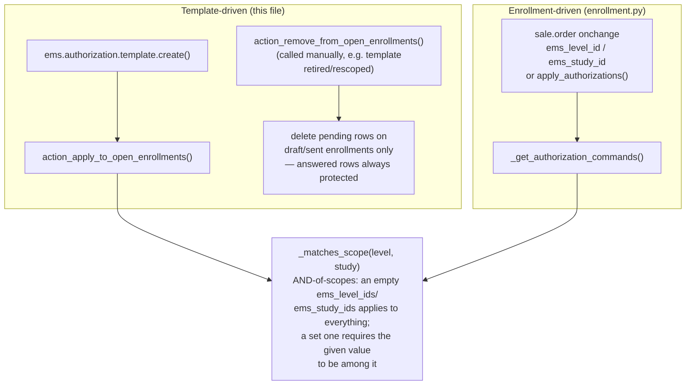
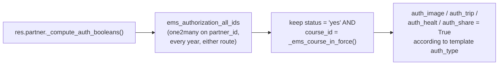
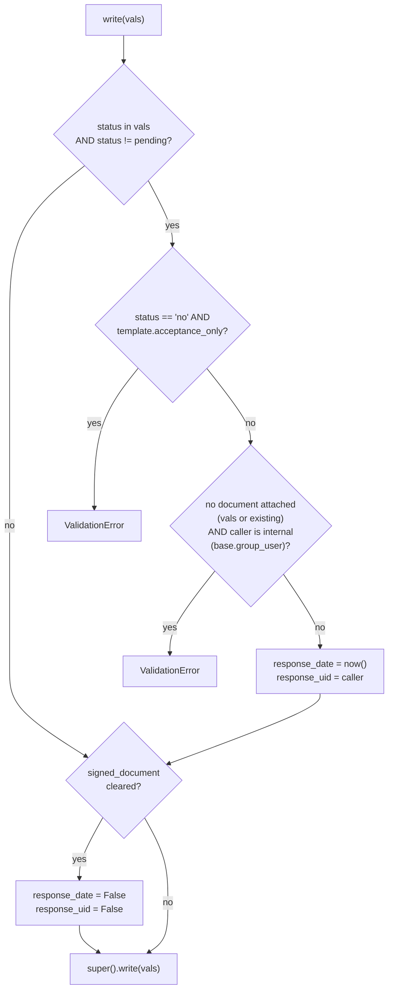
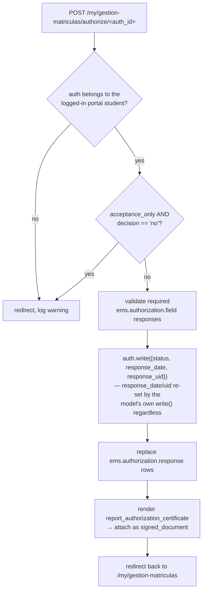

# Technical Reference: Enrollment authorizations (`ems.authorization*`)

## Overview

Five models cover the "the family must accept/reject this" flow — image rights,
school trips, health data, sharing information with family, etc. An
authorization reaches a student by one of two routes:

- **through the enrollment**, as part of the enrollment process: the family
  answers it before the enrollment can be confirmed;
- **standalone, during the school year**, for forms that only appear once the
  course is already running (published by the Departament d'Educació, or
  decided in a tutoring meeting) — the enrollment of the running course is
  closed by then, so these hang off the student directly.

- **`ems.authorization.template`** — the reusable definition (legal text,
  whether it's mandatory, whether it can only be accepted, which
  level/study it applies to, whether it is attached automatically during
  enrollment or sent by hand during the course (`apply_on`), optional extra
  data fields to collect).
- **`ems.authorization.field`** — an extra data field a template can ask
  for on acceptance (e.g. "passport number" for a trip authorization).
- **`ems.authorization`** — the actual pending/accepted/rejected response.
  Always addressed to one student for one academic year (`partner_id`,
  `course_id`); `enrollment_id` is set only for the enrollment route, where
  the row also shows up on [`sale.order`](enrollment.md)'s
  `ems_authorization_ids`.
- **`ems.authorization.response`** — one row per (`ems.authorization`,
  `ems.authorization.field`): the family's answer to an extra data field.
- **`ems.authorization.send.wizard`** (+ `.line`) — the assistant that sends
  standalone authorizations to a chosen set of students and emails them.

**Module files:** `models/enrollment/authorization.py`,
`models/enrollment/authorization_send_wizard.py`

---

## Fields

| Model | Field | Notes |
|-------|-------|-------|
| `ems.authorization.template` | `apply_on` | `enrollment` (default) = attached automatically to every open enrollment matching the scope below. `standalone` = never attached automatically; it only reaches a student through the send wizard. This is what stops a template created mid-year from being pulled onto next year's draft enrollments — see [Standalone authorizations](#standalone-authorizations-sent-during-the-course). |
| | `is_required` | If pending and required, blocks `sale.order.action_confirm()` (see [`enrollment.md`](enrollment.md#authorization-sync)). |
| | `acceptance_only` | If set, `ems.authorization.write()` rejects any attempt to set `status='no'` on its responses. |
| | `auth_type` | `image`/`trip`/`health`/`share`/`other` — drives `res.partner.auth_image`/`auth_trip`/`auth_healt`/`auth_share` (see below), not read anywhere else. |
| | `ems_level_ids` / `ems_study_ids` | Scope. Empty on both = applies to every enrollment; when both are set, an enrollment must match **both** (AND-of-scopes — see [`_matches_scope()`](#keeping-authorizations-in-sync-with-open-enrollments) below). |
| `ems.authorization` | `partner_id` / `course_id` | The student and academic year this authorization is addressed to — the real anchor of the record, stored on every row whichever route created it. Stored computes (`readonly=False`): mirrored from `enrollment_id` when there is one, set by the send wizard otherwise. Deliberately **not** `required=True`: they were introduced as stored computes on an existing table, and Odoo attempts `SET NOT NULL` before the backfill compute runs, which would leave the constraint silently absent on upgraded databases but present on fresh ones. `_check_target()` enforces them instead. |
| | `enrollment_id` | Optional. Set for the enrollment route, empty for a standalone one. |
| | `study_name` | Computed: the enrollment's study when there is one, else the study of the group the student actually sits in (`partner_id.main_group_id.study_id`), else `partner_id.study_id`. Feeds both `legal_text_rendered`'s `{{study_name}}` and the certificate report, so the two cannot drift. |
| | `status` | `pending` → `yes`/`no`. Drives the confirm-blocking check and `res.partner`'s auth booleans. |
| | `legal_text_rendered` | Computed, `sanitize=False` — `template_id.legal_text` with `{{student_name}}`/`{{academic_year}}`/`{{study_name}}` placeholders substituted. Feeds both the portal response page and `report_authorization_certificate`. |
| | `signed_document` / `signed_document_name` | For an internal (staff) response, required before the status can leave `pending` (enforced in `write()`). For a portal response, the controller generates and attaches the certificate PDF itself right after the write — see [Portal response flow](#portal-response-flow) below. |
| | `response_date` / `response_uid` | Set automatically by `write()` whenever `status` leaves `pending` — never set directly by a caller. |
| `ems.authorization` | `_sql_constraints: unique_enrollment_template` | One row per (enrollment, template) — this is what `action_apply_to_open_enrollments`'s "already has this template" check exists to avoid violating. PostgreSQL treats NULLs as distinct, so it imposes nothing on standalone rows. |
| | `ems_authorization_unique_standalone` (partial index, `init()`) | One row per (student, course, template) **among standalone rows only** (`WHERE enrollment_id IS NULL`). Partial on purpose: an enrollment-bound row is already keyed by its own enrollment, and a cancelled enrollment may legitimately coexist with an active one for the same (student, course) — `sale_order_unique_enrollment_per_course` excludes cancelled orders, so a blanket index would not even build on real data. Same technique as `sale.order.init()`. |

---

## Keeping authorizations in sync with open enrollments

Two entry points keep `ems.authorization` rows in step with which templates
apply to which enrollment, and they run at different times — both now share
the same matching rule via `ems.authorization.template._matches_scope(level,
study)`:



### Fixed (2026-07-30): unified AND-of-scopes matching

Previously, `action_apply_to_open_enrollments` (this file) used an AND-of-scopes
(level *and* study must both match, when both are set on the template), while
`sale.order._get_authorization_commands()` (`enrollment.py`, driving the live
onchange sync and `apply_authorizations()`) used an OR-of-scopes instead — the
same template, applied to the same enrollment, could gain or lose the
authorization depending purely on which code path last touched it. Confirmed
against production data that no existing template used both scoping
dimensions at once, so this was a latent inconsistency, not an active bug —
but the developer decided both paths should use AND, matching the
template-driven side, ahead of ever needing a template scoped to both a level
and a specific study within it.

Fixed by extracting the shared `_matches_scope(level, study)` predicate onto
`ems.authorization.template` (see the diagram above) — both directions now
call it instead of hand-rolling their own domain, so they can't drift apart
again. Tested in `tests/test_authorization.py` (template → matching
enrollments) and `tests/test_enrollment_header.py` (enrollment → matching
templates), both exercising the same both-scopes-set case. See also the
[`enrollment.md`](enrollment.md#authorization-sync) side of this coupling.

---

## Standalone authorizations (sent during the course)

New authorizations appear in the middle of the school year: the Departament
d'Educació publishes one, or a tutoring meeting decides one is needed. By then
the running course's enrollment is confirmed and closed, so there is nothing to
hang the authorization off — which is why `ems.authorization.enrollment_id` is
optional and `partner_id`/`course_id` are the record's real anchor.

A standalone authorization is identical to an enrollment-bound one in every
respect that matters to the family: same legal text and placeholder rendering,
same acceptance/rejection rules, same extra data fields, same certificate PDF,
answered on the same portal page. The only differences are how it is created,
and that it never gates an enrollment.

### Creating and sending

`ems.authorization.template.apply_on` decides whether a template takes part in
the enrollment process at all. A `standalone` template is invisible to all four
of the automatic-attachment paths:

| Path | Behaviour for `apply_on = 'standalone'` |
|------|------------------------------------------|
| `template.create()` | Does not call `action_apply_to_open_enrollments()`. |
| `action_apply_to_open_enrollments()` | Returns early; the form's header button is hidden. |
| `sale.order._get_authorization_commands()` | Excluded from the template search — **the important one**: without it, the next onchange on any draft enrollment of the *following* course would pull in a template created mid-year for *this* one. |
| `action_remove_from_open_enrollments()` | Returns early; the form's header button is hidden. |

Sending is done by `ems.authorization.send.wizard`, which resolves its
recipients three ways (`target`):

- `students` — whatever was selected in the students list (`active_ids`), via
  the `action_authorization_send_bulk` server action.
- `scope` — groups / studies / levels chosen in the wizard, intersected with
  the students actually enrolled in `course_id` (a `sale.order` whose state is
  not `cancel`). Going through the enrollment rather than `ems.group`'s own
  student list is what excludes ex-students still attached to a group record.
- `template_scope` — each template's own `ems_level_ids`/`ems_study_ids`, via
  the same `_matches_scope()` predicate the enrollment route uses, fed by
  `res.partner._ems_level_study_in_force()`.

The wizard never re-creates or overwrites an authorization the student already
holds for that (course, template) — by either route — because `course_id` is
stored on every row, so one search covers both. Skipped ones are counted and
shown in the preview, never reset: a signed authorization must survive.

### Notification

One email per student per send, listing every authorization in that batch —
not one email per authorization, which is how families start ignoring the
channel. Recipients come from `res.partner._ems_notification_recipients()`
(shared with the portal access wizard): an adult student is mailed himself, a
minor's **family** is mailed instead of him.

### What a standalone authorization must never do

It must never block an enrollment. Both confirm-time gates —
`sale.order.action_confirm()` and the portal's own
`portal_enrollment_confirm` — read `enrollment.ems_authorization_ids`, the
one2many, so a standalone row is out of scope by construction. That is a
behavioural guarantee, not an accident: it is pinned by a test.

---

## `res.partner` auth booleans

`ems.contact` (`models/contacts/contact.py`) exposes four derived flags —
`auth_image`, `auth_trip`, `auth_healt`, `auth_share` — computed from every
`ems.authorization` with `status == 'yes'` addressed to the student for the
**academic year in force**, grouped by `template_id.auth_type`:



They read the student's own authorizations, not the enrollment's, so one
accepted mid-year counts exactly as much as one accepted at enrollment time.

**`_ems_course_in_force()` is per student, not per centre**, and that
distinction is load-bearing: during the summer a student's enrollment is
already the incoming course while the centre's running course is still the
outgoing one, so keying on the centre's own course left every signed
authorization invisible — 122 of 122 SMX students after the first real
transition. It reads the course off `_ems_enrollment_in_force()` and only
falls back to `_ems_running_course()` (the per-centre answer, also the send
wizard's default) when the student holds no enrollment at all, which is how
a student who only ever received standalone authorizations still resolves to
something. Re-introducing the per-centre shortcut here immediately re-breaks
the four `tests/test_contact.py` cases covering that incident.

The depends deliberately still spans `sale_order_ids` as well as
`ems_authorization_all_ids`: the authorizations decide the value, the
enrollments decide which year is in force. Neither the old nor the new
version reacts to the course flip itself (nothing watches
`ems.course.is_current`); `tests/test_contact.py` invalidates the cache
explicitly for that case.

`ems.contact.ems_authorization_ids` (all of the student's authorizations for
that same year, not filtered by status) is a separate computed field, used by
the contact form's read-only authorizations list
(`views/community/contact/form.xml`). It stays scoped to the year in force so
it can never show an empty table next to a green badge.

**Bug fixed in this pass:** `_compute_ems_authorization_ids` had no
`@api.depends` at all — a non-stored compute field with no dependencies is
never invalidated by a later write within the same transaction/environment,
so a form or test that read `ems_authorization_ids` once and then created a
new enrollment/authorization for that same student in the same transaction
would keep seeing the stale (pre-creation) value until a fresh
environment/request came along. Fixed with
`@api.depends('sale_order_ids.ems_authorization_ids', 'sale_order_ids.ems_course_id')`,
mirroring the depends already correctly declared on the neighboring
`_compute_auth_booleans`. Regression test:
`tests/test_contact.py::TestContactFields::test_ems_authorization_ids_recomputes_within_same_transaction`.
`strike.py`'s minor-notification logic reads `student.auth_share` directly
(see [`strike.md`](../coexistence/strike.md)) — not affected by this bug
since it doesn't chain through `ems_authorization_ids`.

---

## Response rules (`ems.authorization.write()`)



Portal users (`base.group_portal`, never `base.group_user`) are exempt from
the document requirement — the portal controller attaches the generated
certificate right after this write succeeds, so requiring one *before* the
write would make the portal flow impossible.

---

## Portal response flow

`controllers/portal_enrollment.py` is the primary consumer of these models.
Both routes below are keyed on `auth.partner_id`, not on the enrollment's
partner: an authorization sent during the course has no enrollment to check
against. The page itself gets its list from
`res.partner.get_portal_authorizations()` (everything addressed to the
student for the running and the enrolling course, either route), which is
what makes a mid-year authorization show up on the **confirmed** enrollment
page — the one a student otherwise never sees again:



`/my/gestion-matriculas/authorization/<auth_id>/document` serves the
attached `signed_document` back (inline PDF), same ownership check as above.
The certificate's filename comes from `_certificate_filename()`, which falls
back to the academic year when there is no enrollment code to name it after.

Both routes are covered by `tests/test_portal_actions.py`, standalone
authorizations included, plus a regression guard proving one student cannot
answer another's.

The list and the response modals live in one shared QWeb template,
`views/portal/portal_authorizations.xml`, `t-call`ed by both the draft and
the confirmed enrollment pages so the two cannot drift. On the confirmed
page it sits **outside** that template's `t-if="enrollment"` wrapper, and the
"no enrollment found" notice is conditioned on there being no authorizations
either — a student with no enrollment row for the year can still have
authorizations to answer.

**A pending standalone authorization never blocks an enrollment.** Both
confirm-time gates (`sale.order.action_confirm()` and the portal's own
`portal_enrollment_confirm`) read `enrollment.ems_authorization_ids`, the
one2many, so a standalone row is out of scope by construction. Pinned by
`tests/test_authorization.py::TestAuthorizationStandalone::
test_a_pending_required_standalone_does_not_block_action_confirm`.

---

## Views

| View | File | Notes |
|------|------|-------|
| List/Search/Form | `views/academic_management/enrollment_configuration/enrollment_authorization_{view,search,form}.xml` | Configuring `ems.authorization.template`; `action_ems_authorization_template`, under Academic Management → Configuration (admin + secretary, both full CRUD — see `security/ir.model.access.csv`). |
| Enrollment form | `views/academic_management/enrollment/enrollment_form.xml` | `ems_authorization_ids` embedded on the enrollment itself. |
| Contact form | `views/community/contact/form.xml` | Read-only `ems_authorization_ids` tab on the student. |
| Authorizations list/form/search | `views/academic_management/enrollment/authorization_{view,form,search}.xml` | The follow-up screens on `ems.authorization` itself (`action_ems_authorizations`, Academic Management → Enrollment → Authorizations), opening flat on the running year. `group_id` (related, non-stored, to `partner_id.main_group_id`) is searchable but deliberately not groupable: that would need `store=True`, which goes stale the moment a student changes group. |
| Send assistant | `views/academic_management/enrollment/authorization_send_wizard.xml` | The wizard form, its menu action, and the `action_authorization_send_bulk` server action bound to the students list. |
| Portal | `views/portal/portal_authorizations.xml` | The shared authorizations block, `t-call`ed by `portal_enrollment_draft.xml` and `portal_enrollment_confirmed.xml`. Documented from the user side in `docs/en/families/manual-portal-alumne.md`, "Step 5 — Answering an authorization". |
| Report | `reports/authorizations/report_authorization_certificate.xml` | The signed-response certificate PDF, rendered by the portal controller and attached as `signed_document`. Reads the student, year and study off the authorization itself, hides the enrollment-code row when there is none, and tells a portal response from a backoffice one by `response_uid.share`. |

## Data

Seed templates: `data/custom/ems.authorization.template.csv`
(`__import__.`-prefixed, centre-owned). The file carries no `apply_on`
column, so all five seeds resolve to the field default, `enrollment` — which
is correct for every one of them.

Notification template: `mails/enrollment/authorization_send.xml`
(`email_template_authorization_send`), on `res.partner`, with the three
`context="{'lang': ...}"` sibling records this repo uses for a trilingual
template. It deliberately declares **no** `<field name="lang">`: that would
be re-resolved per record (the student) and override the
`with_context(lang=...)` the wizard sets from the actual recipient, who for a
minor is a family member with a language of their own. The authorizations
themselves travel in the render context (`ctx.get('authorization_names')`),
which is what allows one email per student instead of one per authorization.

## Access control

| Group | Templates / fields | `ems.authorization` | Notes |
|-------|--------------------|---------------------|-------|
| `group_academic_admin`, `group_secretary` | full CRUD | full CRUD | Unrestricted (`security/rules/contacts.xml`). |
| `group_head_of_studies` | full CRUD | read/write/create | Needs a rule of its own with `domain_force = []`: rules of *different* groups are ANDed, so inheriting only the teacher's read-only rule and the tutor's own-students-only one would stop them sending anything to a student they do not tutor. |
| `group_teacher` | read-only | read-only | |
| tutors (`group_teacher` + the tutor rule) | read-only | create/write, no unlink | Scoped to `partner_id.tutor_id.user_id = user.id` — keyed on the student now, not on `enrollment_id.partner_id`. |
| `base.group_portal` | read-only | read/write, no create/unlink | `[('partner_id', 'in', [user.partner_id.id] + user.partner_id.get_portal_students().ids)]`. |
| `group_student_data_reader` | — | read-only | |

The portal rule calls `get_portal_students()` rather than traversing the
relation table: the family↔student link goes through
`res.partner.relation.all`, which a portal user cannot read, so a domain
traversal would be a subquery-rights hazard. It is pinned by a real
`with_user(portal_user).search([])` test rather than trusted.

The head of studies also reaches the template screens through Academic
Management → Configuration, which was opened to them; the Enrollment Items
and Enrollment Templates entries under it carry their own `groups=` so that
does not also hand over the enrollment items and packs.

## Migration notes (18.0.0.25.0)

`migrations/18.0.0.25.0/post-migrate.py` backfills `partner_id`/`course_id`
from each existing authorization's enrollment (plain SQL, idempotent) and
logs a warning for any row it cannot resolve. Neither field is
`required=True`, on purpose: Odoo attempts the column's `SET NOT NULL` during
`_auto_init`, before post-migrate runs, and `sql.set_not_null()` swallows the
failure with a warning — so the constraint would be silently absent on every
upgraded database and present on every fresh one. `_check_target()` covers
both paths identically. There is no `post_init_hook` counterpart, and that is
deliberate: a fresh database has nothing to backfill.

**The `noupdate` trap, worth knowing before editing any `noupdate="1"`
record.** `rule_ems_authorization_portal` lived in a `<data noupdate="1">`
block, and rewriting its `domain_force` in the file did nothing at all on an
existing database. `odoo/tools/convert.py::_tag_record()` skips an
already-existing record on the **file's** noupdate flag alone (around line
347), before `models._load_records()` ever gets to check the record's own
`ir_model_data.noupdate` — so clearing the stored flag from a migration is
not sufficient on its own. Both halves were needed: the rule moved into a
plain `<data>` block (it had not earned `noupdate=True`, per CLAUDE.md's own
test), and `pre-migrate.py` clears the flag the record still carries from its
old block, which `_load_records()` would otherwise keep honouring. Verified
empirically on the dev database.

## Regenerating the manual screenshots

`tests/test_docs_screenshots.py` (tagged `-standard`, so `./test.sh` never
runs it) rebuilds the four PNGs the user manuals use. Run it by hand when a
documented screen changes:

```
sudo service odoo stop
sudo -u odoo odoo -d ems --test-enable --test-tags='ems_screenshots/ems' \
     --stop-after-init -c /etc/odoo/odoo.conf
sudo service odoo start
```

It writes to `/tmp/ems_doc_screenshots` (the test process runs as `odoo` and
cannot write to the repository, so the files are copied into `docs/assets/`
by hand; the directory must exist and be writable by `odoo` — `/tmp` itself
is not, on this box). Every shot is clipped to one element and taken against
fixtures that live in a rolled-back transaction, which is what keeps this
box's real students out of a published manual.

## Not covered

- The AND-vs-OR matching-semantics gap above.

## Fixed in this pass (2026-07-28)

`ems.authorization.write()`'s three separate `if 'status' in vals and
vals['status'] != 'pending':` blocks merged into one pass over `self`
(same condition checked three times before). Two previously-untranslated
`ValidationError` strings wrapped in `_()`, with new `ca_ES`/`es_ES` `.po`
blocks. Spanish inline comments translated to English throughout. Decorative
step-numbering comments ("1. Create the templates...", "2. Apply
retroactive logic...") trimmed in favor of docstrings, per the project's
"don't explain WHAT" comment convention. `_order` added to
`ems.authorization.template` (`name`) and `ems.authorization` (`id`) — no
default order existed before. `contact.py`'s missing `@api.depends` bug
(above) fixed as part of this pass since it's this file's primary
consumer, not deferred to a future `ems.contact` revisit.
