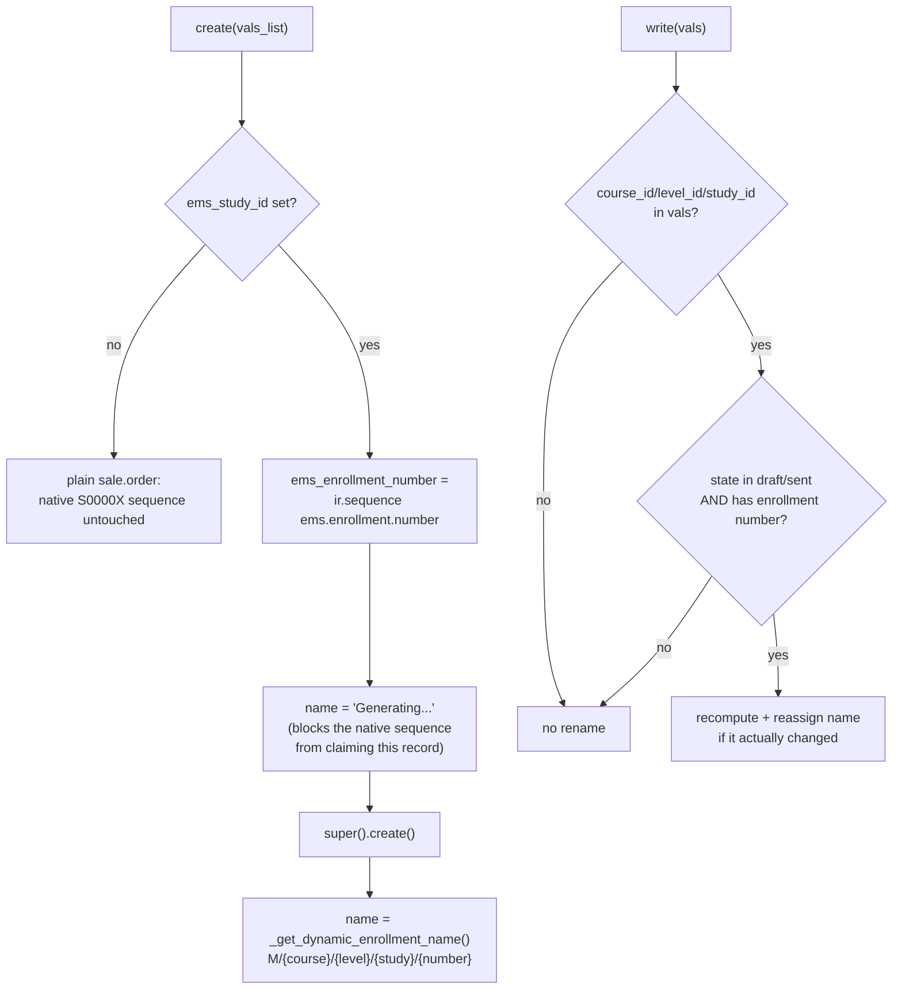
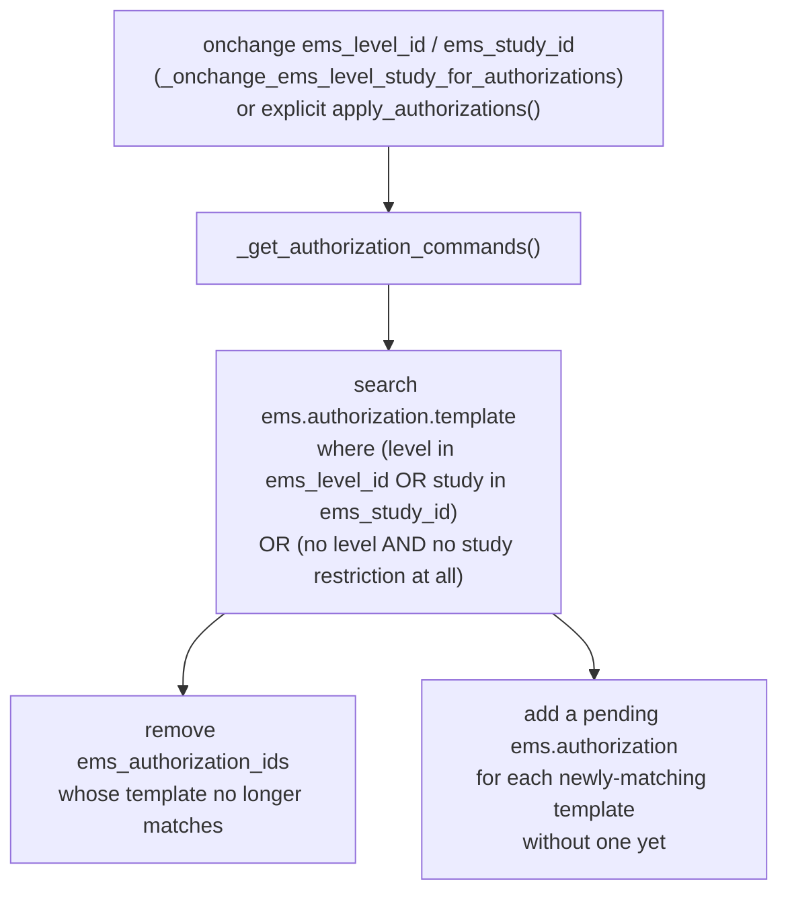
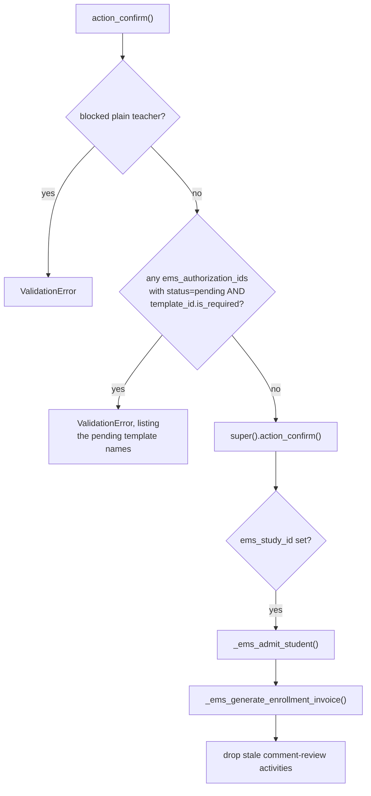

# Technical Reference: Enrollment header (`sale.order` extension)

## Overview

There is no dedicated `ems.enrollment_header` model — "enrollment" at the
document level is this project's name for Odoo's native **`sale.order`**,
extended with EMS-specific fields, state-transition guards and the
admission/billing side-effects that fire on confirmation. Do not confuse it
with [`ems.enrollment`](../contacts/enrollment.md) (a different model: the
student x group x subject junction row created once a student is actually
placed), nor with [`sale.order.template`](enrollment_template.md) (the "pack"
of pre-filled lines an enrollment can start from).

**Module file:** `models/enrollment/enrollment.py` (`SaleOrder`, `_inherit = "sale.order"`)

---

## Fields

| Field | Type | Notes |
|-------|------|-------|
| `ems_enrollment_number` | `Char`, readonly | Sequence-generated (`ems.enrollment.number`) on `create()`, only when `ems_study_id` is set. Feeds `_get_dynamic_enrollment_name()`. |
| `ems_course_id` | `Many2one → ems.course` | Academic year. Defaults to the course flagged `is_enrollment_default`, falling back to `is_current`. |
| `ems_study_id` | `Many2one → ems.study` | The study being enrolled into. Required at the view level only. |
| `ems_level_id` | `Many2one → ems.level` (`related='ems_study_id.level_id'`, stored) | Read-only, purely derived — needed to group/filter the list view. |
| `shift` | `Selection` (morning/afternoon) | Not required/defaulted at the model level (commented out deliberately). |
| `ems_group_id` | `Many2one → ems.group` | Destination group placement — see [Admission and placement](#admission-applicant--student-and-destination-placement) below. Domain restricted to the selected study only; a shift/course mismatch is a soft onchange warning, never a hard block. |
| `sale_order_template_id` | native, re-domained | Only offers templates whose `ems_study_id` matches this order's `ems_study_id`. |
| `ems_authorization_ids` | `One2many → ems.authorization` | Kept in sync with the level/study selection — see [Authorization sync](#authorization-sync). |
| `ems_payment_method` | `Selection` (transfer/direct_debit) | Read by `_ems_generate_enrollment_invoice()` to decide whether to attach a bank account to the invoice. |
| `ems_has_fees`, `ems_fee_amount`, `ems_non_fee_amount` | computed + stored, via `_compute_fee_amounts` | Split of `order_line` totals by `product_template_id.ems_is_enrollment_fee`. |
| `ems_first_installment`, `ems_second_installment` | computed (not stored), via `_compute_installments` | `first = non_fee + fee * 50%`, `second = fee * 50%` — the deferred-payment split. Mirrored (independently, per-invoice) inside `_ems_generate_enrollment_invoice`'s `pct1` calculation. |
| `ems_enrollment_status_label` | computed (not stored) | Cosmetic label for `state`, decoupled from the native selection labels so it can read "Pre-enrollment"/"Sent to student" instead of the generic sale.order wording. |

---

## Naming: `create()` / `write()`

The name is only ever refreshed while the order is still editable
(`draft`/`sent`); once confirmed (`sale`) a study/course change no longer
touches `name` — the code is meant to be stable from that point on.

---

## Uniqueness: one active enrollment per student per course

`_check_unique_enrollment_per_course` (`@api.constrains('partner_id',
'ems_course_id', 'state')`) blocks creating or updating an order into a state
where the same student already has another non-cancelled order for the same
`ems_course_id`. Cancelled orders (`state == 'cancel'`) are excluded, so a
student can always get a fresh enrollment after a previous one was cancelled.

**Known gap:** this is a Python-only `@api.constrains` check — there is no
`_sql_constraints` (partial unique index) backing it. Two concurrent
transactions can each pass the constraint's `search()` before either commits,
producing two live enrollments for the same student/course (a race condition,
not exercised by the test suite — flagged here, not fixed in this pass).

---

## Tutor-blocking guards

`_is_blocked_tutor()` returns `True` only for a *plain* teacher: member of
`ems.group_teacher` but none of `ems.group_tutor`,
`ems.group_academic_admin`, `ems.group_secretary`. It gates
`action_cancel`, `action_quotation_sent`, `action_quotation_send`,
`action_send_enrollment_proposal` and `action_confirm` — each raises a
`ValidationError` up front for a blocked plain teacher, before calling into
the native action.

**Known gap:** this Python guard is not the only access-control layer — the
underlying `ir.rule`s in `security/rules/contacts.xml`
(`rule_sale_order_tutor` etc.) independently restrict write access for
`ems.group_teacher` members to orders where
`partner_id.tutor_id.user_id = user.id` (i.e. the caller is genuinely *that
student's* group tutor, not just someone in `group_tutor`), further limited
to `state == 'draft'`. `_is_blocked_tutor()` never checks either of these —
it only asks "is this a plain teacher", so:
- A tutor who is a `group_tutor` member but not *this particular student's*
  tutor sails past `_is_blocked_tutor()` and only gets stopped by the
  `ir.rule` layer (a bare `AccessError`, not the friendlier `ValidationError`
  the Python guard raises for plain teachers).
- Cross-study/cross-tutor placement restrictions during the enrollment
  *proposal* flow are enforced only in
  [`ems.enrollment_proposal_wizard`](enrollment_proposal_wizard.md), not
  here — `enrollment.py` itself has no `@api.constrains` guarding
  `ems_group_id`/`ems_study_id` against a tutor's own scope.

Neither gap is exercised by production data today; both are flagged for a
future pass rather than fixed here, per this session's convention of not
silently changing security-adjacent behavior mid-DTON-pass.

---

## Authorization sync

`ems_authorization_ids` (rows on [`ems.authorization`](authorization.md)) are
kept in step with the order's level/study selection, not hand-picked by the
user:

This OR-of-scopes matching differs from `ems.authorization.template`'s own
retroactive apply/remove methods (AND-of-scopes) — see
[`authorization.md`](authorization.md#known-gap-two-different-matching-semantics)
for the details of that inconsistency.

`action_confirm` then blocks on any authorization still `pending` whose
template is `is_required`:

---

## Admission (applicant → student) and destination placement

On confirmation, `_ems_admit_student()`:
1. Converts an `applicant` partner into a `student` (`_ems_convert_to_student`).
2. Clears the GEDAC `preinscription_*` fields if the study being confirmed
   matches the pending assignment (a different study being confirmed — the
   manual escape hatch — leaves the assignment standing).
3. If the destination study has *already* been transitioned
   (`ems_study_id.transition_state == 'transitioned'`), immediately calls
   `_ems_apply_destination_placement()` — this is the latecomer path; the
   normal case (study not yet transitioned) is placed in bulk later by the
   transition wizard, not here.

`_ems_suggest_group()` / `_ems_fill_suggested_group()` provide a best-guess
`ems_group_id` (same acronym + shift as the student's current group for a
continuer; lowest-letter group of the shift for an applicant) without forcing
it — placement always goes through the explicit `ems_group_id` field.

`_ems_apply_destination_placement()` is idempotent and shared between this
individual/latecomer path and the transition wizard's bulk path: it sets
`partner.main_group_id` and creates one `ems.enrollment` row per
(student, group, subject) triple not already present, running under `sudo()`
because `ems.enrollment` blocks manual creation for non-admins.

---

## Billing

The student picks `payment_term_id` on the portal enrollment-confirm page
from the plans an admin/secretary marked portal-visible — see
[`payment_term.md`](payment_term.md) for that `account.payment.term`
extension. `_ems_generate_enrollment_invoice()` (idempotent — a no-op if a
live `out_invoice` already exists) creates and posts the enrollment's
invoice:

- **Single payment:** one due date (`_ems_billing_due_dates()`'s first date,
  15-Jul of the course start year by default).
- **Deferred (fees split):** a two-line `account.payment.term` is generated
  on the fly, splitting `ems_first_installment` / `ems_second_installment`
  as percentages of the invoice total, due at the first/second dates
  respectively. Only triggered when the order's `payment_term_id` already
  has more than one line *and* there's a non-zero second installment.
- **Direct debit:** attaches the student's first bank account
  (`partner_bank_id`) to the invoice. If that account isn't trusted yet
  (`allow_out_payment` is `False` — e.g. a CSV-imported account that never
  went through the document-approval flow), this method force-trusts it
  (`bank.sudo().allow_out_payment = True`) rather than failing the invoice
  post. This is the same flag `ems.student.document._apply_bank_account()`
  sets on document approval — see
  `plans/student_document_iban_renewal_allow_out_payment.md` for the open
  question of whether this fallback should exist at all, or whether an
  untrusted account should instead block direct-debit invoicing until a
  document is actually approved.

`action_ems_reapply_benefits()` is the explicit re-entry point for a
confirmed order whose benefit status changed after confirmation (confirmed
orders freeze their fee lines against later bonification/exemption changes):
it cancels the unpaid invoice, recomputes price/discount on the lines, and
regenerates the invoice — refusing if any existing invoice already has a
payment registered.

---

## Views

| View | File | Notes |
|------|------|-------|
| List/Search | `views/academic_management/enrollment/enrollment_list.xml`, `enrollment_search.xml` | The Matricules list; `action_ems_enrollments`. |
| Form | `views/academic_management/enrollment/enrollment_form.xml` | Adds all EMS fields, authorization lines, `action_send_enrollment_proposal` button. |
| Menu | `views/academic_management/enrollment/menu.xml` | Under Academic Management. |
| Contact kanban | `views/community/contact/kanban.xml` | Overrides `action_view_sale_order`, embedding the student's own enrollments. |
| Contact form | `views/community/contact/form.xml` | Adds/relabels the *Sales & Purchase* page and its `action_view_sale_order` button for a student partner. |

## Data

Enrollment number sequence: `data/custom/ems.sequence.enrollment.xml`
(`ems.enrollment.number`, `__import__.`-prefixed per the centre-owned data
convention). Authorization template seed data:
`data/custom/ems_authorization_template_data.xml`.

## Fixed in this pass (2026-07-28)

Class renamed `ems_SaleOrder` (mixed snake/Pascal case) → `SaleOrder`,
matching the sibling `_inherit`-only classes in `models/enrollment/`. All
inline comments translated from Spanish to English. Loop variable renamed
`rec` → `order` throughout, per the project's coding standard (loop variable
named after the model). Every previously-untranslated `ValidationError`
message and one activity `summary=` wrapped in `_()`, with the corresponding
`.po` entries added to `i18n/ca_ES.po`/`i18n/es_ES.po`. New test coverage in
`tests/test_enrollment_header.py` (naming, uniqueness constraint,
fee/installment computes, tutor guards including the `ir.rule` interaction
above, the `action_confirm` authorization gate, `apply_authorizations`).
Two real, pre-existing gaps were found and documented above (no
`_sql_constraints` backing the uniqueness rule; `_is_blocked_tutor()` not
covering the `ir.rule` layer's per-student tutor check) but left unfixed —
they are business-logic-adjacent security changes, out of scope for a
normalization pass.
