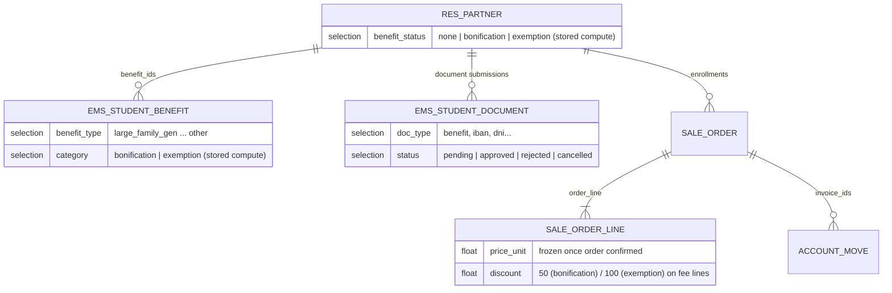
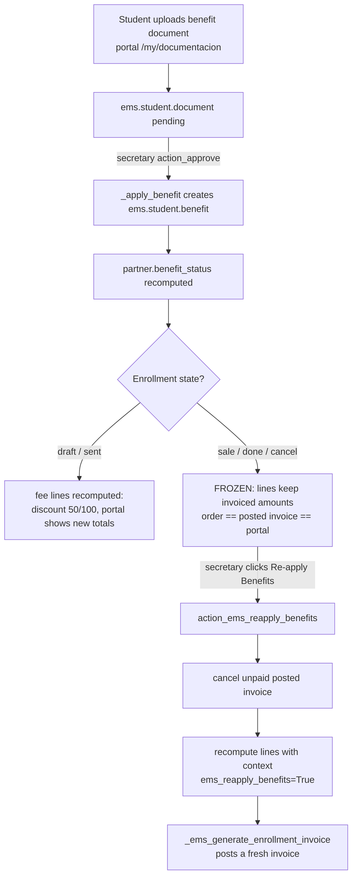

# Enrollment benefits (bonifications / exemptions)

How fee bonifications and exemptions interact with the enrollment sale order
and its invoice, and why confirmed enrollments are **frozen** against late
benefit changes (issue #352).

## Models involved

## Flow

## The freeze (`models/enrollment/enrollment_line_extension.py`)

`sale.order.line._compute_price_unit` and `_compute_discount` are extended
with `@api.depends('order_id.partner_id.benefit_status')`, so any change in
the partner's benefits recomputes the fee lines. Because these are stored
computed fields, before issue #352 this also silently rewrote **confirmed**
orders, making them diverge from the already-posted invoice.

`_ems_benefit_frozen_lines()` returns the lines whose order state is not
`draft`/`sent`; both computes subtract those lines from `self` before calling
`super()` and applying the benefit logic (same pattern as Odoo core's
`qty_invoiced > 0` guard: the skipped lines simply keep their stored value).
The freeze is lifted only when the context flag `ems_reapply_benefits` is set.

## The secretary action (`models/enrollment/enrollment.py`)

`action_ems_reapply_benefits()` — button on the enrollment form header,
visible to `group_secretary` / `group_academic_admin` when `state == 'sale'`
and the order is an enrollment (`ems_study_id` set):

1. Refuses non-confirmed orders (`ValidationError`).
2. Refuses if any non-cancelled customer invoice has payments registered
   (`payment_state != 'not_paid'` and a non-zero total) — a credit note must
   be issued manually instead.
3. Cancels the remaining invoices (`button_draft` + `button_cancel`).
4. Recomputes `price_unit`/`discount` on all lines with
   `ems_reapply_benefits=True` in context.
5. Regenerates and posts the invoice via `_ems_generate_enrollment_invoice()`
   (idempotent: it ignores cancelled invoices) and logs a note in the chatter.

## Portal warning (`views/portal/portal_enrollment_draft.xml`)

Enrollments with fees (`ems_has_fees`) show a warning above the confirm
button telling the student to upload and get any benefit approved **before**
confirming, since later benefits are not applied automatically.

## Access control

| Action | Student/Family (portal) | Secretary | Academic admin |
|---|---|---|---|
| Upload benefit document | yes (own student) | — | — |
| Approve/reject document | — | yes | yes |
| Re-apply benefits on confirmed enrollment | — | yes | yes |

## Tests

`tests/test_enrollment_benefit.py` (`TestEnrollmentBenefit`): draft
application (bonification 50 / exemption 100), freeze after confirmation,
re-apply action (invoice cancelled + regenerated, totals matching), and the
confirmed-only guard.
