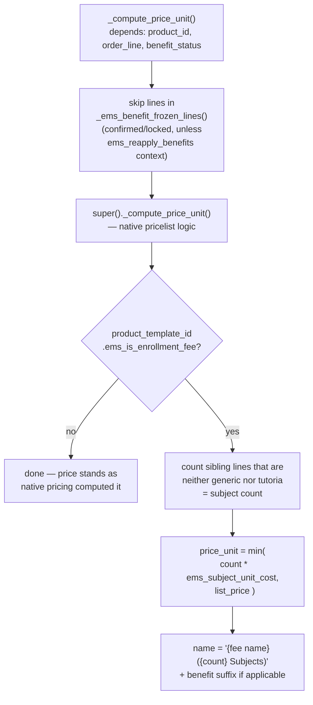

# Technical Reference: Enrollment lines (`sale.order.line` extension)

## Overview

Each enrollment line ([`sale.order.line`](enrollment.md)) is either a subject
(a real product linked from `ems.subject.product_id`) or a generic product
(a fee, insurance, etc. — see [`enrollment_product_extension.md`](enrollment_product_extension.md)).
This file adds the enrollment-specific line rules: forced quantity of 1, no
duplicate product per order, and — the bulk of the logic — automatic fee
price/discount calculation.

**Module file:** `models/enrollment/enrollment_line_extension.py` (`SaleOrderLine`, `_inherit = "sale.order.line"`)

---

## Fields

| Field | Type | Notes |
|-------|------|-------|
| `ems_is_tutoria` | `Boolean` (`related='product_template_id.ems_is_tutoria'`) | Read-only mirror, used by the view to block removing a tutoria line individually. |

---

## Fee price/discount calculation

**Not covered here — see [`enrollment_benefits.md`](enrollment_benefits.md) and
`tests/test_enrollment_benefit.py`:** the bonification/exemption discount
logic and the confirmed-order freeze (`_ems_benefit_frozen_lines`) already
have their own thorough doc and tests from the Phase-5 enrollment-benefits
feature. This section only covers the base calculation those build on top of.

`_compute_discount` follows the same skip-frozen-lines / only-fee-lines
gating, then applies the benefit-driven discount (0% / 50% / 100%) — see
`enrollment_benefits.md` for that part.

### Known gap: `name` is a side-effect field, not a tracked compute

`line.name = f"{base_name}{benefit_suffix}"` is assigned *inside*
`_compute_price_unit`, but `name` itself has no `@api.depends` of its own —
Odoo only knows to invalidate/recompute `price_unit` when its declared
dependencies change; `name`'s stale in-cache value is never proactively
invalidated the same way. Confirmed by direct test: creating a fee line
together with a sibling subject line in one batch write (`order.order_line
= [(0,0,subject), (0,0,fee)]`) and reading `.name` **before** ever touching
`.price_unit` returns a stale "(0 Subjects)" from a premature pass during
sibling-line creation (when the fee line's own compute first ran, before
the subject line was fully visible to it); reading `.price_unit` first
correctly recomputes both fields together, and `.name` then reads correctly
too. `tests/test_enrollment_line.py::test_fee_line_name_includes_subject_count`
calls `self.env.flush_all()` before asserting to force the same settling
any fresh transaction would naturally have.

In practice this is unlikely to be user-visible: normal UI usage creates
lines and confirms the order in separate requests, and Odoo flushes all
pending computes before a transaction commits — so by the time any *later*
transaction reads the row, both fields are already consistent. The risk is
narrow: any code path that creates enrollment lines and reads `line.name`
**in the same transaction**, before `price_unit` is read/recomputed, could
see a stale subject count in the name. Not fixed in this pass — the correct
fix (making `name` a real `@api.depends`-tracked field, or an editable
compute like `product.template.ems_study_ids`) changes the field's public
contract and wasn't attempted here.

---

## Duplicate-item guard

Enforced twice, defense in depth:

- **`_onchange_product_id_check_duplicate`** (form-only): if the product
  just picked already appears on another line of the same order, clears
  the selection and warns immediately.
- **`_check_unique_enrollment_item`** (`@api.constrains('product_id',
  'order_id')`): the actual DB-level guarantee — blocks `create()`/`write()`
  regardless of whether the onchange fired (RPC, import, etc.).

## Forced quantity of 1

**`_force_quantity_one`** (`@api.onchange('product_id', 'product_uom_qty')`):
an enrollment line is never "2 of the same subject" — resets
`product_uom_qty` to `1.0` and warns whenever a product is picked or the
quantity is manually changed away from 1. Form-only (no matching
`@api.constrains`) — a direct `write({'product_uom_qty': 2})` via RPC is
not blocked at the model level, only the UI path is guarded.

---

## Views

Embedded in [`enrollment.md`](enrollment.md)'s own form
(`views/academic_management/enrollment/enrollment_form.xml`) — no
standalone view. The list columns are re-labeled/reordered there (subject
picker, quantity hidden since it's always 1, price/discount/subtotal),
not documented separately here.

## Fixed in this pass (2026-07-28)

Class renamed `ems_SaleOrderLine` (mixed snake/Pascal case) → `SaleOrderLine`,
matching the sibling `_inherit`-only classes in `models/enrollment/`.
Spanish inline comments translated to English. Two previously `_()`-wrapped
but old-style `%`-formatted `ValidationError`/warning messages converted to
the project's named-placeholder convention (`_("...%(name)s...", name=...)`)
— existing `ca_ES`/`es_ES` translations kept, only the placeholder renamed
in both msgid and msgstr (same pattern as the exit-wizards pass). Along the
way, found and fixed two malformed `.po` entries for these same strings in
both locale files — each had two different translations concatenated into
one `msgstr` with no separator (a pre-existing data-quality issue,
unrelated to this fix but caught while touching the same block). New
`tests/test_enrollment_line.py` (9 tests): base fee price cap, duplicate
guards, forced quantity, `ems_is_tutoria` — the fee/discount *benefit*
branches were already covered and are not duplicated here.
