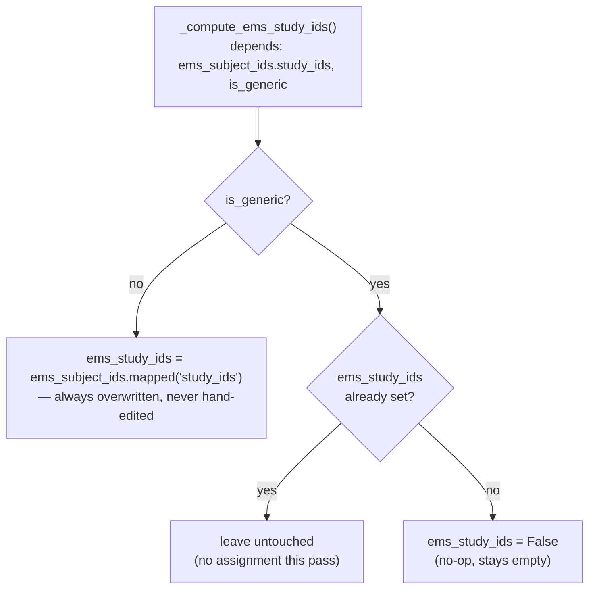

# Technical Reference: Enrollment products (`product.template` extension)

## Overview

Every line on an enrollment ([`sale.order.line`](enrollment_line.md)) points
at a `product.product`. This file adds the EMS-specific product flags that
distinguish a **subject** product (auto-created and owned by
[`ems.subject`](../curriculum/subject.md), via its own `product_id`) from a
**generic** product (a fee, insurance, etc. — configured directly on this
extended form, not owned by any other EMS model).

**Module file:** `models/enrollment/enrollment_product_extension.py` (`ProductTemplate`, `_inherit = 'product.template'`)

---

## Fields

| Field | Type | Notes |
|-------|------|-------|
| `ems_subject_ids` | `One2many → ems.subject` (inverse of `ems.subject.product_id`) | Reverse link — a subject product always has exactly one, a generic product has none. |
| `ems_study_ids` | `Many2many → ems.study`, computed + stored, `readonly=False` | An **editable compute**: derived automatically for a subject product (its subject's own studies); left to manual entry for a generic product — see below. |
| `is_generic` | `Boolean` | `True` = available on enrollments for every study (fees, insurance…); `False` (default) = a real subject, scoped to its own studies. |
| `ems_level_ids` | `Many2many → ems.level` | Only meaningful for a generic product — which levels it's offered at (e.g. a VET-only fee). Plain field, no compute. |
| `ems_is_enrollment_fee` | `Boolean` | Marks a generic product as a calculated fee — read by [`enrollment_line.md`](enrollment_line.md)'s `_compute_price_unit`/`_compute_discount`. |
| `ems_subject_unit_cost` | `Float` | Per-subject cost used in that same fee calculation. |

---

## `_compute_ems_study_ids`: editable compute, two branches

The `is_generic` branch deliberately skips assigning the field for records
that already have a value — this is the standard Odoo pattern for a
`store=True, readonly=False` compute field that the user can also edit by
hand (an admin picks the levels/studies a fee applies to; the compute must
never silently clear that choice on an unrelated recompute trigger, e.g. a
sibling subject's studies changing). `store=True` exists so the field stays
usable in domains/quick filters (e.g. filtering products by study on the
enrollment line's product picker).

## Fixed in this pass (2026-07-28)

**Real bug found and fixed:** this class declared
`_description = "Expand the product object with a reverse link to the
subject to collect the studies to which it belongs."` — a sentence clearly
meant as a code comment, mistakenly written as the actual `_description`
class attribute. Because `_inherit`-only extensions can override a native
model's `_description`, this silently replaced `product.template`'s real
displayed name for `en_US` everywhere Odoo shows a model's description
(confirmed via `SELECT name FROM ir_model WHERE model='product.template'`
— `en_US` held the comment text; `ca_ES`/`es_ES` were unaffected since only
the English source string changed, and their native translations were
never touched by this override). Fixed by removing the override and moving
the explanatory text into an actual class docstring. Regression test:
`tests/test_enrollment_product_extension.py::test_description_override_bug_is_fixed`.

New `tests/test_enrollment_product_extension.py` (5 tests) — the
generic/subject branching of `_compute_ems_study_ids` and the
description-override regression had zero coverage before; `ems.subject`'s
own auto-created-product sync (name/code) was already covered by
`tests/test_subject.py` and isn't duplicated here.
