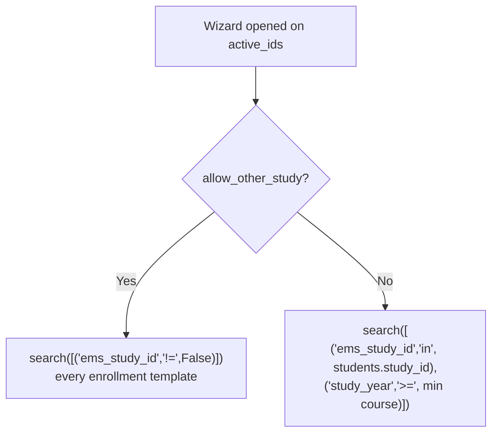
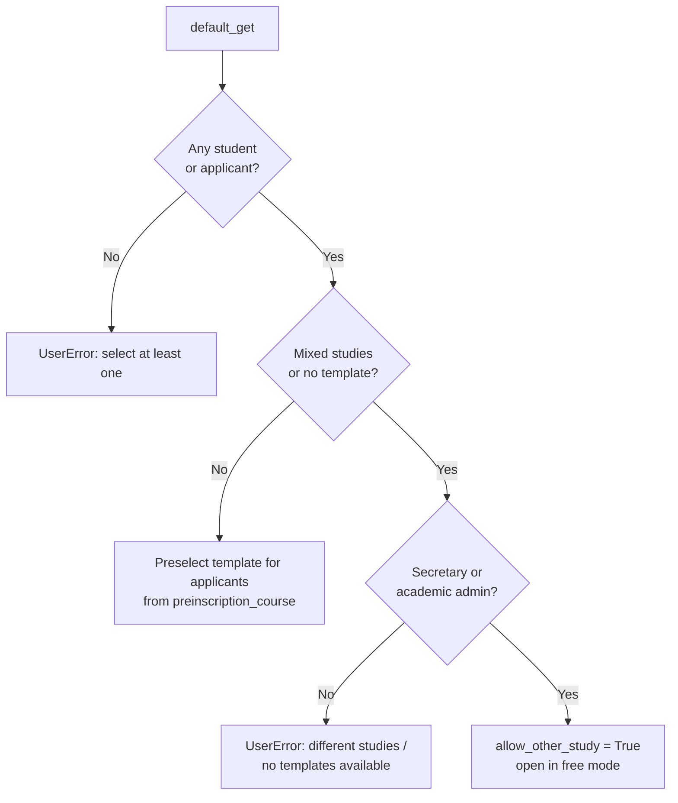

# Technical Reference: `ems.enrollment_proposal_wizard`

## Overview

`ems.enrollment_proposal_wizard` turns a selection of students (or applicants) into draft `sale.order` enrollments for the next course, one per student, all sharing a single `sale.order.template`.

By default the wizard only offers the templates of the students' **own** study, which covers the normal case: a tutor renewing SMX1A into SMX2A after the June board. It cannot cover the **cross-study** case — a current student granted a place in a different study by GEDAC (an ESO 4th-course student moving to SMX 1st course, an AO student moving to GA). Those students are still `contact_type = 'student'`, so their `study_id` is the study they are *leaving*, and no template of that study fits.

The `allow_other_study` flag is the escape hatch: it drops the template filters so the secretary can pick any enrollment template in the catalogue.

**Module files:** `models/contacts/enrollment_proposal_wizard.py`, `views/academic_management/enrollment/enrollment_proposal_wizard.xml`

---

## Data Model

| Field | Type | Description |
|-------|------|-------------|
| `student_ids` | `Many2many → res.partner` | Students/applicants the proposal is generated for, filled from `active_ids` |
| `template_id` | `Many2one → sale.order.template` | The enrollment template applied to every selected student. Not `required` at field level (the wizard legitimately opens with none — see below); the form marks it required and `action_create_enrollments()` enforces it |
| `allow_other_study` | `Boolean`, `groups="ems.group_secretary,ems.group_academic_admin"` | Free mode: list every enrollment template instead of only the students' own study |
| `available_template_ids` | `Many2many` (computed) | The templates offered in the `template_id` dropdown |
| `dest_study_id` | `Many2one → ems.study` (related `template_id.ems_study_id`) | Destination study. **This**, not `student.study_id`, is what gets written to the enrollment |
| `ems_group_id` | `Many2one → ems.group` | Destination group, domain-restricted to `dest_study_id`. Its `shift` is what reaches the enrollment |

### Why `allow_other_study` carries `groups` on the field definition

The `groups` attribute on a **field definition** is enforced by the ORM in `check_field_access_rights()` (via `Field.is_accessible()`): a user outside those groups gets an `AccessError` on read *and* write, including through RPC. The `groups` attribute on a **view node** only hides the widget and can be bypassed. Restricting cross-study enrollment to the secretary therefore requires the field-level declaration; the view attribute is only there so the widget disappears cleanly.

Two consequences:

- `_compute_available_templates()` reads the flag through `sudo()`. Without it, a tutor rendering the dialog would trigger an `AccessError` while computing a field they *are* allowed to see.
- `action_create_enrollments()` still re-checks the crossing itself. The `template_id` dropdown is narrowed by a view domain, and a view domain is not a security rule.

---

## Template resolution

`_ems_templates_for(students, allow_other_study)` is the single source of truth, shared by the compute and by `default_get()`.

Free mode drops **both** filters, not only the study one. Keeping the `study_year >= min_course` floor would still hide the 1st-course template of the destination study from a 4th-course ESO student, which is exactly the population this feature exists for.

---

## `default_get()` flow

The wizard never raises for a user who can act on the problem. It raises for one who cannot.

Both "mixed studies" and "no template for the study" are states the students' own study cannot serve, and both are resolved the same way: free mode for whoever can cross studies, a blocking error for whoever cannot.

---

## Enrollment creation

`action_create_enrollments()` writes one `sale.order` per student:

| Enrollment field | Source | Note |
|------------------|--------|------|
| `ems_study_id` | `dest_study_id` (the **template's** study) | Not the student's current study. Booking a cross-study enrollment against the origin study would give it the wrong enrollment numbering (`_compute_enrollment_number` keys off `ems_study_id.acronym`) and the wrong authorizations (`apply_authorizations()` filters by `ems_study_ids`) |
| `shift` | `group.shift` → `student.main_group_id.shift` → `student.preinscription_shift` | The destination group carries the shift of the study being moved into. An AO-morning student moving to GA-afternoon must end up on the afternoon shift |
| `ems_group_id` | `ems_group_id` or `_ems_suggested_group()` | Cross-study suggestions usually come back empty (no group with the same acronym exists in the destination study), so the secretary picks it explicitly |

A student who already has a non-cancelled enrollment for the target course is skipped, not duplicated.

---

## Access control

| Group | Open the wizard | Same-study proposal | Cross-study proposal |
|-------|-----------------|---------------------|----------------------|
| `ems.group_tutor` | Yes (own tutored students) | Yes | **No** — the field is invisible and ORM-protected, and `action_create_enrollments()` raises `UserError` |
| `ems.group_secretary` | Yes | Yes | Yes |
| `ems.group_academic_admin` | Yes | Yes | Yes |

`ems.group_secretary_admin` implies `ems.group_secretary`, so it inherits the permission without being named.

The server-side guard only fires on an actual crossing: a student whose `study_id` is set and differs from `dest_study_id`. Applicants and same-study renewals never trip it.

---

## Related

- `models/contacts/applicant_import_wizard.py` — the GEDAC import that produces the "active students" CSV listing the internal continuers this feature serves. It deliberately leaves those students untouched; the destination study is **not** stored on the partner, so the secretary re-keys it here.
- `models/enrollment/enrollment.py` — `_ems_admit_student()`, `_ems_apply_destination_placement()`: what happens to the student once the enrollment is confirmed.

---

[← Back to developer index](../index.md)
