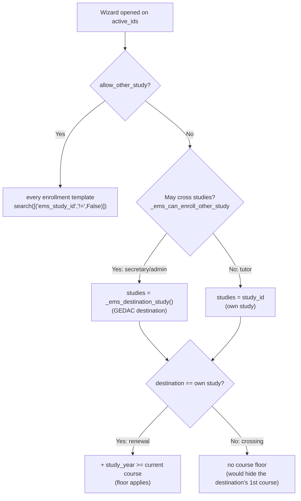
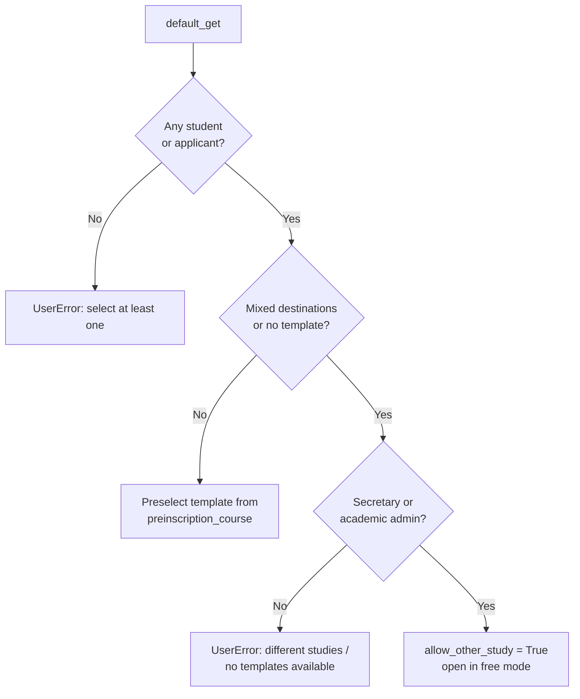

# Technical Reference: `ems.enrollment_proposal_wizard`

## Overview

`ems.enrollment_proposal_wizard` turns a selection of students (or applicants) into draft `sale.order` enrollments for the next course, one per student, all sharing a single `sale.order.template`.

The normal case is a renewal: a tutor turning SMX1A into SMX2A after the June board. The hard case is the **cross-study move** — a current student granted a place in a different study by GEDAC (an ESO 4th-course student moving to SMX 1st course, an AO student moving to GA). Those students are still `contact_type = 'student'`, so their `study_id` is the study they are *leaving*, and no template of that study fits.

Two mechanisms cover it:

- **`preinscription_study_id` on `res.partner`** — the destination GEDAC grants, recorded by the import. When it is set, the wizard resolves templates, course, group and shift against the **destination**, with no manual input.
- **`allow_other_study`** — the manual escape hatch, for a study change that does *not* come from GEDAC (a student asking in October to move from SMX to GA). It drops the template filters so the secretary can pick any template in the catalogue.

**Module files:** `models/contacts/enrollment_proposal_wizard.py`, `models/contacts/contact.py`, `models/contacts/applicant_import_wizard.py`, `views/academic_management/enrollment/enrollment_proposal_wizard.xml`, `views/academic_management/enrollment/list_tutor.xml`

---

## The GEDAC destination

### Storage asymmetry (deliberate)

| Contact | Current study | Destination study | Granted shift / course |
|---------|---------------|-------------------|------------------------|
| Applicant | — (has none) | `study_id` | `preinscription_shift` / `preinscription_course` |
| Active student (internal continuer) | `study_id` | **`preinscription_study_id`** | `preinscription_shift` / `preinscription_course` |

An applicant has no current study, so `study_id` is free and *is* its destination. An active student cannot reuse `study_id` — it already holds the study being left — hence the extra field. Only the study needs one: `preinscription_shift` and `preinscription_course` are empty on an active student and are reused as-is.

Moving the applicant's destination into `preinscription_study_id` too was considered and rejected: it would force a backfill of every existing applicant, rewrite the applicant views (`study_id` drives their list order, group-by and searchpanel), and **break the cross-study guard**, which keys off `s.study_id and s.study_id != dest_study` — a blank `study_id` never registers as a crossing.

### `_ems_destination_study()`

```python
def _ems_destination_study(self):
    return self.mapped(lambda partner: partner.preinscription_study_id or partner.study_id)
```

Defined on `res.partner`, it hides the asymmetry: everything asking "where is this contact going" goes through it instead of reading either field. Works on a recordset, returning the set of destination studies.

---

## Template resolution

`_ems_templates_for(students, allow_other_study)` is the single source of truth, shared by the compute and by `default_get()`. `_ems_studies_for(students)` decides *whose* study is offered.



Two rules worth stating explicitly:

- **The course floor only applies to a renewal.** Keeping `study_year >= min_course` across studies would hide the 1st-course template of the destination from a 4th-course ESO student — the very population this exists for. Free mode drops it for the same reason.
- **A tutor is never offered the destination.** It would be blocked by the server guard on create, so showing it would only advertise an action that is going to fail.

---

## `default_get()` flow

The wizard never raises for a user who can act on the problem. It raises for one who cannot.



- **Mixed studies is judged on destinations**, not current studies: two ESO students heading to SMX and GA are a mixed selection even though they sit in the same study today.
- **Template preselection is no longer applicant-only.** Anyone carrying a granted `preinscription_course` gets the matching template preselected — the applicant at intake *and* the GEDAC continuer. Applicants sharing no single granted course still fall back to the lowest-course template.

---

## Enrollment creation

`action_create_enrollments()` writes one `sale.order` per student:

| Enrollment field | Source | Note |
|------------------|--------|------|
| `ems_study_id` | `dest_study_id` (the **template's** study) | Not the student's current study. Booking a cross-study enrollment against the origin study would give it the wrong enrollment numbering (`_compute_enrollment_number` keys off `ems_study_id.acronym`) and the wrong authorizations (`apply_authorizations()` filters by `ems_study_ids`) |
| `ems_group_id` | `ems_group_id` or `_ems_suggested_group()` | See the two traps below |
| `shift` | `group.shift` → *(crossing)* `preinscription_shift` → `main_group_id.shift` | See trap 2 |

A student who already has a non-cancelled enrollment for the target course is skipped, not duplicated.

### The two cross-study traps

Both come from treating a cross-study move like a renewal. Both are fixed by treating it like a **new entry** instead.

**Trap 1 — the letter cannot be kept.** `_ems_suggested_group()` used to keep the student's current letter and shift in the destination course (ESO4**E** → SMX1**E**). No SMX1E exists, so it returned empty and the enrollment was created **with no group**. Now a crossing takes the applicant path: the lowest-letter group of the destination course matching the **granted** shift.

```python
crossing = partner.study_id and study != partner.study_id
if partner.contact_type == 'applicant' or crossing:
    # lowest-letter group of the granted shift
```

**Trap 2 — the old shift is meaningless.** With no group, the shift fell back to `main_group_id.shift`: an ESO4E-morning student granted an *afternoon* SMX place silently got a morning enrollment. On a crossing, the granted `preinscription_shift` now outranks the current group's, which belongs to the study being left behind.

---

## Consuming the assignment

`_ems_admit_student()` (in `models/enrollment/enrollment.py`) clears the three preinscription fields when the confirmed enrollment **is** the granted study:

```python
if partner.preinscription_study_id and partner.preinscription_study_id == self.ems_study_id:
    partner.write({'preinscription_study_id': False,
                   'preinscription_shift': False, 'preinscription_course': False})
```

Without this the "With GEDAC assignment" filter would accumulate every past year's continuers. Confirming a *different* study (the manual escape hatch) leaves the assignment standing — it is still pending.

---

## Finding them: the filter

`views/.../list_tutor.xml` (Enrollment proposals) carries an opt-in filter and three `optional="hide"` columns:

```xml
<filter name="gedac_assignment" string="With GEDAC assignment"
        domain="[('preinscription_study_id', '!=', False)]"/>
```

No dedicated view, action or menu: the proposals list already lists every student **and** already carries the `action_enrollment_proposal` button, so the secretary sees and enrolls them in the same place. (The Educational Community list has no such button, which is why it was not chosen.) Being opt-in, the filter never alters the default view, and a tutor activating it still only sees its own students (the server action's domain).

---

## Access control

| Group | Open the wizard | Same-study proposal | Cross-study proposal | Offered the GEDAC destination |
|-------|-----------------|---------------------|----------------------|-------------------------------|
| `ems.group_tutor` | Yes (own tutored students) | Yes | **No** — field invisible and ORM-protected; `action_create_enrollments()` raises `UserError` | **No** (falls back to `study_id`) |
| `ems.group_secretary` | Yes | Yes | Yes | Yes |
| `ems.group_academic_admin` | Yes | Yes | Yes | Yes |

`ems.group_secretary_admin` implies `ems.group_secretary`, so it inherits the permission without being named.

### Why `allow_other_study` carries `groups` on the field definition

The `groups` attribute on a **field definition** is enforced by the ORM in `check_field_access_rights()` (via `Field.is_accessible()`): a user outside those groups gets an `AccessError` on read *and* write, including through RPC. The `groups` attribute on a **view node** only hides the widget and can be bypassed. Restricting cross-study enrollment to the secretary therefore requires the field-level declaration; the view attribute is only there so the widget disappears cleanly.

Two consequences:

- `_compute_available_templates()` reads the flag through `sudo()`. Without it, a tutor rendering the dialog would trigger an `AccessError` while computing a field they *are* allowed to see.
- `action_create_enrollments()` still re-checks the crossing itself. The `template_id` dropdown is narrowed by a view domain, and a view domain is not a security rule.

The server-side guard only fires on an actual crossing: a student whose `study_id` is set and differs from `dest_study_id`. Applicants and same-study renewals never trip it.

---

## Related

- `models/contacts/applicant_import_wizard.py` — the GEDAC import. On a row matching an already-active student it keeps the student's own data (identity, group, contact details) but **records the granted destination** on it (`_record_active_student`), which is what makes everything above possible. It also still lists them apart in the "active students" CSV.
- `models/enrollment/enrollment.py` — `_ems_admit_student()`, `_ems_apply_destination_placement()`: what happens to the student once the enrollment is confirmed.

---

[← Back to developer index](../index.md)
