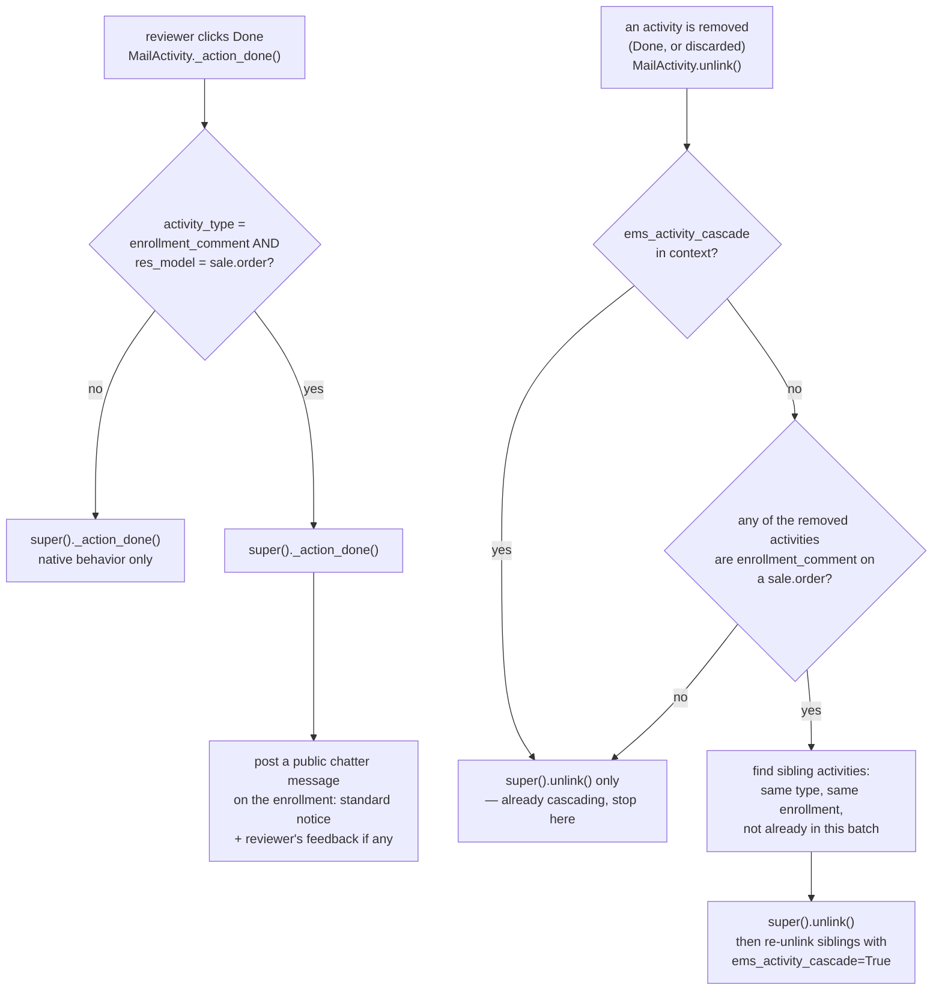

# Technical Reference: Enrollment activities (`res.users`/`mail.activity` extensions)

## Overview

Two small extensions supporting the enrollment-comment review workflow: a
student/family portal comment schedules a to-do for every configured
reviewer (secretary), and this file makes that to-do behave correctly in
the backend systray and chatter.

**Module file:** `models/enrollment/mail_activity.py`

---

## `ResUsers._get_activity_groups`

Relabels the native "Sales Order" activity group in the backend systray
("N activities due") to **"Enrollments"**, since in EMS a `sale.order` is
never a sale in the generic sense — it's always an enrollment. Purely
cosmetic, no logic beyond the string swap.

## `MailActivity._action_done` / `unlink`

Both only act on activities of type `ems.mail_activity_enrollment_comment`
attached to a `sale.order` — scheduled by
[`sale.order._ems_schedule_comment_review_activities`](enrollment.md),
one per configured reviewer (`ems.mail_activity_type.ems_assignee_ids`, see
[`task_assignment.md`](../shared/task_assignment.md) / `test_task_assignment.py`
for how the reviewer list itself is configured — not repeated here).

One reviewer resolving (or discarding) their copy of the to-do closes it
for every other reviewer too — there's only ever one real review outcome
per enrollment, even though a systray to-do is created per reviewer (so
each sees it in their own "My Activities"). The `ems_activity_cascade`
context flag is what stops this from recursing into itself when the
cascade's own `unlink()` call fires.

## Fixed in this pass (2026-07-28)

None — file was already clean (English comments, no `rec` loop vars,
`_()` already used correctly throughout). Pure T + D pass. New
`tests/test_enrollment_mail_activity.py` (7 tests: systray relabeling,
`_action_done`'s chatter message with/without feedback, that it's a no-op
for unrelated activity types, the sibling-cascade on `unlink()`, the
`ems_activity_cascade` recursion guard, and that the cascade never crosses
enrollments) — zero coverage before; `test_task_assignment.py` covers the
reviewer-configuration side of this same feature, not this file's own
`_action_done`/`unlink` logic.
