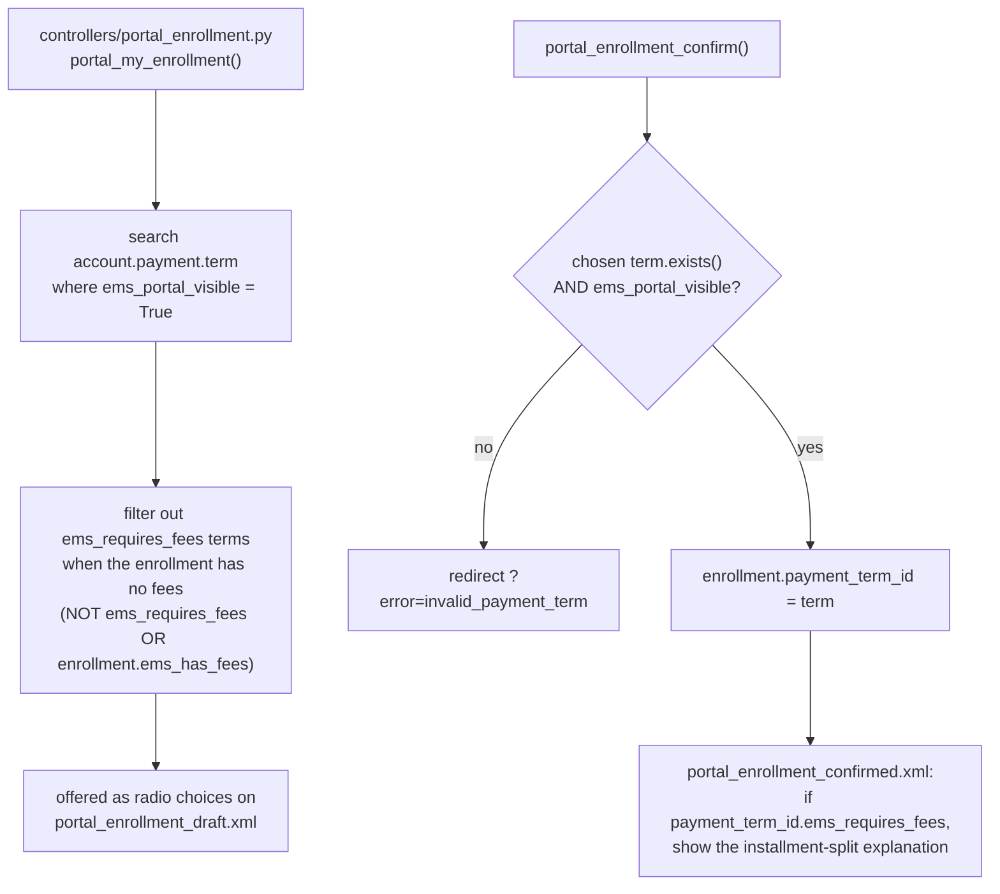

# Technical Reference: Enrollment payment terms (`account.payment.term` extension)

## Overview

No dedicated model — two Boolean flags added to Odoo's native
**`account.payment.term`**, letting an admin/secretary mark which payment
plans (e.g. "Single payment", "Two installments") the enrollment portal
should offer, and which of those only make sense when the enrollment
actually has fee products.

**Module file:** `models/enrollment/payment_term.py` (`AccountPaymentTerm`, `_inherit = 'account.payment.term'`)

---

## Fields

| Field | Type | Notes |
|-------|------|-------|
| `ems_portal_visible` | `Boolean`, default `False` | Only terms with this set are offered as a choice on the portal enrollment-confirm page. |
| `ems_requires_fees` | `Boolean`, default `False` | Further restricts a portal-visible term to enrollments that actually have fee products (`sale.order.ems_has_fees`, see [`enrollment.md`](enrollment.md)) — e.g. a "fees split into two installments" plan is meaningless on an enrollment with no fees to split. |

No compute, constraint, or method override of its own — purely data
flags read by the portal controller.

---

## Where the two flags are read

`views/accounting/payment_term_views.xml` adds both flags (as
`boolean_toggle` widgets, under an "EMS Portal" separator) to the native
payment term form — no standalone EMS view.

## Not covered by this pass

`controllers/portal_enrollment.py`'s use of these two flags (the filtering
and the confirm-time re-validation above) has no automated test coverage —
same "flag, don't test controller code in a models-scoped DTON pass" call
made for `ems.authorization*`'s portal routes (see
[`authorization.md`](authorization.md#not-covered-by-this-pass)).

## Fixed in this pass (2026-07-28)

Class renamed `ems_PaymentTerm` (mixed snake/Pascal case) → `AccountPaymentTerm`,
matching the sibling `_inherit`-only classes already in `models/enrollment/`
(`SaleOrder`, `SaleOrderTemplate`). New `tests/test_payment_term.py` (3
tests: defaults, independent flag setting, persistence) — zero coverage
before. No bugs found; no O work needed (no compute/constraint to guard,
no meaningful `_order` for a native model extension).
