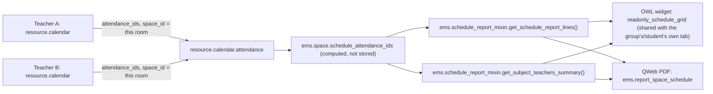

# Technical Reference: Space (Classroom) Occupation Schedule

## Overview

Read [Group schedule (read-only aggregation)](../contacts/group_schedule.md) first — this is
the exact same mechanism (real teaching slots live on a *teacher's* `resource.calendar`; the
Schedule tab is a read-only "photo" of a search over `resource.calendar.attendance`, with a PDF
export) applied to a **room's own occupation** instead of a group's or a student's own subjects.
Everything from `ems.schedule_report_mixin` onward (report-line building, the OWL widget, the
PDF template's structure) is shared verbatim; this doc only covers what's actually different.
Always read-only — a room's schedule has no edit mode at all, unlike `ems.group`'s own tab
(issue #446).



## Why the search is simpler than the group's/student's

A room's occupation is the plain, direct search a group's/student's own aggregation would love
to have but can't: every candidate `resource.calendar.attendance` row already carries its own
`space_id` (`ems_working_schedule_assignation`, `models/employees/working_schedule.py`), so there
is no group/enrollment indirection to go through - `space_id = self.id`, full stop.

**No break derivation, on purpose.** A group's/student's own break block is derived from a
*level's* schedule framework (`ems.schedule_report_mixin._get_level_break_entries`), since a
group/student has exactly one `level_id`. A room has no single level - different groups/levels
can share the same classroom at different hours - so there is no level to derive a break from,
and in practice a break `resource.calendar.attendance` row almost never carries a real `space_id`
of its own anyway (breaks aren't tied to a group, so `create()`'s auto-derivation from
`group_ids[0].space_id` never fires for them). This is a deliberate design decision, not a gap:
the plain `space_id = self.id` search already picks up any break row that *does* happen to carry
this room's real `space_id`, with no special-case code needed.

**No `shift` field, and no shift-window filtering either.** `ems.group`'s/`res.partner`
(student)'s own `shift` lets `ems.schedule_report_mixin.get_schedule_report_lines()` narrow the
report down to a realistic half-day window (`SHIFT_HOURS`) and lets the OWL widget size its axis
accordingly. A room legitimately hosts classes in *both* shifts, so `ems.space` overrides
`_schedule_report_shift()` to return `False` instead of defining a `shift` field of its own -
`get_schedule_report_lines()` then skips the hour-window filtering step entirely (a falsy shift
means `SHIFT_HOURS.get(shift)` is `None`), and the OWL widget's own `bounds` getter (reading
`record.data.shift`, `undefined` here since the view never declares that field) falls back to
`computeBounds()`, auto-fitting the axis to whatever hours the room's own entries actually span -
exactly the same fallback path already used for a reinforcement group or a student with no main
group, just always taken here rather than only as an edge case.

## Model changes

**`ems.space`** (new file `models/facilities/space_schedule.py`, a further
`_inherit = ['ems.space', 'ems.schedule_report_mixin']` alongside `space.py`'s own plain
`models.Model` - same "2-item `_inherit` needs an explicit `_name`" gotcha as `ems.group`'s own
`group_schedule.py`):
- `schedule_attendance_ids` (Many2many `resource.calendar.attendance`, computed, not stored) -
  a plain `search([('space_id', '=', space.id)])`, forcing `active_test=True` explicitly for the
  same reason as `ems.group`'s/`res.partner` (student)'s own version (a caller context that
  already turned active filtering off for an unrelated reason must not resurrect a stale/archived
  calendar's own leftover rows here).
- `_schedule_report_shift()` - overridden to always return `False` (see above).

**Genuinely empty `@api.depends()` - worse off than the group's/student's own version, not just
the same limitation.** A cross-model search can never be a real Odoo dependency (same structural
limitation `ems.group`'s/`res.partner` (student)'s own `schedule_attendance_ids` already accepts)
- but those two at least get a *partial* same-transaction staleness guard from a field that is
itself an input to their own search (`level_id`/`shift`, or `enrollment_ids`). A room's search has
no input but its own `id`, which never changes after `create()`, so there is no field on
`ems.space` worth naming here at all. A value cached earlier in the same transaction (e.g. a test
reading this field before creating the calendar blocks that should show up in it) is never
invalidated by anything short of a fresh env/cache - a real web-client request always gets one, so
this only matters for test fixture ordering (create every `resource.calendar.attendance` fixture
before the first read of this field, or call `invalidate_recordset()` in between - see
`feedback_compute_field_no_depends_stale_cache_in_tests` in project memory).

## View

`views/community/space/form.xml`, a new `<notebook><page string="Schedule" name="schedule">`
(the space form had no notebook at all before this) with `schedule_attendance_ids` and
`widget="readonly_schedule_grid"` - the exact same widget name, same sub-`<list>` shape
(`dayofweek`, `hour_from`, `hour_to`, `day_period`, `subject_id`, `topic`, `non_teaching`,
`non_teaching_is_break`, `employee_id`, `space_id`) as the group's/student's own Schedule tab. No
`can_edit_schedule`/`shift` helper field is declared - this tab is permanently read-only and has
no shift-based axis to smuggle in (see above).

## OWL widget

Reuses `ReadonlyScheduleGridField` (`static/src/js/backend/schedule_grid_readonly_field.js`)
entirely unmodified except for registering this model in `PDF_ACTION_BY_MODEL`:
```js
const PDF_ACTION_BY_MODEL = {
    "ems.group": "ems.action_report_group_schedule",
    "res.partner": "ems.action_report_student_schedule",
    "ems.space": "ems.action_report_space_schedule",
};
```
`canEditSchedule` reads `record.data.can_edit_schedule`, which `ems.space` never defines - so it
is always `false` here and the "Edit" toolbar button never appears, same as the student's own tab.

## PDF report (`ems.report_space_schedule`)

`reports/facilities/report_space_schedule.xml` - a `qweb-pdf` `ir.actions.report` on `ems.space`
(`binding_model_id` = `model_ems_space`, an `ems`-owned model, so the ref resolves the same way
`ems.group`'s own report's does - unlike the student's, whose `res.partner` is a core model), bound
(`binding_type="report"`) so it also appears in the space form's native Print menu. A near-verbatim
copy of `report_group_schedule.xml`'s structure, with the header showing the space's name and (when
set) its work location instead of a tutor/main group.

## Access control

| Action | `ems.group_teacher`/`ems.group_secretary` | `ems.group_academic_admin` |
|--------|:------------------------------:|:------------------------------:|
| Read a classroom's aggregated schedule (`schedule_attendance_ids`, `get_schedule_report_lines()`, `get_subject_teachers_summary()`) | Yes | Yes |
| Export a classroom's schedule to PDF | Yes | Yes |
| Edit a classroom's schedule | No (not possible from this tab at all - edit from the relevant teacher's own Schedule tab) | No (same) |

No new ACL rows needed: `ems.space` is already readable by teacher/secretary/admin
(`ems.access_ems_space_teacher`/`_secretary`/`_admin`, `security/ir.model.access.csv`), and
`resource.calendar`/`resource.calendar.attendance` are already readable by every internal user
(base Odoo ACL) - same "no new ACL row" conclusion both the group's and the student's own docs
reach. No public link, portal page, or "Edit" mode exist for a room's schedule - out of scope for
this feature (unlike the group's own public-link mechanism, issue #453).
