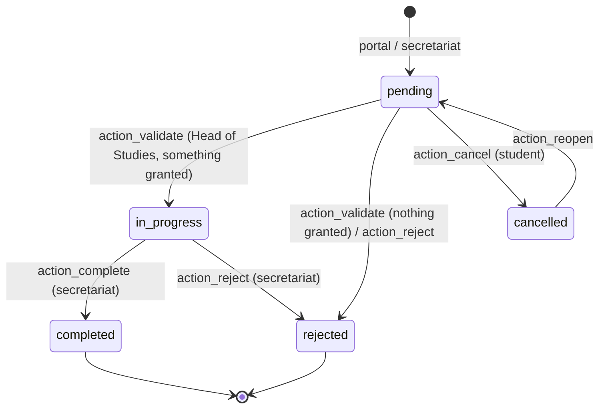
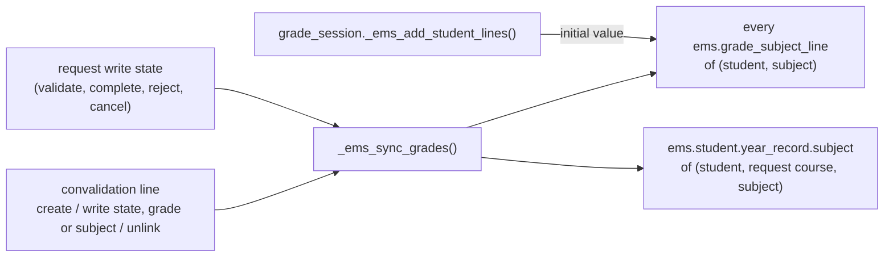

# Technical Reference: `ems.convalidation`

## Overview

A **convalidation request** is a student asking for some subjects (vocational training modules) of their study to be recognised because they already passed them elsewhere. An adult student, or the family of a minor one, files the request from the portal during the yearly **request period** set in the EMS settings (or the secretariat registers one received on paper, at any time).

Resolving it is a **linear, two-step circuit**, mirroring what the centre actually does: the **Head of Studies** decides subject by subject and writes the grade the previous studies hold, then the **secretariat** registers the resolution in Esfera (the Departament d'Educació's own system, outside EMS) and completes the request. Only a completed request reaches the student's grades — until then the resolution is not official.

Only studies whose **level** has `allows_convalidation` set can receive requests. `data/cat/ems.level.csv` sets it for `CFGM` and `CFGS`, the cycles the centre's secretariat publishes convalidation forms for.

**Module files:** `models/grades/convalidation.py`, `models/grades/convalidation_info_wizard.py`, `models/curriculum/level.py` (`allows_convalidation`), `models/curriculum/study.py` (`_ems_convalidable_subjects`), `models/grades/grade_subject_line.py`, `models/grades/grade_session.py`, `models/grades/year_record.py`, `models/grades/grade_review_wizard.py`, `models/grades/em_grading_wizard.py`, `models/contacts/contact.py` (stat button), `models/settings/company.py` (request period), `models/settings/settings.py`, `views/settings/form.xml`, `models/contacts/portal.py` (`_ems_portal_can_act_for`), `controllers/portal_convalidation.py`, `views/academic_management/convalidations/{views,menu}.xml`, `views/portal/portal_convalidations.xml`, `mails/grades/convalidation_resolved.xml`, `mails/grades/convalidation_info_request.xml`, `data/main/mail.activity.type.csv`, `static/src/js/backend/grade_matrix_field.js`, `static/src/js/backend/grade_tutor_matrix.js`, `tests/test_convalidation.py`, `tests/test_convalidation_period.py`, `tests/test_portal_convalidation.py`, `tests/test_convalidation_tour.py`, `static/tests/tours/convalidation_tour.js`

**See also:** [`grade_session.md`](grade_session.md), [`year_record.md`](year_record.md), [`em_grading_wizard.md`](em_grading_wizard.md).

## Hierarchy and relations

```mermaid
erDiagram
    RES_PARTNER ||--o{ EMS_CONVALIDATION : "student_id (restrict)"
    RES_PARTNER |o--o{ EMS_CONVALIDATION : "requester_id (set null)"
    EMS_COURSE ||--o{ EMS_CONVALIDATION : "course_id (restrict)"
    EMS_STUDY ||--o{ EMS_CONVALIDATION : "study_id (restrict)"
    EMS_LEVEL ||--o{ EMS_STUDY : "allows_convalidation"
    EMS_CONVALIDATION ||--|{ EMS_CONVALIDATION_LINE : "line_ids (cascade)"
    EMS_SUBJECT ||--o{ EMS_CONVALIDATION_LINE : "subject_id (restrict)"
    EMS_CONVALIDATION }o--o{ IR_ATTACHMENT : "attachment_ids"
    EMS_CONVALIDATION ||--o{ EMS_CONVALIDATION_INFO_WIZARD : "convalidation_id (cascade)"
    EMS_CONVALIDATION_LINE ..> EMS_GRADE_SUBJECT_LINE : "is_convalidated + grade (sync)"
    EMS_CONVALIDATION_LINE ..> EMS_STUDENT_YEAR_RECORD_SUBJECT : "is_convalidated + grade (sync)"
```

### `ems.convalidation` (request)

| Field | Type | Notes |
|-------|------|-------|
| `name` | Char | Registration number, `CONV-<start>-<end, two digits>-<4-digit counter>` (e.g. `CONV-2026-27-0001`), assigned on creation by `_ems_next_registration_number(course)`. The counter starts again every course: one `ir.sequence` per course (code `ems.convalidation.course.<id>`, the prefix baked in), created the first time that course gets a request, so nothing has to be prepared before a year opens. Leads `display_name`. |
| `student_id` | M2o `res.partner` | Required. Student or applicant (an applicant enrolling into a cycle is the typical requester). |
| `requester_id` | M2o `res.partner` | The portal user who submitted it: the student or a family contact. |
| `course_id` | M2o `ems.course` | Required. Defaults to the enrollment course (`is_enrollment_default`), else the current one: requests are made while enrolling. |
| `study_id` | M2o `ems.study` | Required. Its level must allow convalidations (`_check_study_allows_convalidation`). Cannot change once the request is validated. |
| `basis` | Selection | `prior_studies`, `certificate`, `other`. |
| `student_notes`, `resolution_notes` | Text | Applicant's comments, and comments sent to the student with the resolution. |
| `attachment_ids` | M2m `ir.attachment` | Supporting documents, optional. Linked to the request (`res_model`/`res_id`) on create/write, so they follow its access rights. The portal's own answers add to this same field. |
| `line_ids` | O2m | At least one (`_check_has_lines`, also triggered by `study_id` since a request created without lines carries no `line_ids` in `vals`). |
| `state` | Selection, stored | `pending`, `in_progress`, `completed`, `rejected`, `cancelled`. Written by the actions only (`readonly`), never computed: the circuit is driven by people, not by the lines' own states. |
| `validation_date`, `validated_by_id` | Date, M2o | Stamped by `action_validate`. |
| `resolution_date`, `resolved_by_id` | Date, M2o | Stamped when the request is completed or rejected. |
| `granted_count`, `pending_count` | Integer compute | List columns. `pending_count` is what `action_validate` requires to be zero. |
| `has_centre_title` | Boolean compute | True when the student's academic history holds a `title_obtained` record: a hint that their previous grades can be looked up here. Its absence proves nothing (only recent years are in EMS), so nothing is shown in that case. |

### `ems.convalidation.line` (subject)

| Field | Type | Notes |
|-------|------|-------|
| `convalidation_id` | M2o | Cascade. |
| `student_id`, `course_id` | related, stored | Used by the grades sync and searches. |
| `request_state` | related | The request's state, so the embedded list can gate its own cells and buttons. |
| `subject_id` | M2o `ems.subject` | Must be one of `study_id._ems_convalidable_subjects()` (the study's subjects minus the tutorship). Unique per request. |
| `state` | Selection | `pending`, `granted`, `rejected`. |
| `grade` | Integer | The grade a granted subject is recorded with. Defaults to `CONVALIDATED_GRADE` (5) and is constrained to 5..10: a convalidated subject is passed by definition. |
| `resolution_notes` | Char | Where the resolution comes from (e.g. "Granted by the Department, file no. 1234"), shown to the student. |

## Workflow



- **`action_validate`** (Head of Studies): requires every line decided (`pending_count == 0`). With at least one granted line the request moves to `in_progress`, stamps the validation and schedules the secretariat's task. With none, there is nothing to register in Esfera, so it is rejected straight away.
- **`action_complete`** (secretariat): the only door to `completed`, and therefore to the student's grades. It also withdraws the student from every granted subject (`_ems_withdraw_convalidated_subjects`, see below).
- **`action_reject`**: the Head of Studies while `pending`, the secretariat while `in_progress`. Every line still standing is rejected too, so the student never reads "convalidated" on a rejected request.
- **`action_request_info`** opens `ems.convalidation.info_wizard`, which emails the applicant and posts the text on the portal without moving the request.
- **`action_cancel` / `action_reopen`**: the student's own, from the portal, while the request is `pending`.

**Who may do what.** `_ems_is_head_of_studies()` / `_ems_is_secretary()` (with `group_academic_admin` counting as both) gate the request's actions; on the lines, `_ems_check_can_decide()` guards `state`/`subject_id` (Head of Studies, only while the request is `pending`) and `_ems_check_can_grade()` guards `grade` (Head of Studies while `pending`, secretariat while `in_progress`). `sudo` bypasses both: the request's own actions write their lines that way, after checking who is acting on the request as a whole.

**Tasks.** Each step puts the request in the to-do list of whoever owns the next one: `ems.mail_activity_convalidation_review` on creation, for the **Deputy Head of Studies** (the holder of `ems.role_dhos`, who handles vocational training), and `ems.mail_activity_convalidation_registration` on validation, for **every member of the secretariat** (`ems.group_secretary` minus `ems.group_academic_admin`). `_ems_task_recipients()` resolves both from the organisation, so there is nothing to configure: both types carry `ems_task_assignment = False` and stay out of Academic Management → Configuration → Task Assignment on purpose, the same choice [`task_assignment.md`](../shared/task_assignment.md) makes for attendance corrections, whose recipient also comes from the org chart. The administrator is subtracted because it implies every group — exactly why that screen stopped deriving recipients from groups. Each step closes the previous task (`_ems_close_tasks`), assignees are unsubscribed from the thread so the task is their only notice, and when nobody holds the position a warning is logged and no task is created.

**Resolution notice.** Completing or rejecting a request stamps it and calls `_ems_send_resolution()`, which queues `ems.email_template_convalidation_resolved` (`force_send=False`) to `student_id._ems_notification_recipients()` filtered by email — the student when adult, the family when a minor — and logs the recipients, or the lack of any, as a chatter note. Validation sends no email: the student sees the new state on the portal.

**Communications page.** The portal's Communications page (`controllers/portal_comms.py`) lists the comments posted on the student's requests, never their internal notes. `_ems_post_communication()` posts one comment each time the request is created, validated, cancelled, reopened, answered from the portal, or resolved. Requests are created with `mail_create_nosubscribe`, and every post (`_ems_poster()`: comments and internal notes alike) carries it too — `message_post()` otherwise subscribes whoever posts a comment, which made the Head of Studies and the secretary who acted on a request followers, emailed every later message. So a request has no followers, these comments email nobody, and the only emails are the resolution and the request for information, both to the student (or family) through the mail queue.

## Withdrawal from the subject

Completing a request means the student no longer takes the subjects it convalidated. `_ems_withdraw_convalidated_subjects()` deletes their `ems.enrollment` for each granted subject, with `ems_bypass_grade_guard` — grades already written included, the convalidation replaces them. That runs the enrollment's own cascade: the student leaves the subject's attendance schedules and loses their lines in its **open** grade sessions. Rounds already at the board or finalised keep their line, which the sync below turns into the convalidation's grade.

- **Who is told:** before deleting, the enrollment's groups give the subject's teachers (active `ems.teaching` for group + subject) and the groups' tutors. Each gets an `ems.mail_activity_convalidation_notice` activity **on the student** (`res.partner`), not on the request: teachers cannot read convalidations, but they can open the student. The summary names the subject; the note, the grade and the registration number. Assignees that were not already following the student are unsubscribed again, so the activity is their only notice.
- **Placements afterwards:** `sale.order._ems_apply_destination_placement()` skips any subject `_ems_is_convalidated()` for the student, so a request completed before the student is placed (the usual case during summer enrollment) never gets the subject enrolled back.
- **Validation alone withdraws nothing:** the resolution is not official until the secretariat registers it.

## Grades integration

`ems.grade_subject_line` and `ems.student.year_record.subject` carry `is_convalidated` + `convalidation_grade` as **mirrors** kept in sync by `ems.convalidation.line._ems_sync_grades()`. The source of truth is `_ems_convalidation_line(student, subject)`: a granted line **of a completed request** (`_ems_convalidation_grade` returns its grade, or `None`). The history subject also stores the request's registration number as `convalidation_number` — frozen text, like the rest of the history, since most of its readers (teachers) cannot open a request.



- **Live grade line:** a convalidated line has `internal_is_complete = True`, `computed_score = final_score = convalidation_grade` (falling back to `CONVALIDATED_GRADE`), `computed_is_scored = True` and therefore `has_final = True`, whatever its outcomes hold. The mirror is written with the `ems_convalidation_sync` context, which `grade_subject_line.write()` lets through (only for those two fields) regardless of the session state: a resolution can arrive after the rounds are closed. New lines (`_ems_add_student_lines`) start with the current value.
- **Year record:** `_subject_vals()` copies both fields (plus the registration number) and forces `state = 'passed'`. Since completing deletes the open grade line, `_generate_one()` also adds, through `_convalidated_subject_vals(student, course, study, taken)`, every subject convalidated for that course that no grade line accounts for: passed, with the convalidation's grade and number, the teaching plan's weights and no learning outcomes of its own (`ems.student.year_record.subject._convalidated_vals`). A record already frozen is updated by `_ems_set_convalidated(convalidated, grade, convalidation)`, but only for the request's own course, and gains the subject if it never had it. When the course has **no record yet** (the usual case: a request completed mid-course), `_ems_sync_grades` opens a provisional one (`is_provisional`, *Current course*) with just the convalidated subjects, so teachers see the grade in the history from the day it is completed; closing the course rewrites it with everything else — see [`year_record.md`](year_record.md). Granting sets `passed` / that grade. Revoking rebuilds `state`, `final_grade` and `has_final` from the record's own RAs and grades, using `_final_from_parts()`.
- **Grade review (issue #493):** a convalidated subject is out of its reach. `_apply_correct()` refuses it with a `UserError` and `_recompute_from_outcomes()` skips it: its grade is a resolution, not an evaluation of learning outcomes the student never took here. Correcting it means resolving the convalidation again.
- **Consumers:** the transition wizard's incomplete-evaluation check passes (via `has_final` / `internal_is_complete`). The EM grading wizard skips convalidated lines (`_live_subject_lines`), and `final_pending` is never set for them. Both grade widgets show the grade followed by **CV** in the Final column.
- **Not done:** a textual `CV` in an Esfera import is not turned into the flag. The request is the only source, so a later sync can never silently undo an imported value.

## Portal

`controllers/portal_convalidation.py` (`/my/convalidaciones`) always acts on `get_portal_student()`: the student, or the child a family has selected. It uses `sudo()` because portal users have no ACL on these models.

**Who acts.** `res.partner._ems_portal_can_act_for(student)` (`models/contacts/portal.py`): the student themselves once they are of age (`is_adult`), or their family while they are a minor; a student with no birth date counts as a minor. Whoever may only consult (a minor on their own account, a family looking at its adult child, see "Who sees and who acts on the portal" in `docs/en/developers/contacts/portal_access_wizard.md`) is sent back to `/my/home` by `@ems_portal_manage_required` on every route. `_ems_convalidation_student()` still checks `_ems_portal_can_act_for()` and returns an empty recordset otherwise, as a last line of defence.

| Route | Behaviour |
|-------|-----------|
| `GET /my/convalidaciones` | Requests of the student, plus the new-request form when `_ems_portal_study()` finds a study **and the request period is open**. The form is a Bootstrap collapse, folded by default; it opens with `?new=1` or when the page comes back with a validation `?error=`. It says when the period closes. While closed, a notice with the next opening replaces the form. |
| `POST /my/convalidaciones/submit` | Refused with `?error=closed` outside the request period. Then checks that at least one subject in `_ems_portal_requestable_subjects()` and a valid `basis` are sent, and creates the request and its attachments. Documents are optional: the form says per case which ones are needed, and the Head of Studies can ask for more. |
| `POST /my/convalidaciones/reply/<id>` | The applicant's answer: files and/or text, while the request is `pending` or `in_progress`, whatever the date. The files join `attachment_ids` and the text is posted as a comment (`_ems_portal_add_documents`). |
| `POST /my/convalidaciones/cancel/<id>` | Only the student's own request, only while `pending`, whatever the date. |

### Request period

A yearly window, with no year, stored on `res.company` and edited in Settings → EMS Management → Convalidations Settings (the settings form, so only `base.group_system`):

| Field | Default | Notes |
|-------|---------|-------|
| `convalidation_start_day`, `convalidation_start_month`, `convalidation_start_time` | 1, October, 08:00 | Opening. `month` is a Selection `'1'`..`'12'`; `time` a float hour (`float_time`). |
| `convalidation_end_day`, `convalidation_end_month`, `convalidation_end_time` | 31, March, 23:59 | Closing. The closing minute is still inside the period. |

- **Local time:** compared in the company partner's time zone (`_ems_convalidation_datetime_utils()`), whoever is asking.
- **Across the new year:** `_ems_convalidation_period_keys()` turns both ends into `(month, day, minute)` tuples. When the opening comes before the closing in the calendar the period is that stretch; otherwise it runs from the opening to the end of the year and from 1 January to the closing, as the default does.
- **`_ems_convalidation_period_open(now=None)`** decides; **`_ems_convalidation_period_next_change(now=None)`** returns the next opening (while closed) or the coming closing (while open) as naive UTC, which the portal renders in the reader's time zone. Both take `now` as naive UTC, so tests can fix it.
- **`_check_convalidation_period`:** each day must exist in its month in a non-leap year (no 29 February, so the period is the same every year), times must be within 00:00-23:59, and the two ends must differ.
- **Staff are not limited:** nothing in `ems.convalidation` itself checks the period. The secretariat can register, and every role can process, requests at any time.

- `_ems_portal_study(student)`: the study of the student's non-cancelled `sale.order` for the enrollment course, else `main_group_id.study_id`. The result is kept only if its level allows convalidations.
- `_ems_portal_requestable_subjects(student, study)`: the convalidable subjects minus those already in a non-cancelled, non-rejected line. A rejected subject can be asked for again with new documents.
- The grade of a granted subject is only rendered once the request is `completed` — the template hides the whole column otherwise, which is what "the secretariat makes it official" means for the student.

## Access control

| Role | Request | Lines | Validate | Complete |
|------|---------|-------|----------|----------|
| Academic admin | CRUD | CRUD | Yes | Yes |
| Head of Studies / Director | CRU | CRUD | Yes | No |
| Secretary | CRU | CRUD (grade while `in_progress`) | No | Yes |
| Teacher / tutor | none | none | No | No |
| Portal (adult student / family of a minor) | through the controller only; new requests only during the request period | through the controller only | No | No |
| Settings administrator | Configures the request period | - | - | - |

- **Student form:** the **Convalidations** stat button is limited to the three groups above. Its count is computed with `sudo`, so the form still opens for roles without access.
- **Menu:** Academic management → Convalidations (`menu_ems_convalidations`).
