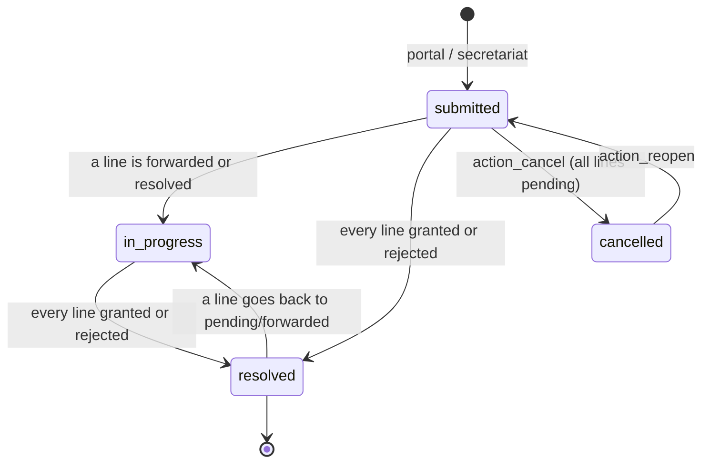
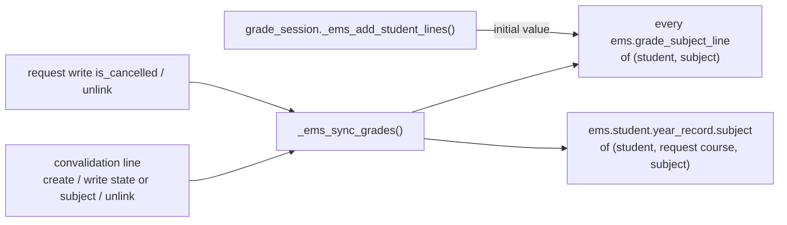

# Technical Reference: `ems.convalidation`

## Overview

A **convalidation request** is a student asking for some subjects (vocational training modules) of their study to be recognised because they already passed them elsewhere. The student, or the family of a minor, files the request from the portal (or the secretariat registers one received on paper). The **Head of Studies** resolves it subject by subject. A granted subject is marked as convalidated in the grades subsystem and in the academic history.

Only studies whose **level** has `allows_convalidation` set can receive requests. `data/cat/ems.level.csv` sets it for `CFGM` and `CFGS`, the cycles the centre's secretariat publishes convalidation forms for.

**Module files:** `models/grades/convalidation.py`, `models/curriculum/level.py` (`allows_convalidation`), `models/curriculum/study.py` (`_ems_convalidable_subjects`), `models/grades/grade_subject_line.py`, `models/grades/grade_session.py`, `models/grades/year_record.py`, `models/grades/em_grading_wizard.py`, `models/contacts/contact.py` (stat button), `controllers/portal_convalidation.py`, `views/academic_management/convalidations/{views,menu}.xml`, `views/portal/portal_convalidations.xml`, `mails/grades/convalidation_resolved.xml`, `static/src/js/backend/grade_matrix_field.js`, `static/src/js/backend/grade_tutor_matrix.js`, `tests/test_convalidation.py`, `tests/test_portal_convalidation.py`, `tests/test_convalidation_tour.py`, `static/tests/tours/convalidation_tour.js`

**See also:** [`grade_session.md`](grade_session.md), [`year_record.md`](year_record.md), [`em_grading_wizard.md`](em_grading_wizard.md).

## Hierarchy and relations

```mermaid
erDiagram
    RES_PARTNER ||--o{ EMS_CONVALIDATION : "student_id (restrict)"
    RES_PARTNER |o--o{ EMS_CONVALIDATION : "requester_id (set null)"
    EMS_COURSE ||--o{ EMS_CONVALIDATION : "course_id (restrict)"
    EMS_STUDY ||--o{ EMS_CONVALIDATION : "study_id (restrict)"
    EMS_LEVEL ||--o{ EMS_STUDY : "allows_convalidation"
    EMS_CONVALIDATION ||--|{ EMS_CONVALIDATION_LINE : "line_ids (cascade)"
    EMS_SUBJECT ||--o{ EMS_CONVALIDATION_LINE : "subject_id (restrict)"
    EMS_CONVALIDATION }o--o{ IR_ATTACHMENT : "attachment_ids"
    EMS_CONVALIDATION_LINE ..> EMS_GRADE_SUBJECT_LINE : "is_convalidated (sync)"
    EMS_CONVALIDATION_LINE ..> EMS_STUDENT_YEAR_RECORD_SUBJECT : "is_convalidated (sync)"
```

### `ems.convalidation` (request)

| Field | Type | Notes |
|-------|------|-------|
| `student_id` | M2o `res.partner` | Required. Student or applicant (an applicant enrolling into a cycle is the typical requester). |
| `requester_id` | M2o `res.partner` | The portal user who submitted it: the student or a family contact. |
| `course_id` | M2o `ems.course` | Required. Defaults to the enrollment course (`is_enrollment_default`), else the current one: requests are made while enrolling. |
| `study_id` | M2o `ems.study` | Required. Its level must allow convalidations (`_check_study_allows_convalidation`). Cannot change once a line is resolved. |
| `basis` | Selection | `prior_studies`, `certificate`, `other`. |
| `student_notes`, `resolution_notes` | Text | Applicant's comments, and comments sent to the student with the resolution. |
| `attachment_ids` | M2m `ir.attachment` | Supporting documents. Linked to the request (`res_model`/`res_id`) on create/write, so they follow its access rights. |
| `line_ids` | O2m | At least one (`_check_has_lines`, also triggered by `study_id` since a request created without lines carries no `line_ids` in `vals`). |
| `is_cancelled` | Boolean | Set by `action_cancel` (only while every line is pending) and cleared by `action_reopen`. |
| `state` | Selection, stored compute | See the state machine below. |
| `resolution_date`, `resolved_by_id` | Date, M2o | Stamped when the request becomes resolved; cleared if it is reopened. |
| `granted_count`, `pending_count` | Integer compute | List columns. `pending_count` counts pending and forwarded lines. |

### `ems.convalidation.line` (subject)

| Field | Type | Notes |
|-------|------|-------|
| `convalidation_id` | M2o | Cascade. |
| `student_id`, `course_id` | related, stored | Used by the grades sync and searches. |
| `subject_id` | M2o `ems.subject` | Must be one of `study_id._ems_convalidable_subjects()` (the study's subjects minus the tutorship). Unique per request. |
| `state` | Selection | `pending`, `forwarded` (to the Departament d'Educació), `granted`, `rejected`. |
| `resolution_notes` | Char | Per-subject remark, shown on the portal and in the email. |

## Workflow



The request state is computed from its lines:

- **cancelled** if `is_cancelled`
- **resolved** if every line is `granted` or `rejected`
- **in_progress** if any line is not `pending`
- **submitted** otherwise

A forwarded line keeps the request open: the Department's answer is recorded later by setting the line to granted or rejected.

**Resolution notice.** `_ems_on_resolved()` runs after every change that can resolve a request, whether on the request or on one of its lines. It is idempotent, and the stamp (`resolution_date`) is what marks a request as already notified. When a request becomes resolved, it:

1. stamps `resolution_date` and `resolved_by_id`;
2. queues `ems.email_template_convalidation_resolved` (`force_send=False`) to `student_id._ems_notification_recipients()` filtered by email: the student when adult, the family when a minor, the same rule as every other EMS notice;
3. logs the recipients, or the lack of any, as a chatter note.

Reopening clears the stamp, so resolving again notifies the new outcome.

**Communications page.** The portal's Communications page (`controllers/portal_comms.py`) lists the comments posted on the student's requests, never their internal notes. `_ems_post_communication()` posts one comment each time the request is created (with the subjects asked for), cancelled, reopened or resolved. The resolution comment is the email's own rendered subject and body, in the language of the first recipient. Requests are created with `mail_create_nosubscribe`, so they have no followers and these comments email nobody; the only email stays the resolution one. The chatter note naming the recipients (or the lack of any) remains internal.

## Grades integration

`ems.grade_subject_line.is_convalidated` and `ems.student.year_record.subject.is_convalidated` are **mirrors** kept in sync by `ems.convalidation.line._ems_sync_grades()`. The source of truth is `_ems_is_convalidated(student, subject)`: some granted line, in a request that is not cancelled, for that student and subject, in any course.



- **Live grade line:** a convalidated line has `internal_is_complete = True`, `computed_score = final_score = CONVALIDATED_GRADE` (5), `computed_is_scored = True` and therefore `has_final = True`, whatever its outcomes hold. The flag is written with the `ems_convalidation_sync` context, which `grade_subject_line.write()` lets through (only for `is_convalidated`) regardless of the session state: the Department can answer after the rounds are closed. New lines (`_ems_add_student_lines`) start with the current value.
- **Year record:** `_subject_vals()` copies the flag and forces `state = 'passed'`. A record already frozen is updated by `_ems_set_convalidated()`, but only for the request's own course. Granting sets `passed` / final 5. Revoking rebuilds `state`, `final_grade` and `has_final` from the record's own RAs and grades, using `_final_from_parts()`.
- **Consumers:** the transition wizard's incomplete-evaluation check passes (via `has_final` / `internal_is_complete`). The EM grading wizard skips convalidated lines (`_live_subject_lines`), and `final_pending` is never set for them. Both grade widgets show **CV** in the Final column.
- **Not done:** a textual `CV` in an Esfera import is not turned into the flag. The request is the only source, so a later sync can never silently undo an imported value.

## Portal

`controllers/portal_convalidation.py` (`/my/convalidaciones`) always acts on `get_portal_student()`: the student, or the child a family has selected. It uses `sudo()` because portal users have no ACL on these models.

| Route | Behaviour |
|-------|-----------|
| `GET /my/convalidaciones` | Requests of the student, plus the new-request form when `_ems_portal_study()` finds a study. The form is a Bootstrap collapse, folded by default; it opens with `?new=1` or when the page comes back with a validation `?error=`. |
| `POST /my/convalidaciones/submit` | Checks that at least one subject in `_ems_portal_requestable_subjects()`, a valid `basis` and at least one file are sent, then creates the request, attachments and a chatter note. Anything else redirects with `?error=`. |
| `POST /my/convalidaciones/cancel/<id>` | Only the student's own request, only while `submitted`. |

- `_ems_portal_study(student)`: the study of the student's non-cancelled `sale.order` for the enrollment course, else `main_group_id.study_id`. The result is kept only if its level allows convalidations.
- `_ems_portal_requestable_subjects(student, study)`: the convalidable subjects minus those already in a non-cancelled, non-rejected line. A rejected subject can be asked for again with new documents.

## Access control

| Role | Request | Lines | Resolve (change a line's state) |
|------|---------|-------|---------------------------------|
| Academic admin | CRUD | CRUD | Yes |
| Head of Studies / Director | CRU | CRUD | Yes |
| Secretary | CRU | CRUD (pending lines) | No (`UserError`) |
| Teacher / tutor | none | none | No |
| Portal (student / family) | through the controller only | through the controller only | No |

- **Resolving:** `_ems_check_can_resolve()` guards changes to `state` and `subject_id`, the creation of a non-pending line and the deletion of a non-pending one. `sudo` bypasses it (`env.su`).
- **Student form:** the **Convalidations** stat button is limited to the three groups above. Its count is computed with `sudo`, so the form still opens for roles without access.
- **Menu:** Academic management → Convalidations (`menu_ems_convalidations`).
