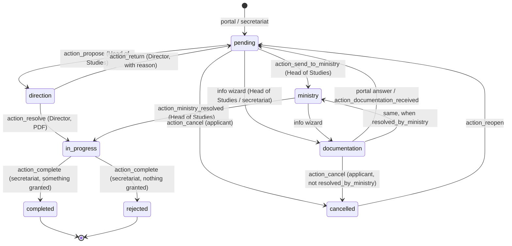
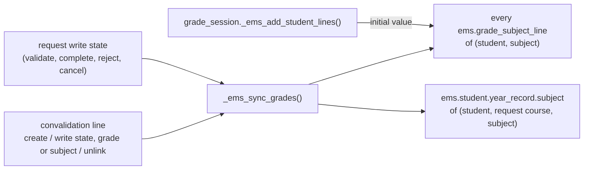

# Technical Reference: `ems.convalidation`

## Overview

A **convalidation request** is a student asking for some subjects (vocational training modules) of their study to be recognised because they already passed them elsewhere. It is filed from the portal during the yearly **request period** set in the EMS settings (or the secretariat registers one received on paper, at any time): an adult student files it himself, and so does his family when he authorized sharing with it; a minor's family files it for him (see [Portal](#portal)).

Resolving it follows the centre's official circuit. The **Deputy Head of Studies** reviews every request and keeps it until it is resolved, deciding subject by subject (the grade the previous studies hold, or the reason for refusing). Each request is then resolved one of two ways:

- **by the centre:** the review becomes a proposal the **Director** turns into the official resolution, a PDF kept on the request (or sends back for review, saying why);
- **by the Ministry:** the Head of Studies files it there and marks it *In process at the Ministry*; when the answer arrives they record it (optionally attaching the Ministry's PDF) and it skips the Director.

Every resolution, a full refusal included, then goes to the **secretariat**, who registers it in Esfera (the Departament d'Educació's own system, outside EMS) and closes the request. Only a completed request reaches the student's grades.

> **Not yet legally signed:** the resolution PDF carries no qualified electronic signature. Signing it with the Director's certificate is future work, tracked in issue #530.

Only studies whose **level** has `allows_convalidation` set can receive requests. `data/cat/ems.level.csv` sets it for `CFGM` and `CFGS`, the cycles the centre's secretariat publishes convalidation forms for.

**Module files:** `models/grades/convalidation.py`, `models/grades/convalidation_info_wizard.py`, `models/grades/convalidation_info_reason.py`, `models/grades/convalidation_return_wizard.py`, `models/grades/convalidation_grant_wizard.py`, `models/grades/convalidation_reject_wizard.py`, `models/grades/convalidation_rejection_reason.py`, `reports/grades/report_convalidation_resolution.xml`, `models/curriculum/level.py` (`allows_convalidation`), `models/curriculum/study.py` (`_ems_convalidable_subjects`), `models/grades/grade_subject_line.py`, `models/grades/grade_session.py`, `models/grades/year_record.py`, `models/grades/grade_review_wizard.py`, `models/grades/em_grading_wizard.py`, `models/contacts/contact.py` (stat button), `models/settings/company.py` (request period), `models/settings/settings.py`, `views/settings/form.xml`, `models/contacts/portal.py` (`_ems_portal_can_act_for`), `controllers/portal_convalidation.py`, `views/academic_management/convalidations/{views,menu}.xml`, `views/academic_management/convalidation_info_reason/{list,form,menu}.xml`, `data/main/ems.convalidation.info_reason.csv`, `views/academic_management/convalidation_rejection_reason/{list,form,menu}.xml`, `data/main/ems.convalidation.rejection_reason.csv`, `views/portal/portal_convalidations.xml`, `mails/grades/convalidation_resolved.xml`, `mails/grades/convalidation_info_request.xml`, `data/main/mail.activity.type.csv`, `static/src/js/backend/grade_matrix_field.js`, `static/src/js/backend/grade_tutor_matrix.js`, `tests/test_convalidation.py`, `tests/test_convalidation_period.py`, `tests/test_portal_convalidation.py`, `tests/test_convalidation_tour.py`, `static/tests/tours/convalidation_tour.js`

**See also:** [`grade_session.md`](grade_session.md), [`year_record.md`](year_record.md), [`em_grading_wizard.md`](em_grading_wizard.md).

## Hierarchy and relations

```mermaid
erDiagram
    RES_PARTNER ||--o{ EMS_CONVALIDATION : "student_id (restrict)"
    RES_PARTNER |o--o{ EMS_CONVALIDATION : "requester_id (set null)"
    EMS_COURSE ||--o{ EMS_CONVALIDATION : "course_id (restrict)"
    EMS_STUDY ||--o{ EMS_CONVALIDATION : "study_id (restrict)"
    EMS_LEVEL ||--o{ EMS_STUDY : "allows_convalidation"
    EMS_CONVALIDATION ||--|{ EMS_CONVALIDATION_LINE : "line_ids (cascade)"
    EMS_SUBJECT ||--o{ EMS_CONVALIDATION_LINE : "subject_id (restrict)"
    EMS_CONVALIDATION }o--o{ IR_ATTACHMENT : "attachment_ids"
    EMS_CONVALIDATION ||--o{ EMS_CONVALIDATION_INFO_WIZARD : "convalidation_id (cascade)"
    EMS_CONVALIDATION_INFO_REASON |o--o{ EMS_CONVALIDATION : "info_request_reason_id (set null)"
    EMS_CONVALIDATION_INFO_REASON ||--o{ EMS_CONVALIDATION_INFO_WIZARD : "reason_id"
    EMS_CONVALIDATION ||--o{ EMS_CONVALIDATION_RETURN_WIZARD : "convalidation_id (cascade)"
    EMS_CONVALIDATION |o--o| IR_ATTACHMENT : "resolution_pdf_id (set null)"
    EMS_CONVALIDATION_LINE ..> EMS_GRADE_SUBJECT_LINE : "is_convalidated + grade (sync)"
    EMS_CONVALIDATION_LINE ..> EMS_STUDENT_YEAR_RECORD_SUBJECT : "is_convalidated + grade (sync)"
```

### `ems.convalidation` (request)

| Field | Type | Notes |
|-------|------|-------|
| `name` | Char | Registration number, `CONV-<start>-<end, two digits>-<4-digit counter>` (e.g. `CONV-2026-27-0001`), assigned on creation by `_ems_next_registration_number(course)`. The counter starts again every course: one `ir.sequence` per course (code `ems.convalidation.course.<id>`, the prefix baked in), created the first time that course gets a request, so nothing has to be prepared before a year opens. Leads `display_name`. |
| `student_id` | M2o `res.partner` | Required. Student or applicant (an applicant enrolling into a cycle is the typical requester). |
| `student_idalu` | Char, related | The student's IDALU (`student_id.student_id`), shown under the name with a copy button (`CopyClipboardChar`) to paste it into Esfera, as an optional list column, and searchable from the *Student* search field (issue #576). |
| `requester_id` | M2o `res.partner` | The portal user who submitted it: the student or a family contact. |
| `course_id` | M2o `ems.course` | Required. Defaults to the enrollment course (`is_enrollment_default`), else the current one: requests are made while enrolling. |
| `study_id` | M2o `ems.study` | Required. Its level must allow convalidations (`_check_study_allows_convalidation`). |
| `basis` | Selection | `prior_studies`, `certificate`, `other`. |
| `student_notes`, `resolution_notes` | Text | Applicant's comments, and comments sent to the student with the resolution. |
| `attachment_ids` | M2m `ir.attachment` | Supporting documents, optional. Linked to the request (`res_model`/`res_id`) on create/write, so they follow its access rights. The portal's own answers add to this same field. |
| (what was filed) | | `student_id`, `course_id`, `study_id`, `basis` and `student_notes` (`FILED_FIELDS`) are set on creation — from the portal, or by the secretariat registering a paper request — and cannot be written afterwards, except through `sudo`; the form shows them read-only once saved. |
| `line_ids` | O2m | At least one (`_check_has_lines`, also triggered by `study_id` since a request created without lines carries no `line_ids` in `vals`). |
| `state` | Selection, stored | `pending`, `documentation` (*Pending documentation*: waiting for the applicant), `ministry` (*In process at the Ministry*), `direction` (*Pending the Director*), `in_progress` (*Pending the secretariat*), `completed`, `rejected`, `cancelled`. Written by the actions only (with `sudo`; any other write is refused in `write()`), never computed: the circuit is driven by people, not by the lines' own states. |
| `resolved_by_ministry`, `ministry_date` | Boolean, Date | Set by `action_send_to_ministry`. |
| `ministry_resolution` (+ `_filename`) | Binary (attachment) | The Ministry's own resolution, optional; editable only while `ministry`. |
| `info_request_reason_id`, `info_request`, `info_request_date` | M2o `ems.convalidation.info_reason`, Text, Date | The last request for information (`ems.convalidation.info_wizard`): its reason, the optional details and the date. Shown on the portal above the answer form while the request is in `REVIEW_STATES`, and on its own tab in the form. |
| `return_reason` | Text | The Director's reason for sending the last proposal back; shown on the form while `pending`, cleared by the next proposal. |
| `validation_date`, `validated_by_id` | Date, M2o | *Proposal date / Proposed by*: stamped by `action_propose` and `action_ministry_resolved`. |
| `signature_date`, `signed_by_id` | Date, M2o | *Resolution date / Resolved by*: stamped by `action_resolve` (whoever pressed it). |
| `resolution_pdf_id` | M2o `ir.attachment` | The official resolution the student gets: the centre's PDF (`action_resolve`), or a copy of `ministry_resolution` under its own file name (`action_ministry_resolved`). |
| `resolution_pdf_link` | Html compute | The file name as a link to `/web/content/<id>` opening in a new tab, which the form shows instead of the many2one (that one would open the attachment's own form). |
| `resolution_date`, `resolved_by_id` | Date, M2o | *Registration date / Registered by*: stamped by the secretariat's `action_complete`. |
| `granted_count`, `pending_count` | Integer compute | List columns. `pending_count` is what a proposal requires to be zero. |
| `has_centre_title` | Boolean compute | True when the student's academic history holds a `title_obtained` record of this centre (a previous record, `is_external`, counts only when its origin centre is this one): a hint that their previous grades can be looked up here. Its absence proves nothing (only recent years are in EMS), so nothing is shown in that case. |

### `ems.convalidation.info_reason` (documentation request reason)

A catalog like `ems.strike.reason`: `name` (translatable), `sequence`, `active`; ordered by `sequence, name`. The information wizard preselects the first active one, so the most usual reason goes first. Seeded in `data/main/ems.convalidation.info_reason.csv` (`noupdate=False`, EMS's own data): missing official grade certificate from the previous centre (first), missing title of the previous studies, missing syllabus, other. Maintained by the academic administrator from Academic management → Configuration → Convalidations → Documentation request reasons.

### `ems.convalidation.rejection_reason` (refusal reason per subject)

The same kind of catalog as `ems.convalidation.info_reason` (`name` translatable, `sequence`, `active`; ordered by `sequence, name`), for refusing a subject (issue #580). The reject dialog preselects the first active one. Seeded in `data/main/ems.convalidation.rejection_reason.csv` (`noupdate=False`): contents not equivalent (first), shorter duration of the previous studies, previous studies not passed or accredited, subject not convalidable, other. Maintained by the academic administrator from Academic management → Configuration → Convalidations → Refusal reasons per subject. The Convalidations section (`menu_ems_configuration_convalidations`) groups both catalogs.

### `ems.convalidation.line` (subject)

| Field | Type | Notes |
|-------|------|-------|
| `convalidation_id` | M2o | Cascade. |
| `student_id`, `course_id` | related, stored | Used by the grades sync and searches. |
| `request_state` | related | The request's state, so the embedded list can gate its own cells and buttons. |
| `subject_id` | M2o `ems.subject` | Must be one of `study_id._ems_convalidable_subjects()` (the study's subjects minus the tutorship). Unique per request. |
| `state` | Selection | `pending`, `granted`, `rejected`. |
| `grade` | Integer | The grade a granted subject is recorded with. Defaults to `CONVALIDATED_GRADE` (5) and is constrained to 5..10 unless `without_grade`: a convalidated subject is passed by definition. |
| `without_grade` | Boolean | Convalidated with no grade (issue #580): the resolution and the portal read *Convalidat*, the grades a plain **CV**, and it does not count towards any average. `grade` is then ignored. `_ems_resolved_grade()` returns 0 for such a line, and 0 is what the grade mirrors receive. |
| `rejection_reason_id` | M2o `ems.convalidation.rejection_reason` | Why the subject is refused (`ondelete='restrict'`). Set by the reject dialog, editable on the line while under review. |
| `rejection_reason` | Text | *Refusal details*: optional text after the reason. Lines refused before #580 hold their whole reason here, with no `rejection_reason_id`. |

`_ems_rejection_text()` joins both, in the current language (reason, then details); the resolution, the portal and the resolution email print it, and `_ems_check_decided` requires it to be non-empty on every refused line before a proposal or a Ministry resolution.
| `resolution_notes` | Char | Optional remarks shown to the student (hidden column in the form). |

## Workflow

```mermaid
stateDiagram-v2
    [*] --> pending: portal / secretariat
    pending --> direction: action_propose (Head of Studies)
    direction --> pending: action_return (Director, with reason)
    direction --> in_progress: action_resolve (Director, PDF)
    pending --> ministry: action_send_to_ministry (Head of Studies)
    ministry --> in_progress: action_ministry_resolved (Head of Studies)
    in_progress --> completed: action_complete (secretariat, something granted)
    in_progress --> rejected: action_complete (secretariat, nothing granted)
    pending --> documentation: info wizard (Head of Studies / secretariat)
    ministry --> documentation: info wizard
    documentation --> pending: portal answer / action_documentation_received
    documentation --> ministry: same, when resolved_by_ministry
    pending --> cancelled: action_cancel (applicant)
    documentation --> cancelled: action_cancel (applicant, not resolved_by_ministry)
    cancelled --> pending: action_reopen
    completed --> [*]
    rejected --> [*]
```

- **`action_propose`** (Head of Studies, `pending`): requires every line decided and every refusal explained (`_ems_check_decided`). Stamps the proposal, clears `return_reason`, closes the review task and schedules the Director's.
- **`action_send_to_ministry`** (Head of Studies, `pending`): sets `resolved_by_ministry` and `ministry_date`. The review task stays open (the request is still theirs), the applicant can no longer cancel, and can still be asked for documents.
- **`action_ministry_resolved`** (Head of Studies, `ministry`): same checks as a proposal; copies `ministry_resolution`, if any, into `resolution_pdf_id` and goes straight to `in_progress`.
- **`action_resolve`** (Director, `direction`): stamps `signature_date`/`signed_by_id`, renders the resolution (`_ems_generate_resolution_pdf`) and moves on to the secretariat.
- **`action_return`** (Director, `direction`): opens `ems.convalidation.return_wizard`; `_ems_return(reason)` goes back to `pending`, stores the reason, posts it as an internal note (the student is not told) and re-schedules the review task.
- **`action_complete`** (secretariat, `in_progress`): the only way out of the circuit, for every resolution. `completed` when at least one line is granted, `rejected` otherwise; stamps the registration, emails the resolution and, for granted subjects, withdraws the student from them (`_ems_withdraw_convalidated_subjects`, see below).
- **`action_request_info`** opens `ems.convalidation.info_wizard` while in `REVIEW_STATES` (`pending`, `documentation`, `ministry`). The wizard takes a required reason (preselected, see `ems.convalidation.info_reason`) and optional details; it emails the reason in each recipient's language followed by the details, stores both on the request and moves it to `documentation` (`_ems_wait_for_documentation`), closing the review task: there is nothing for the Head of Studies to do until the applicant answers.
- **Back from `documentation`** (`_ems_resume_review`): automatically when the applicant answers from the portal (`_ems_portal_add_documents`), or with **`action_documentation_received`** (Head of Studies) when it arrives some other way. It returns to `ministry` when `resolved_by_ministry`, else to `pending`, re-schedules the review task and logs an internal note. While waiting, the subjects can still be decided, but nothing can be proposed or sent to the Ministry.
- **Deciding a subject:** the line's ✓ button calls **`action_open_grant`** (Head of Studies, `REVIEW_STATES`), which opens `ems.convalidation.grant_wizard` with the line's current `grade` (5 by default) and a `mode` selection (`grade` / `without_grade`, a selection rather than a checkbox so other ways of convalidating can be added). Its `action_grant` writes `state = 'granted'` with either the grade or `without_grade`; a grade out of 5..10 is refused by the line's own constraint, leaving the dialog open. Both stay editable in the line afterwards, while under review. The ✖ button calls **`action_open_reject`**, which opens `ems.convalidation.reject_wizard` (reason preselected, or the line's own; optional details) and writes `state = 'rejected'`, `rejection_reason_id` and `rejection_reason`. `action_grant` / `action_reject` (direct, no dialog) and `action_reset` remain on the line. There is no "convalidate every pending subject" action: each subject is checked, and graded, one by one.
- **`action_cancel` / `action_reopen`**: the applicant's own, from the portal, while `_ems_is_cancellable()`: `pending`, or `documentation` when the request was not filed with the Ministry.

There is no whole-request "reject" action: a refusal is a resolution like any other, decided line by line, issued by the Director (or the Ministry) and registered by the secretariat.

**Who may do what.** `_ems_is_head_of_studies()` / `_ems_is_director()` / `_ems_is_secretary()` (with `group_academic_admin` counting as all three) gate the request's actions. On the lines, `_ems_check_can_decide()` guards `state`, `subject_id`, `grade`, `without_grade`, `rejection_reason_id` and `rejection_reason`: the Head of Studies, only while the request is in `REVIEW_STATES`. Once proposed, nobody changes the decision — the Director resolves or returns it, and the secretariat only registers it. `sudo` bypasses the check: the request's own actions write their lines that way, after checking who is acting on the request as a whole.

**Tasks.** Each step puts the request in the to-do list of whoever owns the next one: `ems.mail_activity_convalidation_review` for the **Deputy Head of Studies** (holder of `ems.role_dhos`), on creation, on reopening and when the Director returns a proposal; `ems.mail_activity_convalidation_resolution` for the **Director** (holder of `ems.role_director`) on a proposal; and `ems.mail_activity_convalidation_registration` for **every member of the secretariat** (`ems.group_secretary` minus `ems.group_academic_admin`) once resolved. `_ems_task_recipients()` resolves them from the organisation (`_EMS_TASK_ROLES`), so there is nothing to configure: the three types carry `ems_task_assignment = False` and stay out of Academic Management → Configuration → Task Assignment on purpose, the same choice [`task_assignment.md`](../shared/task_assignment.md) makes for attendance corrections, whose recipient also comes from the org chart. The administrator is subtracted because it implies every group — exactly why that screen stopped deriving recipients from groups. Each step closes the previous task (`_ems_close_tasks`, via `_ems_move_on`), assignees are unsubscribed from the thread so the task is their only notice, and when nobody holds the position a warning is logged and no task is created.

**Resolution notice.** `action_complete` calls `_ems_send_resolution()`, which queues `ems.email_template_convalidation_resolved` (`force_send=False`) with `resolution_pdf_id` attached to `student_id._ems_convalidation_recipients()` filtered by email — the student always, plus the family while the student is a minor or when an adult authorized sharing (`auth_share`) — and logs the recipients, or the lack of any, as a chatter note. The intermediate steps send no email: the student sees the new state on the portal.

**Communications page.** The portal's Communications page (`controllers/portal_comms.py`) lists the comments posted on the student's requests, never their internal notes. `_ems_post_communication()` posts one comment each time the request is created, proposed, sent to the Ministry, resolved (by the Director or the Ministry), cancelled, reopened, answered from the portal, or registered. Requests are created with `mail_create_nosubscribe`, and every post (`_ems_poster()`: comments and internal notes alike) carries it too — `message_post()` otherwise subscribes whoever posts a comment, which made the staff who acted on a request followers, emailed every later message. So a request has no followers, these comments email nobody, and the only emails are the resolution and the request for information, through the mail queue.

## Resolution document

`ems.report_convalidation_resolution` (`reports/grades/report_convalidation_resolution.xml`, not bound to the Print menu) is rendered by `_ems_generate_resolution_pdf()` when the Director resolves, always in Catalan (`_ems_resolution_lang()`), and kept as `resolution_pdf_id` (named *Resolució &lt;number&gt;.pdf*). It replaces any earlier one. Contents:

- Company header (`web.external_layout`) and the title *Resolució de convalidació de mòduls professionals*.
- Registration number, request date, applicant (with `document_id`), the representative of a minor (`_ems_resolution_representative()`: the family contact that filed it, else the first one on file), study and course.
- Grounds of law: RD 1085/2020, art. 8 (fixed), plus `_ems_resolution_legal_grounds()`: the text configured for the request's `basis`, or the standard one.
- One row per module: code, name, favourable/unfavourable, grade — *Convalidat* when the line is `without_grade`, the number otherwise — and the refusal reason.
- Place (company city) and `signature_date`, *El director / La directora*, *Per delegació* when configured, a green *Validat a l'EMS* stamp (who resolved it, the date and the registration number) where a signature would go, and the name from `_ems_resolution_signatory()`: the holder of `ems.role_director`, or `signed_by_id` when signing by delegation. The stamp is only EMS's own record of the step, not a qualified electronic signature (issue #530).
- The appeal footer, `_ems_resolution_appeal_text()`: configured, or a standard one naming the competent body only in general terms (the exact body is pending confirmation with the Inspecció).

The configurable texts live on `res.company` (see [Request period](#request-period) for the settings block): `convalidation_legal_prior_studies`, `convalidation_legal_certificate`, `convalidation_legal_other`, `convalidation_appeal_text` (Text, empty = standard text, written in Catalan) and `convalidation_sign_by_delegation` (Boolean).

## Withdrawal from the subject

Completing a request means the student no longer takes the subjects it convalidated. `_ems_withdraw_convalidated_subjects()` deletes their `ems.enrollment` for each granted subject, with `ems_bypass_grade_guard` — grades already written included, the convalidation replaces them. That runs the enrollment's own cascade: the student leaves the subject's attendance schedules and loses their lines in its **open** grade sessions. Rounds already at the board or finalised keep their line, which the sync below turns into the convalidation's grade.

- **Who is told:** before deleting, the enrollment's groups give the subject's teachers (active `ems.teaching` for group + subject) and the groups' tutors. Each gets an `ems.mail_activity_convalidation_notice` activity **on the student** (`res.partner`), not on the request: teachers cannot read convalidations, but they can open the student. The summary names the subject; the note, the grade (or that it has none) and the registration number. Assignees that were not already following the student are unsubscribed again, so the activity is their only notice.
- **Placements afterwards:** `sale.order._ems_apply_destination_placement()` skips any subject `_ems_is_convalidated()` for the student, so a request completed before the student is placed (the usual case during summer enrollment) never gets the subject enrolled back.
- **The resolution alone withdraws nothing:** the request is not closed until the secretariat registers it.

## Grades integration

`ems.grade_subject_line` and `ems.student.year_record.subject` carry `is_convalidated` + `convalidation_grade` as **mirrors** kept in sync by `ems.convalidation.line._ems_sync_grades()`. The source of truth is `_ems_convalidation_line(student, subject)`: a granted line **of a completed request** (`_ems_convalidation_grade` returns its grade, 0 when `without_grade`, or `None`). The history subject also stores the request's registration number as `convalidation_number` — frozen text, like the rest of the history, since most of its readers (teachers) cannot open a request.

```mermaid
flowchart LR
    L["convalidation line<br/>create / write state, grade or subject / unlink"] --> S["_ems_sync_grades()"]
    C["request write state<br/>(validate, complete, reject, cancel)"] --> S
    S --> G["every ems.grade_subject_line<br/>of (student, subject)"]
    S --> Y["ems.student.year_record.subject<br/>of (student, request course, subject)"]
    N["grade_session._ems_add_student_lines()"] -- "initial value" --> G
```

- **Live grade line:** a convalidated line has `internal_is_complete = True`, `computed_score = final_score = convalidation_grade` (0 for a subject convalidated without a grade), `computed_is_scored = True` and therefore `has_final = True`, whatever its outcomes hold. The mirror is written with the `ems_convalidation_sync` context, which `grade_subject_line.write()` lets through (only for those two fields) regardless of the session state: a resolution can arrive after the rounds are closed. New lines (`_ems_add_student_lines`) start with the current value.
- **Year record:** `_subject_vals()` copies both fields (plus the registration number) and forces `state = 'passed'`. Since completing deletes the open grade line, `_generate_one()` also adds, through `_convalidated_subject_vals(student, course, study, taken)`, every subject convalidated for that course that no grade line accounts for: passed, with the convalidation's grade and number, the teaching plan's weights and no learning outcomes of its own (`ems.student.year_record.subject._convalidated_vals`). A record already frozen is updated by `_ems_set_convalidated(convalidated, grade, convalidation)`, but only for the request's own course, and gains the subject if it never had it. When the course has **no record yet** (the usual case: a request completed mid-course), `_ems_sync_grades` opens a provisional one (`is_provisional`, *Current course*) with just the convalidated subjects, so teachers see the grade in the history from the day it is completed; closing the course rewrites it with everything else — see [`year_record.md`](year_record.md). Granting sets `passed` / that grade. Revoking rebuilds `state`, `final_grade` and `has_final` from the record's own RAs and grades, using `_final_from_parts()`.
- **Grade review (issue #493):** a convalidated subject is out of its reach. `_apply_correct()` refuses it with a `UserError` and `_recompute_from_outcomes()` skips it: its grade is a resolution, not an evaluation of learning outcomes the student never took here. Correcting it means resolving the convalidation again.
- **Consumers:** the transition wizard's incomplete-evaluation check passes (via `has_final` / `internal_is_complete`). The EM grading wizard skips convalidated lines (`_live_subject_lines`), and `final_pending` is never set for them. Both grade widgets show the grade followed by **CV** in the Final column, or **CV** alone when it has no grade, always styled as passed. The history views hide the 0 final grade of such a subject.
- **Not done:** a textual `CV` in an Esfera import is not turned into the flag. The request is the only source, so a later sync can never silently undo an imported value.

## Portal

`controllers/portal_convalidation.py` (`/my/convalidaciones`) always acts on `get_portal_student()`: the student, or the child a family has selected. It uses `sudo()` because portal users have no ACL on these models.

**Who files requests** has its own rule, `res.partner._ems_convalidation_can_request(student)` (`models/contacts/portal.py`), independent from the rest of the portal's `_ems_portal_can_act_for()`:

| Student | Who files and follows up (answers, cancels) | Who only reads |
|---------|---------------------------------------------|----------------|
| Adult, no `auth_share` | The student | - |
| Adult, `auth_share` | The student and the family | - |
| Minor with a family contact | The family | The student |
| Minor without a family contact (a GEDAC applicant included) | Nobody: the page tells the student to fill in the family's contact details from the profile page | The student |

A student with no birth date counts as a minor. `_ems_convalidation_portal_visible()` decides whether the page (and its home card and header entry, which live outside the view-only block) is shown: to whoever can file, and to the student himself; anyone else is sent back to `/my/home`. The Communications page shows the convalidation threads to a view-only account (the family of an adult who shares) when it can file them.

| Route | Behaviour |
|-------|-----------|
| `GET /my/convalidaciones` | Requests of the student, plus the new-request form when the viewer can file, `_ems_portal_study()` finds a study **and the request period is open**. The form is a Bootstrap collapse, folded by default; it opens with `?new=1` or when the page comes back with a validation `?error=`. It says when the period closes. While closed, a notice with the next opening replaces the form. Otherwise, a notice explains why the viewer cannot file. |
| `POST /my/convalidaciones/submit` | Only whoever can file. Refused with `?error=closed` outside the request period. Then checks that at least one subject in `_ems_portal_requestable_subjects()` and a valid `basis` are sent, and creates the request and its attachments. Documents are optional: the form says per case which ones are needed, and the Head of Studies can ask for more. |
| `POST /my/convalidaciones/reply/<id>` | The applicant's answer: files and/or text, while the request is in `REVIEW_STATES`, whatever the date. The files join `attachment_ids` and the text is posted as a comment (`_ems_portal_add_documents`); a request in `documentation` goes back under review. |
| `POST /my/convalidaciones/cancel/<id>` | Only while `_ems_is_cancellable()`, whatever the date. |
| `GET /my/convalidaciones/resolution/<id>` | Downloads `resolution_pdf_id` of a `completed`/`rejected` request, for whoever sees the page. |

### Request period

A yearly window, with no year, stored on `res.company` and edited in Settings → EMS Management → Convalidations Settings (the settings form, so only `base.group_system`):

| Field | Default | Notes |
|-------|---------|-------|
| `convalidation_start_day`, `convalidation_start_month`, `convalidation_start_time` | 1, October, 08:00 | Opening. `month` is a Selection `'1'`..`'12'`; `time` a float hour (`float_time`). |
| `convalidation_end_day`, `convalidation_end_month`, `convalidation_end_time` | 31, March, 23:59 | Closing. The closing minute is still inside the period. |

- **Local time:** compared in the company partner's time zone (`_ems_convalidation_datetime_utils()`), whoever is asking.
- **Across the new year:** `_ems_convalidation_period_keys()` turns both ends into `(month, day, minute)` tuples. When the opening comes before the closing in the calendar the period is that stretch; otherwise it runs from the opening to the end of the year and from 1 January to the closing, as the default does.
- **`_ems_convalidation_period_open(now=None)`** decides; **`_ems_convalidation_period_next_change(now=None)`** returns the next opening (while closed) or the coming closing (while open) as naive UTC, which the portal renders in the reader's time zone. Both take `now` as naive UTC, so tests can fix it.
- **`_check_convalidation_period`:** each day must exist in its month in a non-leap year (no 29 February, so the period is the same every year), times must be within 00:00-23:59, and the two ends must differ.
- **Staff are not limited:** nothing in `ems.convalidation` itself checks the period. The secretariat can register, and every role can process, requests at any time.

- `_ems_portal_study(student)`: the study of the student's non-cancelled `sale.order` for the enrollment course, else `main_group_id.study_id`. The result is kept only if its level allows convalidations.
- `_ems_portal_requestable_subjects(student, study)`: the convalidable subjects minus those already in a non-cancelled, non-rejected line. A rejected subject can be asked for again with new documents.
- The grade of a granted subject is only rendered once the request is `completed` — the template hides the whole column otherwise, which is what "the secretariat makes it official" means for the student. A notice explains the `ministry`, `direction` and `in_progress` states.

## Access control

| Role | Request | Lines | Review / propose / Ministry | Resolve / return | Register (complete) |
|------|---------|-------|-----------------------------|------------------|---------------------|
| Academic admin | CRUD | CRUD | Yes | Yes | Yes |
| Director | CRU | CRUD | Yes (implies Head of Studies) | Yes | No |
| Head of Studies / Deputy | CRU | CRUD | Yes | No | No |
| Secretary | CRU | CRUD (no decision, no grade) | No | No | Yes |
| Teacher / tutor | none | none | No | No | No |
| Portal | through the controller only, per the table in [Portal](#portal); new requests only during the request period | through the controller only | No | No | No |
| Settings administrator | Configures the request period and the resolution texts | - | - | - | - |

`ems.convalidation.info_reason`: academic admin CRUD; Head of Studies and secretary read (they pick it in the wizard); nobody else.

- **Student form:** the **Convalidations** stat button is limited to the groups above. Its count is computed with `sudo`, so the form still opens for roles without access.
- **Menu:** Academic management → Convalidations (`menu_ems_convalidations`). Its default filters show every state waiting for the centre (Head of Studies, Ministry, Director, secretariat); `documentation` is left out, since it waits for the applicant, and has its own filter. The form's actions are in its **Actions** dropdown ([`actions_dropdown.md`](../shared/actions_dropdown.md)).
