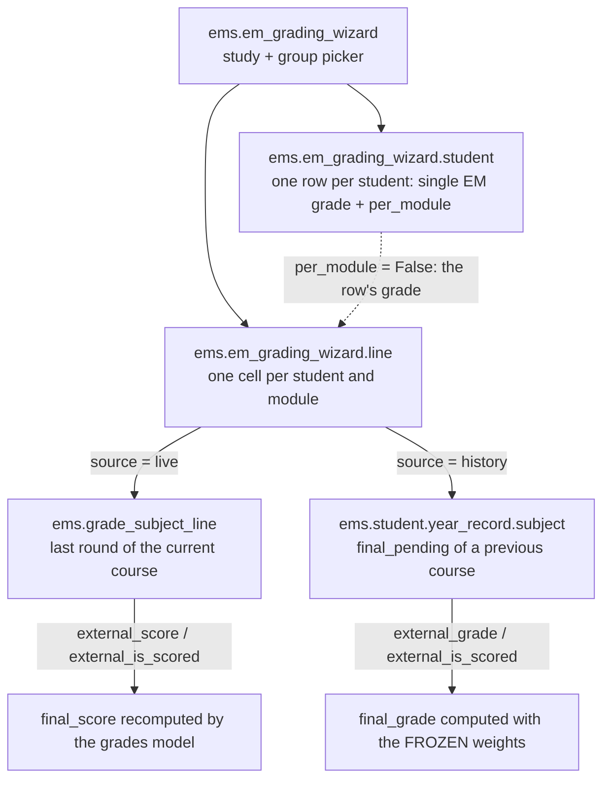

# Work placement (EM) grading wizard — `ems.em_grading_wizard`

Students do not finish their work placement (*estada a l'empresa*, EM) at the same time: each
one starts on a different date and does a different number of hours. Closing the EM can
therefore not be a group act, nor wait for the course transition — as soon as a student
finishes, their tutor must be able to grade the placement for **all** of that student's
modules at once.

This wizard is the tool for that. It is reached from **Planning and Grading → Grades → Work
placement evaluation (EM)**, next to the other grading screens.

## What it grades

The EM lives **at subject level**, never as a learning outcome (RA). A module carries an EM
when its planning gives it an external weight (`ems.planning.external_ponderation > 0`,
typically 90/10). The wizard shows the selected group as a matrix (the `em_matrix` OWL field widget, the same
shape as the group/subject evaluation screen): one row per student with a **single EM grade**
— the normal case, that grade goes to every module of theirs — plus a **Grade per module**
switch that turns on one cell per module instead. Only what the user fills in is written: an
empty cell is never applied (a `0` is a real grade, so an explicit flag, `to_apply`, is what
decides).

The wizard writes to two destinations, and **never touches the subject's state**: a subject
whose RAs are all passed is already `passed`; only its final grade is missing.

- **Live** (`source = live`): modules of the course in progress that still have a grade session.
  The wizard writes `external_score` / `external_is_scored` on the student's
  `ems.grade_subject_line` of the **last round**, and the grades model recomputes the final on
  its own — it remains the single source of truth.
- **History** (`source = history`): modules of previous courses already archived into
  `ems.student.year_record.subject` with `final_pending = True` (passed, external weight > 0,
  no final yet). The wizard writes `external_grade` / `external_is_scored` and computes the
  final with the **weights frozen** in that record, through the shared helper
  `ems.grade_subject_line._final_from_parts()` (same formula as the live model: weighted
  average, round half up, capped at 4 if a weighted part is failed).

A module that appears in both destinations (re-evaluated this course) is graded **live only**.

## EM below 5 — the placement is repeated, not the subject

A failed EM never fails a subject: the student repeats the **placement**. The wizard keeps the
grade (`external_score` / `external_grade`) for the record but does **not** mark
`external_is_scored`, so:

- the subject stays `passed`,
- the final grade stays empty (`final_pending` remains `True`, `has_final` stays `False`),
- the line shows up again in the wizard when the student repeats the placement.

## Session state and `sudo`

`ems.grade_subject_line.write()` guards the session state (`board`: only the group's tutor;
`final`: only administrators). The EM arrives **after** the evaluation rounds are closed, which
is precisely the case that guard would block.

`sudo()` alone does **not** lift that guard: it is a plain Python check on
`grade_session_id.can_edit`, a compute that reads `has_group('ems.group_academic_admin')` for
the current uid — and the superuser is not in that group, so a sudo write on a finalised
session still raises. The wizard therefore writes with `sudo()` (for the ACLs: the secretary
only reads grade lines) **plus** the `ems_em_grading` context key, which `write()` honours only
when the written fields are a subset of `{external_score, external_is_scored}`. The exception is
narrow (the EM and nothing else) and explicit in the model, not a generic back door; the
authorisation is the wizard's own ownership check (`_user_can_manage_group`).

## CRUD flow

1. The user picks the **group** (`group_id`, optionally pre-filtered by `study_id`). The
   selectable groups come from `group_domain` (a default + onchange, not a compute: a
   computed field with no field dependencies is not sent to the client on a new record):
   a tutor can only pick the group it tutors.
2. The wizard builds the grid: one row per student of the group (from `ems.enrollment`, the
   subjects they take THIS course — **and only `contact_type = 'student'`**: a withdrawal
   keeps its enrollment records until the transition, so without that filter an ex-student
   would still be listed, with its grades editable) and one cell per module with an external
   weight — live cells from the last round of the group's sessions, history cells from the
   pending finals of previous courses.
3. The `em_matrix` widget edits those transient lines directly (no buffer, no RPC of its
   own): the EM grade cell writes `score`/`to_apply` on the student row, the module cells on
   their own line. It brings the spreadsheet behaviour of the evaluation matrix: arrows and
   Enter move between cells, Tab skips the disabled ones and a block copied from a
   spreadsheet can be pasted from the focused cell on.
4. `action_apply()` decides, per module cell, which grade wins — the student's single grade
   (when `per_module` is off and the row was graded) or the cell's own grade (when it is on)
   — re-validates every applied line against the group (never trust the references coming
   back from the client: the write runs with sudo), writes each line to its destination and
   reports how many modules were graded and how many placements have to be repeated (EM < 5).

The hidden `line_ids` list in the arch must declare **every** field the server needs at apply
time — `subject_line_id` and `subject_record_id` above all: the client only sends back the
fields present in the view, so a missing one strips the line of its write target and the
scope check rejects it. The tests drive the wizard through `odoo.tests.Form`, which emulates
the client protocol (onchanges + view spec).

## Access

| Group | Wizard | Groups it can grade |
|---|---|---|
| `group_academic_admin` | full | any |
| `group_secretary` | full | any |
| `group_tutor` | full | only the group they tutor |
| `group_teacher` (not tutor) | no access | — |
