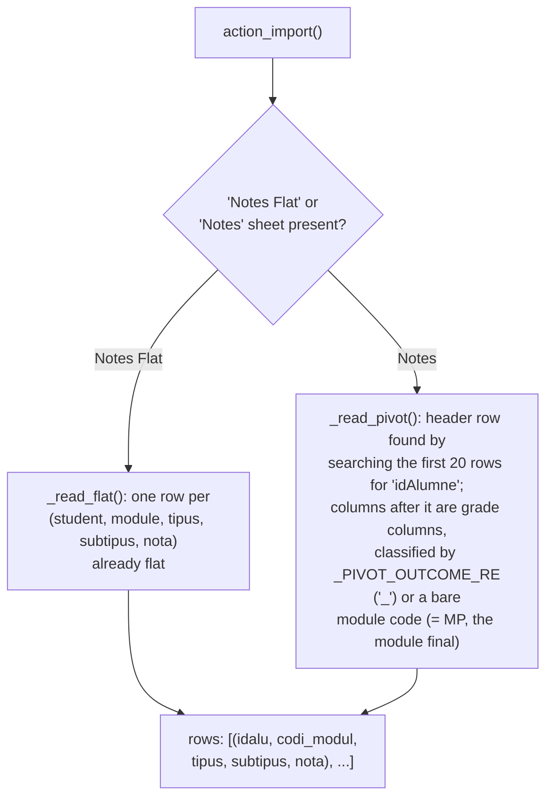
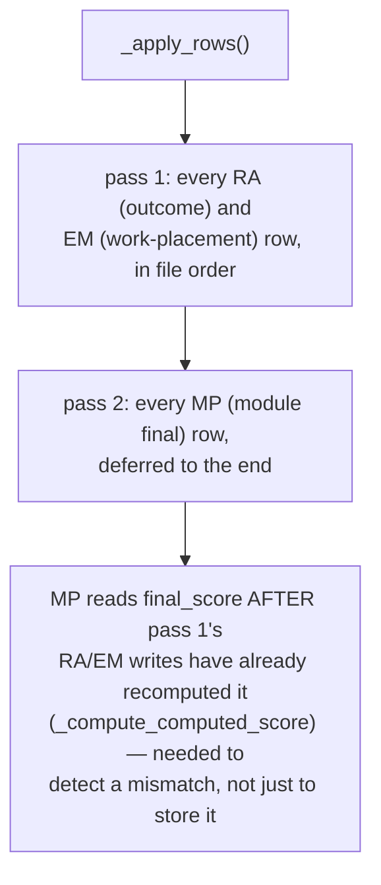

# Technical Reference: `ems.grade_import_wizard`

## Overview

Bulk-imports official grades from an Esfera-exported xlsx file (Catalonia's education
administration system of record) for one evaluation round, writing directly into
[`ems.grade_outcome_line`/`ems.grade_subject_line`](grade_session.md) — the same models the
tutor grading screen and [`ems.em_grading_wizard`](em_grading_wizard.md) write into. Fifth
in this codebase's "import an xlsx/csv from an external system" family (alongside
`ems.student_import_wizard`/`ems.applicant_import_wizard`/`ems.student_update_wizard`, see
`docs/en/developers/contacts/`), sharing the same HTML-escaping discipline documented there.

**Module file:** `models/grades/grade_import_wizard.py` (`EmsGradeImportWizard`)

---

## Two source formats, normalized to one row shape

Both readers produce the exact same 5-tuple shape, so `_apply_rows` never needs to know which
sheet the data came from.

## Applying: two passes, RA/EM before MP

- **`_apply_ra`**: resolves the outcome by `"<subject.code>_<subtipus>RA"`, writes
  `score`/`is_scored` on the matching `ems.grade_outcome_line`, with
  `ems_grade_import_bypass_lock=True` in context — the only caller allowed to overwrite a
  locked outcome (see [`grade_session.md`](grade_session.md#emsgrade_outcome_line-the-cross-round-lock)).
  Releases that line's lock (`is_lock_released`) without touching the earlier round that
  originally locked it.
- **`_apply_em`**: writes `external_score`/`external_is_scored` on the subject line — the
  same fields [`ems.em_grading_wizard`](em_grading_wizard.md) writes, just from the official
  export instead of live entry.
- **`_apply_mp`**: for a subject with **no work placement** (`external_ponderation == 0`,
  final == internal by definition), the official MP is stored as an *override*
  (`is_overridden=True`, `internal_score=score`) — this file becomes the source of truth for
  that number, matching `EmsGradeSubjectLine.write()`'s intended use of `is_overridden`. For a
  subject **with** work placement, EMS's own computed final is trusted instead — the file's
  MP value is only compared against it, and a divergence is logged as a `warning`, never
  silently overwritten.

**Optional modules** ("MP OPTx") are named/coded differently between Esfera and EMS by
design (e.g. Esfera `OPT2` vs this centre's EMS code `OPT1` for the same actual cycle) — so
`_resolve_subject` doesn't even try to match the code for an `OPT*` module; it resolves via
whichever optional subject the student is *actually enrolled in* for that study (one per
study, so unambiguous).

## Fixed in this pass (2026-07-28)

**Real bug found and fixed:** `_build_result_html` interpolated `stats["warnings"]`/
`stats["errors"]` directly into HTML with zero escaping — the same class of bug already found
and fixed in all four of this codebase's other `*_html`-building import wizards this rollout
(`student_import_wizard.py`, `student_update_wizard.py`, `applicant_import_wizard.py`; see
`docs/en/developers/contacts/student_import_wizard.md` for the first occurrence and the
established fix pattern). Concretely exploitable here: an **error message can echo raw
uploaded-file content** — e.g. `_log_error`'s "Student not found (idAlumne %s)" embeds
`idalu`, read directly from the xlsx's own `idAlumne` column, unescaped, into an admin-only
readonly `Html` field. Fixed with the same established pattern:
`markupsafe.Markup(...).format(...)` (auto-escapes plain-`str` arguments) plus
`Markup('').join(...)` for the warnings/errors `<li>` list (a plain `''.join(...)` on a
generator of `Markup` fragments silently downgrades the result back to `str`, losing the
"already safe" marker and causing the outer `.format()` call to re-escape and show literal
`&lt;li&gt;` tags instead of a real list — the exact gotcha documented for the other three
wizards, reproduced here verbatim since it's the same root mechanism). No text content
changed (same `_()`-wrapped strings), so no new `.po` translation work was needed.

Class renamed `ems_grade_import_wizard` → `EmsGradeImportWizard`. Whole file was
tab-indented — normalized to spaces. Test coverage was already thorough before this pass
(`tests/test_grade_import_wizard.py`, 11 tests: both sheet formats, locked-outcome
overwrite, MP override vs. divergence-warning branches, optional-module resolution, access
restriction) — no new tests needed.
