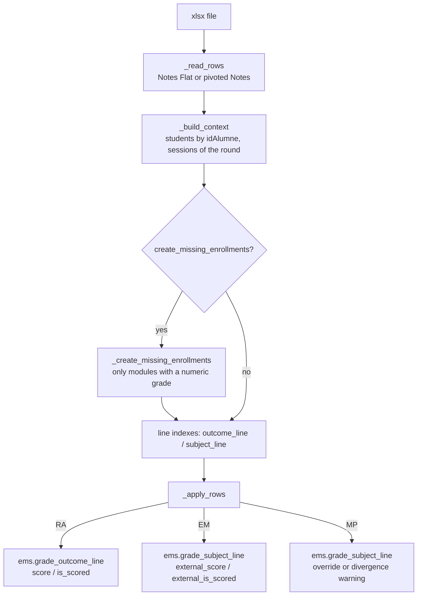

# Grade import wizard — `ems.grade_import_wizard`

The official grades of a group live in Esfera, the Catalan education department's system. At
the end of each evaluation the centre exports them as an xlsx and imports them here, so EMS
holds the same grades that were officially recorded. The wizard is reached from **Planning and
Grading → Grades → Import grades**.

It is a `TransientModel`: nothing is stored beyond the run, only the result HTML and a CSV log
of everything that was applied or rejected.

## The two sheet shapes

Esfera exports the same data in two layouts, and `_read_rows()` normalises both to the same
tuple, `(idAlumne, codi_mòdul, tipus, subtipus, nota)`:

- **`Notes Flat`** — one row per grade, with explicit `Tipus` (`MP`/`RA`/`EM`) and `Subtipus`
  columns. Preferred when present.
- **`Notes`** — pivoted: one row per student, one column per grade. The header row is found by
  looking for `idAlumne`; a column named `<module>_<NN><RA|EM>` is a learning outcome or a work
  placement, a bare module code is that module's final grade, and `n. convocatoria` /
  `provisional` are skipped.

Two export-only aggregate codes, `QFINAL` and `QUNIVERSITAT`, are not subjects and are dropped
rather than reported as errors (`_SKIP_MODULE_CODES`).

## Flow

`_build_context()` resolves the students by `res.partner.student_id` (Esfera's *idAlumne*),
derives the groups from their `main_group_id`, loads the grade sessions of the chosen round and
builds O(1) indexes of the existing lines. `_apply_rows()` then writes in two passes — RA and EM
first, MP last — so the module's final is read after the outcomes it derives from have been
recomputed.

### Code matching

Esfera codes carry a cycle token that EMS does not store (`0179_AGA0` vs `0179`), so
`_resolve_subject()` falls back to the code without its trailing token. **Optional modules** are
the exception: their code differs between Esfera and EMS by design (`OPT2` vs `OPT1` for the
same cycle), so they are matched not by code but by the optional subject the student is actually
enrolled in — one per study.

### Grades that are not numbers

`PQ`, `NP`, `PDT`, `NA`, `CV`, `RN`… are legitimate values. `_coerce_score()` returns
`(score, is_scored)`, and a non-numeric grade sets `is_scored = False` and stores no score. A
textual MP is not stored at all: the module's state emerges from its outcomes on its own.

### Locked outcomes

An outcome passed (≥ 5) in an earlier round is locked and cannot be re-evaluated
(`ems.grade_outcome_line.is_locked`). The official file is the source of truth, so the import
overwrites it anyway: it writes with `ems_grade_import_bypass_lock` in the context and sets
`is_lock_released` on that line only. The earlier rounds keep their history intact, and the lock
recomputes from them for any future round. The result reports how many locks were released.

### Module final (MP)

- **Without work placement** (`external_ponderation = 0`): the final is the internal grade, so
  the official MP is stored verbatim as an override (`is_overridden`, `internal_score`).
- **With work placement**: EMS recomputes the final from RA + EM, so the file's MP is not
  written — it is only compared, and a divergence is reported as a warning.

## Creating the missing enrollments

Esfera lists **every module of the cycle** in each student's report, whereas EMS only has a
`ems.enrollment` for the modules the student actually takes. When the two diverge, the session
exists (other students of the group are enrolled) but the student has no line in it, and the
grade used to be discarded with a "not enrolled or session not filled" error.

With `create_missing_enrollments` on (a checkbox, **off by default**), the wizard enrolls the
student instead. What counts is that the module carries **any informed grade**:

| Condition | Enrolled? |
|---|---|
| Any informed grade, numeric or textual (`PDT`, `NP`, `CV`…) | yes |
| Module left entirely blank | no — that is how Esfera lists what a student does not take |
| Optional module (`OPT*`), group has **one** optional graded | yes — unambiguous by elimination |
| Optional module, group has **several** optionals graded | no — cannot tell which; reported as a warning |
| No session for the student's group | no — nothing to grade into; reported as a missing session |
| Already enrolled in **another** group | no — an anomaly to review by hand, reported as a warning |

A textual grade is a grade, not the absence of one: `PDT`/`NP` state the module is not passed and
`CV` (convalidated) states it is, but all of them assert the module is part of the student's
record. Only a blank module asserts nothing, and that is the one case left alone.

Optional modules deserve the detail: they cannot be matched by code (Esfera's `OPT2` against this
centre's `OPT9`), and what normally resolves them — `optional_by_student`, built from the student's
own enrollment — is precisely what is missing here. So they are resolved **by elimination** on the
sessions of the student's group: exactly one optional subject being graded this round means that is
the one, and two or more means nothing is created.

`ems.enrollment.create()` already syncs the grade sessions on its own
(`_ems_sync_grade_session_add`), which is what creates the student's lines — but **only for
sessions in the `open` state**. Since an administrator can import into a `board` or `final`
session, the wizard calls `grade_session._ems_add_student_lines()` explicitly; it is idempotent
and leaves every other student's lines untouched. This happens **before** the line indexes are
built, so the lines created here are picked up by the same import.

Creating an enrollment also adds the student to the module's attendance templates
(`_ems_sync_attendance_template_add`), which is consistent: if they take the module, they belong
on its attendance list.

Each created enrollment is counted in the result and logged in the CSV with `ENROLLMENT` /
`CREATED`, so there is a written trace of what the import changed.

## What it deliberately does not do

- **Create grade sessions.** A module with no session at all in the group is reported as an
  error; creating one means deriving a teacher and a planning, which is what
  `ems.grade_session_wizard` ("Create grade sessions") is for.
- **Import a group whose sessions do not exist yet.** The sessions must be created first.

## Access

| Group | Access |
|---|---|
| `group_academic_admin` | full — the action and menu are restricted to this group |
| everyone else | no access |

The wizard needs create rights on `ems.enrollment`, which `group_academic_admin` already has,
so no `sudo` is involved. `ems.enrollment.default_get()` blocks non-admins from creating
enrollments manually, but it does not run on a programmatic `create()`.

## Tests

- `tests/test_grade_import_wizard.py` — `TransactionCase`: both sheet shapes, code matching,
  optional modules, locked outcomes, MP with and without work placement, and the enrollment
  creation rules above.
- `tests/test_grade_import_wizard_tour.py` + `static/tests/tours/grade_import_wizard_tour.js` —
  renders the wizard's form in a real browser. The `TransactionCase` suite drives the model
  directly and never renders the view, so a broken arch or a field missing from it would go
  unnoticed. A tour cannot upload a file, so it checks the inputs render and the checkbox
  defaults to off and is editable.
