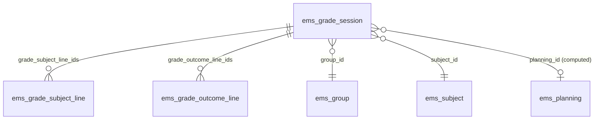
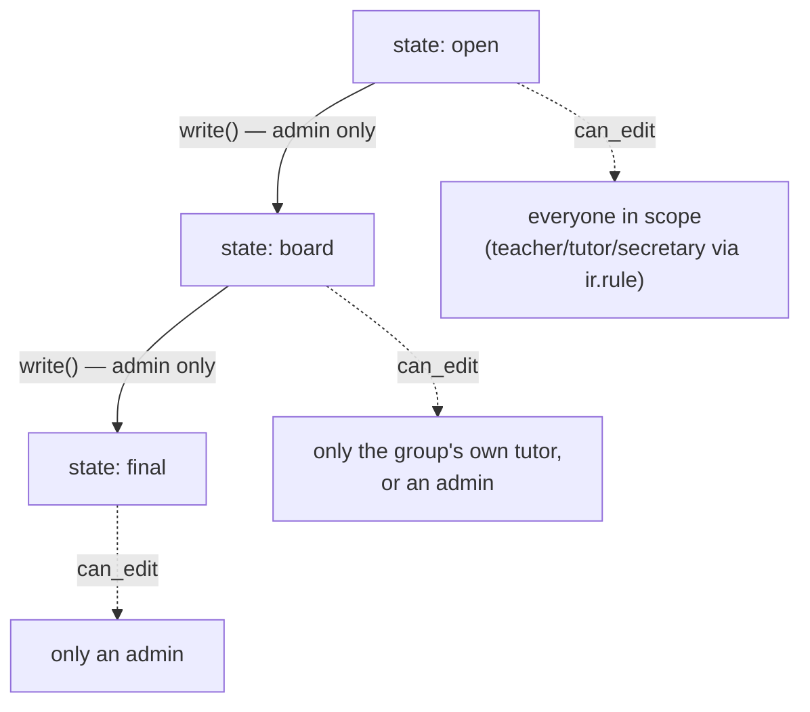
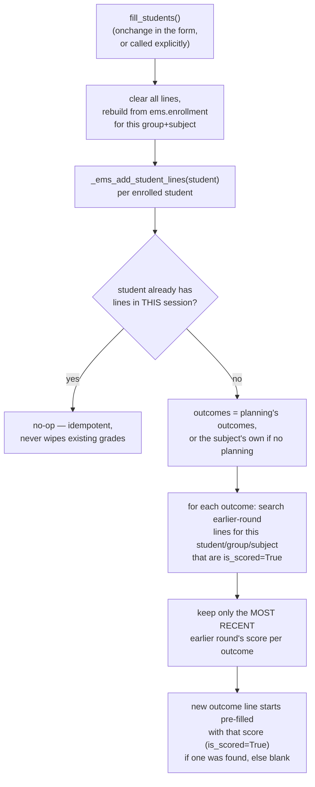
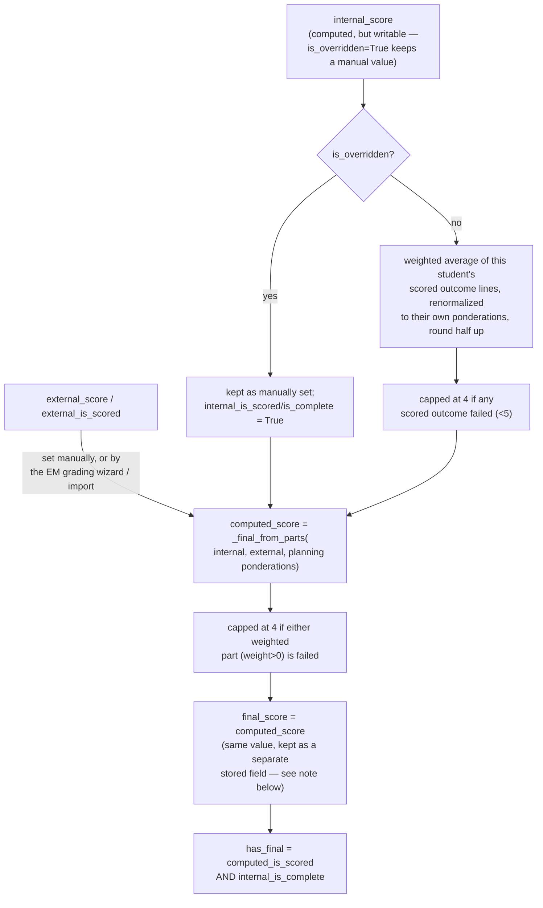

# Technical Reference: `ems.grade_session` / `ems.grade_subject_line` / `ems.grade_outcome_line`

## Overview

The core grading triad — one **`ems.grade_session`** per (group, subject, round), holding
one **`ems.grade_subject_line`** per enrolled student (the subject grade) and one
**`ems.grade_outcome_line`** per (student, learning outcome) (the outcome-level score the
subject grade is computed from).

**Module files:** `models/grades/grade_session.py` (`EmsGradeSession`),
`models/grades/grade_subject_line.py` (`EmsGradeSubjectLine`),
`models/grades/grade_outcome_line.py` (`EmsGradeOutcomeLine`).

**See also:** [`em_grading_wizard.md`](em_grading_wizard.md) (the work-placement grade entry
point, which writes into `grade_subject_line` after the normal rounds are closed) and
[`year_record.md`](year_record.md) (the archived history these sessions eventually feed).

---

## `ems.grade_session`: identity and access-control state machine

`_sql_constraints`: `UNIQUE(group_id, subject_id, round)` — the real guard against duplicate
sessions; `create()` catches the resulting `IntegrityError` and re-raises as a friendly
`ValidationError`.

`can_edit` (`store=False`, `@api.depends_context('uid')`) is the single source of truth both
`grade_subject_line`'s and `grade_outcome_line`'s own `write()` overrides check — the state
machine is enforced once here, not duplicated on each line model.
`planning_id`/`has_planning` are derived from `(group_id.study_id, subject_id)` — a session
with no matching [`ems.planning`](../planning/planning.md) still works (falls back to the
subject's own `outcome_ids` and a 100%-internal/0%-external split), just without ponderations
tailored per outcome.

### `fill_students` / `_ems_add_student_lines`: cross-round carry-over

A carried-over score that was **passed** (≥5) becomes `is_locked` (see below) — the student
doesn't re-sit an outcome they already cleared. A carried-over **failed** score is not
locked — editable, but starts from the previous attempt's score rather than blank.

`_ems_has_scored_grades(student, group, subject)` is the read-only check
[`ems.enrollment`](../contacts/enrollment.md) uses to block deleting the underlying
placement once evaluation has actually started (scored outcome, or an external grade) — see
that model's own doc for the calling side.

`apply_grade_changes(outcome_vals, subject_vals)` batches the tutor grading screen's buffered
edits into one RPC (outcome lines first, so subject lines recompute from the fresh scores) —
the per-line `write()` overrides still enforce locking/state, this is purely a network-
efficiency wrapper.

---

## `ems.grade_subject_line`: internal / external / computed / final

`_final_from_parts()` is an `@api.model` **pure function** (no `self` state read) —
deliberately shared verbatim with `ems.student.year_record`'s archived-history equivalent
(`year_record.py`'s `subject.apply_external_grade`, see [`year_record.md`](year_record.md)),
so a live session and an already-archived record compute a final grade with the *exact* same
formula. Any future change to the weighting/capping rules must be made in both places, or
they will silently diverge.

`final_score` duplicates `computed_score`'s value rather than being a plain `related` alias —
the code's own comment explains why: a stored compute that only reads *another* stored
compute of the same model can flush stale when both are pending recomputation in the same
transaction (the dependency-triggered re-mark is suppressed while the field is protected), so
`final_score` is assigned directly inside `_compute_computed_score` instead.

`write()` enforces the session's `can_edit` state machine, with one documented exception: a
context flag (`ems_em_grading`) set only by [`ems.em_grading_wizard`](em_grading_wizard.md),
scoped to *only* `external_score`/`external_is_scored` — a work-placement grade legitimately
arrives after the rounds are closed, but every other field on the line stays protected
regardless of context.

---

## `ems.grade_outcome_line`: the cross-round lock

`is_locked` (`store=False`, recomputed on read — it depends on *other* grade sessions, not
just this record) is `True` when this exact (student, outcome) already scored ≥5 in an
**earlier round** of the same group+subject. A locked outcome's `write()` unconditionally
rejects any `score`/`is_scored` change — not even an admin can override it through the normal
UI — **except** when `ems_grade_import_bypass_lock` is set in context, which only
[`ems.grade_import_wizard`](grade_import_wizard.md) sets (the official exported grade is the
source of truth and may need to overwrite a locked line; see `is_lock_released`, which marks
that specific line so the padlock stops showing without touching the earlier round that
originally locked it).

---

## Views

| View | File | Notes |
|------|------|-------|
| List/Form/Kanban | `views/planning_grading/grading/grade_session/` | Admin/secretary-facing session management. |
| Tutor grading screen | Custom OWL component (`static/src/js/backend/...`), backed by `apply_grade_changes` | The actual day-to-day roll-call-style grading UI; covered by `static/tests/tours/grade_session_tour.js`. |
| Bulk creation/state wizards | `views/planning_grading/grading/grade_session_wizard/` | See below. |

### `ems.grade_session_wizard` / `ems.grade_session_state_wizard`

Two small `TransientModel`s (`models/grades/grade_session_wizard.py`) automating what would
otherwise be many individual session creates/state writes:

- **`EmsGradeSessionWizard.action_create_sessions()`**: for every group in the selected
  level(s)/study(ies), creates one session per subject with actual enrolled students
  (excluding tutorship subjects — never graded), skipping any that already exist for the
  chosen round, deriving the teacher via `EmsGradeSession._derive_teacher()` (the active
  `ems.teaching` entry, falling back to the group's tutor).
- **`EmsGradeSessionStateWizard.action_apply_state()`**: bulk `state` transition
  (open→board→final) across every session in the selected scope+round in one write.

Both share a `_target_studies()` helper (level-mode resolves to that level's studies) and
raise `UserError` if the scope/round selection matches nothing.

## Fixed in this pass (2026-07-28)

Classes renamed `ems_grade_session`/`ems_grade_subject_line`/`ems_grade_outcome_line`/
`ems_grade_session_wizard`/`ems_grade_session_state_wizard` → their PascalCase equivalents.
Whole files were tab-indented — normalized to spaces.

**Self-caught regression, fixed before landing:** normalizing `grade_subject_line.py`'s loop
variable (originally `rec`) to `line` collided with an *existing, unrelated* lambda parameter
also named `line` in three computes (`_compute_internal_score`, `_compute_internal_is_scored`,
`_compute_internal_is_complete`) — the lambda's own `line` shadowed the outer loop variable,
silently turning `lambda line: line.student_id == line.student_id` into a tautology (always
`True`, since both sides refer to the shadowed inner parameter) instead of the intended
"does this candidate outcome-line belong to the current subject-line's student" filter. Caught
immediately by the existing test suite (`test_apply_grade_changes_batches_writes`,
`test_internal_complete_when_all_scored`, `test_no_final_while_incomplete` all failed) before
being committed to memory/roadmap as done — fixed by renaming the *outer* loop variable to
`subject_line` throughout the file instead, leaving the inner lambda's `line` (correctly
referring to outcome-line candidates) alone. No other file in this pass had the same
collision. **Lesson: a blind find-and-replace rename of a loop variable is not safe when the
method also has a nested lambda/comprehension using a plausible-sounding parameter name of its
own — always re-read the method after a mechanical rename, not just run the test suite
after the whole file (which is what actually caught this one) and grep for the old name.**

Test coverage was already extensive before this pass (`tests/test_grade_session.py`, 39
tests spanning all three models plus both bulk wizards, `tests/test_grade_session_tour.py`)
— no new tests were needed; this was a normalization-only pass (plus the regression fix
above). No dev doc existed for this triad before now.
