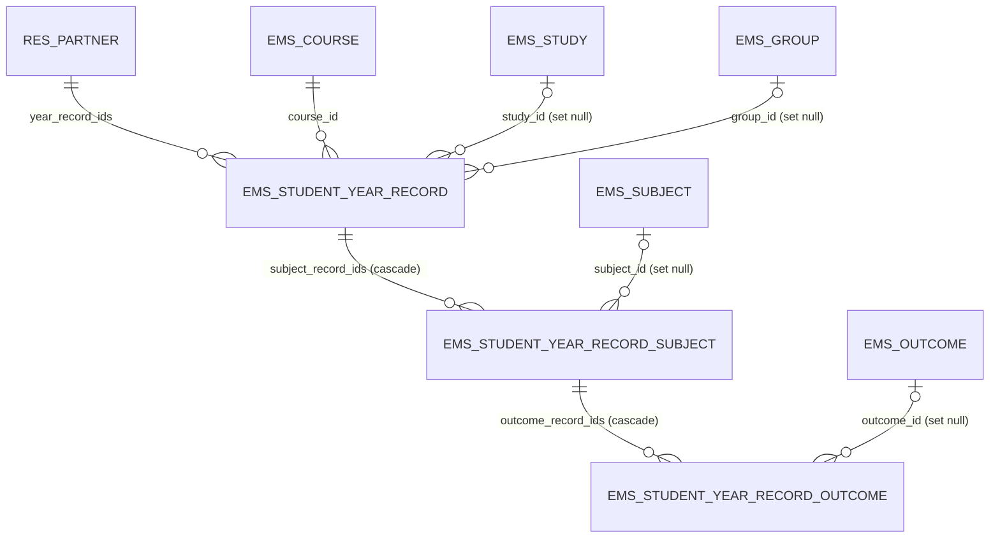
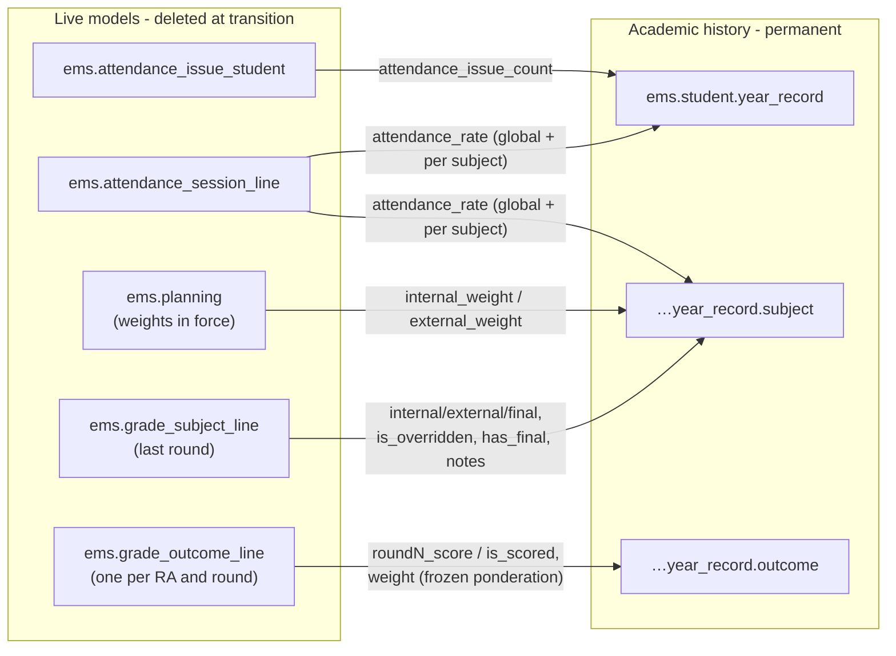

# Technical Reference: `ems.student.year_record`

## Overview

`ems.student.year_record` is the three-level **academic history** of a student: one record per student·course, its subjects (`ems.student.year_record.subject`) and, inside each subject, its learning outcomes (`ems.student.year_record.outcome`).

The record is a **frozen copy** of the grades subsystem output — never recalculated. The single source of truth for grade computation is `ems.grade_subject_line` / `ems.grade_outcome_line`; the year record copies their values (and the planning weights in force) at generation time, so the history stays self-contained and verifiable even if `ems.planning` changes in later courses, or after the transition wizard deletes the operational records of the outgoing year.

This model replaces the legacy, unused `ems.grade_outcome` (removed in this same issue).

**Module files:** `models/grades/year_record.py`, `models/contacts/contact.py` (O2m + history tab), `models/contacts/graduation_wizard.py` (withdrawal wizard generates the record), `views/planning_grading/grading/year_record/{form,list,search,menu}.xml`, `views/community/contact/form.xml`, `security/rules/grading.xml`, `security/ir.model.access.csv`, `tests/test_year_record.py`

## Hierarchy and relations

Every M2o to a curriculum/operational entity is `ondelete='set null'` and doubled by a denormalized `*_name` Char, so the history stays readable even if the study/group/subject is archived or deleted. Only `student_id` and `course_id` are `restrict` (they are the record's identity: `UNIQUE(student_id, course_id)`).

## Copy sources (generation)

`generate_for_students(students, course)` (model method, idempotent on `(student_id, course_id)`: re-running replaces the copied content instead of duplicating). Callers:

1. **Withdrawal wizard** (`ems.withdrawal_wizard.action_apply`) — generates the record **at withdrawal time, before `_ems_convert_to_ex_student()` clears `main_group_id`**. Without this, a mid-course withdrawal would never get a history record (the transition wizard captures by `main_group_id.study_id`).
2. **Transition wizard** (phase 6, step 0 — future issue) — generates for every student in the studies being transitioned, before any cleanup.

### Semantics copied, not recomputed

- **Subject `state` is binary and determined only by RAs**: `passed` = every RA resolved ≥ 5; `failed` = some RA < 5 (or never scored) after all rounds. A failed/pending work placement (EM) never fails a subject — the student repeats the placement, not the subject.
- **`final_grade` empty while the EM is pending**: `has_final` is copied from the subject line; `final_pending` (stored compute) = `passed` + `external_weight > 0` + no final. It is the work list of the EM grading wizard (phase 1bis).
- **`roundN_score` reflects "the grade as of that round"** (`fill_students()` carries the best previous grade forward); `final_score` is the last scored round.
- **`academic_result`** is written by the generator (plain field, manually adjustable):
  - `exit_type = 'withdrawal'` that course → `withdrawn`
  - graduated that course (`has_graduated` + `exit_course_id` = course) → `full` + `title_obtained`
  - confirmed enrollment (`sale.order`, state `sale`) for the next course, same study & same year → `repeating`; otherwise promotes → `full` if every subject `passed`, else `partial`
  - no confirmed enrollment: study `uses_enrollment_flow` → `repeating` (suspicious, listed in the transition preview); no flow → empty (filled by the September re-import if applicable)
- **`title_obtained`** is per record (= per study·course): `has_graduated` alone is global and does not say which study/course; the record's `exit_course_id` match provides that dimension.

## CRUD flow

| Operation | Who | How |
|-----------|-----|-----|
| Create | Generator only (withdrawal wizard, transition wizard) | `generate_for_students()`; no manual create UI |
| Read | Tab "Academic history" on the contact form (student/alumni/withdrawal); standalone list under Planning and Grading | — |
| Update | Admin/secretary may adjust `academic_result` / header metadata; content refresh via re-generation | Idempotent replace of copied children |
| Delete | Admin only (correction of a wrongly generated record) | — |

## Access control

| Group | Read | Write | Create | Unlink | Record rule |
|-------|------|-------|--------|--------|-------------|
| `group_academic_admin` | ✔ | ✔ | ✔ | ✔ | all data |
| `group_secretary` | ✔ | ✔ | ✔ | ✘ | none (unrestricted) |
| `group_head_of_studies` (and Director) | ✔ | ✘ | ✘ | ✘ | all data (read) |
| `group_teacher` (tutors) | students of tutored groups only | ✘ | ✘ | ✘ | `student_id.main_group_id.tutor_id.user_id = user` |
| Portal / families | ✘ | ✘ | ✘ | ✘ | — |

The three models share the same matrix (children are always reached through the header).
