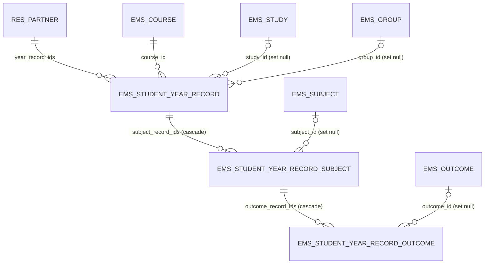
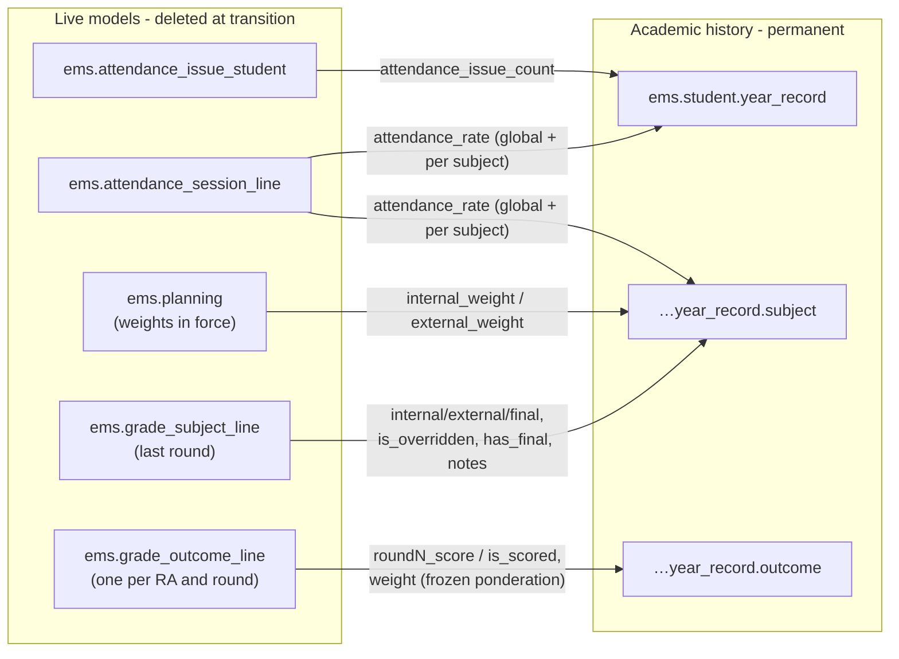
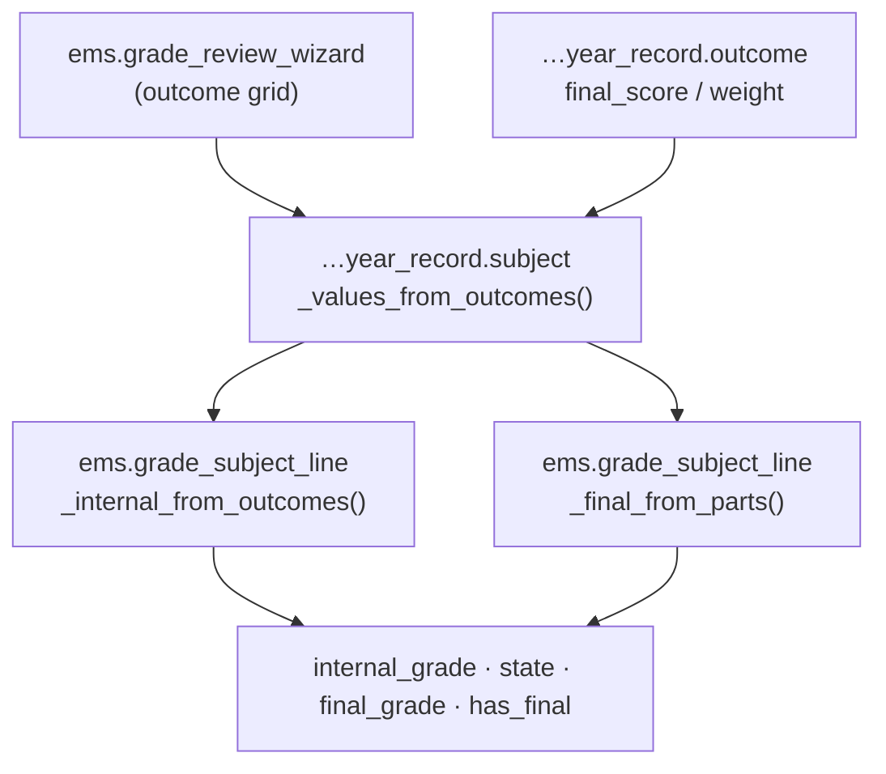

# Technical Reference: `ems.student.year_record`

## Overview

`ems.student.year_record` is the three-level **academic history** of a student: one record per student·course, its subjects (`ems.student.year_record.subject`) and, inside each subject, its learning outcomes (`ems.student.year_record.outcome`).

The record is a **frozen copy** of the grades subsystem output — never recalculated. The single source of truth for grade computation is [`ems.grade_subject_line` / `ems.grade_outcome_line`](grade_session.md); the year record copies their values (and the planning weights in force) at generation time, so the history stays self-contained and verifiable even if `ems.planning` changes in later courses, or after the transition wizard deletes the operational records of the outgoing year.

This model replaces the legacy, unused `ems.grade_outcome` (removed in this same issue).

**Module files:** `models/grades/year_record.py`, `models/grades/grade_review_wizard.py`, `models/contacts/contact.py` (O2m + history tab), `models/contacts/graduation_wizard.py` (withdrawal wizard generates the record), `views/planning_grading/grading/year_record/{form,list,search,menu,grade_review_wizard}.xml`, `views/community/contact/form.xml`, `security/rules/grading.xml`, `security/ir.model.access.csv`, `tests/test_year_record.py`, `tests/test_grade_review.py`, `tests/test_grade_review_tour.py`

## Hierarchy and relations

Every M2o to a curriculum/operational entity is `ondelete='set null'` and doubled by a denormalized `*_name` Char, so the history stays readable even if the study/group/subject is archived or deleted. Only `student_id` and `course_id` are `restrict` (they are the record's identity: `UNIQUE(student_id, course_id)`).

## Copy sources (generation)

`generate_for_students(students, course)` (model method, idempotent on `(student_id, course_id)`: re-running replaces the copied content instead of duplicating). Callers:

1. **Withdrawal wizard** (`ems.withdrawal_wizard.action_apply`) — generates the record **at withdrawal time, before `_ems_convert_to_ex_student()` clears `main_group_id`**. Without this, a mid-course withdrawal would never get a history record (the transition wizard captures by `main_group_id.study_id`).
2. **Transition wizard** (phase 6, step 0 — future issue) — generates for every student in the studies being transitioned, before any cleanup.

### Semantics copied, not recomputed

- **Subject `state` is binary and determined only by RAs**: `passed` = every RA resolved ≥ 5; `failed` = some RA < 5 (or never scored) after all rounds. A failed/pending work placement (EM) never fails a subject — the student repeats the placement, not the subject.
- **`final_grade` empty while the EM is pending**: `has_final` is copied from the subject line; `final_pending` (stored compute) = `passed` + `external_weight > 0` + no final. It is the work list of the EM grading wizard (phase 1bis).
- **Current-course records** (`is_provisional`, labelled *Current course*): completing a convalidation opens the record of its course straight away when none exists yet (`_ems_provisional_record`), holding only the convalidated subjects — the history is the one place teachers look grades up, and a running course otherwise has none. No academic result, no title. The generator rewrites it whole when the course closes (transition, graduation or withdrawal all regenerate with the student's group), which also clears the flag. It is **not** a frozen year: `freeze_on_leaving()` only skips non-provisional records, the grade review refuses it (`action_apply`) and hides its button, and a revoked convalidation removes its subject (and the record once empty). The search view offers *Current course* / *Closed courses*.
- **Convalidated subjects** (`is_convalidated` + `convalidation_grade` + `convalidation_number`) are `passed` with the grade their convalidation was resolved with (5 unless someone wrote another one), whether they still have a grade line or not: completing a convalidation withdraws the student from the subject, so `_convalidated_subject_vals()` adds the ones no grade line accounts for. A convalidation completed after the record was frozen updates the record of the request's course (adding the subject if missing), and a grade review never touches one; see [`convalidation.md`](convalidation.md).
- **`roundN_score` reflects "the grade as of that round"** (`fill_students()` carries the best previous grade forward); `final_score` is the last scored round.
- **`academic_result`** is written by the generator (plain field, manually adjustable):
  - `exit_type = 'withdrawal'` that course → `withdrawn`
  - graduated that course (`has_graduated` + `exit_course_id` = course) → `full` + `title_obtained`
  - confirmed enrollment (`sale.order`, state `sale`) for the next course, same study & same year → `repeating`; otherwise promotes → `full` if every subject `passed`, else `partial`
  - no confirmed enrollment: study `uses_enrollment_flow` → `repeating` (suspicious, listed in the transition preview); no flow → empty (filled by the September re-import if applicable)
- **`title_obtained`** is per record (= per study·course): `has_graduated` alone is global and does not say which study/course; the record's `exit_course_id` match provides that dimension.

## Grade reviews (post-closure corrections)

A **grade review** is a formal resolution signed once the academic file of a course is already closed. By then the frozen history is the only surviving trace of that year — the transition wizard deleted the `ems.grade_subject_line` / `ems.grade_outcome_line` records it was copied from — so there is nowhere else to apply it. `ems.grade_review_wizard` is the single write path into a closed file; every other field of the history stays read-only in the UI.

Three operations, all of them stamped and logged:

| Operation | Effect |
|-----------|--------|
| `correct` | Rewrites `final_score` / `final_is_scored` of the subject's outcomes, then recomputes the subject |
| `add` | Creates a subject record the history is missing, with its outcomes seeded from the `ems.planning` of the record's study |
| `remove` | Unlinks a subject record |

### Recomputation reuses the grading formulas, never a copy of them

`_internal_from_outcomes()` was extracted out of `ems.grade_subject_line._compute_internal_score` for this, alongside the already shared `_final_from_parts()`: the live grades and the frozen history run the very same weighted-average rule (renormalized over the scored outcomes, capped at 4 when any of them is below 5). `_values_from_outcomes()` sits on top of both and is what the wizard's **live preview** is computed from too, so what the operator sees before applying and what gets written cannot diverge.

`_recompute_from_outcomes()` also clears `is_overridden`: after a grade review the internal grade is the one its outcomes yield, no longer a teacher's manual override of them. A subject whose work placement (EM) has not been graded yet becomes `passed` with its final still pending, exactly as the freeze would have left it.

### The course result is proposed, never silently rewritten

`ems.student.year_record.grade_based_result()` returns `full` when every subject is passed and `partial` otherwise. `withdrawn` and `repeating` are returned untouched: they come from the exit and from the destination enrollment (see `_academic_result` above), not from the grades, so a grade review on a subject cannot resolve them. The wizard shows the proposal next to the current result with a pre-checked "Update the course result" box; `title_obtained` is never derived — it stays a manual decision.

### Traceability

`review_date`, `review_user_id` and `review_note` on `ems.student.year_record.subject` keep the **last** grade review applied to that subject. The full sequence is auditable in the student's chatter: `_log_review()` posts one note per review (through `_message_log`, so it needs no email address on whoever signed it) listing every outcome changed with its before → after, the resulting subject state and, when it changed, the course result.

## CRUD flow

| Operation | Who | How |
|-----------|-----|-----|
| Create | Generator only (withdrawal wizard, transition wizard) | `generate_for_students()`; no manual create UI |
| Read | Tab "Academic history" on the contact form (student/alumni/withdrawal); standalone list under Planning and Grading | — |
| Update | Admin (and the secretariat, pre-existing) directly on the record; Head of Studies / Director and teachers are read-only. Grade corrections of every role go through the grade review wizard | Idempotent replace of copied children on re-generation |
| Delete | Record: admin only (a wrongly generated record). Subject line: through the grade review wizard | — |

### The grade review wizard is the only door to a closed history

Head of Studies / Director have no write access on `ems.student.year_record` and its subject/outcome children (neither the ACL nor the record rules grant it), and the secretariat cannot delete subject or outcome lines. Nobody can therefore correct a closed history over RPC or any other way around the wizard. `ems.grade_review_wizard` performs every write through `_history()`, which applies `.sudo()` to the records it touches, and only after `_check_can_review()` has confirmed the caller is secretariat, admin, Head of Studies or Director. Only the records are elevated, never the wizard itself, so `self.env.user` keeps naming the person who signs the review (stamp and chatter note).

### The generator elevates its arguments, not only the model

Every caller reaches the generator as `self.env['ems.student.year_record'].sudo()`: the operator triggering it is typically a secretary, who has no rights over grades, attendance or employees. `.sudo()` only elevates `self`, so `_generate_one()` re-applies it to the `student` and `group` it receives - they arrive bound to the caller's own environment, and the header metadata dereferences them (`group.tutor_id.name` reads an `hr.employee`). Without that, generation fails halfway through a withdrawal for exactly the users it is meant to serve (issue #492, see [employee.md](../employees/employee.md#every-field-ems-adds-to-hremployee-must-declare-groups)).

## Access control

| Group | Read | Write | Create | Unlink | Record rule |
|-------|------|-------|--------|--------|-------------|
| `group_academic_admin` | ✔ | ✔ | ✔ | ✔ | all data |
| `group_secretary` | ✔ | ✔ | ✔ | subject/outcome lines only | all data — needs its own rule: a secretary who is also a teacher would otherwise be restricted by the teacher rule |
| `group_head_of_studies` (and Director, which implies it) | ✔ | ✔ | ✔ | subject/outcome lines only | all data |
| `group_teacher` (every teacher, not only tutors) | ✔ | ✘ | ✘ | ✘ | all students centre-wide (issue #393) |
| Portal / families | ✘ | ✘ | ✘ | ✘ | — |

The three models share the same matrix (children are always reached through the header), except for `unlink`: only the admin may delete a whole year record, while the subject and outcome lines are deletable by every role that signs a grade review. `ems.grade_review_wizard` itself is reachable by those same four roles, and `_check_can_review()` re-checks it in Python behind the view's own `groups=`.
