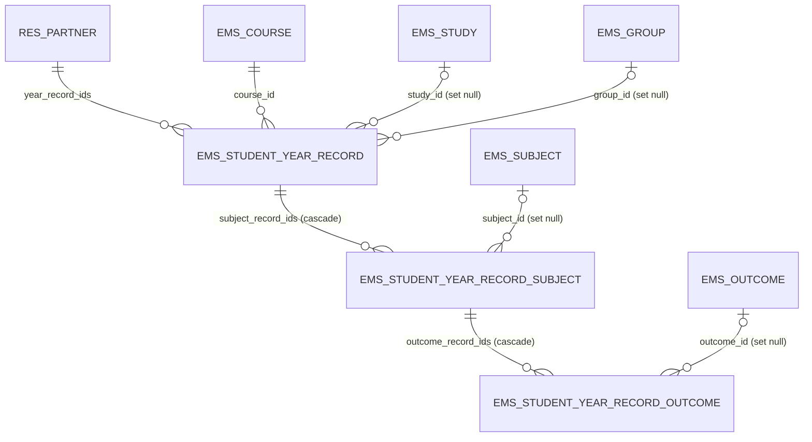
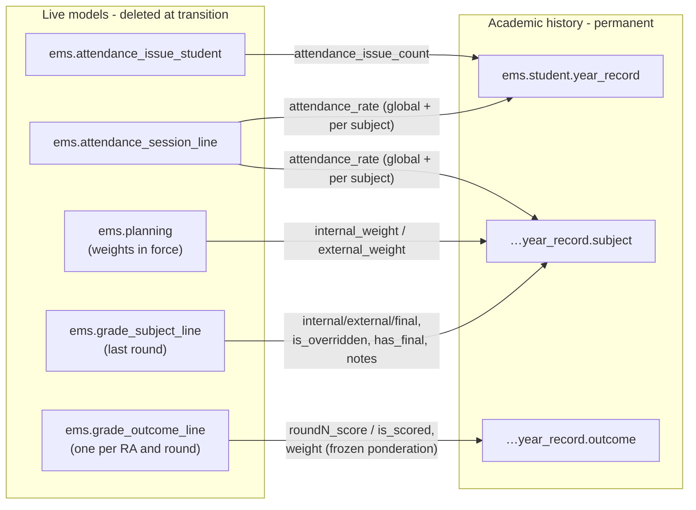
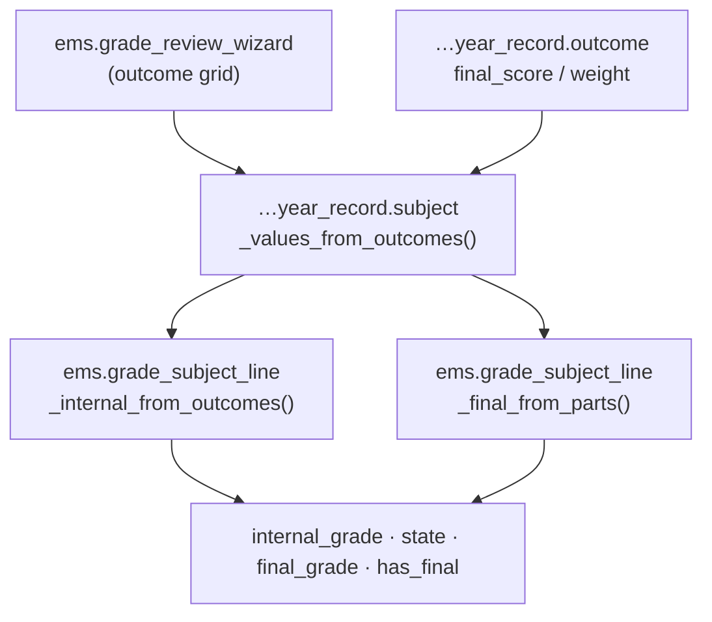
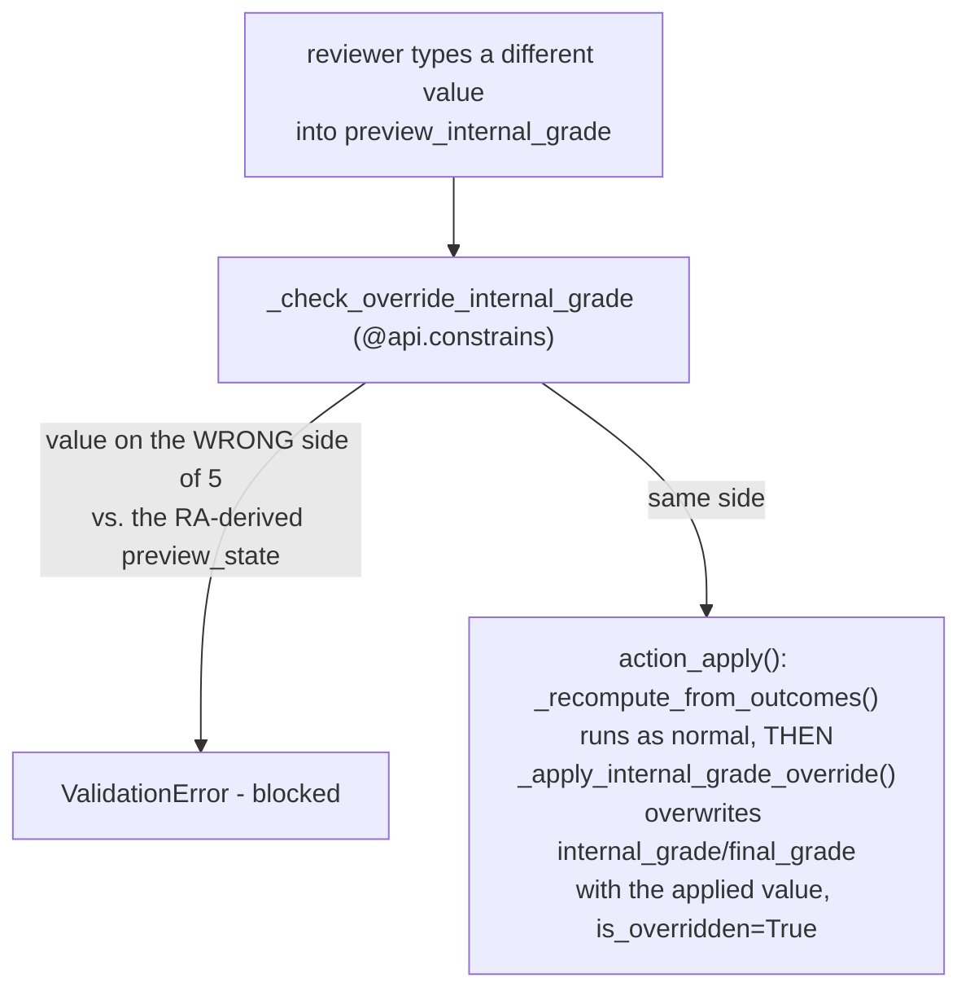
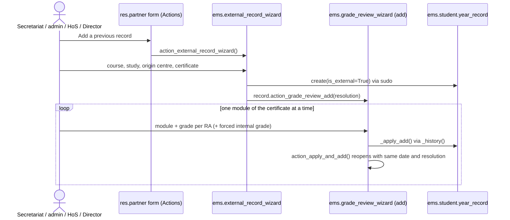
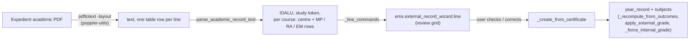

# Technical Reference: `ems.student.year_record`

## Overview

`ems.student.year_record` is the three-level **academic history** of a student: one record per student·course, its subjects (`ems.student.year_record.subject`) and, inside each subject, its learning outcomes (`ems.student.year_record.outcome`).

The record is a **frozen copy** of the grades subsystem output — never recalculated. The single source of truth for grade computation is [`ems.grade_subject_line` / `ems.grade_outcome_line`](grade_session.md); the year record copies their values (and the planning weights in force) at generation time, so the history stays self-contained and verifiable even if `ems.planning` changes in later courses, or after the transition wizard deletes the operational records of the outgoing year.

This model replaces the legacy, unused `ems.grade_outcome` (removed in this same issue).

**Module files:** `models/grades/year_record.py`, `models/grades/grade_review_wizard.py`, `models/grades/external_record_wizard.py`, `models/grades/academic_record_pdf.py`, `models/contacts/contact.py` (O2m + history tab), `models/contacts/graduation_wizard.py` (withdrawal wizard generates the record), `views/planning_grading/grading/year_record/{form,list,search,menu,grade_review_wizard,external_record_wizard}.xml`, `views/community/contact/form.xml`, `security/rules/grading.xml`, `security/ir.model.access.csv`, `tests/test_year_record.py`, `tests/test_grade_review.py`, `tests/test_grade_review_tour.py`, `tests/test_external_record.py`, `tests/test_external_record_tour.py`

## Hierarchy and relations

```mermaid
erDiagram
    RES_PARTNER ||--o{ EMS_STUDENT_YEAR_RECORD : "year_record_ids"
    EMS_COURSE ||--o{ EMS_STUDENT_YEAR_RECORD : "course_id"
    EMS_STUDY |o--o{ EMS_STUDENT_YEAR_RECORD : "study_id (set null)"
    EMS_GROUP |o--o{ EMS_STUDENT_YEAR_RECORD : "group_id (set null)"
    EMS_STUDENT_YEAR_RECORD ||--o{ EMS_STUDENT_YEAR_RECORD_SUBJECT : "subject_record_ids (cascade)"
    EMS_SUBJECT |o--o{ EMS_STUDENT_YEAR_RECORD_SUBJECT : "subject_id (set null)"
    EMS_STUDENT_YEAR_RECORD_SUBJECT ||--o{ EMS_STUDENT_YEAR_RECORD_OUTCOME : "outcome_record_ids (cascade)"
    EMS_OUTCOME |o--o{ EMS_STUDENT_YEAR_RECORD_OUTCOME : "outcome_id (set null)"
```

Every M2o to a curriculum/operational entity is `ondelete='set null'` and doubled by a denormalized `*_name` Char, so the history stays readable even if the study/group/subject is archived or deleted. Only `student_id` and `course_id` are `restrict` (they are the record's identity: `UNIQUE(student_id, course_id)`).

## Copy sources (generation)

```mermaid
flowchart LR
    subgraph live [Live models - deleted at transition]
        GSL["ems.grade_subject_line<br/>(last round)"]
        GOL["ems.grade_outcome_line<br/>(one per RA and round)"]
        ASL["ems.attendance_session_line"]
        AIS["ems.attendance_issue_student"]
        PLN["ems.planning<br/>(weights in force)"]
    end
    subgraph frozen [Academic history - permanent]
        YR["ems.student.year_record"]
        YRS["…year_record.subject"]
        YRO["…year_record.outcome"]
    end
    GSL -- "internal/external/final,<br/>is_overridden, has_final, notes" --> YRS
    PLN -- "internal_weight / external_weight" --> YRS
    ASL -- "attendance_rate (global + per subject)" --> YR & YRS
    AIS -- "attendance_issue_count" --> YR
    GOL -- "roundN_score / is_scored,<br/>weight (frozen ponderation)" --> YRO
```

`generate_for_students(students, course)` (model method, idempotent on `(student_id, course_id)`: re-running replaces the copied content instead of duplicating). Callers:

1. **Withdrawal wizard** (`ems.withdrawal_wizard.action_apply`) — generates the record **at withdrawal time, before `_ems_convert_to_ex_student()` clears `main_group_id`**. Without this, a mid-course withdrawal would never get a history record (the transition wizard captures by `main_group_id.study_id`).
2. **Transition wizard** (phase 6, step 0 — future issue) — generates for every student in the studies being transitioned, before any cleanup.

### Semantics copied, not recomputed

- **Subject `state` is binary and determined only by RAs**: `passed` = every RA resolved ≥ 5; `failed` = some RA < 5 (or never scored) after all rounds. A failed/pending work placement (EM) never fails a subject — the student repeats the placement, not the subject.
- **`final_grade` empty while the EM is pending**: `has_final` is copied from the subject line; `final_pending` (stored compute) = `passed` + `external_weight > 0` + no final. It is the work list of the EM grading wizard (phase 1bis).
- **Current-course records** (`is_provisional`, labelled *Current course*): completing a convalidation opens the record of its course straight away when none exists yet (`_ems_provisional_record`), holding only the convalidated subjects — the history is the one place teachers look grades up, and a running course otherwise has none. No academic result, no title. The generator rewrites it whole when the course closes (transition, graduation or withdrawal all regenerate with the student's group), which also clears the flag. It is **not** a frozen year: `freeze_on_leaving()` only skips non-provisional records, the grade review refuses it (`action_apply`) and hides its button, and a revoked convalidation removes its subject (and the record once empty). The search view offers *Current course* / *Closed courses*.
- **Convalidated subjects** (`is_convalidated` + `convalidation_grade` + `convalidation_number`) are `passed` with the grade their convalidation was resolved with (5 unless someone wrote another one), whether they still have a grade line or not: completing a convalidation withdraws the student from the subject, so `_convalidated_subject_vals()` adds the ones no grade line accounts for. A convalidation completed after the record was frozen updates the record of the request's course (adding the subject if missing), and a grade review never touches one; see [`convalidation.md`](convalidation.md).
- **`roundN_score` reflects "the grade as of that round"** (`fill_students()` carries the best previous grade forward); `final_score` is the last scored round.
- **`academic_result`** is written by the generator (plain field, manually adjustable):
  - `exit_type = 'withdrawal'` that course → `withdrawn`
  - graduated that course (`has_graduated` + `exit_course_id` = course) → `full` + `title_obtained`
  - confirmed enrollment (`sale.order`, state `sale`) for the next course, same study & same year → `repeating`; otherwise promotes → `full` if every subject `passed`, else `partial`
  - no confirmed enrollment: study `uses_enrollment_flow` → `repeating` (suspicious, listed in the transition preview); no flow → empty (filled by the September re-import if applicable)
- **`title_obtained`** is per record (= per study·course): `has_graduated` alone is global and does not say which study/course; the record's `exit_course_id` match provides that dimension.

## Grade reviews (post-closure corrections)

A **grade review** is a formal resolution signed once the academic file of a course is already closed. By then the frozen history is the only surviving trace of that year — the transition wizard deleted the `ems.grade_subject_line` / `ems.grade_outcome_line` records it was copied from — so there is nowhere else to apply it. `ems.grade_review_wizard` is the single write path into a closed file; every other field of the history stays read-only in the UI.

Three operations, all of them stamped and logged:

| Operation | Effect |
|-----------|--------|
| `correct` | Rewrites `final_score` / `final_is_scored` of the subject's outcomes, then recomputes the subject |
| `add` | Creates a subject record the history is missing, with its outcomes seeded from the `ems.planning` of the record's study **and course** (issue #503 — `ems.planning` is course-scoped, so a correction on an old course must use the ponderations that were actually in force then, not today's) |
| `remove` | Unlinks a subject record |

### Recomputation reuses the grading formulas, never a copy of them

```mermaid
flowchart TD
    W["ems.grade_review_wizard<br/>(outcome grid)"] --> V
    YRO["…year_record.outcome<br/>final_score / weight"] --> V
    V["…year_record.subject<br/>_values_from_outcomes()"] --> IFO & FFP
    IFO["ems.grade_subject_line<br/>_internal_from_outcomes()"] --> R
    FFP["ems.grade_subject_line<br/>_final_from_parts()"] --> R
    R["internal_grade · state · final_grade · has_final"]
```

`_internal_from_outcomes()` was extracted out of `ems.grade_subject_line._compute_internal_score` for this, alongside the already shared `_final_from_parts()`: the live grades and the frozen history run the very same weighted-average rule (renormalized over the scored outcomes, capped at 4 when any of them is below 5). `_values_from_outcomes()` sits on top of both and is what the wizard's **live preview** is computed from too, so what the operator sees before applying and what gets written cannot diverge.

`_recompute_from_outcomes()` also clears `is_overridden`: after a grade review the internal grade is the one its outcomes yield, no longer a teacher's manual override of them. A subject whose work placement (EM) has not been graded yet becomes `passed` with its final still pending, exactly as the freeze would have left it.

### The course result is proposed, never silently rewritten

`ems.student.year_record.grade_based_result()` returns `full` when every subject is passed and `partial` otherwise. `withdrawn` and `repeating` are returned untouched: they come from the exit and from the destination enrollment (see `_academic_result` above), not from the grades, so a grade review on a subject cannot resolve them. The wizard shows the proposal next to the current result with a pre-checked "Update the course result" box; `title_obtained` is never derived — it stays a manual decision.

### Forcing "Nota del centre" (internal grade) manually — Esfera parity (issue #503)

Esfera (the official external system) can carry a slightly different number for the same
subject than what EMS's own outcome-based calculation yields (a rounding difference, typically).
Rather than requiring the reviewer to reverse-engineer fake outcome scores that happen to
average out to Esfera's number, the "Result of the review" section shows the internal grade as
**two separate fields, side by side with "Nota final"** — the same "calculated vs. applied"
shape `line_ids` already uses for each learning outcome (`previous_score`/`score`):
`preview_internal_grade_calculated` ("Nota del centre (calculada)") is always read-only and
always shows what the outcome grid above yields; `preview_internal_grade` ("Nota del centre
(aplicada)") starts equal to it but is always editable — typing a different value there is what
forces it. There is no checkbox: "is this overridden" is simply "does the applied value
currently differ from the calculated one", checked fresh wherever it matters instead of tracked
by a separate flag.

```mermaid
flowchart TD
    A["reviewer types a different value\ninto preview_internal_grade"] --> C["_check_override_internal_grade (@api.constrains)"]
    C -- "value on the WRONG side of 5\nvs. the RA-derived preview_state" --> X["ValidationError - blocked"]
    C -- "same side" --> D["action_apply(): _recompute_from_outcomes()\nruns as normal, THEN\n_apply_internal_grade_override()\noverwrites internal_grade/final_grade\nwith the applied value, is_overridden=True"]
```

**Only the internal grade ("Nota del centre") can be forced — "Nota final" and "Estat" are NOT
independently settable.** `preview_final_grade`/`preview_has_final` are always *derived* from
whatever `preview_internal_grade` currently is (forced or computed) via `ems.grade_subject_line.
_final_from_parts()` — the same formula used everywhere else, never a second implementation.
`preview_state` (and the frozen record's own `state`) is deliberately **never** touched by the
override — it stays exactly what the outcome grid says.

**The safeguard is the whole point:** a forced value can correct which exact number the subject
shows, but can never flip whether it's actually passed. If any outcome is below 5 (so `state`
computes `'failed'`), the forced value must also stay below 5; if every outcome is at 5+
(`'passed'`), the forced value must stay at 5+. `_check_override_internal_grade` enforces this
with two distinct, direction-specific messages, firing only when `preview_internal_grade !=
preview_internal_grade_calculated` — nothing to check when the applied value simply matches the
calculated one.

**Implementation subtlety #1 — a compute field cannot depend on itself.** `preview_internal_grade`
and `preview_final_grade` used to be computed by the same method; a direct write to
`preview_internal_grade` (the override) never re-triggered that method (no self-dependency), so
`preview_final_grade` silently kept the stale, un-overridden value. Fixed by splitting into
`_compute_preview_internal_grade` (skips itself when overridden) and `_compute_preview` (now
also `@api.depends('preview_internal_grade', ...)`, so it reliably reruns on either path) — the
same split `ems.grade_subject_line` already uses for `internal_score`/`computed_score`.

**Implementation subtlety #2 — why "is this overridden" cannot be a plain `@api.onchange`.** An
earlier iteration of this feature had a `override_internal_grade` boolean checkbox, set by an
`@api.onchange('preview_internal_grade')` the moment the user typed into the field. That broke
every OTHER test that merely resolved an outcome score or picked a subject: Odoo's `onchange()`
dispatch re-fires an onchange registered on a field whenever that field's *value* changes during
the same onchange evaluation, **regardless of whether a user edit or a compute recalculation
caused the change** — so `_compute_preview_internal_grade` recomputing `preview_internal_grade`
to follow a newly-picked subject's calculated value ALSO (wrongly) fired the "user typed this"
onchange, permanently marking the review as overridden. The actual, working mechanism has no
onchange at all: `preview_internal_grade_synced` (a plain, non-computed, view-invisible field)
remembers the calculated value `_compute_preview_internal_grade` last pushed into
`preview_internal_grade` on its own. On every recompute pass it compares the field's *current*
value against that memory — equal means nothing has touched it since (keep following the
calculated value); different means the user typed something else since that last push (leave it
alone). `_fill_lines()` resets both `preview_internal_grade` and `preview_internal_grade_synced`
to 0 whenever the subject/operation changes, so a freshly picked subject starts synced again
instead of carrying over a stale override from a previous one.

**Reuses `is_overridden`** (already on `ems.student.year_record.subject`, previously only ever
copied from the live `ems.grade_subject_line.is_overridden` at freeze time, and cleared by
`_recompute_from_outcomes()`) — same "this grade isn't purely outcome-derived" meaning, no new
field needed. `_apply_internal_grade_override()` runs *after* `_recompute_from_outcomes()` in
both `_apply_correct()` and `_apply_add()`, overwriting `internal_grade`/`is_overridden`/
`final_grade`/`has_final` when the applied value differs from the calculated one - it is a no-op
otherwise. The wizard's own "no changes" guard (`_apply_correct()`, "the review does not change
any learning outcome grade") is relaxed to allow a save where the ONLY change is the forced
grade, with zero outcome edits - the exact scenario this feature exists for (every outcome score
is already right, only the weighted average disagrees with Esfera).

### Traceability

`review_date`, `review_user_id` and `review_note` on `ems.student.year_record.subject` keep the **last** grade review applied to that subject. The full sequence is auditable in the student's chatter: `_log_review()` posts one note per review (through `_message_log`, so it needs no email address on whoever signed it) listing every outcome changed with its before → after, the resulting subject state and, when it changed, the course result.

## Previous records (issue #585)

A course a student took before the history was kept in EMS - at another centre (typically the first year of a study whose second year they come here to take) or at this one (a former student from before EMS) - is typed in from the academic certificate, per learning outcome (RA), instead of generated from this centre's grade sessions. Such a record is marked `is_external`, with `origin_centre_name`, `origin_centre_code` and an optional `certificate_file`. It has no group, tutor or attendance. There are two ways in: reading the Esfera academic record PDF, or typing any other certificate in module by module.

### Manual way (any certificate)

```mermaid
sequenceDiagram
    actor S as Secretariat / admin / HoS / Director
    participant P as res.partner form (Actions)
    participant X as ems.external_record_wizard
    participant R as ems.grade_review_wizard (add)
    participant YR as ems.student.year_record
    S->>P: Add a previous record
    P->>X: action_external_record_wizard()
    S->>X: course, study, origin centre, certificate
    X->>YR: create(is_external=True) via sudo
    X->>R: record.action_grade_review_add(resolution)
    loop one module of the certificate at a time
        S->>R: module + grade per RA (+ forced internal grade)
        R->>YR: _apply_add() via _history()
        R->>R: action_apply_and_add() reopens with same date and resolution
    end
```

- **The modules go through the grade review's own `add` operation**, nothing parallel: RAs and weights from the `ems.planning` of the record's study and course, grades from `_values_from_outcomes()`, and the internal grade override of issue #503 to match the certificate when the other centre weighed its RAs differently. `action_apply_and_add()` applies and reopens the wizard on the same record (`ems.student.year_record.action_grade_review_add()`), carrying the review date and resolution over.

### From the Esfera academic record PDF

When the certificate is the Departament d'Educació's own "Expedient acadèmic" PDF (issued from Esfera), uploading it in the wizard fills everything in and the record is created with all its modules at once, after the user checks a review grid. Any other certificate goes the manual way below.

```mermaid
flowchart LR
    PDF["Expedient acadèmic PDF"] -->|"pdftotext -layout<br/>(poppler-utils)"| TXT[text, one table row per line]
    TXT -->|parse_academic_record_text| DATA["IDALU, study token,<br/>per course: centre + MP / RA / EM rows"]
    DATA -->|_line_commands| GRID["ems.external_record_wizard.line<br/>(review grid)"]
    GRID -->|user checks / corrects| CREATE[_create_from_certificate]
    CREATE --> YR["year_record + subjects<br/>(_recompute_from_outcomes,<br/>apply_external_grade, _force_internal_grade)"]
```

- **Reading** (`academic_record_pdf.py`, plain functions, no ORM): Odoo's PyPDF2 glues the table columns together, so the text comes from poppler's `pdftotext -layout` (`poppler-utils` in `apt-requirements.txt`, installed by `install.sh`/`upgrade.sh` and therefore by CI and every deploy). A row is a line starting with the level and a code; a wrapped "Pendent de / qualificar" is joined. Grades: `Assolit-N` or a plain number is scored; `No assolit` and `Pendent` are left unscored (the module stays not passed); a module's `Pendent de qualificar` means its work placement is pending.
- **Mapping by code**, the same rule as the Esfera grade import: the study is the one whose code ends with the certificate's token (`CFPM IC10` → `CFGM_IC10`), a module `0156_IC10` is subject `0156` of that study, an outcome `0156_IC10_03RA` is the planning outcome whose code ends in `_03RA`. Courses the student already has in the history and empty blocks are skipped; a block whose course does not exist in EMS or is not over yet is shown but cannot be imported. When the certificate holds courses of several centres, each record keeps the centre that graded its course.
- **Review grid**: one line per module, RA and EM, in the certificate's order (`module_key` ties them). Module lines carry the mapped subject (editable), an *Import* flag (off when the subject is unknown, e.g. the other centre's own optional modules, or has no teaching plan that course) and a computed warning, which also previews when the certificate's module grade will override the RA-derived internal grade. Read-only columns are `force_save`, or the client would not send them back.
- **Creation**: refused when the certificate's student identifier is not the student's IDALU. Per course, the record is created as in the manual flow; per ticked module, the subject record is built from the planning's outcomes graded as the grid says, then `_recompute_from_outcomes()`, `apply_external_grade()` when the EM is graded, and `_force_internal_grade()` (shared with the grade review, issue #503) when the certificate's module grade differs but agrees on passed / not passed. The academic result is `grade_based_result()`.

### Rules for both ways

- **Choices are limited to what can be typed per RA:** `course_id` offers courses before the company's current one that the student has no record for yet (the record is a course already taken elsewhere, and a current-course record would block the generator); `study_id` offers studies with an `ems.planning` with outcomes that course, which today means VET only; on an external record, the review's `available_subject_ids` keeps only the modules with a teaching plan that course.
- **A missing work placement grade stays pending:** a module with an external weight whose EM grade is not on the certificate is saved passed with `has_final = False`, so `final_pending` puts it on the work list of the EM grading wizard (`_pending_subject_records()` searches by student), where the tutor of the student's current group completes it.
- **The rest of EMS leaves it alone:** `_generate_one()` returns an external record untouched, and `ems.convalidation._compute_has_centre_title` only counts it when its origin centre is this one (`res.company.center_code`): a title obtained elsewhere is not a title of this centre, one granted here before EMS is.
- **Traceability:** the creation is logged in the student's chatter (centre, code, notes, author); every module added is stamped and logged like any grade review.

## CRUD flow

| Operation | Who | How |
|-----------|-----|-----|
| Create | Generator (withdrawal wizard, transition wizard); a course taken at another centre through `ems.external_record_wizard` | `generate_for_students()`; `action_create()` |
| Read | Tab "Academic history" on the contact form (student/alumni/withdrawal); standalone list under Planning and Grading | — |
| Update | Admin (and the secretariat, pre-existing) directly on the record; Head of Studies / Director and teachers are read-only. Grade corrections of every role go through the grade review wizard | Idempotent replace of copied children on re-generation |
| Delete | Record: admin only (a wrongly generated record). Subject line: through the grade review wizard | — |

### The grade review wizard is the only door to a closed history

Head of Studies / Director have no write access on `ems.student.year_record` and its subject/outcome children (neither the ACL nor the record rules grant it), and the secretariat cannot delete subject or outcome lines. Nobody can therefore correct a closed history over RPC or any other way around the wizard. `ems.grade_review_wizard` performs every write through `_history()`, which applies `.sudo()` to the records it touches, and only after `_check_can_review()` has confirmed the caller is secretariat, admin, Head of Studies or Director. Only the records are elevated, never the wizard itself, so `self.env.user` keeps naming the person who signs the review (stamp and chatter note).

### The generator elevates its arguments, not only the model

Every caller reaches the generator as `self.env['ems.student.year_record'].sudo()`: the operator triggering it is typically a secretary, who has no rights over grades, attendance or employees. `.sudo()` only elevates `self`, so `_generate_one()` re-applies it to the `student` and `group` it receives - they arrive bound to the caller's own environment, and the header metadata dereferences them (`group.tutor_id.name` reads an `hr.employee`). Without that, generation fails halfway through a withdrawal for exactly the users it is meant to serve (issue #492, see [employee.md](../employees/employee.md#every-field-ems-adds-to-hremployee-must-declare-groups)).

## Access control

| Group | Read | Write | Create | Unlink | Record rule |
|-------|------|-------|--------|--------|-------------|
| `group_academic_admin` | ✔ | ✔ | ✔ | ✔ | all data |
| `group_secretary` | ✔ | ✔ | ✔ | subject/outcome lines only | all data — needs its own rule: a secretary who is also a teacher would otherwise be restricted by the teacher rule |
| `group_head_of_studies` (and Director, which implies it) | ✔ | ✔ | ✔ | subject/outcome lines only | all data |
| `group_teacher` (every teacher, not only tutors) | ✔ | ✘ | ✘ | ✘ | all students centre-wide (issue #393) |
| Portal / families | ✘ | ✘ | ✘ | ✘ | — |

The three models share the same matrix (children are always reached through the header), except for `unlink`: only the admin may delete a whole year record, while the subject and outcome lines are deletable by every role that signs a grade review. `ems.grade_review_wizard` and `ems.external_record_wizard` are reachable by those same four roles, and both re-check it in Python behind the view's own `groups=` through `ems.base.get_user_can_edit_history()`.
