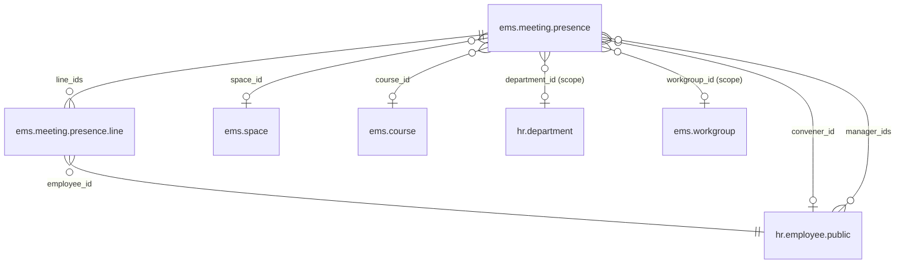
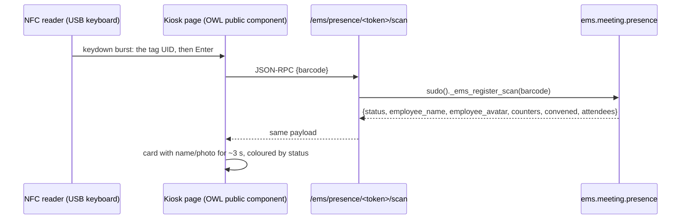
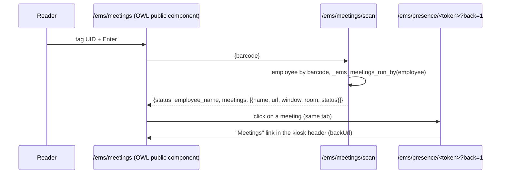

# Technical Reference: `ems.meeting.presence` (meeting attendance by NFC tag)

## Overview

A **presence session** records who was convened to one meeting (a staff meeting, a department meeting, a training) and who confirmed their attendance. A laptop with a USB NFC reader at the door runs the **kiosk**, a public page, and each person passes the same tag they already use to clock in. This is **not** time tracking: nothing is ever written to `hr.attendance`.

The native attendance kiosk cannot be reused for this. Every scan there toggles check-in/check-out, so someone who clocked in on arrival would be clocked **out** by passing the tag at the door. What is reused is the tag's identity (`hr.employee.barcode`, the tag's UID) and the shape of the public kiosk (a token in the URL, a JSON scan route, `sudo()` on the server).

**Module files:** `models/meetings/presence.py`, `models/meetings/presence_line.py`, `controllers/meeting_presence.py`, `static/src/js/frontend/meeting_presence_kiosk.js` (+ `static/src/xml/frontend/`, `static/src/scss/frontend/`), `reports/meetings/report_meeting_presence.xml`, `views/minutes_agreements/`.

---

## Data model

### `ems.meeting.presence` (`_inherit = ['ems.base']`: chatter, `active`)

| Field | Type | Description |
|-------|------|-------------|
| `name` | `Char` | What the meeting is, e.g. "Claustre". Required |
| `date` | `Datetime` | Start of the meeting. Defaults to now |
| `duration` | `Float` (hours) | Source of truth of the length. Defaults to 2 (`DEFAULT_DURATION`); constraint: greater than 0 |
| `date_end` | `Datetime` (computed, stored, `precompute`, inverse) | `date` + `duration`. Written by hand, its inverse turns it into the duration, so either can be set; moving `date` moves the whole window and keeps the length. The form's `onchange('date_end')` runs the same inverse so the duration updates as the user types |
| `space_id` | `Many2one → ems.space` | Optional room |
| `course_id` | `Many2one → ems.course` | Defaults to the current course |
| `company_id` | `Many2one → res.company` | Defaults to the current company; the scanned tag is only looked up among this company's employees |
| `convener_id` | `Many2one → hr.employee.public` | Who convenes the meeting. Defaults to the creator's employee, editable (the secretariat may create a meeting on someone else's behalf). Decides who can open the kiosk from the meetings page, see below |
| `manager_ids` | `Many2many → hr.employee.public` | Other people who can also open the kiosk from the meetings page |
| `scope` | `Selection` | Who is convened: `all_teachers` (default), `all_staff`, `department`, `workgroup`, `manual` |
| `department_id` / `workgroup_id` | `Many2one` | The target of the `department` / `workgroup` scope (required by a constraint for those scopes) |
| `state` | `Selection` | `draft` → `open` → `closed`, tracked |
| `access_token` | `Char` | Random, unique, `copy=False`; the kiosk's only credential |
| `kiosk_lang` | `Selection` | The language the kiosk page speaks. The visitor is anonymous (the public user is `en_US`), so the session decides: the language of whoever created it, editable |
| `kiosk_url` | `Char` (computed) | `<host>/ems/presence/<token>`; the host is the one the request came in through, not `web.base.url` (a restored production database keeps production's) |
| `line_ids` | `One2many` | One line per person |
| `convened_count`, `present_count`, `pending_count`, `justified_count`, `absent_count` | `Integer` (computed) | Counters shown in the form and on the kiosk |

### `ems.meeting.presence.line`

| Field | Type | Description |
|-------|------|-------------|
| `presence_id` | `Many2one` | `ondelete='cascade'` |
| `employee_id` | `Many2one → hr.employee.public` | Same comodel the minutes' attendee lists use, so the two can be linked without a translation step |
| `state` | `Selection` | `pending` (default) / `present` / `justified` / `absent` |
| `checkin_time` | `Datetime` | When the tag was passed (or when it was marked by hand) |
| `method` | `Selection` | `nfc` or `manual`; empty unless the person is present |
| `is_convened` | `Boolean` | `False` for someone who passed the tag without being convened |
| `notes` | `Char` | e.g. why an absence is justified |

`UNIQUE (presence_id, employee_id)`: one line per person and session.

---

## Rules

- **Convened list.** Created from the scope by `action_load_convened()`, which runs on `create()` for every scope but `manual` and can be run again from the form. It only **adds** people who are missing: it never removes a line, so a scan is never lost when the scope is changed afterwards.
  - `all_teachers`: `employee_type = 'teacher'`; `all_staff`: every active employee; `department`: the department and its children; `workgroup`: its members. All limited to the session's company.
- **Scan** (`_ems_register_scan(barcode)`, called by the controller with `sudo()`):
  1. If the session is not taking tags (`_ems_kiosk_status()`): `not_open` / `closed`. Nothing changes.
  2. Look the employee up by `barcode` in the session's company. No match: `unknown`.
  3. Already `present`: `already`. Otherwise the line becomes `present` (`checkin_time` = now, `method = 'nfc'`): `ok`. A person with no line gets one with `is_convened = False`: `not_convened`.
  - A second scan of the same person never creates a second line: the unique constraint plus a savepoint keeps two scans that arrive together (a double tap) from raising.
- **Time window.** A session takes tags only while it is `open` **and** now is between `date` and `date_end`, both included: before the start it answers `not_open` (the same "not started yet" a draft gives), after the end `closed`, whatever its own state. The session's state is not touched: it stays `open` until a manager closes it, which is also what turns the pending lines into absent. The window applies to the kiosk only; a manager can mark people by hand at any time while the session is not closed.
- **Closing** turns every `pending` line into `absent` and locks the lines: nothing can be created, edited or deleted in a closed session until it is reopened. A `justified` line stays justified.
- **Manual changes** to a line's `state` by a manager follow the same bookkeeping as a scan: `present` stamps `checkin_time` and `method = 'manual'`; any other state clears both. A `present` line cannot be deleted (mark it pending or absent first), and only a draft session can be deleted (archive the rest).
- **Kiosk security.** The token is the credential, as in `hr_attendance`. The kiosk page shows, besides the person who just scanned, who is still to come and who is in, **by name only** (`_ems_kiosk_progress()`): never a photo other than the scanner's own card, an address or anything else of a person. That is what anyone holding the link can read, so the link is to be treated as the list of names it shows: it is not published, and a session is only as private as its link.

---

## Kiosk

- `GET /ems/presence/<token>` renders `web.frontend_layout` with an `<owl-component name="ems.meeting_presence_kiosk">` (Odoo's `public_components` registry, bundled in `web.assets_frontend`). An unknown token is a 404; a known one renders the page whatever the state, and the page says whether the session is open.
- `POST /ems/presence/<token>/status` returns `{'status', 'present_count', 'pending_count', 'convened', 'attendees'}`. `convened` are the people still pending, alphabetical ignoring accents and case, on the left of the page; `attendees` the present ones, the latest arrival first with its local time and a flag for someone who was not convened, on the right. Someone justified is in neither. Every scan's answer carries the same two lists, so the page never waits for a poll to show who just came in. The page polls it every 5 seconds, so the kiosk switches on when the window starts and off when it ends (or when a manager closes or reopens the session) without reloading the laptop at the door. The page header shows the window (`windowLabel`, `_ems_window_label()`: local time, of the browser or else of the company, since the visitor is anonymous).
- `POST /ems/presence/<token>/scan` (`type='json'`, `auth='public'`) returns `{'status': ..., 'employee_name', 'employee_avatar', 'present_count', 'pending_count'}`; `status` is one of `ok`, `already`, `unknown`, `not_convened`, `not_open`, `closed`.
- **The input works like the clock-in kiosk's: there is no box to type in.** The reader is a USB keyboard that types the tag's UID and ends with Enter. A listener on the whole page (`useTagReader()`, `static/src/js/frontend/tag_reader.js`, shared with the meetings page) collects the keys exactly as Odoo's own barcode service does (`barcodes/static/src/barcode_service.js`, the one `hr_attendance`'s kiosk uses): only printable keys count, Enter or Tab ends a code, and so does the reader going quiet for 150 ms; a code of at least 3 keys is a tag. Somebody typing is too slow for that (each key empties the buffer before the next arrives), so typing a code by hand registers nothing. The service itself is not used, because it needs the web client's environment and this page is a public component; the rules are copied, and the tours play both a reader (a burst of `keydown` events, with and without the closing Enter) and a person typing.
- **The one exception is a box to type a code in, shown only outside production** (`_ems_show_code_box()`: `ems.environment_type != 'production'`, an undeclared one counting as not production), as a testing aid where there is no reader. It has its own submit and the page listener ignores keys typed into it. `deploy.sh` always declares production, so the real kiosk never has it.
- **Short names.** The lists show a name without its last surname (`kiosk_short_name()`, applied by `_ems_kiosk_names()`), to keep the rows short; the card in the middle and the PDF keep the whole name. An employee's name is a single string with nothing saying which words are given names and which are surnames, so the rule only drops the last word (with the particles that go with it: "Fernando del Olmo Fernández" becomes "Fernando del Olmo", "Josep Maria Vila i Serra" becomes "Josep Maria Vila") when that is safe, and **in any doubt the whole name stays**: a longer name is never a wrong one. It stays whole for a name of one or two words, when only a given name would be left ("Olga de la Morena", "Maribel del Tío") and for a three-word name whose second word is a common second given name ("Gerardo Jesús Nicolau", "Josep Manel Cos": `_SECOND_GIVEN_NAMES`, only names that are not also surnames). The one case it cannot tell is a three-word name whose second word is an uncommon given name. If two people of the company's staff would end up with the same short name, both keep their whole names; the comparison is against the whole staff, not against the meeting, so a name never changes on screen when somebody else comes in.
- **The two lists always fit.** `fitLists()` gives each list the biggest font (9 to 36 px) and the number of columns (1 to 6) with which every name shows without scrolling, measuring the widest row with the page's own font (canvas `measureText`) against the room the list has, and does it again whenever the lists change, the window is resized or the fonts arrive. A handful of names get one big column, a staff meeting's hundred get several small ones; only past the 9 px floor does a list scroll, as a last resort. The width goes to the lists: the card in the middle is narrow on purpose.
- The page asks `/status` only while its tab is visible (`document.hidden`), and once more as soon as it becomes visible again: a kiosk left open in a background tab costs the server nothing.
- On a server hosting several databases, the kiosk needs the database to be resolvable without a session (`dbfilter`, or `?db=<name>` on the URL), like any other public route.

---

## Meetings page (issue #526)

A fixed public address, `/ems/meetings`, that the computers with a reader keep open as their home page, so nobody has to carry each meeting's kiosk link over to them. It reads tags like the kiosk (`useTagReader()`), and each tag gets the list of meetings its owner can open today, each a link to its kiosk.

- **No token.** The address is fixed and predictable; the tag is the only credential. That was accepted on purpose: what it opens are kiosks, which only register attendance (and list names, see "Kiosk security").
- **`_ems_run_by(employee)`** decides whether an employee can open a meeting: its `convener_id`, one of its `manager_ids`, the company's Director (`res.company.director_id`, also for a meeting with no convener), or a chief above the convener in the chain of command. The chain is the tutor scope's (`hr.employee.tutor_scope_user_ids`, issue #483): every ancestor through `parent_id` whose user holds `ems.group_department_chief` (Seminar Chief, Department Chief, Head of Studies, Deputy, Director). So a Department Chief opens what their department's staff convene and a Deputy Head of Studies what their whole area convenes, but a chief of another branch does not. It resolves the real hierarchy instead of granting it by role centre-wide, as CLAUDE.md's permission-escalation rule asks.
- **`_ems_meetings_run_by(employee)`** lists the meetings of the employee's company in state `open` (the kiosk is published only once attendance is started) whose `date_end` has not passed and whose `date` is before the end of the current local day (tz of the context or of the company, via `ems.datetime_utils`), earliest first, filtered by `_ems_run_by()`. A draft, a closed session or one that already ended is left out, since its kiosk takes no tags.
- **`_ems_hub_scan(barcode)`** (called with `sudo()` from `POST /ems/meetings/scan`) returns `{'status': 'ok' | 'none' | 'unknown', 'employee_name', 'meetings'}`; each meeting carries its kiosk URL with `?back=1`, its window (`_ems_window_label()`), room and kiosk status (`open` / `not_open`).
- **`GET /ems/meetings`** renders `web.frontend_layout` with the `ems.meeting_presence_hub` public component. Its words come from `_ems_hub_labels()` in the company partner's language (the visitor is anonymous). The code box outside production (`_ems_show_code_box()`) is the same testing aid as the kiosk's.
- **The page clears itself** 30 seconds after a tag if nobody picks a meeting.
- **The way back.** The kiosk route takes `?back=1` and then passes `backUrl='/ems/meetings'`, shown as a "Meetings" link in the kiosk header. A kiosk opened straight from its own link has no such link.

---

## Access control

| Role | Sessions and lines |
|------|--------------------|
| Director, Head of Studies (`ems.group_head_of_studies`) | Full |
| Secretary (`ems.group_secretary`) | Full |
| Academic administrator (`ems.group_academic_admin`) | Full |
| Teacher and the rest | None: they only pass their tag |

The convener and managers of a meeting get no backend rights from those fields: they only decide who can open the kiosk from the meetings page.

There are no record rules: the sessions are centre-wide by nature (a staff meeting has no branch of the hierarchy to be scoped to), and the roles above are the ones that convene one. The quality administrator is deliberately left out for now: that role cannot read the courses, rooms, departments or workgroups a session points at (it implies neither `ems.group_teacher` nor `ems.group_secretary`), so opening a session would fail on them. It joins when the quality work's minutes land (issue #497), which brings its own quality groups. The *Meetings* root menu and its *Attendance* entry are visible to the same groups.

---

## Integration with the minutes (issue #497)

Built independently of the quality work's minutes (`ems.minute`), deliberately aligned with it: the *Meetings* root menu uses the same XML ID (`menu_minutes`) and `views/` folder (`views/minutes_agreements/`) that phase 2 uses, so both merge into one menu; the convened list uses the same comodel and the same scope semantics as the minutes' attendee preloading. The steps to join them once #497 lands are in `plans/meeting_presence_minute_integration.md`.
