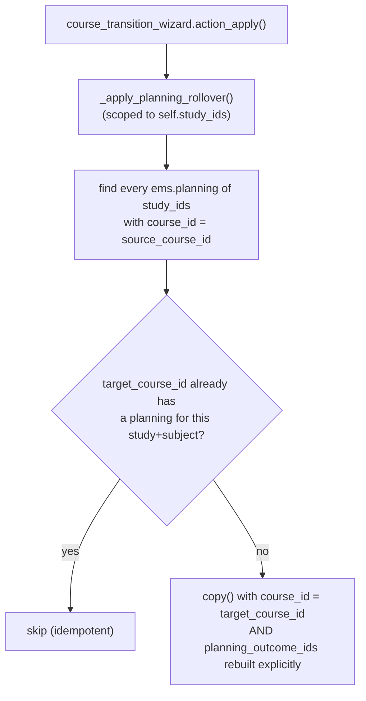
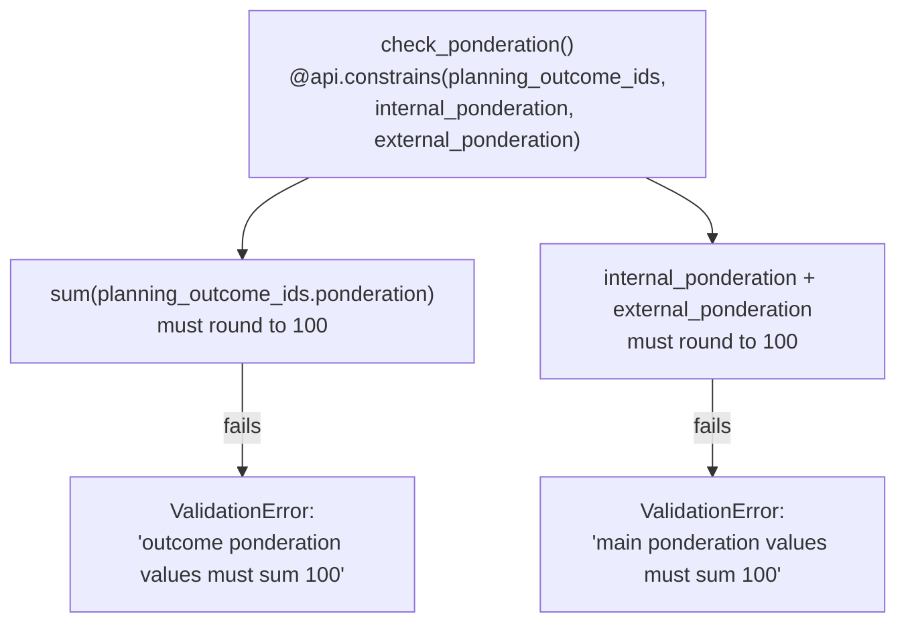
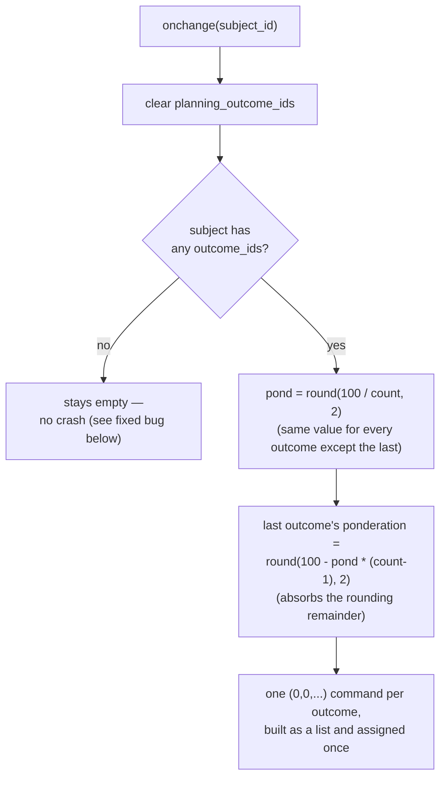

# Technical Reference: `ems.planning` / `ems.planning_outcome`

## Overview

`ems.planning` is, today, purely a **grading-ponderation configuration**: one record per
(study, subject, course), splitting 100% between an internal grade (from learning outcomes) and
an external one (e.g. work placement), and — via `ems.planning_outcome` — splitting the
internal 100% further across that subject's own learning outcomes. Despite the model's name
and description ("Curriculum deployment in the classroom"), it is not yet the broader
curriculum-planning feature that name implies — the code's own `TODO` comments say so
explicitly (a redactor-teacher field, a review/approval workflow) — it exists today solely to
feed [`ems.grade_session`](../grades/grade_session.md)'s `_final_from_parts()` formula and the
[grade review wizard](../grades/grade_review_wizard.md)'s "add a missing subject" flow.

A planning belongs to one specific academic year (`course_id`, issue #503) — ponderations can
change from one year to the next, so a grade correction on an old course must use the
ponderations that were actually in force *then*, not whatever is configured today. `ems.study`
is persistent (never recreated per year), so this course link is what makes a study+subject
combination able to have different ponderations across different years at all.

**Module files:** `models/planning/planning.py` (`EmsPlanning`),
`models/planning/planning_outcome.py` (`EmsPlanningOutcome`)

---

## Fields

| Model | Field | Notes |
|-------|-------|-------|
| `ems.planning` | `name` | Computed, `"{study.acronym}  {subject.display_name} ({course.name})"` (falls back to the course-less format while `course_id` is transiently empty — see below). |
| | `course_id` | The academic year this planning's ponderations apply to. **Not `required=True` at the DB level** (see "Why `course_id` isn't a hard-required field" below) — required at the application level instead, via `check_course_id_required`. |
| | `internal_ponderation`/`external_ponderation` | Default 90/10, but not fixed — `check_ponderation` only requires the two to sum to 100, nothing else. |
| | `planning_outcome_ids` | One row per outcome of `subject_id`, each carrying that outcome's share of the internal 100%. |
| `ems.planning_outcome` | `ponderation` | This outcome's share of the *internal* 100% (not of the overall subject grade — that's `internal_ponderation` × this value). |

`_sql_constraints`: `UNIQUE(study_id, subject_id, course_id)` on `ems.planning` — one planning
per study/subject/course triple, so the same study+subject can have a different planning each
year.

## Why `course_id` isn't a hard-required field

Data files (the centre's own `data/custom/ccff/ems.planning-*.csv`) create `ems.planning` rows
*during* module installation, before `res.company.current_course_id` can be resolved for a
fresh install (`post_init_hook`, which seeds it, runs strictly after every data file has already
loaded — see [`current_course_auto_seed`](../settings/company.md) for that mechanism). A DB-level
`NOT NULL` would make a clean install fail outright at that point. Instead:
- `course_id` defaults to `self.env.company.current_course_id` (safe for any real, UI-driven
  creation — by then the current course is always configured).
- `check_course_id_required` (`@api.constrains`) enforces it at the application level, skipping
  itself under `install_mode` — the exact same escape hatch `check_ponderation` already uses for
  the same reason (a CSV row's `planning_outcome_ids` also arrive empty on the same first pass).
- `post_init_hook` backfills `course_id` on any planning still empty, right after seeding the
  current course.

## Access: Head of Studies/Deputy see and edit every planning (issue #503)

Before this, HOS/DHOS (`ems.group_head_of_studies`, which implies `ems.group_teacher`) only
inherited the teacher-scoped rule below — they saw only the plannings of subjects they
personally teach via `ems.teaching`, same as a plain teacher, despite their role needing
centre-wide visibility.

| Rule | Group | Scope |
|------|-------|-------|
| `rule_planning_admin` | `group_academic_admin` | All (read/write/create/unlink) |
| `rule_planning_hos_all` | `group_head_of_studies` | All (read/write/create, **not** unlink) |
| `rule_planning_teacher_own_subjects` | `group_teacher` | Only subjects taught via `ems.teaching` (read-only) |

Both `ems.planning` and `ems.planning_outcome` carry the matching pair of rules
(`security/rules/planning.xml`). `ir.rule`s across different groups on the same model combine
with OR, so a HOS user (who also holds `group_teacher` by implication) effectively gets
`rule_planning_hos_all`'s unrestricted domain.

## "Show only mine" search filter

`is_own_subject` (compute + search, not stored) mirrors `res.partner.is_my_student`'s pattern
(issue #421): true when `subject_id` is one the current user personally teaches
(`user.employee_ids.teaching_ids.subject_id`). The list view's action defaults
`search_default_only_mine: 1`, so a HOS/DHOS's newly-widened access still defaults down to their
own taught subjects, with the usual searchbar facet to remove it and see everything.

---

## Rollover at course transition

**Gotcha, confirmed empirically 2026-09-23: `copy()` does NOT duplicate `planning_outcome_ids`
on its own.** A plain `one2many` field's `copy` attribute defaults to `False` in this Odoo
version — `copy()` alone silently drops the outcome lines. Both `_apply_planning_rollover()` and
the `18.0.0.28.0` migration's own history-replication step rebuild
`planning_outcome_ids` explicitly in the `copy()` call's `default` dict.

## Migrating an already-existing install's history

`migrations/18.0.0.28.0/post-migrate.py::_replicate_plannings_across_history` replicates every
pre-existing (course-less) planning across every course up to and including the current one, not
just onto the current course — so a grade correction against an old course's frozen record still
finds a planning, with the same ponderations that were live before this migration (a single
timeless row is treated as having applied to every year up to now).

## `check_ponderation`: two independent sum-to-100 rules

---

## `check_ponderation`: two independent sum-to-100 rules

Both are rounded to 2 decimals before comparing (`round(total, 2) != 100`) — floating-point
splits (e.g. 3 outcomes at 33.33/33.33/33.34) are expected to land exactly on 100 after
rounding, not merely "close enough."

`ems.planning_outcome.check_ponderation` is a second, narrower constraint: each individual
line's `ponderation` must be within `[0, 100]` — independent of whether the *set* sums to
100 (that's `ems.planning`'s own constraint, above).

## `_onchange_planning_outcome_ids`: even split, remainder on the last

Only a **starting point** — the form lets an admin/secretary hand-edit each outcome's
ponderation afterward, as long as `check_ponderation` still holds at save time.

## Fixed in this pass (2026-07-28)

**Real bug found and fixed:** `_onchange_planning_outcome_ids` divided `100 / count` with no
guard for `count == 0` — selecting a subject with no learning outcomes yet (an entirely
normal state for a newly created subject, before its outcomes are added) raised
`ZeroDivisionError`, crashing the form's onchange. Fixed with an early `continue` when the
subject has no outcomes (leaving `planning_outcome_ids` empty, letting `check_ponderation`
correctly reject the save with "must sum 100" once outcomes still don't exist). Regression
test: `test_onchange_with_no_outcomes_does_not_crash`.

Three `ValidationError`s across both files were plain, untranslated Python strings — wrapped
in `_()`, with new `ca_ES`/`es_ES` `.po` blocks (brand new text, not reused-label cases).
Classes renamed `ems_planning`/`ems_planning_outcome` → `EmsPlanning`/`EmsPlanningOutcome`.
Tab-indented → spaces. Loop variables `rec`/`pc`/`oc` → `planning`/`outcome_line`/`outcome`.
`_onchange_planning_outcome_ids` refactored to build the command list once and assign it in
a single step (matching the established idiom elsewhere in this codebase, e.g.
`attendance_session.py`'s `_auto_populate_lines`) instead of reassigning the one2many field
once per outcome inside the loop — behaviorally identical (each individual `(0, 0, ...)`
assignment is additive, not a replace, so the original was correct, just less idiomatic and
noisier on the ORM) but clearer and avoids N separate onchange-recompute cycles.

New `TestPlanningLogic` test class (7 tests: `_compute_name`, both `check_ponderation` rules
on `ems.planning`, `ems.planning_outcome`'s own range check, the even-split/remainder
onchange behavior, the zero-outcome regression, and re-triggering the onchange on a subject
change) — the existing `TestPlanningAccess` class only covered `ir.rule` access scoping
(teachers see/edit only the plannings of subjects they teach), not any of this model's own
logic.

## Not part of this pass

The model's own `TODO`s (multiple planning redactors, a review/approval workflow, broader
curriculum deployment beyond grading ponderation) are pre-existing, explicitly out-of-scope
feature work, not a DTON finding — left untouched.
