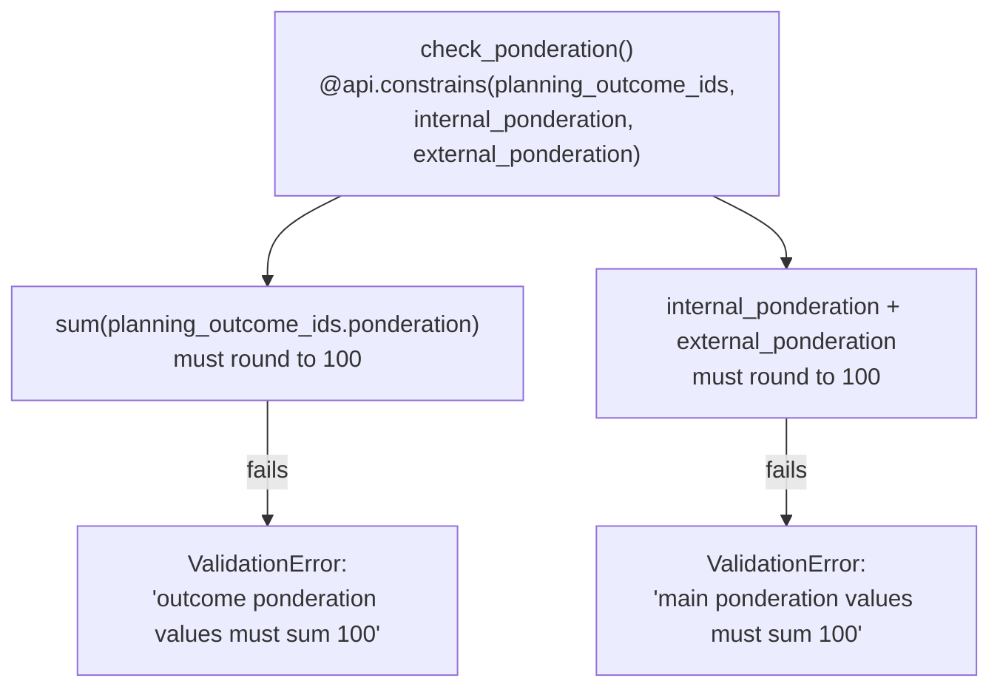
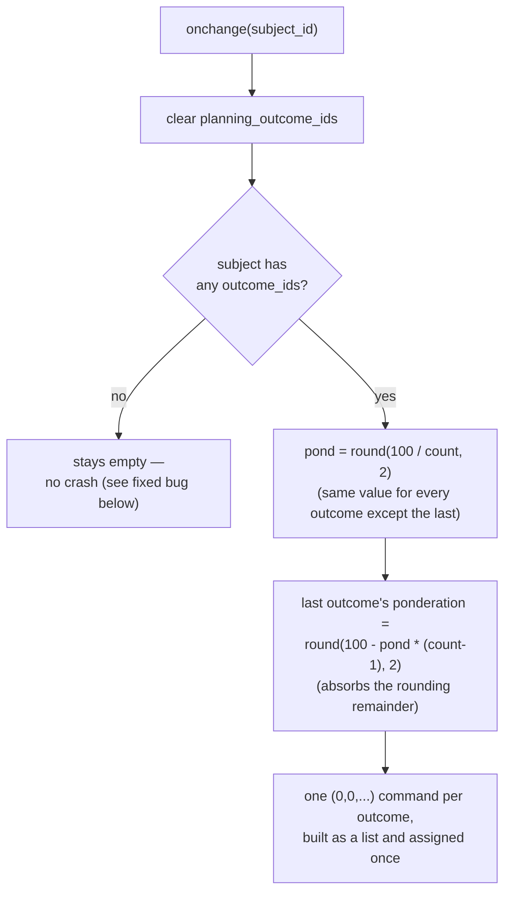

# Technical Reference: `ems.planning` / `ems.planning_outcome`

## Overview

`ems.planning` is, today, purely a **grading-ponderation configuration**: one record per
(study, subject), splitting 100% between an internal grade (from learning outcomes) and an
external one (e.g. work placement), and — via `ems.planning_outcome` — splitting the
internal 100% further across that subject's own learning outcomes. Despite the model's name
and description ("Curriculum deployment in the classroom"), it is not yet the broader
curriculum-planning feature that name implies — the code's own `TODO` comments say so
explicitly (a redactor-teacher field, a review/approval workflow) — it exists today solely to
feed [`ems.grade_session`](../grades/grade_session.md)'s `_final_from_parts()` formula.

**Module files:** `models/planning/planning.py` (`EmsPlanning`),
`models/planning/planning_outcome.py` (`EmsPlanningOutcome`)

---

## Fields

| Model | Field | Notes |
|-------|-------|-------|
| `ems.planning` | `name` | Computed, `"{study.acronym}  {subject.display_name}"` (note the double space — kept as-is, matches the original formatting). |
| | `internal_ponderation`/`external_ponderation` | Default 90/10, but not fixed — `check_ponderation` only requires the two to sum to 100, nothing else. |
| | `planning_outcome_ids` | One row per outcome of `subject_id`, each carrying that outcome's share of the internal 100%. |
| `ems.planning_outcome` | `ponderation` | This outcome's share of the *internal* 100% (not of the overall subject grade — that's `internal_ponderation` × this value). |

`_sql_constraints`: `UNIQUE(study_id, subject_id)` on `ems.planning` — one planning per
study/subject pair, full stop.

---

## `check_ponderation`: two independent sum-to-100 rules

Both are rounded to 2 decimals before comparing (`round(total, 2) != 100`) — floating-point
splits (e.g. 3 outcomes at 33.33/33.33/33.34) are expected to land exactly on 100 after
rounding, not merely "close enough."

`ems.planning_outcome.check_ponderation` is a second, narrower constraint: each individual
line's `ponderation` must be within `[0, 100]` — independent of whether the *set* sums to
100 (that's `ems.planning`'s own constraint, above).

## `_onchange_planning_outcome_ids`: even split, remainder on the last

Only a **starting point** — the form lets an admin/secretary hand-edit each outcome's
ponderation afterward, as long as `check_ponderation` still holds at save time.

## Fixed in this pass (2026-07-28)

**Real bug found and fixed:** `_onchange_planning_outcome_ids` divided `100 / count` with no
guard for `count == 0` — selecting a subject with no learning outcomes yet (an entirely
normal state for a newly created subject, before its outcomes are added) raised
`ZeroDivisionError`, crashing the form's onchange. Fixed with an early `continue` when the
subject has no outcomes (leaving `planning_outcome_ids` empty, letting `check_ponderation`
correctly reject the save with "must sum 100" once outcomes still don't exist). Regression
test: `test_onchange_with_no_outcomes_does_not_crash`.

Three `ValidationError`s across both files were plain, untranslated Python strings — wrapped
in `_()`, with new `ca_ES`/`es_ES` `.po` blocks (brand new text, not reused-label cases).
Classes renamed `ems_planning`/`ems_planning_outcome` → `EmsPlanning`/`EmsPlanningOutcome`.
Tab-indented → spaces. Loop variables `rec`/`pc`/`oc` → `planning`/`outcome_line`/`outcome`.
`_onchange_planning_outcome_ids` refactored to build the command list once and assign it in
a single step (matching the established idiom elsewhere in this codebase, e.g.
`attendance_session.py`'s `_auto_populate_lines`) instead of reassigning the one2many field
once per outcome inside the loop — behaviorally identical (each individual `(0, 0, ...)`
assignment is additive, not a replace, so the original was correct, just less idiomatic and
noisier on the ORM) but clearer and avoids N separate onchange-recompute cycles.

New `TestPlanningLogic` test class (7 tests: `_compute_name`, both `check_ponderation` rules
on `ems.planning`, `ems.planning_outcome`'s own range check, the even-split/remainder
onchange behavior, the zero-outcome regression, and re-triggering the onchange on a subject
change) — the existing `TestPlanningAccess` class only covered `ir.rule` access scoping
(teachers see/edit only the plannings of subjects they teach), not any of this model's own
logic.

## Not part of this pass

The model's own `TODO`s (multiple planning redactors, a review/approval workflow, broader
curriculum deployment beyond grading ponderation) are pre-existing, explicitly out-of-scope
feature work, not a DTON finding — left untouched.
