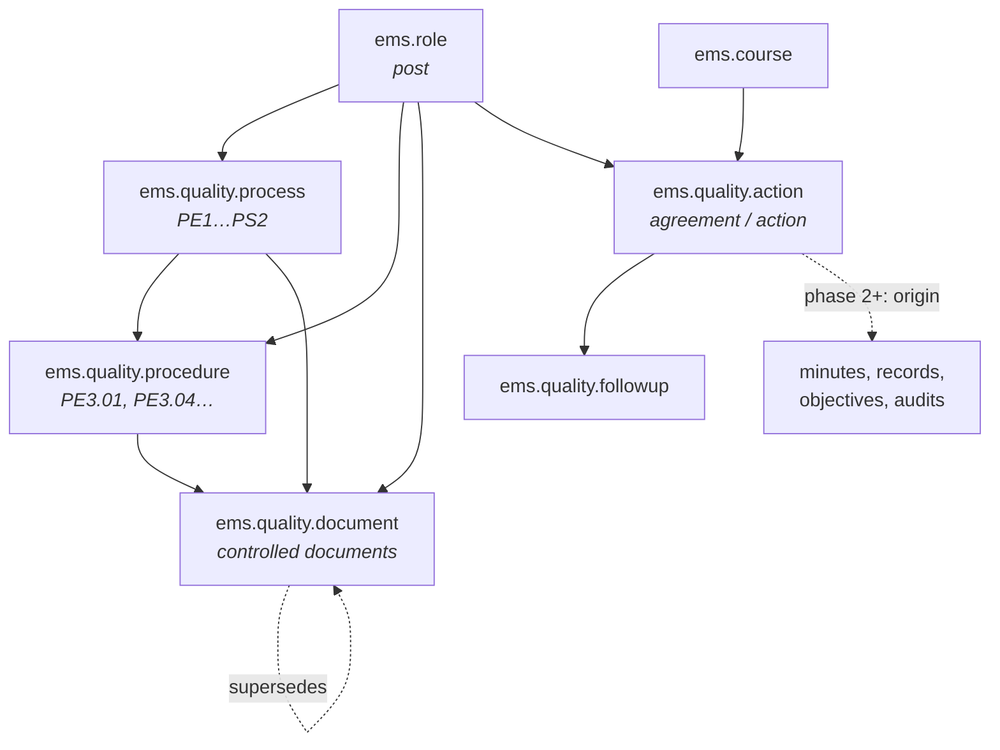

# Technical Reference: quality management (`ems.quality.*`)

## Overview

The `ems.quality.*` models bring the centre's ISO 9001 quality management system inside EMS. **This
document is the area overview**; each model gets its own reference as it lands. The design of record for
the whole feature, including the phases still to come, is `plans/quality_iso.md`.

**Phase 1 (this one) delivers the foundation:** the process map, the controlled-document registry, and the
unified action/agreement model. It is visible only to quality coordination and management; the
staff-facing application arrives in phase 2 with the minutes.

**Module files:** `models/quality/` · **Views:** `views/quality/` · **Security:**
`security/groups.xml`, `security/ir.model.access.csv`, `security/rules/quality.xml`

---

## Model map



Three ideas carry the whole area and are worth stating before the field tables:

1. **Responsibility is a post, not a person.** Every owner field points at `ems.role` (Director, Head of
   studies, Secretary, Quality coordinator…) and resolves to the employee holding it. The centre's own
   records work this way, and it survives someone changing job in September.
2. **An agreement and an improvement action are the same thing.** One model, `ems.quality.action`, with a
   `type`. That is what makes a single "what do I owe and by when" screen possible instead of one per
   origin.
3. **State is computed, never typed.** It derives from the latest follow-up entry, so changing state
   requires recording why.

---

## `ems.quality.process`

The eight processes of the centre's map: strategic (`PE*`), key (`PC*`) and support (`PS*`).

| Field | Type | Notes |
|-------|------|-------|
| `code` | `Char`, required, unique | `PE1`…`PS2` |
| `name` | `Char`, required, translatable | |
| `kind` | `Selection` | `strategic` / `key` / `support` |
| `responsible_role_id` | `Many2one → ems.role` | The post responsible for the process |
| `responsible_employee_ids` | computed, not stored | The employees currently holding that post |
| `is_quality_process` | `Boolean` | Answers the management review's "is this a quality process?" |
| `swot_review_date` | `Date` | When the process's SWOT was last reviewed |
| `procedure_ids` | `One2many` | |
| `sequence`, `active` | | |

## `ems.quality.procedure`

| Field | Type | Notes |
|-------|------|-------|
| `code` | `Char`, required, unique | `PE3.01` |
| `name` | `Char`, required, translatable | |
| `process_id` | `Many2one`, required | |
| `what` / `what_for` / `for_whom` | `Text`, translatable | The three opening blocks of the centre's procedure sheet |
| `responsible_role_id` | `Many2one → ems.role` | Who drafts and maintains it |
| `phase_ids` | `One2many → ems.quality.procedure.phase` | `sequence`, `name`, `tools` |
| `document_ids` | `One2many → ems.quality.document` | Its records and documentation |

## `ems.quality.document` — the controlled-document registry

The file itself stays in the centre's Drive. This model records **what it is, who owns it, which version
it is at, and where it lives**.

| Field | Type | Notes |
|-------|------|-------|
| `code` | `Char`, unique when set | `PE3.01.15`. Nullable: a document can be registered before it is coded |
| `name` | `Char`, required | |
| `kind` | `Selection` | `procedure` / `record` / `template` / `strategic` / `form` / `manual` |
| `process_id` / `procedure_id` | `Many2one` | `process_id` is computed from the procedure when there is one |
| `responsible_role_id` | `Many2one → ems.role` | |
| `version` | `Char` | |
| `approval_date`, `revision_date`, `next_review_date` | `Date` | What the management review asks for |
| `state` | `Selection` | `draft` → `review` → `approved` → `obsolete` |
| `superseded_by_id` | `Many2one` self | Set when a document is replaced; `obsolete` without it is a loose end |
| `requested_by_role_id`, `request_date`, `due_date` | | The request side of the lifecycle |
| `url`, `drive_file_id` | `Char` | **Deliberately not `data/custom/` CSV columns** — live application state, loaded separately. See below |
| `is_minute_template` | `Boolean` | Phase 2 uses it from `ems.minute.type` |
| `published_moodle`, `published_web`, `published_mail` (+ dates) | | Distribution channels, today maintained by hand in three places |
| `is_legacy_code` | computed, stored | True when the code does not resolve to any process in the current map — catches documents still carrying codes from a superseded scheme |

### Why the links are not in the data files

`url` and `drive_file_id` change whenever a document is replaced, which makes them live application state.
The repository's conventions say a field the running application mutates must not be a synced CSV column
(same carve-out as `ems.course.is_current` and `ir.sequence.number_next_actual`): a synced column would
revert the change on the next upgrade. They are loaded from a `code,url` file kept outside the repository.

The registry as a whole is **seeded once and then frozen** via
`res.company._ems_freeze_living_custom_data()`, the mechanism already used for `ems.group`, because
versions and states change from the interface.

## `ems.quality.action` — agreements and improvement actions

| Field | Type | Notes |
|-------|------|-------|
| `code` | `Char`, readonly | Issued by sequence — see *Numbering* |
| `name` | `Char`, required | "Action to take" / "Agreement" |
| `description` | `Html` | |
| `type` | `Selection`, required | `agreement`, `immediate`, `repair`, `corrective`, `preventive`, `improvement`, `change` |
| `responsible_role_id` | `Many2one → ems.role` | |
| `responsible_employee_ids` | `Many2many → hr.employee` | The centre's real data holds values like "\<name\> + volunteers", so several people must be expressible alongside the post |
| `deadline_date` | `Date` | |
| `deadline_text` | `Char` | Real deadlines are often prose ("by the final meeting of the year"); both are kept |
| `resources` | `Char` | |
| `completion_criteria` / `efficacy_criteria` | `Text` | "When will it be finished" / "How will efficacy be measured" |
| `department_id` / `workgroup_id` / `group_id` / `is_centre` | | The scope: drives the sequence, the filters and the record rules |
| `course_id` | `Many2one → ems.course`, required | |
| `followup_ids` | `One2many` | |
| `state` | `Selection`, computed, stored | See *State* |
| `is_late` | `Boolean`, computed, stored | Past its deadline and not closed |

Phase 2 onwards adds the origin (`minute_id`, `issue_id`, `objective_id`, `audit_id`, `review_id`), of
which exactly one is set.

## `ems.quality.followup`

| Field | Type | Notes |
|-------|------|-------|
| `date` | `Date`, required | |
| `state` | `Selection`, required | The five stages below |
| `description` | `Text`, required | What happened |
| `author_employee_id` | `Many2one → hr.employee` | Defaults to the current user's employee |
| `action_id` | `Many2one` | Phase 3 adds `issue_id`, with exactly one of the two set |

---

## State

```
no owner and no deadline yet     → New (pending)
planned but no follow-up yet     → Analysed (planning)
otherwise                        → the state of the latest follow-up entry
```

The five stages, matching the centre's own vocabulary: `new` New (pending), `analysed` Analysed
(planning), `in_progress` In progress (implementation), `review` Review (measuring efficacy), `closed`
Closed. **Open means anything not closed** — there is no separate open flag, and no editable state field:
moving forward requires a follow-up entry, which is what keeps the reason on record.

## Numbering

`ir.sequence`, one per (scope, element type, course), resolved or created on demand by
`ems.quality.action._ems_sequence_for_scope()`. A hand-rolled `max + 1` is not used: it loses to
concurrent writes when two people approve records at the same time.

| Element | Code | Counter |
|---|---|---|
| Agreement or action | `ACORD-INF-2026-27-012` | per scope and course |
| Records (phase 3) | `NC-2026-27-007` | per centre and course |

The academic year segment comes from `ems.course.short_code`, a stored computed field (`2026-27`) that is
the single source of that string. Note `ir.sequence.number_next_actual` is live application state and must
never appear in a data file.

---

## Access control

Two new groups: `ems.group_quality_coordinator` (quality coordination) and
`ems.group_quality_committee` (the quality committee).

| Model | Teacher | Dept. head | Head of studies | Secretariat | Quality coord. | Committee | Management |
|---|---|---|---|---|---|---|---|
| `ems.quality.process` | — | R | R | R | R+W | R | R+W |
| `ems.quality.procedure` | — | R | R | R | R+W | R | R+W |
| `ems.quality.document` | R approved | R+W own | R | R | R+W | R | R+W |
| `ems.quality.action` | R+W own | R+W in scope | R in their line | R | R+W | R+W | R+W |
| `ems.quality.followup` | R+W own actions | R+W in scope | R | R | R+W | R+W | R+W |

Escalation follows the **real hierarchy**, not flat group membership: a department head sees their own
department's scope, and above them their own head of studies and management — not every holder of those
posts. Reuse the `tutor_scope_user_ids` / `find_head_of_studies()` patterns rather than an `ir.rule` with
`domain_force=[]`.

The *Quality* root menu is restricted to quality coordination, the committee, management, the head of
studies and the secretariat. The staff-facing menu does not exist in this phase.
