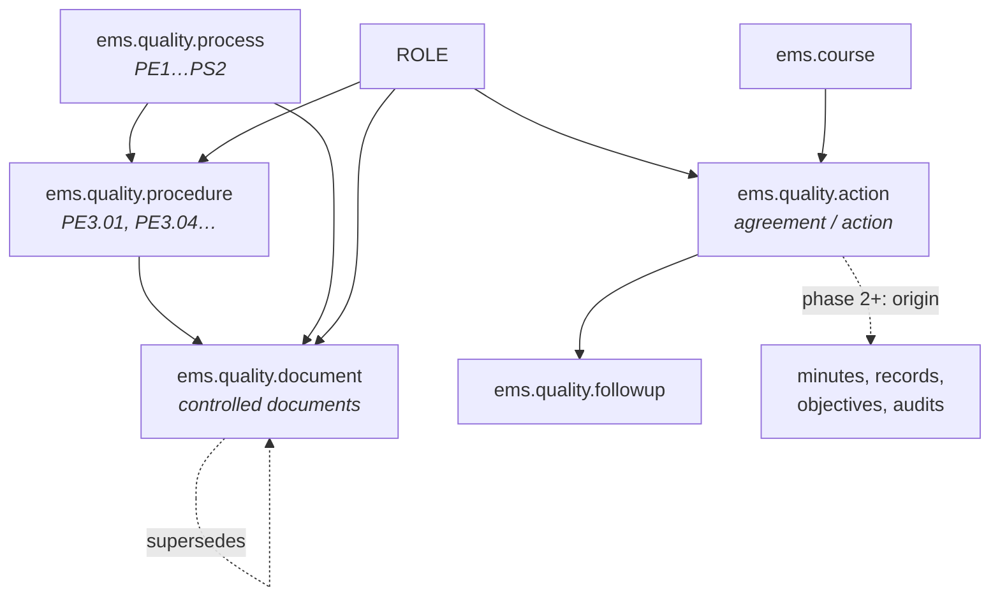

# Technical Reference: quality management (`ems.quality.*`)

## Overview

The `ems.quality.*` models bring the centre's ISO 9001 quality management system inside EMS. **This
document is the area overview**; each model gets its own reference as it lands. The design of record for
the whole feature, including the phases still to come, is `plans/quality_iso.md`.

**Phase 1 (this one) delivers the foundation:** the embedded process map, the documentary structure
(processes, procedures and documents, each with its Drive link), and the unified action/agreement model. It is visible only to quality coordination and management; the
staff-facing application arrives in phase 2 with the minutes.

**Module files:** `models/quality/` · **Views:** `views/quality/` · **Security:**
`security/groups.xml`, `security/ir.model.access.csv`, `security/rules/quality.xml`

---

## Model map



Three ideas carry the whole area and are worth stating before the field tables:

1. **One owner per piece of information.** A controlled document lives in the centre's Drive, and its
   version, state, dates and owner are written there and only there. EMS keeps where each document sits
   in the structure and its link, nothing else, so nobody updates the same thing twice.
2. **Responsibility is a post, not a person.** Every owner field of an action points at `ems.role`
   (Director, Head of studies, Secretary, Quality coordinator…) and resolves to the employee holding it. The centre's own
   records work this way, and it survives someone changing job in September.
3. **An agreement and an improvement action are the same thing.** One model, `ems.quality.action`, with a
   `type`. That is what makes a single "what do I owe and by when" screen possible instead of one per
   origin.
4. **State is computed, never typed.** It derives from the latest follow-up entry, so changing state
   requires recording why.

---

## Documentary structure

Three models, under `Quality > Documentation` (with the process map first, so it is what clicking
*Quality* opens), that hold **only the structure and the links**:

| Model | Fields |
|-------|--------|
| `ems.quality.process` | `code` (unique, `PE1`…`PS2`), `name`, `kind` (`strategic` / `key` / `support`), `sequence`, `active`, `procedure_ids`, `document_ids`, `url`, `embed_url` |
| `ems.quality.procedure` | `code` (unique, `PE3.01`), `name`, `process_id` (required), `document_ids`, `active`, `url`, `embed_url` |
| `ems.quality.document` | `code` (unique when set, nullable: some documents have no code yet), `name`, `procedure_id`, `process_id` (computed from the procedure, editable when there is none), `url`, `embed_url`, `is_process_map`, `active` |

A process and a procedure each have their own sheet in Drive (the one the process map links to), so
all three carry a link, through the shared abstract model `ems.quality.link` (`models/quality/link.py`).
The process and procedure forms show it in a first **Document** tab.

There is deliberately **no version, state, date, owner or distribution field**: the document itself, in
Drive, is the only place those are kept. A document no longer in force is archived (`active = False`).

### One link per record, previewed inside EMS

`url` (from `ems.quality.link`) is the ordinary address people copy from the browser; **Open document**
(`action_open_document`) opens it in a new tab, where Google Docs edits it. `embed_url` is derived from it
(`_EMBEDDABLE_LINKS` in `models/quality/link.py`, which also accepts the `/u/<n>/` form some links carry): Google's own `/preview` address for Docs, Sheets,
Slides, Drawings and Drive files, which the forms show in an `<iframe>` across the full width of the window (the three forms carry
`class="o_quality_wide_form"`, `static/src/css/backend/quality_document.css`) (field widget
`ems_quality_document_preview`, `static/src/js/backend/quality_document_fields.js`). No second link, no
"Publish to the web" copy and no extra module: the frame is served by Google and follows the file's own
sharing, so the viewer's browser must be signed in to a Google account that can open the file. Any other
address gets no preview, only the button.

### Process map

`Quality > Process map`, the first entry of the app, is a server action
(`ems.action_quality_process_map_open` → `ems.quality.document.action_open_process_map()`) that opens the
form of the document with `is_process_map` set, so the map is an ordinary document of the structure: its
link is changed from its own form. A constraint keeps a single one marked. Seeded as
`__import__.quality_doc_process_map` ("Mapa de processos", the Drive title), without its link.

### Read-only until "Edit"

The three models inherit `ems.quality.edit.mode` (`models/quality/edit_mode.py`): a non-stored
`edit_mode` that always loads False (True for a record being created) and `can_edit`
(`has_access('write')`). Every field of their forms is `readonly="not edit_mode"`, and the header shows
an **Edit** button (field widget `ems_quality_edit_mode`) only when `can_edit`. Pressing it sets
`edit_mode` on the client; saving or discarding reloads the record, so it comes back read-only. Record
access is unchanged: this is only about not presenting every field as editable by default.

There is no configuration menu: everyone with the *Quality* menu consults the structure under
*Documentation*, and whoever may write changes it with *Edit* on the record itself. The document list is
not editable in place, so every change goes through the form. Its *Load links* button (quality
coordination and management) opens `ems.quality.document.link.import`, which fills `url` from a
`code,url` file in one go, matching each code against documents, procedures and processes.

### Why the links are not in the data files

The links point into the centre's Drive, and several of those documents are shared by link: publishing
them in this public repository would expose them. So `url` is not a `data/custom/` CSV column; it is
filled in from the interface, or loaded with the wizard from a file kept outside the repository.

The three models are **seeded once and then frozen** via
`res.company._ems_freeze_living_custom_data()`, the mechanism already used for `ems.group`: the quality
coordination keeps the structure from the interface, and a synced CSV would revert those edits on the
next upgrade.

### Why the seeded names are in Catalan

The process map, the procedures, the document registry, the minute types and the minute sections are
seeded from `data/custom/quality/*.csv` with their **Catalan** names, taken verbatim from the centre's
own controlled documents. Those records are owned by `__import__`, and `.po` translation never reaches
them: the exporter (`TranslationModuleReader._export_translatable_records`) only looks at
`ir_model_data` rows whose `module` is a module being exported, and `__import__` is not a module. The
value written by the CSV — stored under the `en_US` key of the jsonb field — is therefore what every
reader sees, whatever their language, so it has to be the wording the centre actually uses.

Module strings (field labels, menus, buttons, report headings, selection values) are unaffected: they
stay English in the source and are translated through `i18n/ca_ES.po` and `i18n/es_ES.po` as usual.

## `ems.quality.action` — agreements and improvement actions

| Field | Type | Notes |
|-------|------|-------|
| `code` | `Char`, readonly | Issued by sequence — see *Numbering* |
| `name` | `Char`, required | "Action to take" / "Agreement" |
| `description` | `Html` | |
| `type` | `Selection`, required | `agreement`, `immediate`, `repair`, `corrective`, `preventive`, `improvement`, `change` |
| `responsible_role_id` | `Many2one → ems.role` | |
| `responsible_employee_ids` | `Many2many → hr.employee` | The centre's real data holds values like "\<name\> + volunteers", so several people must be expressible alongside the post |
| `deadline_date` | `Date` | |
| `deadline_text` | `Char` | Real deadlines are often prose ("by the final meeting of the year"); both are kept |
| `resources` | `Char` | |
| `completion_criteria` / `efficacy_criteria` | `Text` | "When will it be finished" / "How will efficacy be measured" |
| `department_id` / `workgroup_id` / `group_id` / `is_centre` | | The scope: drives the sequence, the filters and the record rules |
| `course_id` | `Many2one → ems.course`, required | |
| `followup_ids` | `One2many` | |
| `state` | `Selection`, computed, stored | See *State* |
| `is_late` | `Boolean`, computed, stored | Past its deadline and not closed |

Phase 2 onwards adds the origin (`minute_id`, `issue_id`, `objective_id`, `audit_id`, `review_id`), of
which exactly one is set.

## `ems.quality.followup`

| Field | Type | Notes |
|-------|------|-------|
| `date` | `Date`, required | |
| `state` | `Selection`, required | The five stages below |
| `description` | `Text`, required | What happened |
| `author_employee_id` | `Many2one → hr.employee` | Defaults to the current user's employee |
| `action_id` | `Many2one` | Phase 3 adds `issue_id`, with exactly one of the two set |

---

## State

```
no owner and no deadline yet     → New (pending)
planned but no follow-up yet     → Analysed (planning)
otherwise                        → the state of the latest follow-up entry
```

The five stages, matching the centre's own vocabulary: `new` New (pending), `analysed` Analysed
(planning), `in_progress` In progress (implementation), `review` Review (measuring efficacy), `closed`
Closed. **Open means anything not closed** — there is no separate open flag, and no editable state field:
moving forward requires a follow-up entry, which is what keeps the reason on record.

## Numbering

`ir.sequence`, one per (scope, element type, course), resolved or created on demand by
`ems.quality.action._ems_sequence_for_scope()`. A hand-rolled `max + 1` is not used: it loses to
concurrent writes when two people approve records at the same time.

| Element | Code | Counter |
|---|---|---|
| Agreement or action | `ACORD-INF-2026-27-012` | per scope and course |
| Records (phase 3) | `NC-2026-27-007` | per centre and course |

The academic year segment comes from `ems.course.short_code`, a stored computed field (`2026-27`) that is
the single source of that string. Note `ir.sequence.number_next_actual` is live application state and must
never appear in a data file.

---

## Access control

Two new groups: `ems.group_quality_coordinator` (quality coordination) and
`ems.group_quality_committee` (the quality committee).

| Model | Teacher | Dept. head | Head of studies | Secretariat | Quality coord. | Committee | Management |
|---|---|---|---|---|---|---|---|
| `ems.quality.process` | — | R | R | R | R+W | R | R+W |
| `ems.quality.procedure` | — | R | R | R | R+W | R | R+W |
| `ems.quality.document` | R | R+W | R | R | R+W | R | R+W |
| `ems.quality.action` | R+W own | R+W in scope | R in their line | R | R+W | R+W | R+W |
| `ems.quality.followup` | R+W own actions | R+W in scope | R | R | R+W | R+W | R+W |

Escalation follows the **real hierarchy**, not flat group membership: a department head sees their own
department's scope, and above them their own head of studies and management — not every holder of those
posts. Reuse the `tutor_scope_user_ids` / `find_head_of_studies()` patterns rather than an `ir.rule` with
`domain_force=[]`.

The *Quality* root menu is restricted to quality coordination, the committee, management, the head of
studies and the secretariat. The staff-facing menu does not exist in this phase.
