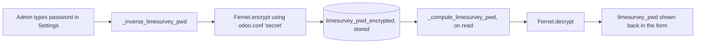

# Technical Reference: `res.company` (EMS extension)

## Overview

`models/settings/company.py` extends Odoo's single `res.company` record with every centre-wide configuration value EMS needs. It has no view of its own — everything here is rendered through `views/settings/form.xml` (the "EMS Management" app tab on the Settings page).

This doc is primarily a **map**: most of these fields already have their own detailed technical doc from the feature that owns them. Where that's the case, this doc only lists the field and links out, rather than duplicating.

**Module file:** `models/settings/company.py`

---

## Fields, grouped by area

### Course

| Field | Type | Documented in |
|-------|------|----------------|
| `current_course_id` | `Many2one → ems.course` | [ems.course](course.md) — `_sync_current_course_flag()` keeps `ems.course.is_current` in step with this |

### Director / academic hierarchy

| Field | Type | Documented in |
|-------|------|----------------|
| `director_id` | `Many2one → hr.employee` | [Department Chief / HoS / Director cascade](../employees/department.md) — `write()` here (lines ~99–111) is what actually drives `hr.employee.parent_id` and the `role_director` role sync when this changes |

### Teacher schedules

| Field | Type | Documented in |
|-------|------|----------------|
| `default_schedule_framework_id` | `Many2one → resource.calendar` (required) | [Teacher working schedules & schedule frameworks](../employees/working_schedule.md) |
| `schedule_import_first_entry_time` | `Float`, default `8.0` | Same doc — bounds for the XML schedule importer |
| `schedule_import_last_entry_time` | `Float`, default `21.0` | Same doc |

### Attendance & coexistence

| Field | Type | Documented in |
|-------|------|----------------|
| `strike_escalation_threshold` | `Integer`, default `3` | [ems.strike](../coexistence/strike.md) |
| `auto_checkin_mode` | `Selection` (`disabled`/`first`/`start`/`current`), default `disabled` | Not yet documented elsewhere — used by the employee auto-checkin flow (`models/employees/employee_autocheckout.py` and related) |
| `auto_checkout_mode` | `Selection` (`native`/`ems`), default `native` | Same as above |
| `auto_checkout_time` | `Float`, default `1.0` | Same as above |
| `auto_checkout_retry_until` | `Float`, default `6.0` | Same as above |
| `attendance_issue_status_delay` | `Integer` (minutes), default `15` | Used by `ems.attendance_session_header.time_float_to_utc_datetime`-based deadline computation (`models/attendance/attendance_session.py`) — governs how long a session stays "pending" before a status is required |
| `attendance_issue_tutor_default` | `Float`, default `21.0` | Same file — the fallback time-of-day used for the tutor notification ETA |

### GEDAC / centre identity

| Field | Type | Documented in |
|-------|------|----------------|
| `center_code` | `Char` | Not yet documented elsewhere — official Departament d'Educació centre code (e.g. `08028047`, leading zero included); the GEDAC applicant importer (`ems.applicant_import_wizard`) uses it to keep only rows assigned to this centre, ignoring the leading zero the source Excel drops |
| `secretariat_email` | `Char` | Not yet documented elsewhere — recipient for messages addressed to the centre's secretariat (e.g. portal personal-data change requests) |

### Google Workspace

| Field | Type | Documented in |
|-------|------|----------------|
| `google_ws_enabled`, `google_ws_domain`, `google_ws_ou_minor`, `google_ws_ou_adult`, `google_ws_ou_suspended`, `google_ws_ou_teacher`, `google_ws_ou_asp`, `google_ws_ou_staff_suspended`, `google_ws_dry_run` | Various | [Google Workspace staff integration](../employees/google_workspace_staff.md) |
| `google_ws_sa_json` / `google_ws_sa_json_encrypted` | `Text` (computed, Fernet-encrypted at rest) | See "Encrypted credential fields" below — the encryption pattern itself isn't covered in the Google Workspace doc |

### LimeSurvey

| Field | Type | Documented in |
|-------|------|----------------|
| `limesurvey_api`, `limesurvey_usr`, `limesurvey_gid` | `Char`/`Integer` | Not yet documented elsewhere (LimeSurvey integration doesn't have a dedicated dev doc yet — out of scope for this DTON pass) |
| `limesurvey_pwd` / `limesurvey_pwd_encrypted` | `Char` (computed, Fernet-encrypted at rest) | See "Encrypted credential fields" below |

---

## Encrypted credential fields

`limesurvey_pwd` and `google_ws_sa_json` follow the identical pattern: a non-stored computed field (`compute=`/`inverse=`) that transparently encrypts/decrypts a stored `..._encrypted` companion field using [Fernet symmetric encryption](https://cryptography.io/en/latest/fernet/), keyed from the Odoo instance's own `secret` config value (`odoo.conf`'s `secret =`, via `odoo.tools.config`).

- `_get_fernet_key()` raises `ValueError` if `odoo.conf` has no `secret =` line — this would surface as a hard error the moment anyone reads or writes either credential field, not a silent failure.
- Decryption failures (corrupted/foreign data in the `_encrypted` column, or a `secret` that's changed since the value was encrypted) are caught and degrade to `False` rather than raising — the admin would see an empty password field instead of a crash, and would need to re-enter the credential.
- Neither field is ever plain-text in the database; only `..._encrypted` is stored.

**Fixed bug (this DTON pass):** `_inverse_google_ws_sa_json`'s falsy branch referenced an undefined `record` variable (leftover from a find/replace that missed one line) — clearing `google_ws_sa_json` via `write()` raised a `NameError` instead of clearing the encrypted column. Caught by the test added in this pass (`test_google_ws_sa_json_cleared`); there was no prior test exercising this path.

---

## Access Control

`res.company` uses Odoo's standard multi-company access rules — every field here inherits those, there are no EMS-specific `ir.model.access.csv` entries for `res.company`. In practice only administrators reach the Settings screen these fields live on (the "EMS Management" Settings tab has no additional group restriction beyond Odoo's own Settings access).

---

## Views

| View | File | Notes |
|------|------|-------|
| Settings form | `views/settings/form.xml` | Inherits `base.res_config_settings_view_form`; the "EMS Management" app tab (`ems.action_settings`) renders every field above in one long form, alongside the (separate) "Setup next course" TODO block covered in [ems.course](course.md) |
| Other inherited Settings tabs | `views/settings/hr_employees_form.xml`, `views/settings/hr_attendance_form.xml`, `views/settings/res_users_form.xml` | Extend *other* apps' own Settings tabs (Employees, Attendances) rather than the EMS one — out of scope here |

The one browser tour covering the Settings screen ([`ems_course_settings`](course.md)) already renders this entire form (all fields above are mounted in the DOM when it runs), so the "does this view crash" risk DTON tours exist to catch is already covered for every field on this page — a second, dedicated tour would be redundant.
