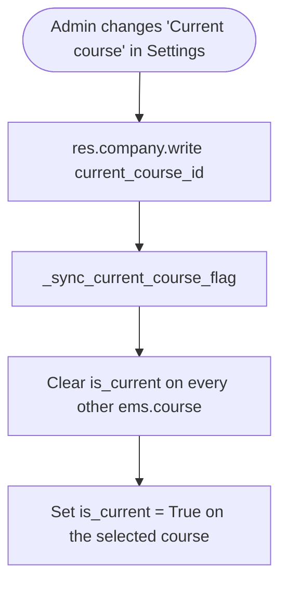

# Technical Reference: `ems.course`

## Overview

`ems.course` represents an academic year window (e.g. `2025-2026`). Its two flags are driven from the Settings page, each by its own selector on `res.company`: **Current course** (`current_course_id` → `is_current`) and **Enrollment course** (`enrollment_course_id` → `is_enrollment_default`).

**Module file:** `models/settings/course.py`

---

## Course management UI

Both flags are managed from **Settings → EMS Management → Course Management Settings**, each
through its own selector: **Current course** (`res.company.current_course_id`) and **Enrollment
course** (`res.company.enrollment_course_id`). Selecting a course there is what moves the flag,
via `_sync_current_course_flag()` / `_sync_enrollment_course_flag()` — the clear-then-set order
those methods own is also what makes moving a unipersonal mark a single action instead of an
untick-then-tick dance against the `@api.constrains`.

There is deliberately **no list action or menu** for `ems.course`: a second screen would be a
second way in, and an editable flag on a list bypasses the sync (writing `is_current` straight
from a list left it out of step with `current_course_id`). The list and form views exist only to
serve the selectors — "Search more…" and "Create and edit…", the latter being the only way to
create a new academic year from the UI.

There is no seed data file for `ems.course`: a fresh install gets its first course from
`post_init_hook` (see "Seeding `current_course_id` itself on a fresh install" below), and every
later one is created from the UI through "Create and edit…" on a course selector. Courses an
installation already has are `__import__`-owned, so they are unaffected by the absence of a file.
**Neither flag may ever be seeded from a data file**: both are live application state the
instance moves on its own, so a synced column would revert an admin's change on the next
upgrade — see "Why the flags are never in a data file" below.

Until this issue there was no UI at all: `is_current` could only be reached indirectly through
`current_course_id` in Settings, and `is_enrollment_default` had no path whatsoever, which made
it unrecoverable when the transition cleared it.

---

## Data Model

### Fields

| Field | Type | Required | Stored | Description |
|-------|------|----------|--------|-------------|
| `start` | `Integer` | Yes (`default=`current year) | Yes | Start year |
| `end` | `Integer` | Yes (`default=`current year + 1) | Yes | End year |
| `name` | `Char` (computed) | — | Yes | Format: `start-end`, e.g. `2025-2026`; unique |
| `is_current` | `Boolean` | No | Yes | The operational course used for day-to-day academic management (attendance, grades, incidents) |
| `is_enrollment_default` | `Boolean` | No | Yes | The course new enrolments default to |

Both booleans are enforced single-active by a `@api.constrains` each (`_check_unique_current`, `_check_unique_enrollment_default`) — writing `True` on a second record raises a `ValidationError` naming the conflict.

### `is_current` sync with `res.company.current_course_id`

`ems.course.is_current` is not set directly by an admin — `res.company`'s `_sync_current_course_flag()` (`models/settings/company.py`) keeps it in step whenever `current_course_id` is written on the company (i.e. whenever the admin changes the "Current course" setting):



`is_current` is what the rest of the codebase actually queries (`ems.contact`, `ems.enrollment`, `ems.enrollment_proposal_wizard`, `ems.graduation_wizard`) — `current_course_id` is only the admin-facing pointer that drives it.

`is_enrollment_default` works the same way through `_sync_enrollment_course_flag()` and `res.company.enrollment_course_id`. It is read by the same kind of business logic (`ems.enrollment`, `ems.contact`, `ems.year_record`, `ems.graduation_wizard`, `ems.enrollment_proposal_wizard`), and until 18.0.0.22.0 nothing in the UI could write it at all.

---

## Access Control

Defined in `security/ir.model.access.csv` (lines 169–171, 227).

| Role | Create | Read | Write | Delete | Group XML ID |
|------|:------:|:----:|:-----:|:------:|--------------|
| Administrator | ✓ | ✓ | ✓ | ✓ | `ems.group_academic_admin` |
| Teacher | — | ✓ | — | — | `ems.group_teacher` |
| Secretary | — | ✓ | — | — | `ems.group_secretary` |
| Portal | — | ✓ | — | — | `base.group_portal` |

No record-level rules exist for this model. Administrators exercise create through the selectors' "Create and edit…", and write through the two settings selectors; the flags are readonly on the views themselves.

---

## Integration Map

`ems.course` (via `is_current`/`is_enrollment_default`) is read by:

| Model | Usage |
|-------|-------|
| `res.company` | `current_course_id` (admin-facing pointer) drives `is_current` |
| `ems.contact` | Determines the student's current/next course for various flows |
| `ems.enrollment` | Defaults a new enrolment to the current or enrollment-default course |
| `ems.enrollment_proposal_wizard` | Bulk draft enrolments target the enrollment-default course |
| `ems.graduation_wizard` | Withdrawal/graduation flows reference the current course |
| `ems.student.year_record` | `course_id`; historical academic records link to a specific course |

---

## Views

| View | File | Notes |
|------|------|-------|
| List | `views/settings/course.xml` | Used by the selectors' "Search more…"; both flags readonly |
| Form | `views/settings/course.xml` | Used by "Create and edit…"; both flags readonly |
| Settings selectors | `views/settings/form.xml` | `current_course_id` and `enrollment_course_id`, the only write paths |

### Why the flags are never in a data file

`is_current` and `is_enrollment_default` are **live application state**, not configuration:
`res.company._sync_current_course_flag()` moves the first whenever the "Current course" setting
changes, and the centre moves the second by hand when it opens the following year's enrollment
campaign. A synced CSV column would reapply the file's value on every upgrade and silently undo
either move — with new enrollments then landing on the wrong course.

The initial value of `is_enrollment_default` is seeded once by
`ems.course._ems_seed_enrollment_default()` from `post_init_hook` (fresh installs) and the
18.0.0.22.0 post-migrate (existing ones). The
helper only acts when no course carries the flag, so it can never override a deliberate move.

### Seeding `current_course_id` itself on a fresh install

A fresh install gets an operational course without an admin having to pick one first:
`__init__.py::_ems_seed_current_course`, called from `post_init_hook` **before**
`_ems_seed_enrollment_default()` (that method's own "course after the operational one" logic
depends on `is_current` already being meaningful):

```python
def _ems_seed_current_course(env):
    year = datetime.now().year
    course = env['ems.course'].search([('start', '=', year)], limit=1) \
        or env['ems.course'].create({'start': year, 'end': year + 1})
    env['res.company'].search([]).write({'current_course_id': course.id})
```

Deliberately a plain calendar year, no September/August academic-year cutover logic — decided
against for now (not worth the complexity yet). Reuses an existing course for that year instead
of creating a duplicate if that course already exists (`unique_course_name` would
block a real duplicate anyway). `migrations/18.0.0.28.0/post-migrate.py::_backfill_current_course_id`
covers the equivalent for an already-existing install that somehow never configured one — a no-op
for an install that already has (this box's own DB included).

This is also what makes [`ems.planning.course_id`](../planning/planning.md) safe to leave
non-required at the DB level: any real, UI-driven planning creation can always default to a
properly-seeded `current_course_id`.
