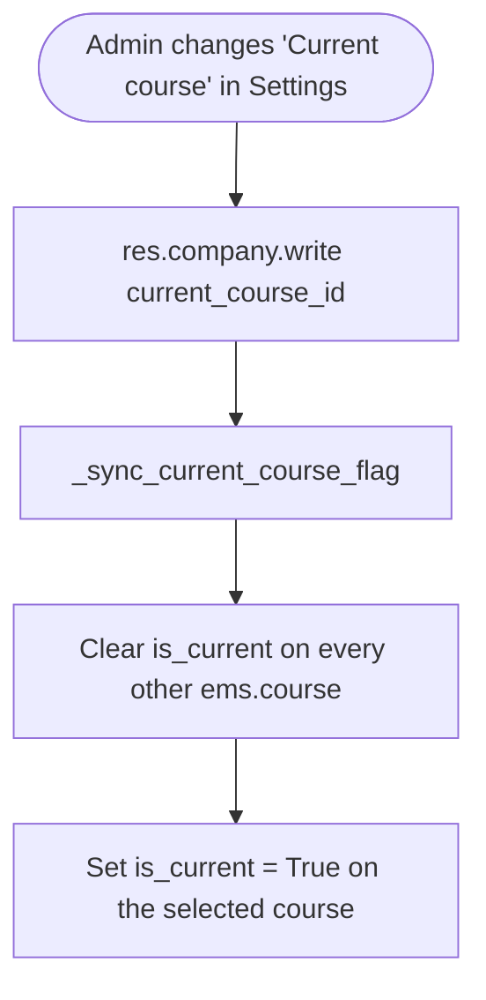

# Technical Reference: `ems.course`

## Overview

`ems.course` represents an academic year window (e.g. `2025-2026`). It has no menu, list, or form view of its own — the only UI surface is the **Current course** selector on the Settings page (`res.config.settings`), which points at `res.company.current_course_id`.

**Module file:** `models/settings/course.py`

---

## ⚠️ Known limitation: no course-management UI

There is no way, today, to create a new `ems.course` record, or to change which course is the "Enrollment Default", from the application UI. In practice:

- All existing course records (`2025-2026` through `2028-2029`) come from a single seed file, `data/custom/ems.course.xml`, pre-created years ahead of time.
- `is_current` (see below) can be changed via the Settings page indirectly, through `current_course_id`.
- `is_enrollment_default` has **no UI path at all** — it can only be set via a data file or direct database/shell access.

`views/settings/form.xml` (lines ~14–27) has an explicit, still-unimplemented TODO for a **"Setup next course"** wizard: select/generate the next course, move expirable data (enrolments, schedules, grades) to a read-only history, and clear it for the new year. This DTON pass intentionally did **not** build that wizard — it is a real, separate feature request, not a retroactive cleanup of existing behaviour. Treat it as a known gap; implementing it needs its own scoped design (in particular the data-migration/history side, which this doc doesn't attempt to spec).

---

## Data Model

### Fields

| Field | Type | Required | Stored | Description |
|-------|------|----------|--------|-------------|
| `start` | `Integer` | Yes (`default=`current year) | Yes | Start year |
| `end` | `Integer` | Yes (`default=`current year + 1) | Yes | End year |
| `name` | `Char` (computed) | — | Yes | Format: `start-end`, e.g. `2025-2026`; unique |
| `is_current` | `Boolean` | No | Yes | The operational course used for day-to-day academic management (attendance, grades, incidents) |
| `is_enrollment_default` | `Boolean` | No | Yes | The course new enrolments default to |

Both booleans are enforced single-active by a `@api.constrains` each (`_check_unique_current`, `_check_unique_enrollment_default`) — writing `True` on a second record raises a `ValidationError` naming the conflict.

### `is_current` sync with `res.company.current_course_id`

`ems.course.is_current` is not set directly by an admin — `res.company`'s `_sync_current_course_flag()` (`models/settings/company.py`) keeps it in step whenever `current_course_id` is written on the company (i.e. whenever the admin changes the "Current course" setting):

`is_current` is what the rest of the codebase actually queries (`ems.contact`, `ems.enrollment`, `ems.enrollment_proposal_wizard`, `ems.graduation_wizard`) — `current_course_id` is only the admin-facing pointer that drives it.

`is_enrollment_default` has no equivalent sync mechanism today (see the limitation above) — it is read by the same kind of business logic (`ems.enrollment`, `ems.contact`, `ems.year_record`, `ems.graduation_wizard`, `ems.enrollment_proposal_wizard`) but nothing in the UI ever writes it.

---

## Access Control

Defined in `security/ir.model.access.csv` (lines 169–171, 227).

| Role | Create | Read | Write | Delete | Group XML ID |
|------|:------:|:----:|:-----:|:------:|--------------|
| Administrator | ✓ | ✓ | ✓ | ✓ | `ems.group_academic_admin` |
| Teacher | — | ✓ | — | — | `ems.group_teacher` |
| Secretary | — | ✓ | — | — | `ems.group_secretary` |
| Portal | — | ✓ | — | — | `base.group_portal` |

No record-level rules exist for this model. Create/write/delete access exists for administrators even though no UI currently exercises it (beyond the indirect `is_current` sync) — consistent with the model being manageable today only via data files or `odoo shell`.

---

## Integration Map

`ems.course` (via `is_current`/`is_enrollment_default`) is read by:

| Model | Usage |
|-------|-------|
| `res.company` | `current_course_id` (admin-facing pointer) drives `is_current` |
| `ems.contact` | Determines the student's current/next course for various flows |
| `ems.enrollment` | Defaults a new enrolment to the current or enrollment-default course |
| `ems.enrollment_proposal_wizard` | Bulk draft enrolments target the enrollment-default course |
| `ems.graduation_wizard` | Withdrawal/graduation flows reference the current course |
| `ems.student.year_record` | `course_id`; historical academic records link to a specific course |

---

## Views

| View | File | Notes |
|------|------|-------|
| Settings selector only | `views/settings/form.xml` | `current_course_id` under "Course Management Settings"; no dedicated list/form/menu exists for `ems.course` itself |
