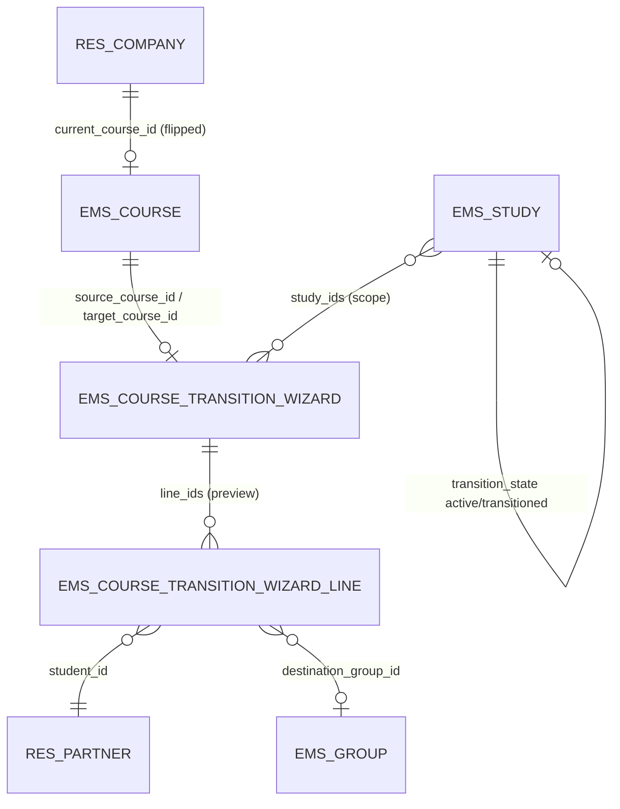
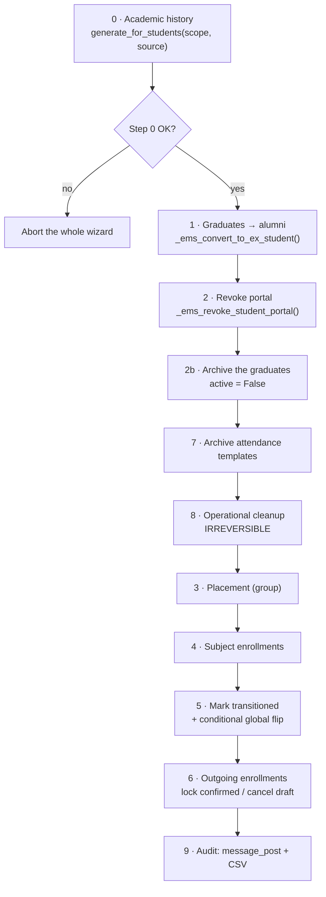
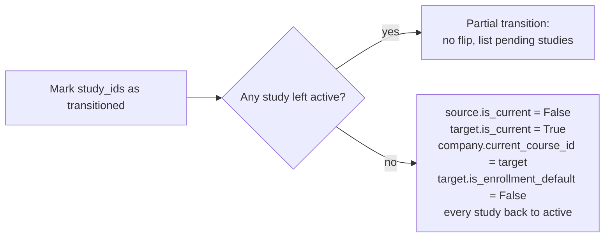

# Technical Reference: `ems.course_transition_wizard`

## Overview

`ems.course_transition_wizard` is the **end-of-year transition**: the single operation that closes the outgoing course and opens the incoming one. It freezes the academic history, turns graduates into archived alumni, places the returning students into their destination groups from their confirmed enrollments, and wipes the operational records of the year that just ended.

It is deliberately **scoped by study** (`study_ids`), because studies do not finish at the same time: a CFGS may be closed in June while an ESO level is still evaluating. Each run transitions the studies it is given and marks them `transitioned`; the **global course flip** (which course is "current") only happens on the run that leaves no `active` study behind.

The wizard is **preview-first**: nothing is written until a dry-run has listed the blockers, the warnings and the exact record counts, and the operator has ticked the backup checkbox. Step 8 is irreversible.

**Module files:** `models/settings/course_transition_wizard.py`, `models/curriculum/study.py` (`transition_state`), `models/enrollment/enrollment.py` (`_ems_admit_student` latecomer branch), `views/settings/course_transition_wizard.xml`, `views/settings/form.xml`, `security/ir.model.access.csv`, `tests/test_course_transition.py`, `static/tests/tours/course_transition_tour.js`

## Hierarchy and relations



Both models are `TransientModel`: the preview is a throwaway projection, never a stored plan.

## `ems.study.transition_state`

```python
transition_state = fields.Selection(
    [('active', 'Active'), ('transitioned', 'Transitioned')],
    default='active', copy=False)
```

A new field, so **no migration script** is needed (no XML ID is renamed). It is the switch that makes a *latecomer* work: `sale.order._ems_admit_student()` places a student immediately (group + subject enrollments) when the destination study is already `transitioned`, and leaves the placement to the bulk wizard while the study is still `active`. That branch already exists in `enrollment.py`, guarded by a `getattr` because the field did not exist yet; creating the field and dropping the `getattr` activates it.

Step 5 resets every study back to `active` when the flip happens, so the next course starts clean.

## Preview (dry-run — writes nothing)

### Blockers

| Blocker | Rule |
|---------|------|
| Target course | It exists and is different from `source_course_id` |
| Graduate already enrolled | No student marked `exit_type='graduation'` in scope has a non-cancelled `sale.order` in the target course |
| Evaluation not closed | Every `ems.grade_session` of the **last round** (max existing `round` per group·subject) of the groups in scope is in state `final`, linking the offenders to `ems.action_grade_session_state_wizard` |

### Warnings (informative, never blocking)

| Warning | Note |
|---------|------|
| Students with no destination | `transition_status = 'missing'`, **listed one by one** (D8), split by `study.uses_enrollment_flow` |
| Draft / sent enrollments in the target course | They will be cancelled by step 6 if never confirmed |
| Confirmed enrollments with no `ems_group_id` | They are skipped by steps 3-4 and the student stays unplaced |
| Incomplete evaluation | See the rule below (D9) |
| Attendance templates to archive | Including templates whose `group_ids` span studies both in and out of scope |
| Records to delete | Counts per model for step 8, grade sessions included |
| Applicants without a confirmed enrollment | Summer withdrawals, only when the optional checkbox is ticked (D3) |

### Incomplete-evaluation rule (D9)

The criterion depends on whether the group is in the **last course of its study**:

- **Not the last course** (e.g. 1st of a CFGM/CFGS): `internal_is_complete` on `ems.grade_subject_line`. Promotion to the next course is decided by the *internal* grade — the 90% awarded by the centre.
- **Last course**: `has_final`, which also demands the external (work placement) part.

The reason is that the **work placement (EM) only exists in the final course**, when students actually go to a company. Since the centre's `ems.planning` gives a 10% `external_ponderation` to first-course subjects as well, `_final_from_parts()` returns `(0, False)` for them — no final grade at all, not even a failing one. Using `has_final` everywhere would therefore report *every* first-course student as incompletely evaluated.

This mirrors the semantics already frozen in the academic history, where `ems.student.year_record.subject.state` is binary and **determined only by the RAs**: a pending or failed work placement never fails a subject, because the student repeats the placement, not the subject.

## Apply



Steps 3 and 4 are a single bulk call to `sale.order._ems_apply_destination_placement()`, which is already idempotent and already ordered (group before subject enrollments). Every step is scoped to `study_ids` except the flip.

### Why the cleanup runs before the placement

The steps are numbered by the phase they belong to, not by the order they execute in: **7 and 8 run before 3 and 4**, and that is load-bearing rather than cosmetic.

`res.partner._ems_clear_operational_records()` deletes *every* `ems.enrollment` of the student with no group or course filter. It was written for a withdrawal, where the student leaves the centre altogether and keeping any enrollment would be wrong. Running it after the placement would therefore delete the very enrollments steps 3-4 had just created, leaving every promoted student in their new group with no subjects at all.

`tests/test_course_transition.py::test_apply_keeps_the_new_enrollments_after_the_cleanup` pins this down: swapping the two blocks makes it fail, together with the two placement tests.

### Archiving the graduates (D4, step 2b)

Graduates are **archived**, not just converted, consistent with issue #357 (withdrawals and alumni are both archived, mirroring how archiving an `hr.employee` asks for a departure reason).

The archive runs **after** the portal revoke and lives in the wizard rather than in `_ems_convert_to_ex_student()`, for two reasons: the helper runs before the revoke, and `res.partner.write()` refuses to archive a contact still linked to an active portal user. A student whose revoke failed is reported and left active instead of raising, so one failure cannot roll back a batch of hundreds.

### Conditional flip (step 5)



`ems.course` enforces "only one current" and "only one enrollment default" through Python `@api.constrains`, not SQL, so the outgoing flag must be **cleared before** the incoming one is set.

### Latecomers

Students with no confirmed enrollment when their study transitions do **not** block. Step 0 archives their history, step 8 cleans their operational records and steps 3-4 skip them, so they end up as `student` with no group and `transition_status = 'missing'`. If they enroll later, `action_confirm()` → `_ems_admit_student()` → the now-active `transitioned` branch places them on their own.

Marking a genuine leaver as withdrawn stays **manual** (`ems.withdrawal_wizard`), by design: in July there is no way to tell a student moving to another school from one who simply enrolls late. The D8 listing exists precisely so that list is on screen when the transition finishes.

## Access control

| Group | Preview | Apply | Notes |
|-------|---------|-------|-------|
| `ems.group_academic_admin` | ✅ | ✅ | Sole owner of the wizard and of the Settings button (D1); already owns the grade-session state wizard the preview links to |
| `ems.group_secretary` | ❌ | ❌ | Manages enrollments, not the academic calendar |
| `ems.group_tutor` / teachers | ❌ | ❌ | — |
| Portal / families | ❌ | ❌ | — |

The wizard writes through `sudo()` where the reused helpers already do (`_ems_apply_destination_placement`, `_ems_clear_operational_records`): the operator is an academic admin, not necessarily a grades or attendance manager.

## Safeguards

- **Backup checkbox** — a single mandatory confirmation ("I have taken a backup") enables Apply.
- **Step 0 gates step 8** — the operational records are only deleted once the history has been frozen.
- **Idempotency** — every step can be re-run if the transition is interrupted, step 8 excepted.
- **Grade sessions must be deleted** (step 8) because `UNIQUE(group_id, subject_id, round)` carries no course; deleting them also resets `is_locked` naturally.
- **`has_graduated` is permanent** — never reset, and readonly on the contact form (D2).
