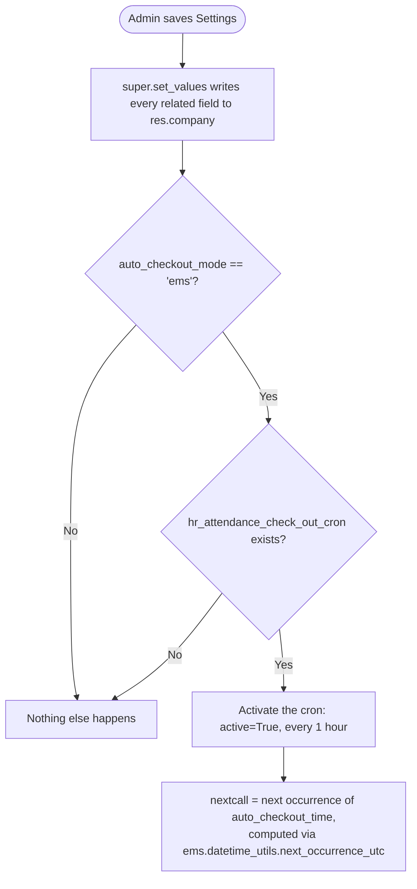

# Technical Reference: `res.config.settings` (EMS extension)

## Overview

`models/settings/settings.py` extends Odoo's `res.config.settings` transient wizard with a `related=..., readonly=False` field for every EMS-added `res.company` field (see [res.company](company.md) for what each one does) — this is what makes them editable from the Settings screen at all. It is a thin proxy: reading/writing any of these fields just reads/writes the underlying `res.company` field through the relation.

**Module file:** `models/settings/settings.py`

The only behaviour that isn't a plain passthrough is `set_values()`.

---

## `set_values()` — EMS auto-checkout cron activation

Switching `auto_checkout_mode` back to `native` does **not** deactivate the cron — `set_values()` only acts when the mode is `'ems'`; the native mode relies on Odoo/`hr_attendance`'s own built-in auto-checkout instead, which this cron has nothing to do with. Toggling away from `'ems'` currently leaves a previously-activated cron running; if that turns out to matter operationally, it's a one-line follow-up (deactivate the cron in the `else` branch) — not addressed in this DTON pass since it wasn't flagged as broken.

---

## Access Control

Same as any `res.config.settings`: reaching the screen at all requires Settings access (standard Odoo `base.group_system`-gated navigation), not an EMS-specific rule.

---

## Views

| View | File | Notes |
|------|------|-------|
| Settings form | `views/settings/form.xml` | See [res.company](company.md)'s Views section — same page, already covered by the `ems_course_settings` tour |
