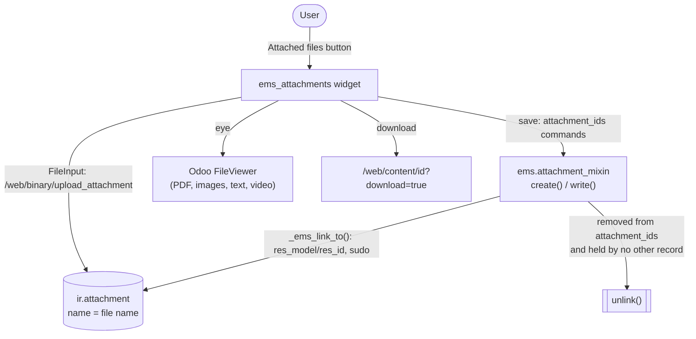

# Technical Reference: a record's own files (`ems.attachment_mixin` + `ems_attachments`)

## Overview

Some models keep their own files in an `attachment_ids` many2many to `ir.attachment`, edited from
an "Attached files" tab: `ems.attendance_justification` (the justificant a tutor uploads) and
`ems.study` (its official curricula). Two shared pieces make that tab work the same everywhere:

| Piece | File | Role |
|-------|------|------|
| `ems.attachment_mixin` | `models/shared/attachment.py` | Server side: ties every file to its record, deletes a removed one |
| `ems_attachments` field widget | `static/src/js/backend/attachments_field.js` + `static/src/xml/backend/attachments_field.xml` | Client side: direct upload, and preview / download / delete on every file |

Usage, model side: `_inherit = [..., 'ems.attachment_mixin']` plus the model's own `attachment_ids`
field. View side: `<field name="attachment_ids" widget="ems_attachments" nolabel="1"/>`.

---

## Who can read a file

Odoo only lets the uploader (or a system admin) read an attachment with no `res_id`
(`ir.attachment.check()`/`_search()`). The mixin's `create()` and `write()` (when `attachment_ids`
is in `vals`) call `ir.attachment._ems_link_to(record)`, which sets `res_model`/`res_id` on the
files still unlinked, with `sudo()`. From then on a file follows its record's own read access:
whoever can read the justification (the tutor and the chiefs above them, the teachers of the
affected sessions, Head of Studies through `group_student_data_reader`, the academic
administration) or the study (every teacher, the secretary's office, the academic administration)
can open it. Issue #553: Head of Studies saw an empty tab on justifications, and teachers on
studies. `migrations/18.0.0.33.0/post-migrate.py` links the files stored before the fix.

`ir.attachment._ems_link_to()` is also used on its own by `ems.convalidation`, whose files come
from the portal and are never deleted from the form.

---

## Deleting a file

The widget offers no list of existing files to pick from, so a file removed from the record could
never be attached again: the mixin's `write()` deletes it. Only the files tied to that record
(`res_model`/`res_id`) are candidates, and one still held by another record of the same model is
kept - an official curriculum shared by several studies stays tied to the first one
(`_ems_link_to()` never re-links a file), which gives the same access since no record rule
restricts `ems.study`. That check searches with `sudo()` and `active_test=False`, so a holder the
user cannot read, or an archived one, still counts. The deletion itself runs with the user's own
rights: Odoo allows it to whoever can write the record.

The study data files keep their curricula linked on their own: `data/cat/ems.study.csv` reloads
on every upgrade (`noupdate=False`) and that `write()` links any file still unlinked. A file an
admin adds by hand to a study shipped in `data/` is dropped by that same reload (the CSV owns the
list), and the mixin then deletes it.

---

## The widget

`EmsAttachmentsField` extends Odoo's `Many2ManyBinaryField` (`many2many_binary`): the same
`FileInput` upload (several files at once, each named after its file), the same `onFileRemove()`.
Its template replaces the stock file card with one row per file - the mimetype icon, the name and
three matching icon buttons:

| Button | Shown | Action |
|--------|-------|--------|
| Preview (`fa-eye`) | `FileModel.isViewable` (PDF, images, text, video) | Odoo's own `FileViewer` (`@web/core/file_viewer`, the chatter's), browsing every viewable file of the field |
| Download (`fa-download`) | always | `/web/content/<id>?download=true` |
| Delete (`fa-trash`) | the field is editable | removes the file from the record; the mixin deletes it on save |

`files` builds `FileModel` objects from each record's `name`/`mimetype`/`checksum` (`checksum` is
added to the stock widget's `relatedFields`). The upload button and the delete icon follow the
field's `readonly`: a user who cannot write the model gets a read-only form from Odoo itself
(`ir.ui.view` sets `edit="False"`), and the justification form also makes the field read-only for
anyone but the student's tutor or an admin.
