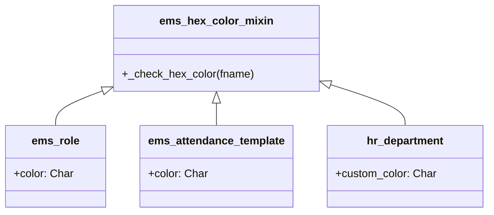
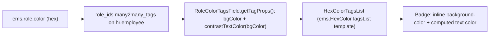

# Technical Reference: Free-Pick Color Widget

## Overview

Three models let an admin pick a display color: `ems.role`, `ems.attendance_template`, and `hr.department` (via a dedicated `custom_color` field — see below). All three originally used Odoo's built-in `widget="color_picker"`/`kanban_color_picker`: a fixed, 12-entry palette (`Integer` field, index 0-11, defined by Odoo core's `$o-colors`/`ColorList.COLORS`). That palette has two problems that motivated this change: index 0 ("No color") renders as an almost-white swatch — selecting it produced illegible white-on-white text wherever the color was used as a tag background — and 12 colors run out fast once there are more than a handful of roles/departments/templates, forcing unrelated records to repeat the same color.

**Module files:** `models/shared/hex_color_mixin.py`, `static/src/js/backend/role_color_tags_field.js`, `static/src/js/backend/hex_color_tags_list.js`, `static/src/xml/backend/hex_color_tags_list.xml`, `static/src/css/backend/color_swatch.css`.

## Data model

All three fields are a plain `Char` storing a hex code (e.g. `#3A8DDE`), not an `Integer` palette index:

| Model | Field | Notes |
|-------|-------|-------|
| `ems.role` | `color` | Was `Integer`; converted in place (see Migration below) |
| `ems.attendance_template` | `color` | Was `Integer`; converted in place. Auto-assigned on creation — see "Auto-assigned colors" below |
| `hr.department` | `custom_color` | **New field**, added alongside Odoo's own native `color` (`Integer`), which is deliberately left untouched — see "Why hr.department has two color fields" |

`ems.hex_color_mixin` (`models.AbstractModel`) is the one place the `#RRGGBB` format is validated — every model above inherits it and calls `self._check_hex_color('<field name>')` from its own `@api.constrains`, rather than duplicating the regex.

## Why `hr.department` has two color fields

`hr.department` is a **native Odoo model**, not an EMS one. Its own `color` field is read by Odoo core itself: the kanban view's `highlight_color="color"` attribute tints the whole card background via a fixed set of `o_kanban_color_N` CSS classes, and other installed modules may assume it stays an `Integer`. Retyping it to a hex `Char` (the same move made for `ems.role`/`ems.attendance_template`, which EMS fully owns) would have silently broken that native mechanism and anything else depending on the type. Instead, `custom_color` was added via `_inherit` as a parallel field used only by EMS's own views; the native `color`/`highlight_color` kanban tinting is untouched.

## The list/kanban swatch: `widget="color"`

The field widget itself is Odoo core's own `widget="color"` (`web/static/src/views/fields/color/color_field.js`) — a native HTML5 `<input type="color">`, giving a genuinely unlimited color choice. No custom JS was needed for the picker itself. What *is* custom is the CSS: the raw `<input>` is invisible (`opacity-0` in Odoo's own template) and the visible swatch is its wrapping `
`, which has no explicit size — on this platform that rendered as a large, round native OS control instead of a small square. `static/src/css/backend/color_swatch.css`'s `.ems_color_swatch` class (applied via `class="ems_color_swatch"` on each `<field widget="color">` in the three models' views) pins it to a 22×22px rounded square with a pointer cursor, without touching Odoo's `widget="color"` globally (it's also used, unstyled, by several unrelated core/enterprise modules — event tickets, product attributes, etc.).

## The employee-form badges: `role_color_tags`

`ems.role` records are also shown as colored badges on `hr.employee`'s form and kanban (`role_ids`, a `many2many`). Odoo's built-in `many2many_tags` widget can only color a tag via one of the same fixed `o_tag_color_0..11` CSS classes — it cannot render an arbitrary hex background. A custom field widget, `role_color_tags` (`RoleColorTagsField`, extending `Many2ManyTagsField`), swaps in `HexColorTagsList` — a **standalone** copy of core's `TagsList` template (`ems.HexColorTagsList`, not a `t-inherit` of `web.TagsList`) that paints each tag with an inline `background-color`/`color` instead of the class. (An earlier attempt used `t-inherit-mode="extension"` on `web.TagsList` directly — that patches the *global* template Odoo uses for every tag list in the app, not just this one; see the "Missing template" incident this replaced.) The text color is computed per-tag from the background's relative luminance (WCAG formula, `contrastTextColor()` in `role_color_tags_field.js`), so any freely-picked color — including a very light or very dark one — always keeps legible text; this generalizes the old "don't let index 0 render invisible" fix to *every* color, not just one excluded palette entry.

## Auto-assigned colors (`ems.attendance_template` only)

New templates get a color automatically when `_write_schedule_sync()` creates them (no admin picks it) — originally `TEMPLATE_COLOR_PALETTE[len(templates) % 12]`, where `len(templates)` is the position *within the current sync batch*. Since most syncs create exactly one new template, that index was almost always `0`, so nearly every active template ended up the same color (the "all red" incident). Fixed to offset by the running total of every template ever created (`self.with_context(active_test=False).search_count([])`, archived included so the count never goes backwards), so consecutive, unrelated syncs keep rotating through the palette instead of each independently restarting at index 0.

## Migration

`ems.role.color` and `ems.attendance_template.color` both moved from `Integer` to `Char` — an existing-field type change, not a new field, so it needed a `pre-migrate.py` (schema syncs happen before `post-migrate`; see the "Migrations" section of the top-level project instructions for why a type change like this can't be left to Odoo's own automatic schema sync). `migrations/18.0.0.22.0/pre-migrate.py`:

- **`ems_role`:** every row is reset to one neutral default hex; `data/cat/ems.role.csv` (`noupdate=False`) reloads immediately after and gives the 16 built-in roles their real, distinct colors back — no per-row mapping needed there.
- **`ems_attendance_template`:** these are live, permanently-created records with no fixture file to restore them, so each row's old integer is instead remapped through Odoo's former fixed palette (`% 12`, matching how `color_picker`/`kanban_color_picker` already interpreted it) — existing rows stay visually distinct instead of collapsing to one flat color.

`hr.department.custom_color` needed no migration: it is a brand-new field with a static Python `default=`, which Odoo's own automatic schema init already backfills for every existing row.

## Known limitations

- `ems.attendance_template`'s color-rotation counter (`search_count`) is recomputed once per `_write_schedule_sync()` call, not cached across the whole `sync_from_schedule_batch()` run — correct (each plan's `create()` is visible to the next plan's count within the same transaction) but means a very large single batch does one extra query per plan.
- `hr.department`'s native `color`/`highlight_color` kanban tint is left exactly as it was — an admin can still (confusingly) find the old fixed-palette picker in the kanban's "..." menu pointing at a field (`color`) that no EMS view surfaces elsewhere. It is deliberately not removed (see "Why hr.department has two color fields" above), but a future pass could hide it from that menu too if the duplication proves confusing in practice.
