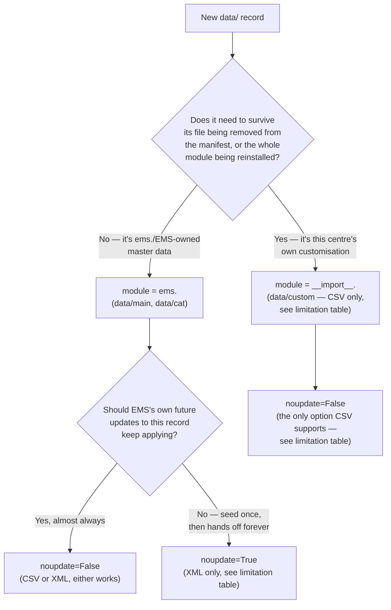

# Technical Reference: XML vs CSV data loading (`data/`)

## Overview

EMS ships master/config data (`data/main/`, `data/cat/`, `data/custom/`) via two file formats —
XML `<record>` tags and CSV — loaded through Odoo's own module data-loading machinery. The two
formats are **not interchangeable**: each has capabilities the other cannot replicate, and two
properties that look related — the xmlid's **module prefix** (`ems.` vs `__import__.`) and its
**`noupdate` flag** — are in fact governed by two completely independent mechanisms. Confusing
them was the source of a real bug during the 2026-07-30 `data/custom/` `__import__.` migration
(see [[project_data_custom_import_prefix_audit]] in memory) and is the reason this page exists.

See `CLAUDE.md`'s "Data folder conventions" for the actionable, per-folder rule this reference
backs — this page is the *why*, that section is the *what to do*.



---

## The two independent mechanisms

**1. Does removing the record's xmlid entry (row deleted from the file, or the whole file
removed from the manifest) delete the record?** Governed by `ir.model.data`'s cleanup pass,
`_process_end()` (`odoo/addons/base/models/ir_model.py`), run once at the end of every module
load:

```sql
SELECT ... FROM ir_model_data
WHERE module IN %(modules_being_processed)s AND COALESCE(noupdate, false) != true ...
```

A record is only a deletion *candidate* if **both** hold: its `module` is one of the modules
actually being installed/updated right now (`__import__` never is — it isn't a real module at
all), **and** its stored `noupdate` is `False`. Either condition alone is enough protection —
they're two independent ways to reach the same outcome, not the same setting.

**2. Does changing the value in the file update the already-existing record?** Governed by
`_load_records()` (`odoo/models.py`), the method underlying every XML `<record>`/CSV `load()`
write:

```python
if not (update and d_noupdate):
    to_update.append(data)
```

`d_noupdate` is read from the **existing** `ir_model_data` row — the value stored at the time
the record was first created — not from whatever noupdate context the *current* load happens
to be running under. This is the trap: renaming a record's `module` from `ems.` to
`__import__.` without also explicitly clearing its stored `noupdate` leaves it permanently
frozen, indistinguishable in every log line from a correctly-syncing record, because nothing
about the rename itself errors.

**Verified empirically, 2026-07-30** (not just from reading the source — see
[[feedback_verify_empirically_not_just_source_reading]]): changed a value in an
already-`__import__.`-owned CSV row, ran a plain `./upgrade.sh`, confirmed the value did **not**
change until the stored `noupdate` flag was explicitly cleared in the rename migration.

---

## Capability table — where each format fails

| Capability | XML | CSV |
|---|---|---|
| `__import__.` xmlid prefix (survives file/module removal) | ❌ Impossible — Odoo's loader rejects the **entire file** with `AssertionError: The ID "__import__.xxx" refers to an uninstalled module` | ✅ The only way to get it |
| `noupdate=True` (record frozen after first creation) | ✅ `<data noupdate="1">`, controlled inline, per block, inside the file | ❌ Not achievable via any manifest mechanism in this Odoo build (see below) |
| `noupdate` granularity | Per `<data>` block — a single file can mix `noupdate="1"` and `noupdate="0"` sections | N/A — not even file-wide is achievable |
| Resolve a field via a dynamic domain (`<field search="[domain]">`, no fixed external id available) | ✅ Yes | ❌ No — only a static `field/id` reference or a plain value |
| Inline one2many child records (`eval="[(0, 0, {...})]"`) | ✅ Yes, in the same file | ⚠️ Indirect — needs a separate related CSV file (one row per child, parent referenced by id) |
| Rich/multi-line HTML content | ✅ Yes (CDATA or inline tags) | ✅ Yes (a properly quoted multi-line cell) — no real limitation, just more fragile to hand-edit |
| Many2many | ✅ Yes (`eval="[(6, 0, [refs])]"`) | ✅ Yes (`field/id` column, comma-separated external ids in one cell) |
| Filename → model mapping | Free — the model is declared explicitly per `<record model="...">` | Rigid — the filename (up to the first `-`) **must** exactly equal the technical model name; use `model.name-suffix.csv` for multiple files backing the same model |
| Invoking a method directly at load time (`<function model="..." name="..."/>`) | ✅ Yes — e.g. `data/main/resync_lifecycle_categories.xml` calls `res.partner._ems_resync_lifecycle_categories()` on every load | ❌ No — CSV's `load()` can only create/update rows of the model the file is named after, never call arbitrary code |

### Why CSV can't do `noupdate=True` here — a confirmed dead-code path, not just "deprecated"

The manifest's `init_xml`/`update_xml` keys are documented (in Odoo's own source comments) as
the way to get a CSV file loaded with `noupdate=True`. In the actually-installed Odoo 18 build
this repo runs on, that path does not fire at all. `odoo/modules/loading.py::load_data`'s
`_get_files_of_kind`:

```python
def _get_files_of_kind(kind):
    if kind == 'demo':
        keys = ['demo_xml', 'demo']
    elif kind == 'data':
        keys = ['init_xml', 'update_xml', 'data']
    if isinstance(kind, str):      # NOT an elif — a separate, unconditional if
        keys = [kind]              # always runs, always overwrites keys back to just ['data']
    ...
```

Since `kind` is always a plain string, the second `if` always fires and discards whatever the
`elif` branch just set. **Files listed under `init_xml`/`update_xml` are never read at all**
during the normal data-load phase, regardless of format — confirmed live (2026-07-30): a
throwaway CSV row listed under `'init_xml': [...]` never produced a single "loading ems/..."
log line and its record was never created, on a completely ordinary `./upgrade.sh` run.

The only manifest key that genuinely produces `noupdate=True` is `demo` — not a substitute for
real config, since demo data is optional and skipped entirely with `--without-demo`.

**Practical conclusion:** a record that genuinely needs `noupdate=True` protection has exactly
two options — stay XML, or have `ir_model_data.noupdate` set directly via a migration script
(bypassing the file-loading mechanism's own noupdate handling, which then means the file's
content stops being an honest description of what actually happens to that record on upgrade —
not something to reach for casually).

---

## Deciding `noupdate=True` vs `False` — the actual criterion, not "is it Odoo-native"

Odoo's own official docs are deliberately non-prescriptive about *when* to reach for
`noupdate="1"` — they explain the mechanism, not a philosophy:

> "If the content of the data file is expected to be applied only once, you can specify the odoo
> flag `noupdate` set to 1." — [Data Files, Odoo 18 docs](https://www.odoo.com/documentation/18.0/developer/reference/backend/data.html)

> "Data shipped by a module belongs to the module initially, but once a user modifies it, the
> user becomes the owner." — [Define module data, Odoo 18 docs](https://www.odoo.com/documentation/18.0/developer/tutorials/define_module_data.html)

The decision is left to each module's own judgment, record by record — which is why Odoo's own
core is inconsistent about it (`mail.activity.type` ships `noupdate=True`; plenty of other
config models don't). **Whether a record happens to be Odoo-native or EMS-authored says nothing
about which way EMS should decide for its own records** — don't use Odoo core as precedent
either way. EMS's default posture (confirmed with the developer, 2026-07-30): **EMS's own data
belongs to EMS — the team has both the right and the responsibility to keep improving it.
`noupdate=True` is the exception, earned by a specific, concrete justification, not a default
courtesy.**

**The actual question that decides it, per record:** does application code reference *this
specific* record by its fixed xmlid (`env.ref('ems.xxx')`, a required single-value field like
`res.company.default_schedule_framework_id`), or is it one of potentially many interchangeable
records of the same kind, where creating another one alongside it is a normal, expected action?

- **Referenced by fixed xmlid, single structural instance** → duplicating is not actually a
  usable option: a duplicate has no xmlid, so code that looks up `env.ref('ems.xxx')` or a
  single-value pointer field will never find it. The only real choice is who edits the *one*
  record that exists: EMS (`noupdate=False`) or the centre (`noupdate=True`). Default to
  `noupdate=False` here too — **unless** there's a concrete reason EMS structurally cannot know
  the correct value for *this specific centre* (not "someone might prefer it differently" —
  that's just a coincidental preference, not a real information gap). Example:
  `ems.schedule_framework_default.xml`'s actual bell-schedule hours are exactly that kind of
  gap — EMS has no way to know a given centre's real timetable — so `noupdate=True` is genuinely
  earned there. Cosmetic choices EMS can perfectly well make well (an activity type's icon, a
  category's label) don't clear that bar.
- **One of many interchangeable records, more can be freely created** → this is where
  "duplicate, don't freeze" fits: keep the shipped example `noupdate=False` (or plain CSV) so
  EMS's own fixes keep landing, and let the admin use Odoo's standard "Duplicate" action to get
  an independent, un-prefixed copy the moment they want their own variant. The duplicate has no
  xmlid, so it's entirely outside the data-loading mechanism from that point on. The application
  needs some existing way to pick "the one in use" for a given purpose (an `is_default`-style
  boolean, or explicit selection) — the same shape already used for
  `ems.course.is_enrollment_default`. Example: an enrollment `sale.order.template` — there are
  already many, one per study, and adding another is completely normal.

**Worked example — the three `data/main/` files reviewed 2026-07-30** (see
[[project_data_main_cat_xml_csv_audit_plan]] for the full investigation):

| File | Referenced by fixed xmlid? | Concrete "EMS can't know this" gap? | Decision |
|---|---|---|---|
| `ems.schedule_framework_default.xml` | Yes — `res.company.default_schedule_framework_id`, required, single value, read live by the schedule-grid widget | Yes — each centre's actual bell-schedule hours | `noupdate=True` (XML) — kept |
| `ems.mail_activity_type.xml` | Yes — `env.ref('ems.mail_activity_...')` throughout the codebase | No — icon/label are cosmetic, EMS can pick sensible defaults | `noupdate=False` (CSV) — changed from the earlier `noupdate=True` |
| `res.partner.category.xml` | Yes — `env.ref('ems.partner_category_...')` in `contact.py` etc. | No — these are business-meaning labels (Student/Family/...), EMS can set them correctly | `noupdate=False` (CSV) — changed from the earlier `noupdate=True` |

Note `noupdate` was never the right tool for "protect this record from being deleted via the
UI" in the first place — that's a completely different concern (see the two independent
mechanisms above). If accidental deletion of a structurally-relied-upon record like a
`res.partner.category` is a real worry, it needs its own guard (e.g. an `unlink()` override
blocking deletion of xmlid-linked rows) — not something `noupdate` was ever going to solve.
