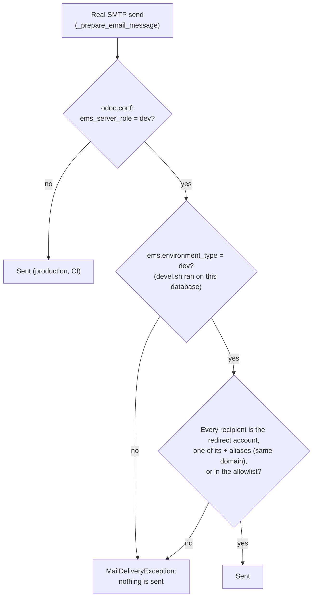

# Development machines never send real email

`models/settings/mail_guard.py` (issue #590), set up by `devel.sh`.

A development machine works on real data restored from production: real students, families and
staff, plus production's own outgoing mail servers (`ir.mail_server`) and its pending jobs. Two
layers keep any of it from reaching a real person, after `devel.sh`'s first step has emptied
every queue.

## 0. Nothing pending survives `devel.sh`

Before rewriting any address, and before the Odoo service can reach the database, `devel.sh`
cancels, as the `postgres` superuser, everything production left unfinished: every `queue_job`
not `done`/`cancelled`/`failed` (whatever its state, `wait_dependencies` included), Odoo's own
outgoing mail queue (`mail_mail` in `outgoing`/`exception`, whose recipients are plain text the
address rewrite never reaches) and outgoing SMS. Running as `postgres` means it works on a copy
locked against the `odoo` role right after `pg_restore` (CLAUDE.md, "Lock a restored production
copy"); only once no job is left pending does it `GRANT CONNECT` back to `odoo`. If the
cancellation fails, or anything is still pending, it stops there with the service stopped. A
production dump of 2026-10-06 restored as `ems` the next day carried 366 pending jobs, all
cancelled by this step.

The restore itself, in order: check the dump reads end to end (`pg_restore -f /dev/null`), stop
the service, rename the old `ems`, `createdb -O odoo ems` + `pg_restore --no-owner --role=odoo`,
`REVOKE CONNECT ON DATABASE ems FROM PUBLIC, odoo`, then `./devel.sh <account> <domain>` and only
then `./upgrade.sh`.

## 1. The Odoo service only serves `ems`

`devel.sh` writes these lines into `/etc/odoo/odoo.conf`:

```ini
db_name = ems
dbfilter = ^ems$
ems_server_role = dev
```

Without `db_name`, Odoo serves **every** database on the server: the queue_job runner
(`get_db_names()` → `odoo.service.db.list_dbs()`) attaches to each database with `queue_job`
installed and runs its pending jobs, and the cron threads process every registry loaded. A
production dump restored into a side database to investigate something would then run every job
still pending in production when the dump was taken, through production's SMTP servers. That is
exactly what happened on 2026-10-06: 412 real attendance notifications went out to students and
families, duplicates of production's own, a few minutes after `./test.sh` restarted the service.

With `db_name`/`dbfilter`, any other database on the box stays inert. A command that names
another database explicitly (`odoo -d <db>`, `odoo shell -d <db>`) still opens it, which is what
layer 2 covers.

## 2. EMS refuses the email itself

`ems_server_role = dev` declares the **machine** as a development one. It has to be the machine
and not the database: a restored production copy declares itself `production`
(`ems.environment_type`, forced by `deploy.sh`), whichever machine it lands on.

`ir.mail_server._prepare_email_message()`, which every real SMTP send goes through, then checks
the envelope recipients (To, Cc and Bcc):



| `ir.config_parameter` | Set by `devel.sh` | Meaning |
|-----------------------|-------------------|---------|
| `ems.dev_mail_redirect` | Every run: `<google_account>@<domain>` | The developer's inbox. Every address `devel.sh` rewrote is `<google_account>+<original, '@' as '_at_'>@<domain>`, so the account and its `+` aliases on that domain are allowed. |
| `ems.dev_mail_allowlist` | First run only: `ems@elpuig.xeill.net` | Comma-separated extra addresses allowed (e.g. the staff newsletter account). Edit it in Settings → Technical → System Parameters; later runs keep it. |

A blocked email raises `MailDeliveryException`, so a queued `mail.mail` ends in **Delivery
failed** with the reason, and nothing reaches the SMTP server.

Production and CI never set `ems_server_role`, so nothing changes there. Tests that mock
`IrMailServer.send_email` (see CLAUDE.md, "Email safety in tests") never reach
`_prepare_email_message`, so the guard does not interfere with them; `tests/test_dev_mail_guard.py`
covers it.

## Restoring a production dump for an investigation

Even with both layers, lock the copy away from the Odoo service right after `pg_restore`, before
anything else: `sudo -u postgres psql -c "REVOKE CONNECT ON DATABASE <db> FROM PUBLIC, odoo;"`,
then query it as `sudo -u postgres psql -d <db>`, and drop it when done (CLAUDE.md, "This
environment is development, not production").
