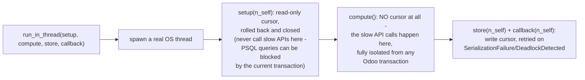

# Technical Reference: `ems.multithreading` (`models/shared/multithreading.py`)

## Overview

`EmsMultithreading` (`_name = 'ems.multithreading'`) is the shared engine behind every
long-running, external-API-calling action in EMS — currently only the LimeSurvey integration
(`ems.limesurvey_header`/`.recipient`, see
[`limesurvey.md`](../communications/limesurvey.md)'s architecture section for the consumer
side of this contract), but written model-agnostically for any future integration with the
same shape (slow external calls that shouldn't hold an Odoo request/cursor open).

`is_running` (a plain `Boolean`) is the guard field every consumer uses via `already_running()`
to prevent two concurrent runs on the same record.

---

## `run_in_thread(setup, compute, store, callback, max_retries=5, *args, **kwargs)`

Captures `uid`/`dbname`/`context`/`self.ids`/`self._name` from the calling environment, then
spawns a real `threading.Thread` running `threaded_worker()`, and returns the `Thread` object
immediately (**not joined** — the caller's own request returns right away; the four callbacks
are what eventually update the record and notify the user).

Inside the thread:

1. **`setup(n_self)`** runs against a **read-only-in-effect** cursor (opened fresh, always
   rolled back and closed in a `finally`, regardless of outcome) — used only to *read* Odoo
   data into a plain dict (the `persistent_data` convention every consumer follows — see
   `limesurvey.py`'s `run_action()`).
2. **`compute()`** runs with **no cursor at all** — this is where slow, blocking external API
   calls belong, deliberately isolated from any open Odoo transaction.
3. **`store(n_self)` + `callback(n_self)`** run together inside a retry loop (up to
   `max_retries`, exponential-ish backoff via `time.sleep(0.5 * (current_try + 1))`) against a
   **fresh write cursor**, retried only on `psycopg2.errors.SerializationFailure`/
   `DeadlockDetected` — any other exception from `store`/`callback` propagates uncaught.

### Fixed in this pass (2026-07-29)

**`compute()` ran completely unguarded** — no `try`/`except` around it at all, unlike every
other stage. If `compute()` raised for any reason not already handled internally by the
caller's own closure (every current consumer wraps its own API calls per-item and stores
errors in `persistent_data`, but a bug in that wrapping, or something entirely unrelated,
could still raise), the exception propagated straight out of `threaded_worker()` — which is
running inside a background `threading.Thread`. **An uncaught exception in a background
thread is not visible to the caller at all**: Python's default `threading.excepthook` prints
it to stderr and the thread simply dies. `store()`/`callback()` never run, so `is_running`
never resets, the record's `state` never changes, and the user never gets a notification — it
just silently hangs in whatever transient state (`uploading`, `reminding`, ...) it started in.
This is the same class of symptom as the `run_action()` bug fixed earlier in this rollout
(Phase 12 Block 3) and the `action_remind`/`action_delete` bug fixed in Block 5 — both of
those were reachable *paths into* this exact gap (a failure inside the caller's `compute()`
closure). Fixed by wrapping the `compute()` call in a `try`/`except Exception:` that logs the
failure via `_logger.exception(...)` before re-raising — this does **not** resolve the
"record stuck forever" symptom (see below), but ensures the failure is at least discoverable
in the server log instead of vanishing without a trace.

**Known, deliberately-not-fixed limitation:** a true fix — resetting `is_running` and
notifying the user even when `compute()` itself raises unexpectedly — would require
`threaded_worker()` to call `store()`/`callback()` (or some equivalent) with a failure state
after a `compute()` exception. It can't do that generically: `persistent_data` (the dict that
carries success/error state between `setup`/`compute`/`store`/`callback`) is entirely owned
and shaped by the *caller*, not by this mixin — `run_in_thread()` has no way to know how to
mark it as failed, and calling `callback()` on a `persistent_data` that `compute()` only
partially populated before crashing risks a **second**, equally invisible exception inside the
same already-broken thread. Fixing this properly would mean changing the `setup`/`compute`/
`store`/`callback` contract itself (e.g. `run_in_thread` requiring `persistent_data` as an
explicit parameter, with a compute failure always writing a generic error into a known key
before calling `callback`) — a real design decision affecting every current and future
consumer, not a mechanical bug fix. Every consumer today mitigates this by keeping `compute()`
itself as close to exception-proof as possible (see the `_do()` convention in `limesurvey.py`).

---

## `reload_request(message=...)`

Fires a `"reload_request"` bus message on the *user* channel (`self.env.user._bus_send`) so
an open form can soft-refresh without a full page reload. The docstring note about needing
`cr.commit()` for a real progress bar is aspirational — not implemented, since no current
consumer needs incremental progress reporting mid-run.

## `already_running()`

Returns `self.is_running`; if `True`, also calls `self.notify(...)` **if** the inheriting
model also has a `notify` method (i.e. also inherits `ems.base` — checked defensively via
`getattr(self, 'notify', None)`, since `ems.multithreading` doesn't itself guarantee that).

---

## Fixed in this pass (cont'd)

Class renamed `ems_multithreading` → `EmsMultithreading`. Tabs → spaces.

## Tests

`tests/test_shared_mixins.py::TestEmsMultithreading` — `reload_request()` and
`already_running()` are tested directly (3 tests, mocking `_bus_send`/`notify`).
**`run_in_thread()`'s cross-cursor execution is deliberately not exercised end-to-end** — it
opens a genuinely separate database connection, and `TransactionCase` never commits its
fixtures (every test runs inside a savepoint rolled back at the end), so a second connection
cannot see anything created within the test. Confirmed empirically while writing this test
file: a naive real-thread test either raised `MissingError` reading the test's own
uncommitted fixture, or intermittently blocked for several seconds opening a fresh connection
under this suite's load — the same reason every one of `run_in_thread`'s real callers
throughout this codebase mocks it at the call site instead of exercising it directly (see
Blocks 3-5 of the LimeSurvey DTON pass, [`limesurvey.md`](../communications/limesurvey.md)).
Its control flow is validated by code review plus every one of those callers' own tests
correctly driving the `setup`/`compute`/`store`/`callback` contract through a mocked
`run_in_thread`.
