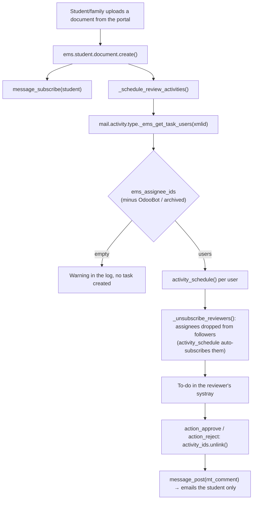

# Technical Reference: Task Assignment (`mail.activity.type`)

## Overview

EMS schedules to-do activities on its own when the portal produces work for the staff:
a student uploads a document that must be validated, or a family comments on an
enrollment. **Who receives those tasks is configuration, not a permission.**

Historically the recipients were derived from a security group
(`self.env.ref('ems.group_secretary').users`). That is unfixable by design: Odoo
materialises the *transitive closure* of `implied_ids` into `res_groups_users_rel`
(`GroupsImplied.write()`, `addons/base/models/res_users.py`), so every user of
`group_academic_admin` is a literal row in `group_secretary` — via
`group_academic_admin → group_secretary_admin → group_secretary` — and is
indistinguishable from a real secretary. Administrators (and OdooBot) therefore got
a task for every single document uploaded in the school.

Recipients are now an explicit list per activity type, editable at
**Academic Management → Configuration → Task Assignment**.

**Module files:** `models/shared/mail_activity_type.py`,
`data/main/ems.mail_activity_type_task_assignment.xml`,
`views/academic_management/task_assignment/`, `migrations/18.0.0.20.1/post-migrate.py`

---

## Data Model

### `mail.activity.type` (inherited)

| Field | Type | Description |
|-------|------|--------------|
| `ems_task_assignment` | `Boolean` | Marks the activity types EMS schedules automatically. Only these show up in the Task Assignment screen (the action's domain). Set from a `noupdate="0"` data file so the flag is (re-)applied on every upgrade — the type records themselves live in `ems.mail_activity_type.xml`, which is `noupdate="1"` and would never re-apply it. |
| `ems_assignee_ids` | `Many2many → res.users` | The recipients. `domain=[('share','=',False)]` — portal users are not staff. Grants no access rights whatsoever. |

### Methods

| Method | Purpose |
|--------|---------|
| `_ems_task_users()` | Recipients of *this* type. Always drops archived users and `SUPERUSER_ID` (OdooBot): its inbox is read by nobody, so a task there is pure noise. |
| `_ems_get_task_users(xmlid)` | `@api.model` wrapper for callers that only hold an xmlid. Logs a warning when the list is empty (the task would silently never be created) and returns an empty recordset instead of raising. |

---

## Which types are managed

| Activity type | Scheduled by | Trigger |
|---------------|--------------|---------|
| `ems.mail_activity_student_document_review` | `ems.student.document::_schedule_review_activities()` | Student/family uploads a document from the portal, or a document is reset to *pending* |
| `ems.mail_activity_enrollment_comment` | `sale.order::_ems_schedule_comment_review_activities()` | Student/family comments on their enrollment from the portal |

`ems.mail_activity_attendance_correction` is **deliberately not managed here.** It is not
a shared inbox but a hierarchical approval: `_find_approver()` walks the requesting
employee's `parent_id` chain looking for their Head of Studies
(`hr.employee::find_head_of_studies()`), and `group_academic_admin` is only the
fallback for a broken org chart. Recipient and approver are the same person on purpose
(`_check_is_approver()`); decoupling them would hand someone a task they have no right
to approve.

---

## Notification rule

Task recipients are **not** subscribed as followers of the record. The to-do in the
systray *is* their notice; adding them as followers would email them again on every
status change, including changes made by their own colleagues.

Only the **student** follows their document (`partner_id`) — they are the one who must
hear back when it is approved or rejected. Families are not followers either: they read
the outcome in the portal, which queries the document's messages directly
(`controllers/portal_comms.py`), a separate mechanism from email notification.

---

## Access control

The screen is for whoever runs the office: `ems.group_secretary_admin`. Odoo natively
reserves write access on `mail.activity.type` to `base.group_system`, which that group
does not hold, so EMS adds an ACL of its own
(`ems.access_mail_activity_type_secretary_admin`, write but no create/unlink).

An ACL is per model, not per record, so on its own it would also let a Secretary
Administrator rename or reconfigure *every* activity type in the database (Meeting,
Call, To Do...). `security/rules/task_assignment.xml` confines it:

| Rule | Groups | Perm | Domain |
|------|--------|------|--------|
| `rule_mail_activity_type_ems_only` | `ems.group_secretary_admin` | write | `[('ems_task_assignment','=',True)]` |
| `rule_mail_activity_type_system_all` | `base.group_system` | write | `[(1,'=',1)]` |

The second rule is not redundant. `group_academic_admin` **implies**
`group_secretary_admin`, so it inherits the first rule and would otherwise lose the
unrestricted write access it holds through `base.group_system`. Record rules of the
groups a user belongs to are OR-ed together, so the second rule gives it back.

| Group | Task Assignment screen | Receives tasks |
|-------|------------------------|----------------|
| `ems.group_secretary_admin` | Read + write (EMS task types only) | Only if explicitly listed |
| `ems.group_academic_admin` | Read + write (any type — implies the group above) | Only if explicitly listed |
| `ems.group_secretary` | No menu | Only if explicitly listed |
| Any other internal user | No menu | Only if explicitly listed |

The two concepts are fully decoupled: **being listed grants no rights, and holding a
role puts nobody on the list.** A user who must act on a document still needs the
relevant access rights through their group — the list only decides who is *told* about it.

---

## Migration

`migrations/18.0.0.20.1/post-migrate.py` seeds each managed type with the users who
receive that task *today* (the members of `ems.group_secretary`), so nobody silently
stops being notified on upgrade. Administrators are included on purpose — the behaviour
must not change under anyone's feet; the centre removes them from the screen when it
sees fit. OdooBot is the single exception: it is seeded to nobody's inbox because it is
read by no one.

The seeding is idempotent: a type that already has recipients is never overwritten.

---

## Edge cases

- **Empty recipient list:** no task is created and a warning is logged. The list view
  flags such a type in red and the form shows a warning banner. Pending documents remain
  visible in *Academic Management → Student Documents*, so no information is lost —
  only the proactive notice.
- **Archived user still on the list:** skipped at scheduling time, no need to clean up
  the list first.
- **Portal users:** cannot be added (`domain=[('share','=',False)]`).
