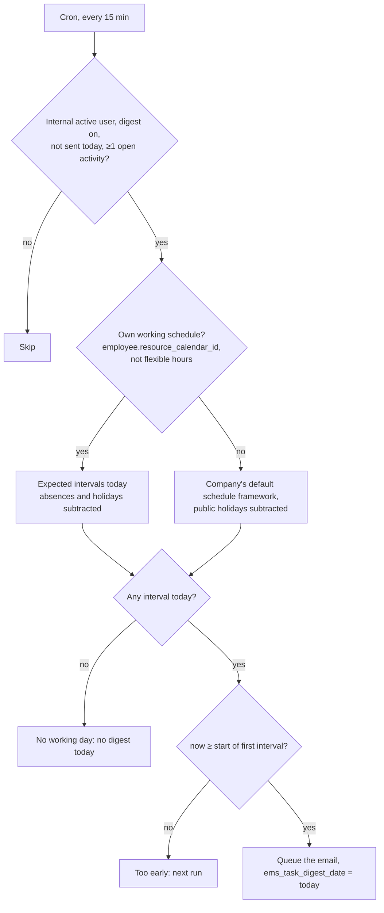

# Technical Reference: Daily Pending-Tasks Digest

## Overview

EMS hands work to the staff as **activities** (`mail.activity`) in each person's to-do tray
(🕒): convalidation requests, supporting documents to validate, attendance corrections, absence
approvals, etc. Most of them are scheduled with `mail_activity_quick_update` (see
[Task assignment](task_assignment.md) and `ems.convalidation._ems_schedule_task()`), which
suppresses Odoo's "X has assigned you an activity" email on purpose: one email per task floods an
inbox (a Deputy Head of Studies can get dozens of convalidation requests in a few days), and the
author of that email would be the family that filed the request from the portal.

Neither EMS nor Odoo would ever remind anyone of those tasks by email, though, so someone who has
not opened EMS in a day has no way to know work is waiting for them. The digest closes that gap:
**one email per person and working day, at the start of their working hours, listing everything
still pending in their to-do tray**. It is a reminder, not an escalation: it never changes or
reassigns a task.

**Module files:** `models/shared/task_digest.py` (`res.users`), `models/employees/workday.py`
(`hr.employee`), `mails/shared/task_digest.xml`, `data/main/ir.cron-task_digest.csv`,
`views/community/employee/user_profile_form.xml`.

---

## Data Model

### `res.users` (inherited)

| Field | Type | Description |
|-------|------|-------------|
| `ems_task_digest` | `Boolean`, default `True` | "Daily summary of pending tasks". Self-readable and self-writable (`SELF_READABLE_FIELDS`/`SELF_WRITEABLE_FIELDS`), shown in **My Profile > Preferences**, so everybody can turn it off. A new column with a default: Odoo fills it for every existing user when it creates it, so no migration is needed. |
| `ems_task_digest_date` | `Date`, readonly | Day (company timezone) the last digest was sent. Guarantees a single email per day whatever the cron's frequency. Never shown. |

### `hr.employee` (inherited) — expected working day

Shared by the automatic check-out (`hr.attendance`, `employee_autocheckout.py`), the digest and the tutor's attendance issues report:

| Method | Returns |
|--------|---------|
| `_ems_local_day_bounds(work_date)` | Start and end of `work_date` in the employee's timezone (the company's, see [Timezones](timezones.md)), tz-aware. |
| `_ems_expected_intervals(work_date)` | `(start, end)` pairs of what the employee is expected to work that day, from their own schedule, with approved absences and public holidays already subtracted (`_get_expected_attendances`). Empty without a schedule. |
| `_ems_framework_intervals(framework, work_date)` | `(start, end)` pairs of a framework's periods that day, without subtracting anything (the automatic check-out only uses it on a day nothing was expected). |
| `_ems_workday_intervals(work_date)` | The employee's working day: their own expected intervals if they have a (non-flexible) schedule, otherwise the company's default schedule framework (`res.company._ems_default_framework_intervals`). Also used by the tutor's attendance report ([attendance_issue.md](../attendance/attendance_issue.md)). |

---

## When the digest is sent

- **Own schedule first.** If the person has a working schedule, only that schedule decides: a day
  it expects nothing of them (weekend, public holiday, a whole-day approved absence, a weekday they
  don't work) sends nothing. This is deliberately stricter than the automatic check-out, which falls
  back to the framework on such a day because someone did check in; here nobody should get a
  reminder while on leave.
- **No own schedule** (a user with no employee, an employee with no schedule, or a flexible-hours
  one): the company's default schedule framework (`default_schedule_framework_id`, a required
  setting, so there is always one), with public holidays subtracted
  (`_work_intervals_batch(compute_leaves=True)`).
- **"Today" and "now"** both come from `fields.Datetime.now()`, converted to the company timezone,
  so a test can freeze them together.
- A late cron (server down in the morning) still sends that same day's digest as soon as it runs
  again; a past day's digest is never sent.
- Each user is processed inside its own savepoint: a failure for one person is logged and never
  prevents the others' digests.

---

## The email

`ems.email_template_task_digest` (`mails/shared/task_digest.xml`, `mail.template` on
`res.users`), queued with `send_mail()` (sent by the mail queue cron), **not** posted with
`message_post()`: it must arrive whatever the person's notification preference ("Handle in
Odoo" would otherwise keep it out of their inbox), and it belongs to no record's chatter.
`auto_delete=True`. The template has no `lang` field; the sender renders it in the recipient's
language, and each language's subject and body live in the XML itself (one `<record>` per
language, same pattern as the other `mails/` templates).

Content, built from `res.users._ems_task_digest_groups()`:

- The total number of pending tasks.
- The tasks grouped by activity type (ordered as the activity types are), each group with its
  count and, per task, the record's name linked through `/mail/view?model=…&res_id=…` (Odoo's own
  access-checked redirect), the task's summary and its due date. Overdue tasks get a discreet
  mark only: the email is not meant to rush anybody.
- At most 20 tasks per type, soonest due first, then "and N more".
- A link to EMS and how to turn the digest off.

A user with no email address is skipped (logged) and still marked as done for the day, so the
cron doesn't retry every 15 minutes.

---

## Access Control

| Who | What |
|-----|------|
| Every internal user | Receives their own digest; reads and toggles their own `ems_task_digest` from My Profile. |
| Administrators (`base.group_system`) | Can toggle anyone's from the user form. |
| Portal users, OdooBot, archived users | Never get a digest. |

The digest lists only activities assigned to the recipient (`mail.activity.user_id`); it reads
them with `sudo()`, but each link goes through `/mail/view`, which applies the recipient's own
access rights when opened.
