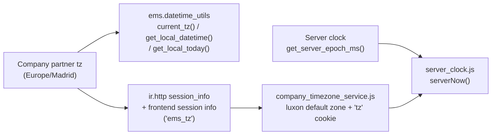

# Technical Reference: dates, times and timezones

**Every date/time EMS shows, reads or decides with is in the company's timezone** (the company
partner's `tz`, `Europe/Madrid` for Institut Puig Castellar, set in `data/custom/res.partner.csv`).
Never the acting user's own `tz`, never the browser's, never the server's clock read naively. The
whole centre works from a single place, so there is exactly one timezone; a centre elsewhere only
has to set its own company's timezone.

Read this before touching anything that stores, shows, compares or converts a date or a time.

## Why: three sources of "time", none of them trustworthy on its own

| Source | Who uses it | What goes wrong |
|--------|-------------|-----------------|
| The **browser's clock and timezone** | The whole web client (luxon's "default" zone), and any JS that calls `new Date()`/`DateTime.now()` | A computer with a wrong timezone or clock shows and saves shifted times, and decides "today"/"now" wrongly: a teacher got the wrong roll-call slot preselected because of it (issue #518) |
| Each **user's own `tz`** (`res.partner.tz`) | Native Odoo server-side formatting: portal QWeb `datetime` widgets, reports, `format_datetime()` (e.g. the attendance kiosk's "hasn't checked out since..." error, formatted with the public user's `tz`) | Odoo fills it in from the browser (the `tz` cookie) on a user's first login, so it ends up being whatever that computer said (users in `America/Lima`, `Atlantic/Canary`... were found) |
| The **server's clock**, read naively (`datetime.now()`, `date.today()`, `fields.Date.today()`) | Python code | **The Odoo process always runs in UTC** (`odoo/_monkeypatches/__init__.py` forces `TZ=UTC`, whatever the OS is set to), so those are UTC: 2h behind in summer, and "today" is yesterday between 00:00 and 02:00 |

The server itself must stay in UTC (Odoo's standard, and changing the OS timezone has no effect on
Odoo anyway): datetimes are stored as naive UTC, and converted only when shown or read from a user.

## The mechanism

- **Python: `ems.datetime_utils`** (`models/shared/datetime_utils.py`) — `current_tz()` is always
  the company's (read with `sudo()`: the portal and kiosks run as the public user). Use
  `get_local_datetime()`/`get_local_today()` for "now"/"today", and `time_float_to_utc_datetime()`
  & co. for converting the float hours schedules are stored as (`resource.calendar.attendance`,
  `ems.attendance_schedule.start_time`...): those floats are local wall-clock times and are fine as
  long as every conversion goes through here.
- **Web client: `static/src/js/shared/company_timezone_service.js`** (backend and portal bundles)
  sets luxon's default zone to `session.ems_tz` (`models/shared/ir_http.py`), so every datetime
  field is shown and entered in the company's timezone whatever the computer says, and overwrites
  the `tz` cookie with it, so the timezone Odoo gives a user on their first login, and the labels it
  formats with that cookie (`hr.attendance`'s display name), are the company's too.
- **"Now" in JS: `static/src/js/backend/server_clock.js`** — `syncServerClock(orm)` once in
  `onWillStart`, then `serverNow()` (a luxon `DateTime`, in the company's timezone) instead of
  `new Date()`/`DateTime.now()`: a wrong computer clock never decides "today" or "now". Used by the
  roll-call screen and the guard duty board.
- **Never trust a date the client sends as "today"**: validate it against `get_local_today()` on
  the server (e.g. `create_scheduled_session()` rejects a future date).

## Rules for new code

- Python: never `datetime.now()`, `datetime.today()`, `date.today()` or `fields.Date.today()`; use
  `self.env['ems.datetime_utils'].get_local_datetime()`/`get_local_today()` (or inherit
  `ems.datetime_utils`). `fields.Datetime.now()` is fine for a value stored in a `Datetime` field
  (naive UTC is exactly what the ORM wants), never for deciding what day or hour it is.
- A `Datetime` value interpolated into a message, email, activity or error must be converted to the
  company's timezone first (`utc_datetime_to_local()`); a plain string never gets the web client's
  conversion.
- JS: never `new Date()`/`DateTime.now()` for "now"/"today"; use `serverNow()`. Pure calendar
  arithmetic on a date already chosen (shifting a `YYYY-MM-DD` by some days) doesn't need it.
- A new time-dependent feature is tested with a frozen "now"
  (`patch.object(fields.Datetime, 'now', ...)`), see `CLAUDE.md`'s testing conventions.

## Every record's own `tz` follows the company's

Native Odoo formats plenty with a record's own `tz` (portal widgets, reports, emails, the kiosk's
error, formatted with the public user's), so those are kept equal to the company's:

- `models/settings/timezone.py`: `ems.company_timezone_mixin`, inherited by `res.partner`,
  `resource.resource` (employees' `tz`) and `resource.calendar`, replaces any `tz` given on create
  or write with the company's. The company's own partner is the one exception: that is where the
  company's timezone is set, and changing it calls `res.company._ems_align_timezones()`, so everyone
  follows.
- `_ems_align_timezones()` sets the company's timezone on every partner, employee and working
  schedule. It runs from the `post_init_hook` (clean install) and from
  `migrations/18.0.0.30.1/post-migrate.py` (existing installations: users had ended up in
  `America/Lima`, `Atlantic/Canary`..., and the public user had none, so UTC).
- The `tz` field is read-only on the user form, "My Profile" and the employee form.

## The one exception: LimeSurvey

Our LimeSurvey server runs in UTC with no time adjustment, and reads the survey start/expiry dates
EMS sends it as its own time, so those are sent in UTC (`LimesurveyApi._limesurvey_now()`). If its
"time difference" setting is ever changed, change that method too.
